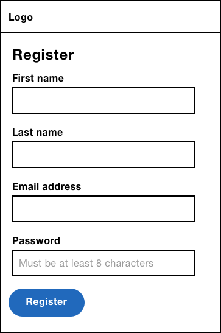
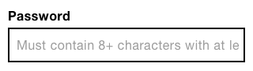
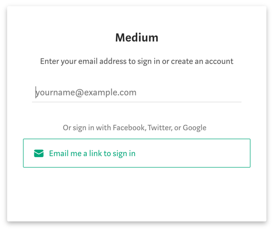
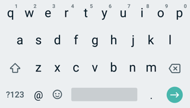
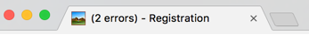
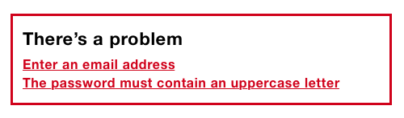
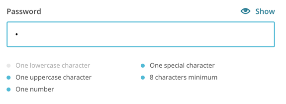
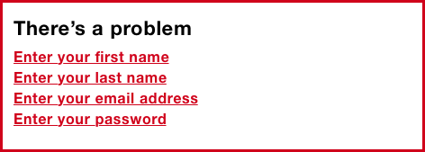

# A Registration Form

We're going to start with a registration form. Most companies want long-term relationships with their users. To do that they need users to sign up. And to do *that*, they need to give users value in return. Nobody wants to actually sign up to your service. They just want to access whatever it is you offer, or just the promise of a faster experience next time they visit.

Despite the registration form's basic appearance, there are many things to consider: the primitive elements that make up a form (labels, buttons and inputs), ways to reduce effort (even on small forms like this), all the way through to form validation.

In choosing such a simple form, we can zoom in on the foundational qualities found in well-designed forms.

## How It Might Look



Here's the HTML:

```html
<form>
  <label for="firstName">First name</label>
  <input type="text" id="firstName" name="firstName">
  <label for="lastName">Last name</label>
  <input type="text" id="lastName" name="lastName">
  <label for="email">Email address</label>
  <input type="email" id="email" name="email">
  <label for="password">Create password</label>
  <input type="password" id="password" name="password" placeholder="Must be at least 8 characters">
  <input type="submit" value="Register">
</form>
```

The form is made up of 4 fields and a submit button. Each field is made up a of a control (the input) and its associated label. Labels are where our discussion begins.

## Labels

In “Accessibility For Everyone”[^], Laura Kalbag sets out four broad parameters that improves the user experience for everyone:

- Visual: make it easy to see.
- Auditory: make it easy to hear.
- Motor: make it easy to interact with.
- Cognitive: make it easy to understand.

By looking at labels from each of these standpoints, we can see just how important labels are. Sighted users can read them, visually-impaired users can hear them by using a screen reader and motor-impaired users can more easily set focus to the field thanks to the larger hit area. That's because clicking a label sets focus to the associated form element.


For these reasons, every control that accepts input should have an auxilary `<label>`. Submit buttons, for example, don't accept input so they don't need an auxilary label—the `value` attribute which renders the text inside the button acts as the accessible label.

To *connect* an input to a label, the input's `id` and label's `for` attribute should match and be unique to the page. In the case of the email field, the value is “email”:

```html
<label for="email">Email address</label>
<input id="email">
```

Failing to include a label means ignoring the needs of many users including those with physical and cognitive impairments. By focusing on the recognized barriers of people with disabilities, we can make our forms easier and more robust for everyone.

For example, a larger hit area is crucial for motor-impaired users but is easier to hit for those without impairments too.

## Placeholders

The `placeholder` attribute is intended to store a hint. It gives users extra guidance when filling out a field—particularly useful for fields that have complex rules such as a password field. 

As placeholder text is not a real value, it's ‘grayed out’ so that it can be differentiated from user-entered values.


Hints, unlike labels, are optional and shouldn't be used as a matter of course. Just because the placeholder attribute exists doesn't mean we have to use it. For example, you don't need a placeholder of ‘Enter your first name’ when the label is ‘First name’—that's needless duplication.


Placeholders are appealing because of their minimal, space-saving aesthetic. This is because placeholder text is placed *inside* the field. But, this is a problematic way to give users a hint.

First, they disappear when the user types. Disappearing text is hard to remember which can cause errors if, for example, the user forgets to satisify one of the password rules. Users often mistake placeholder text for a value[^], causing the field to be skipped, which again, would cause errors later on. Gray-on-white text lacks sufficient contrast making it generally hard-to-read[^]. And to top it off, some browsers don't support them, some screen readers don't announce them and long hint text may get cut off.



That's a lot of problems for what is essentially just text. All content, especially a form hint, shouldn't be considered a ‘nice to have.’ So instead of using placeholders, it's better to position hint text above the control like this:


```HTML
<div class="field">
  <label for="password">
    <span class="field-label">Password</span>
    <span class="field-hint">Must contain 8+ characters with at least 1 number and 1 uppercase letter.</span>
  </label>
  <input type="password" id="password" name="password">
</div>
```

The hint is placed within the label and inside a `<span>` so that it can be styled differently. By placing it inside the label it will be read out by screen readers, and further enlarges the hit area.

As with most things in design, and life for that matter, this isn't the only way to achieve this functionality. We could use ARIA attributes to associate the hint with the input:

```HTML
<div class="field">
  <label for="password">Password</label>
  <p class="field-hint" id="passwordhint">Must contain 8+ characters with at least 1 number and 1 uppercase letter.</p>
  <input type="password" id="password" name="password" aria-describedby="passwordhint">
</div>
```

The `aria-describedby` attribute is used to connect the hint by its `id`—just like the `for` attribute for labels, but in reverse. It's appended to the control's label and read out after a short pause. In this example, “password [pause] must contain eight plus characters with at least one number and one uppercase letter.”

There are other differences too. First, clicking the hint (a `<p>` in this case) won't focus the control, which reduces the hit area. Second, despite ARIA's ever-growing support, it's never going to be as well supported as native elements. In this case, for example, Internet Explorer 11 doesn't support `aria-describedby`[^].  This is why the first rule of ARIA is not to use ARIA:

> If you can use a native HTML element or attribute with the semantics and behaviour you require already built in, instead of re-purposing an element and adding an ARIA role, state or property to make it accessible, then do so.

## Float Labels

The float label[^] pattern by Matt Smith is a technique that uses the label as a placeholder. The label starts *inside* the control, but floats above the control as the user types, hence the name. This technique is often lauded for it's quirky, minimalist and space saving qualities.


Unfortunately, there are several problems with this approach. First, there is no space for a hint because the label and hint are one and the same. Second, they're hard-to-read due to their poor contrast and small text as they're typically designed. Lower contrast is necessary so that users have a chance to differentiate between a real value and a placeholder. And, like placeholders, they may be mistaken for a value and could get cropped.

And, float labels don't actually save space. That's because the label needs space to move into in the first place. Even if they did save space, that's hardly a good reason to diminish the usability of forms.

> “Seems like a lot of effort when you could simply put labels above inputs and get all the benefits/none of the issues” -- Luke W on Float Labels

Quirky and minimalist interfaces don't make users feel awesome. Obvious, inclusive and robust interfaces do. Artificially reducing the height of forms like this is both uncompelling and problematic.

Instead, you should priortise making room for an ever-present, readily-available label (and hint if necessary) at the start of the design process. This way you won't have to squeeze content into a small space.

We'll be discussing several, less artificial techniques to reduce the size of forms shortly.

## The Question Protocol

One powerful and *natural* way to reduce the size of a form is to use the Question Protocol[^?] by the Government Digital Service. It helps ensure you know why you are asking every question (or form field).

Does the registration form need to collect first name, last name, email address and password? Are there better or alternative ways to ask for this information that simplifies the experience?

In all likeliness you don't need to ask for the user's first and last name just to register. If you need that information later, for whatever reason, then ask for it then. By removing these fields, we can half the size of the form. All without resorting to novel and problematic patterns.

### No Password Sign In

One way to avoid asking users for a password is to use the No Password Sign In pattern. It works by leveraging the security of email (which already needs a password). Users only have to enter their email address and the service sends a special link to their inbox. Clicking it logs the user into the service immediately.



Not only does this reduce the size of the form to just one field, but it also saves users having to remember another password. Whilst this simplifies the form in isolation, in other ways it adds some additional complexity for the user.

First, users might be less familiar with this approach, and many people are worried about online security. Second, having to move away from the app to your email account is long winded, especially for users who know their password (or use a password manager).

It's not that one technique is always better than the other. It's that the Question Protocol urges us to think about this as part of the design process. Otherwise, you'd mindlessly add a password field on the form and be done with it.

### Passphrases

Passwords are generally short, hard to remember and easy to crack. Users often have to create a password with at least eight characters made up of at least one uppercase, one lowercase letter and a number. This micro interaction is hardly ideal.

> Sorry but your password must contain an uppercase letter, a number, a haiku, a gang sign, a hieroglyph, and the blood of a virgin. -- Adrian Zumbrunnen

Instead of a password, we could ask users for a passphrase[^]. A passphrase is a series of words such as ‘monkeysinmygarden’ (sorry, that's the first thing that comes to mind). They are generally easier to remember than passwords and they are more secure due to their length—passphrases must be at least 16 characters long.

The downside is that they are unfamiliar, which may cause anxiety for users, that are already worried about online security.

Whether it's the No Password Sign In pattern or passphrases, we should only move away from convention once we've conducted thorough and diverse user research. You don't want to exchange one set of problems for another.

## Field Styling

The way you style your form components will, at least in part, be determined by your product or company's brand. Still, label position and focus styles are important considerations.

### Label Position

Matteo Penzo's eye-tracking tests[^] showed that positioning the label above (as opposed to beside) the form control works best.

“Placing a label right over its input field permitted users to capture both elements with a single eye movement.”

But, there are other reasons to put the label above the field. On small viewports there's no room beside the control. And on large viewports, zooming in increases the chance of the text disappearing off screen[^].

Also, some labels contain a lot of text which causes it to wrap onto multiple lines which would disrupt the visual rhythm if placed next to the control.

While you should aim to keep labels terse, it's not always possible. So, using a pattern that accomodates varying content—by positioning labels above the control—is a good strategy.

### Look, Size And Space

First, form fields should look like form fields. But what does that mean exactly? 

It means that a text box should look like one. Empty boxes naturally signify “fill me in.” This happens to be part of the reason that placeholders are unhelpful. They remove the natural perceived affordance that an empty text box would otherwise provide.

This also means that the empty space should be boxed in (bordered). Removing the border, or only having a bottom border for example, removes the perceived affordances. A bottom border, for example, first appears more as a separator. Even if you know that you have to fill something in, does it go above the line or below it?

Space-wise, the label should be closest to it's form control. Not to the previous field's control. Things that appear close together naturally signify that they *belong* together[^]. Having equal spacing might improve aesthetics, but it would be at the cost of usability.

Finally, the label and the text box itself should be large enough to read and tap. This probably means a font-size of at least 16 pixels and ideally an overall tap target of at least 44px[^].

### Focus Styles

Focus styles are a simpler prospect. Browsers put an outline around the in-focus element by default so that users, especially those who use a keyboard, know where they are. The problem with the default styling is that it is often faint (hard to see) and somewhat ugly.

While this is the case, don't be tempted to remove it, because this will diminish the user experience greatly for those traversing the screen with their keyboard. We can override the default styling to make it clear and more aesthetically pleasing.

```HTML
input:focus {
  outline: 4px solid #ffbf47;
}
```

## The Email Field


```HTML
<div class="field">
  <label for="email">
    <span class="field-label">Email address</span>
  </label>
  <input type="email" id="email" name="email">
</div>
```

Despite it's simple appearance there are some important details that have gone into the field's construction which affect the experience. As noted earlier, some fields have a hint in addition to the label which is why the label is inside a child span. The `field-label` class lets us style it through CSS.

The label itself is “Email address” and uses sentence case. In “Making A Case For Letter Case”[^7], John Saito explains that sentence case (as opposed to title case) is generally easier to read, friendlier and makes it easier to spot nouns. Whether you take heed of this advice is up to you, but whatever style you choose, be sure to use it consistently.

The input's `type` attribute is set to `email` which triggers an email-specific on-screen keyboard on mobile devices. Specifically, it gives users easy access to the ‘@’ and ‘.’ symbols which every email address must contain.



People using a non-supporting browser will see a standard text input (`input type="text"`). This is a form of progressive enhancement which is a cornerstone of designing inclusive experiences.

### Progressive Enhancement

Progressive enhancement is about users. It just happens to make our lives (as designers and developers) easier too. This is because instead of keeping up with a set of browsers and devices (which is impossible!) we can just focus on features.

First and foremost, progressive enhancement is about always giving users an experience, no matter their browser or device or quality of connection. When things go wrong—and they will—users won't suffer in that they can still get things done.

There are a lot of ways an experience can go wrong. Perhaps the stylesheet or script fails to load. Maybe everything loads, but the user's browser doesn't recognise some HTML, CSS or Javascript. Whatever happens, using progressive enhancement as an approach to designing experiences, stops users having an especially bad time.

It starts with HTML, which is for structure and content. If CSS or Javascript doesn't load, it's fine because the content is there.

If everything loads okay, perhaps various HTML elements aren't recognised. For example, some browsers don't understand `input type="email"`. That's okay though because users will get a text box (`input type="text"`) instead. Users can still enter an email address, they just don't get an email-specific keyboard on mobile.

Maybe the browser doesn't understand some fancy CSS. In this case, browsers just ignore it. In most cases, this isn't a problem. For example, let's say you have a button that is applied with `border-radius: 10px`. Browsers that don't recognise this rule will show a button with straight edges. Arguably the button's perceived affordance is reduced, but ultimately users are left unharmed. In other cases it might be helpful to use Feature Queries[^].

Then there is Javascript, which is more complicated. When the browser tries to parse methods it doesn't recognise, it will just throw a hissy fit. This can cause your other (valid and supported) scripts to fail too. If your script doesn't first check if the methods exist (feature detection) and work (feature testing) before using them, then users may get a broken interface. For example, if a button's click handler calls a method that's not recognised, the button won't work. That's bad.

That's how you enhance. But what's better, is not needing an enhancement at all. HTML with a little CSS, can give users an excellent experience. It's the content that counts and you don't need Javascript for that. The more you can rely on HTML and CSS, the better. I can't emphasise this enough: so often, the basic experience is the best and most performant one[^]. There's no point in enhancing something if it doesn't *add value* (see principle 7).

Of course, there are times when the basic experience isn't as good as it could be. And that's when it's time to enhance. But if we follow the principles above, when a piece of CSS or Javascript isn't recognised or executed things will still work.

Progressive enhancement makes us think about what happens when things fail. This way we end up building experiences with resilience baked-in. But equally, it makes us think about whether an enhancement is needed at all and if it is, how best to go about it.

## The Password Field


```HTML
<div class="field">
  <label for="password">
    <span class="field-label">Choose password</span>
    <span class="field-hint">Must contain 8+ characters with at least 1 number and 1 uppercase letter.</span>
  </label>
  <input type="password" id="password" name="password">
</div>
```

We're using the same mark-up as the email field discussed earlier. If you're using a template language, you'll be able to create a component that accomodates both types of field. This helps to enforce principle 3, *Be consistent*.

The password field contains a hint. Without one, the user won't understand the requirements which is likely to cause an error once the user tries to proceed.

The `type="password"` attribute masks the input's value by replacing what the user types with small black circles. This is a security measure that stops people from seeing what you typed if they happen to be close by.

### A Password Reveal

Obscuring the value as the user types makes it hard to fix typos. So when one is made, it's often easier to delete the whole entry and start again. This is frustrating as most users aren't using a computer with a person standing behind them.

Due to the increased risk of typos, some registration forms include an additional ‘confirm password’ field. This is a precautionary measure that requires the user to type the same password twice, doubling the effort and degrading the user experience.

Instead, it's better to let users reveal their password which speaks to principles 4 and 5, *Give control* and *Offer choice* respectively. This way users can choose to reveal their password, when they know nobody is looking—reducing the risk of typos.

Recent versions of Internet Explorer and Edge provide this behaviour natively. As we'll be creating our own solution we should suppress this feature like this:

```css
input[type=password]::-ms-reveal {
  display: none;
}
```

Now we're ready to enhance the interface with our own version. 


First, we need to inject a button next to the input. The `<button>` element should be your go-to element for changing anything with Javascript. That is, except for changing location which is what links are for. When clicked, it should toggle the `type` attribute between `password` and `text` and the label between “Show password” and “Hide password”.

```JS
function PasswordReveal(input) {
  // store input as a property of the instance
  // so that it can be referenced in methods
  // on the prototype
  this.input = input;
  this.createButton();
};

PasswordReveal.prototype.createButton = function() {
  // create a button
  this.button = $('<button type="button">Show password</button>');
  // inject button
  $(this.input).parent().append(this.button);
  // listen to the button's click event
  this.button.on('click', $.proxy(this, 'onButtonClick'));
};

PasswordReveal.prototype.onButtonClick = function(e) {
  // Toggle input type and button text
  if(this.input.type === 'password') {
    this.input.type = 'text';
    this.button.text('Hide password');
  } else {
    this.input.type = 'password';
    this.button.text('Show password');
  }
};
```

#### Javascript Syntax and Architectural Notes

As there are many flavours of Javascript, and different ways in which to architect components, we're going to walk through the choices used to construct the password reveal component and all the upcoming components in the book.

First, we're using a constructor. A constructor is a function that is conventionally written in upper camel case—`PasswordReveal` not `passwordReveal`. It's initialised using the `new` keyword which lets us use the same code to create several instances of the component:

```JS
var passwordReveal1 = new PasswordReveal(document.getElementById('input1'));

var passwordReveal2 = new PasswordReveal(document.getElementById('input2'));
```

Second, the component's methods, are defined on the prototype—for example `PasswordReveal.prototype.onButtonClick`. The `prototype` is the most performant way to share methods across multiple instances of the same component.

Third, jQuery is being used to create and retrieve elements, and listen to events. While jQuery may not be necessary or preferred, using it means that the book can focus on forms—and not on the complexities of cross-browser components.

If you're a designer who codes a little bit, then jQuery's ubiquity and low-barrier to entry should be helpful. By the same token, if you prefer not to use jQuery, you'll have no trouble refactoring the components to suit your preference.

You may have also noticed the use of the `$.proxy` function. This is jQuery's implementationo of `Function.prototype.bind`. If we didn't use this function to listen to events, then the event handler would be called in the element's context (`this`). In the above case, `this.button` would be undefined. But we want `this` to be the password reveal object instead so that we can access its properties and methods.

#### Alternative Interface Options

The password reveal interface we constructed before toggles the button's label between “Show password” and “Hide password”. Some screen reader users can get mildy confused when the button's label is changed. This is because once a user encounters a button, they expect that button to persist. Even though the button *is* persistent, changing the label makes it appear not to be.

If your research shows this to be a problem, you could try two alternative approaches:

1. Use a checkbox with a persistent label of “Show password”. The state will be signalled by the `checked` attribute. Screen reader users will hear “Show password, checkbox, checked” (or similar). Sighted users will see the checkbox tick mark.

The problem with this approach is that checkboxes are for inputing data, not for controlling the interface. Some users might think their password will be revealed to the system.

2. Change the button's state—not the label. To convey the state to screen reader users you can switch the `aria-pressed` attribute between `true` (pressed) and `false` (unpressed).

```HTML
<button type="button" aria-pressed="true">  
  Show password
</button>
```

When focusing the button, NVDA for example will announce, “Show password, toggle button, pressed”. For sighted users, you can style the button to look pressed or unpressed accordingly using the attribute selector like this:

```CSS
[aria-pressed="true"] {
  box-shadow: inset 0 0 0 0.15rem #000, inset 0.25em 0.25em 0 #fff;
}
```

Just be sure that the unpressed and pressed styles are obvious and differentiated, otherwise sighted users may struggle to tell the difference between them.

### Microcopy

The label is set to “Choose password” rather than “Password”. The latter is somewhat confusing and could suggest the user needs to type a password they already posess, which could be a security issue. More subtly it might suggest the user is already registered causing users with cognitive impairments to think they are logging in instead.

Where “Password” is ambiguous, “Choose password” provides clarity.

## Button Styles

What's a button? Often we refer to many different types of components on a web page as a button. In fact, I've already covered two different types of button without calling them out. Let's do that now.

Buttons that submit forms are “submit buttons” and they are coded typically as either `<input type="submit">` or `<button type="submit">`. The latter is more maleable in that you can nest other elements inside it. But there's rarely a need for that. Most submit buttons contain just text. 

*(Note: in older versions of Internet Explorer, if you have multiple `<button type="submit">`s, the form will submit the value of all the buttons to the server regardless of which was clicked[^]. What you want is to know which button was clicked so that you can determine the right course of action to take.)*

Other buttons are injected into the interface to enhance the experience with Javascript—much like we did with the password reveal component discussed earlier. That was also a `<button>` but it's type was set to `button` (not `submit`).

In both cases, the first thing to know about buttons is that they aren't links. Links are typically underlined (by user agent styles) or specially positioned (in a navigation bar) so that they are visually identifiable amongst regular text. When hovering a link, the cursor will change to a hand. This is because, unlike buttons, links have weak perceived affordance[^].

In “Resilient Web Design”[^], Jeremy Keith discusses the idea of material honesty. He says that “one material should not be used as a substitute for another. Otherwise the end result is deceptive.” Making a link look like a button is materially dishonest. It tells users that links and buttons are the same when they’re not.

Links can do things buttons can't do. For example, links can be opened in a new tab or bookmarked for later. Therefore buttons shouldn't look like links, nor should they have a hand cursor. Instead we should make buttons look like buttons which have naturally strong perceived affordance. Whether they have rounded corners, drop shadows, borders is up to you, but they should look like buttons regardless.

Buttons can still give feedback on hover (and on focus) by changing the background colour for example.

### Placement

Submit buttons are typically placed at the bottom of the form. This is because with most forms, users fill out the fields from top to bottom and then submit. But should the button be aligned left, right or center? To answer this question, we need to think about where users will naturally look for it.

Field labels and form controls are aligned left and run from top to bottom. Users are going to look for the next field below the last one. Naturally then, the submit button should also be positioned in that location: to the left and directly below the last field. This also helps users who zoom in as a right-aligned button could disappear off screen more easily.

### Text

The button's text is just as important as its styling. The text should explicitly describe the action being taken. And because it's an action, it should be a verb. We should aim to use as few words as possible because its quicker to read. But we shouldn't remove words at the cost of clarity.

The exact words can match your brand's tone of voice, but don't exchange clarity for quirkiness. 

Using simple and plain language is easy to understand for everyone. The exact words will depend on the type of service. In this case “Register” is fine but depending on your service “Join” or “Sign up” might be more appropriate.

## Validation

Despite our efforts to create an inclusive, simple and friction-free registration experience, we can't eliminate human error. People make mistakes and when they do, we should make remedying them as easy as possible. 

When it comes to form validaton, there are a number of important details to consider. Choosing when to give feedback, through to how to display that feedback, down to the formulation of a good error message—all of these things need to be taken into account.

### HTML5 Validation

HTML5 validation has been around for a while now. By adding just a few HTML attributes, supporting browsers will mark erroneous fields when the form is submitted. Non supporting browsers fall back to server-side validation.

Normally I would recommend using functionality that the browser provides for free because it's often more performant, robust and accessible. Not to mention, it becomes more familiar to users and more sites start to use the standard functionality.

While HTML5 validation support is quite good it's not implemented uniformly[^]. For example, the `required` attribute can mark fields as invalid from the outside which isn't desirable. And some browsers, such as Firefox 45.7, will show an error of “Please enter an email address” even if the user entered something in the box. Where as Chrome, for example, says “Please include an '@' in the email address” which is more helpful.

We also want to give users the same interface whether errors are caught on the server or the client. For these reasons we'll design our own solution. In this case, the first thing to do is turn off HTML5 validation as follows.

```HTML
<form novalidate>
```

### Handling Submission

When the user submits the form, we need to check if there are errors. If there are, we need to prevent the form from submitting the details to the server.

```JS
function FormValidator(form) {
  form.on('submit', $.proxy(this, 'onSubmit'));
}

FormValidator.prototype.onSubmit = function(e) {
  if(!this.validate()) {
    e.preventDefault();
    // show errors
  }
};
```

*(Note: we are listening to the form's submit event, not the button's click event. The latter will stop users being able to submit the form by pressing <kbd>Enter</kbd> when focus is within one of the fields. This is also known as implicit form submission[^].)*

### Displaying Feedback

It's all very well detecting the presence of errors, but currently users are none the wiser. There are three disparate parts of the interface that need to be updated. We'll talk about each of those now.

#### Document Title

The document's `<title>` is the first part of a web page to be read out by screen readers. As such, we can use it to quickly inform users that something has gone wrong with their submission. This is especially useful when the page reloads after a server request.

Even though we're enhancing the user experience by catching errors on the client with Javascript, not all errors can be caught this way. For example, checking that an email address hasn't already been taken can only be checked on the server. And in any case, Javascript is prone to failure[^] so we can't solely rely on it's availability.

Where the original page title might read “Register for [service]”, on error it should read “(2 errors) Register for [service]” (or similar). The exact words is somewhat down to opinion.

The following JavaScript updates the title:

```JS
document.title = "(" + this.errors.length + ")" + document.title;
```

As noted above this is primarly for screen reader users, but as is often the case with inclusive design, what helps one set of users helps everyone else too. This time, the updated title acts as a notification in the tab.



#### Error Summary

In comparison to the title element, the error summary is more prominent, which tells sighted users that something has gone wrong. But it's also responsible for letting users understand what's gone wrong and how to fix it. 

It's positioned at the top of the page so that users don't have to scroll down to see it after a page refresh (should an error get caught on the server). Conventionally speaking, errors should be coloured red. However, relying on colour alone would exclude colour-blind users. To draw attention to the summary, consider also using position, size, text and iconography.



The panel consists of a heading, “There's a problem”, to indicate the problem. Notice, it doesn't say the word “Error” which isn't very human. Imagine you were filling out your details to purchase a car in real life and made a mistake. The salesperson wouldn't say “Error”—if they did it would be jarring and confusing.

It also doesn't say “sorry”. Avoid this because it gets in the way and actually, we're not sorry.

```HTML
<div class="errorSummary" role="group" tabindex="-1" aria-labelledby="errorSummary-heading">
  <h2 id="errorSummary-heading">There's a problem</h2>
  <ul>
    <li><a href="#emailaddress">Enter an email address</a></li>
    <li><a href="#password">The password must contain an uppercase letter</a></li>
  </ul>
</div>
```

The container has a role of `group` which is used to group a set of interface elements: in this case, the heading and the error links. The `tabindex` attribute is set to `-1`, so that it can be focused programmatically with Javascript (when the form is submitted with mistakes). This ensures the error summary panel is scrolled into view. Otherwise, the interface would appear unresponsive and broken when submitted.

*(Note: Using `tabindex="0"` means it will be permanently focusable by way of the tab key which is a 2.4.3 Focus Order WCAG fail. That's because if users can tab to something, they expect that it will actually do something.)*

```JS
FormValidator.prototype.showSummary = function () {
  // ...
  this.summary.focus();
};
```

Underneath, there's a list of error links. Clicking a link will set focus to the erroneous field which lets users jump into the form quickly. The link's `href` attribute is set to the control's `id` which in some browsers is enough to set focus to it. 

However, in other browsers clicking the link will just scroll the input into view, without focusing it. To fix this we can focus the input explicitly.

```JS
FormValidator.prototype.onErrorClicked = function(e) {
  e.preventDefault();
  var href = e.target.href;
  var id = href.substring(href.indexOf("#"), href.length);
  $(id).focus();
};
```

When there aren't any errors, the summary panel should be hidden. This ensures that there is only ever one summary panel on the page. And, that it appears consistently in the same location whether errors are rendered by the client or the server. To hide the panel we need to add a class of `hidden`.

```HTML
<div class="errorSummary hidden" ...></div>
```

```CSS
.hidden {
  display: none;
}
```

*(Note: you could use the `hidden` attribute/property to toggle an element's visibility, but there's less support for it. Inclusive design is about making decisions that you know are unlikely to exclude people. Using a class aligns with this philosophy.)*

#### 3. Inline Errors

First, we need to put the relevant error message just above the field. This saves users scrolling up and down the page in order to check the error message, which keeps them moving down the form. If the message was placed below the field we'd increase the chance of it being obscured by the browser autocomplete panel[^] or by the on-screen keyboard.


```html
<div class="field">
  <label for="blah">
    <span class="field-error">
      <svg width="1.5em" height="1.5em"><use xmlns:xlink="http://www.w3.org/1999/xlink" xlink:href="#warning-icon"></use></svg>
      Enter your email address.
    </span>
    <span class="field-error">Enter an email address</span>
  </label>
</div>
```

Like the hint pattern mentioned earlier, the error message is injected inside the label. When the field is focused, screen reader users will hear the message in context so they can freely move through the form without having to refer to the summary.

The error message is coloured red and uses an SVG warning icon to draw users' attention. If we'd just used a colour change to denote an error, this would exclude color-blind users. So this works really well for sighted users. But what about screen reader users?

To give both sighted and non-sighted users an equivalent experience, we can use the well-supported `aria-invalid` attribute. When the user focuses the input it will now announce “Invalid” (or similar) in screen readers.

```HTML
<input aria-invalid="false">
```

*(Note: the registration form only consists of text inputs. In chapter 3, “Book A Flight”, we'll look at how to inject errors accessibly for groups of fields such as radio buttons.)*

### Submitting The Form Again

When submitting the form for a second time, we need to clear the existing errors from view. Otherwise users may see duplicate errors.

```JS
FormValidator.prototype.onSubmit = function(e) {
  this.resetPageTitle();
  this.resetSummaryPanel();
  this.removeInlineErrors();
  if(!this.validate()) {
    e.preventDefault();
    this.updatePageTitle();
    this.showSummaryPanel();
    this.showInlineErrors();
  }
};
```

### Initialisation

Having finished defining the `FormValidator` component we're now ready to initialise it. To create an instance of `FormValidator` you need to pass the form element as the first parameter.

```JS
var validator = new FormValidator(document.getElementById('registration'));
```

To validate the email field, for example, call the `addValidator()` method: 

```JS
validator.addValidator('email', [{
  method: function(field) {
    return field.value.trim().length > 0;
  },
  message: 'Enter your email address.'
},{
  method: function(field) {
    return (field.value.indexOf('@') > -1);
  },
  message: 'Enter the ‘at’ symbol in the email address.'
}]);
```

The first parameter is the control's `name` and the second is an array of “rule” objects. Each rule contains two properties: `method` and `message`. The `method` is a function that tests various conditions to return either `true` or `false`. False puts the field into an error state which is used to populate the interface with errors as discussed earlier.

#### Forgiving Trivial Mistakes

In “The Design of Everyday Things”, Don Norman talks about designing for error. He talks about the way people converse:

> “If a person says something that we believe to be false, we question and debate. We don't issue a warning signal. We don't beep. We don't give error messages. In normal conversations, misstatements are taken as normal, as approximations to what was really meant.”

Unlike humans, machines are not intelligent enough to determine the meaning of most actions but they are often far less forgiving of mistakes than they need to be. Jared Spool makes a joke about this in “Design is Metrically Opposed”[^], at 42 minutes in:

> “it takes 1 line of code to trim brackets and dashes from a telephone number, but it takes 10 to tell the user they typed something wrong.”

The `addValidator` (shown above) demonstrates how to design validation rules so that they forgive trivial mistakes. The first rule, for example, trims the value before checking its length, reducing the burden on the user.

### Live Inline Validation

Live inline validation gives users feedback as they type or when they leave the field (`onblur`). There's some evidence to show that live inline validation improves accuracy and decreases completition times in long forms[^]. This is partially to do with giving users feedback when the field's requirements are fresh in users' minds. But, live inline validation (or live validation for short) poses several problems.

For entries that require a certain number of characters, the first keystroke will always constitute an invalid entry. This means users will be interrupted early and often causing them to switch mental contexts. That is, between entering information and fixing it.

Alternatively, we could wait until the user enters enough characters before showing an error. But this means users only get feedback after they have entered a correct value which is somewhat pointless.

We could wait until the user leaves the field (`onblur`), but this is too late as the user has mentally prepared for (and often started to type in) the next field. Moreover, some users switch windows or use a password manager when using a form. Doing so will trigger the blur event, causing an error to show before the user is finished. All very frustrating.

Remember, there's no problem with giving users feedback without a page refresh. Nor is there a problem with putting the error messages inline (next to fields)—we've done this already. The problem with live feedback is that it interupts users either too early or too late which often results in a jarring experience.

If users are seeing errors often, there's probably something wrong elsewhere. Focus on shortening your form and providing better guidance (good labeling and hint text). This way users shouldn't see more than the odd error. We'll look at long forms in the next chapter.

### Checklist Affirmation Pattern

A variation of live validation involves ticking off rules (marking them as complete) as the user types. This is less invasive than live validation but isn't suited to every type of field. Here's an example of Mailchimp's sign up form which employs this technique for the password field.



You should put the rules above the field otherwise the on-screen keyboard could obscure the feedback. As a result users may stop typing, hide the keyboard to then check the feedback.

### A Note On Disabling Submit Buttons

Some forms are designed to disable the submit button until all the fields become valid. There are several problems with this.

First, users are left to wonder what's actually wrong with their entries. Second, disabled buttons are not focusable, which makes it hard for the button to be discovered for blind users navigating using the <kbd>Tab</kbd> key. Third, disabled buttons are hard to read as they are greyed out.

As we're providing users with clear feedback, when the user expects it, there's no good reason to take control away from the user by disabling the button anyway.

### Crafting A Good Error Message

There's nothing more important than content. Users don't come to your website to enjoy the design. They come to enjoy the content or the outcome of using a service.

Even the most thought-out, inclusive and beautifully-designed experience counts for nothing if we ignore the words used to craft error messages. One study showed that showing custom error messages increased conversions by 0.5% which equated to more than £250,000 in yearly revenue[^].

> “Content is the user experience”—Ginny Redish

Like labels, hints and any other content, a good error message provides clarity in as few words as possible. Normally we should drive the design of an interface based on the content—not the other way around. But in this case, understanding how and why you show error messages influences the design of the words. This is why Jared Spool says “content and design are inseparable work partners.”

We're showing messages in the summary at the top of the screen and next to the fields. Maintaining two versions of the same message is a hard sell for an unconvincing gain.

Design an error message that works in both places. ‘Enter an “at” symbol’ needs context from the field label to make sense. ‘Your email address needs an “at” symbol’ works well in both places.

Maintaining two versions of the same error message is a hard sell for an unconvincing gain. Instead, we'll design the content to work in both locations. In the case of the email address, ‘Your email address needs an “at” symbol’ works well in both locations.

Avoid pleasantries, like starting each error message with “please”. On one hand, this seems polite. On the other, it gets in the way and implies a choice.

Whatever approach you take, there's going to be some repetition due to the nature of the content. And testing usually involves submitting the form without entering any information at all. This makes the repetition glaringly obvious, which as content designers may cause us to flip out. But how often is this the case? Most users aren't trying to break the interface.



Different errors require different formatting. Instructions like “Enter your first name” are natural. But “Enter a first name that is 35 characters or less” is longer, wordier and less natural than a description like “First name must be 35 characters or less”.

Here's a checklist:

- **Be concise.** Don't use more words than is necessary, but don't omit words at the cost of clarity.
- **Be consistent.** Use the same tone, the same words and the same punctuation throughout.
- **Be specific.** If you know why something has gone wrong, say so. ‘The email is invalid.’ is ambiguous and puts the burden on the user. ‘The email needs an “at” symbol’ is explicit and clear.
- **Be human, avoid jargon.** Don't use words like *invalid*, *forbidden* and *mandatory*.
- **Use plain language.** Error messages are not an opportunity to promote your brand's humorous tone of voice.
- **Use the active voice**. When an error is an instruction and you tell the user what to do. For example, 'Enter your name' not 'First name must be entered'.
- **Don't blame the user**. Let them know what's gone wrong and how to fix it.

## Summary

In this chapter we solved several fundamental form design challenges that are applicable well beyond a simple registration form. In many respects, this chapter has been as much about what not to do, as it has about what we should. By avoiding novel and artificial space-saving patterns to focus on reducing the number of fields we include, we avoid several usability failures while similtaneously making forms somewhat pleasant.

### Things To Avoid

- Using the placeholder attribute as a mechanism for storing label and hint text.
- Using incorrect input types.
- Styling buttons and links the same.
- Validating fields as users type.
- Disabling submit buttons.
- Using complex, jargon and brand-influenced microcopy.

## Demos

- Registration form: http://nostyle.herokuapp.com/examples/registration-form

## Footnotes

[^accessibility for everyone]: https://abookapart.com/products/accessibility-for-everyone
[^mistaking placeholder text]: https://www.uxmatters.com/mt/archives/2010/03/dont-put-hints-inside-text-boxes-in-web-forms.php
[^grey on white text]: https://medium.com/backchannel/how-the-web-became-unreadable-a781ddc711b6 
[^IE11 aria-describedby not supported]: http://www.html5accessibility.com/tests/aria-labelledby-input.html
[^float label pattern]: http://mds.is/float-label-pattern/
[^question protocol]: https://www.uxmatters.com/mt/archives/2010/06/the-question-protocol-how-to-make-sure-every-form-field-is-necessary.php
[^passphrases]: https://www.smashingmagazine.com/2015/12/passphrases-more-user-friendly-passwords/
[^label placement eye tracking]: https://www.uxmatters.com/mt/archives/2006/07/label-placement-in-forms.php
[^screen magnifier off screen]: https://www.w3.org/TR/WCAG20-TECHS/G162.html
[^law]: https://lawsofux.com/law-of-proximity
[^tap target 44]: https://www.lukew.com/ff/entry.asp?1085
[^sentence case]: https://medium.com/@jsaito/making-a-case-for-letter-case-19d09f653c98
[^feature queries]: https://hacks.mozilla.org/2016/08/using-feature-queries-in-css/
[^basic experience is best]: https://blog.prototypr.io/designing-for-performance-90ce5378c2fb
[^ie button submit trouble]: http://www.dev-archive.net/articles/forms/multiple-submit-buttons.html 
[^links weak affordance]: https://msdn.microsoft.com/en-us/library/windows/desktop/dn742466%28v=vs.85%29.aspx
[^resilient web design book]: https://resilientwebdesign.com/
[^html5 validation not uniform]: http://caniuse.com/#feat=form-validation
[^implicit form submission]: https://html.spec.whatwg.org/multipage/form-control-infrastructure.html#implicit-submission
[^javascript prone to failure]: https://kryogenix.org/code/browser/everyonehasjs.html
[^design is metrically opposed]: https://vimeo.com/138359368
[^inline validation]: https://alistapart.com/article/inline-validation-in-web-forms
[^error message return on investment]: http://www.90percentofeverything.com/2009/02/16/karl-sabino-on-the-roi-of-well-designed-error-messages/
[^where to look for buttons]: https://www.uxmatters.com/mt/archives/2014/09/eye-tracking-in-user-experience-design.php
[^inline error message position]: http://adrianroselli.com/2017/01/avoid-messages-under-fields.html