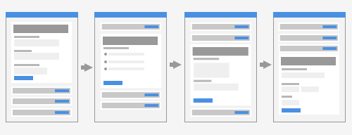
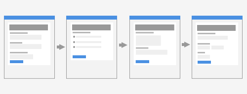
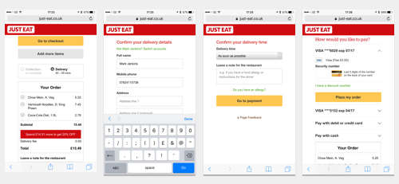
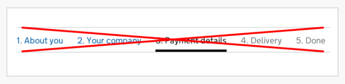
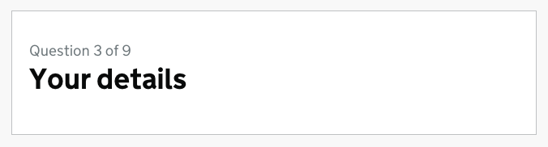

# Checkout

In 2008 I worked on Boots.com. They asked us to design a single-page checkout. This included the trendiest of techniques from that era: accordions, AJAX and client-side validation.

Each step: delivery address, delivery options and payment was an accordion panel. Each panel was submitted via AJAX. On successful submission, the panel collapsed and the next one opened.

It looked like this:



Users struggled to complete their orders. Errors were hard to fix as users had to scroll up and down. And the the accordion was a distraction. Inevitably, the client asked us to make changes.

We redesigned it so that each panel became its own page removing the need for an accordion and AJAX. However, we kept the client-side validation to avoid an unnecessary trip to the server.

It looked like this:



This converted much better. I can’t remember the exact numbers but I know that the client was happy.

Six years later, in 2014, at Just Eat, the same thing happened. We redesigned the single-page checkout flow so that each section became its own page. This time I made a note of the numbers. The result was an extra 2 million orders a year. That’s *orders*, not revenue.

Here are some of the mobile-first designs we used:



A couple of years later, in 2016, Robin Whittleton from GDS, told me that putting each thing on a page of its own was a GDS design pattern called One Thing Per Page[^1]. Apart from the numbers there is a strong rationale behind the pattern, which we’ll get to shortly.

First, we'll take a look at exactly what this pattern is.

## What is One Thing Per Page?

One Thing Per Page is not necessarily about having one element or component on a page (although it could). In all likeliness you’ll still have, for example, a header and footer. Similarly, it’s not about having a single form field on each page either (although, again, it could).

This pattern is about splitting up a complex process into multiple smaller pieces, and placing those smaller pieces on screens of their own. For example, instead of placing the address form on the same page as the delivery options and payment forms, we put it on a separate page.

An address form has multiple fields, but it’s a single, tangible question that is being asked of the user. It makes sense to tackle this question on one screen.

Next we’ll look at why the pattern is so good.

## Why is it so good?

Whilst this pattern often bares wonderful and delicious fruit (or orders and conversions if you hate my analogies) it’s nice to understand the rationale behind it.

### 1. It reduces cognitive load

Like Ryan Holiday describes in The Obstacle Is The Way, remember the first time you saw a complicated algebra equation? It was a jumble of symbols and unknowns. But when you stopped to break it down and isolate the parts, all that was left was the answer.

It’s the same for users trying to complete a form or anything else for that matter. If there is less stuff on screen, and only one choice to make, friction is reduced to a minimum. Therefore users stay on task.

### 2. It's easy to fix errors

When users fill in a small form, errors are caught and presented early. If there’s one thing to fix, it’s easy to fix, which reduces the chance of users giving up.

### 3. Pages load faster

If pages are small by design, they will load faster. Faster pages reduce the risk of users leaving and they build trust in the service.

### 4. It's easy to track progress and return to previous steps

If users submit information frequently, we can save it in a more granular fashion. If a user drops off, we can send them an email, prompting them to complete their order, for example.

### 5. It reduces the chance of losing information

A large form takes longer to complete. If it takes too long, then a page timeout may cause the information to be lost, causing tremendous frustration.

Alternatively, the computer freezes, which was the case for Daniel, the leading character in *I, Daniel Blake*. With declining health and having never used a computer before, his computer freezes and his data lost. In the end, he gives up.

I've counted 16 problems in total, which you can read about in Better Form Design: One Thing Per Page[^2].

This inconspicuous and humble UX pattern is flexible, performant and inclusive by design. It truly embraces the web, making things easy for high and low confidence users.

Having lots (or everything) on one page, may give an illusion of simplicity, but like algebraic equations, they are difficult to deal with unless they are broken down.

If we consider a task as a transaction that a user wants to complete, breaking it down into multiple steps makes sense. It’s as if we’re using the very building blocks of the web as a form of progressive disclosure. And the metaphor behind pages provides a subconscious sense of moving forward.

We'll use this approach to design the checkout flow.

## Flow and order

In Forms That Work[^3], Caroline Jarett and Gerry Gafney explain the importance of asking questions in a sensible order:

> Asking for information at the wrong time can alienate a user. The same question put at the right moment can be entirely acceptable.

> Think about buying a car. You’re just browsing, getting a sense of what is available. A salesperson comes along and starts to ask you how you’ll pay. Would you answer? Or would you think, “If that person doesn’t stop annoying me, I’m out of here”?

> Now think about the point where you’ve told the salesperson which car you want to buy. Now it’s appropriate to start negotiating about payment. It would be quite odd if the salesperson did **not** do so.

We can apply the same principles to the steps in checkout:

1. Delivery address
2. Delivery options
3. Delivery notes
4. Payment
5. Check and confirm
6. Order confirmation

Just like the car salesperson, we'll ask for the right information at the right time. The *Check and confirm* step acts as a final check of contracts and the confirmation acts as sales receipt for record keeping.

## Delivery address

How it might look:


HTML:

```html
<form novalidate>
  <div class="field">
    <label for="recipientName">
		<span class="field-label">Recipient name</span>
    </label>
    <input type="text" id="recipientName" name="recipientName">
  </div>
  <div class="field">
    <label for="mobile">
    	<span class="field-label">Your mobile</span>
    	<span class="field-hint">So we can notify you about delivery</span>
    </label>
    <input type="tel" id="mobile" name="mobile">
  </div>
  <div class="field">
    <label for="address1">
    	<span class="field-label">Recipient address line 1</span>
    </label>
    <input type="text" id="address1" name="address1">
  </div>
  <div class="field">
    <label for="address2">
    	<span class="field-label">Recipient address line 2</span>
   	</label>
    <input type="text" id="address2" name="address2">
  </div>
  <div class="field">
    <label for="city">
    	<span class="field-label">Recipient city</span>
    </label>
    <input type="text" id="city" name="city">
  </div>
  <div class="field">
    <label for="postcode">
    	<span class="field-label">Recipient postcode</span>
    </label>
    <input type="text" id="postcode" name="postcode">
  </div>
  <input type="submit" value="Next">
</form>
```

We've used the same field pattern from the first chapter with a label and optional hint for each field. But there are some specific things to note.

### Mobile field

In the first chapter, we discussed just how important it was to tell users, on occasion, why it is we're asking for particular information. Why is it, then, are we asking for the user's phone number, especially when they're ordering online?

The courier who is fulfilling delivery actually offers real-time text messages on the day of delivery. So we tell the users this through by using the hint pattern. This builds trust, reduces friction and promotes the feature, all at the same time.

The mobile input uses `type=tel`. This displays a telephone-specific on-screen keyboard on mobile. This makes it far easier to enter their phone number.


### Postcode field

Designers are obsessed with clean lines and symmetry. In Write Less Damn Code[^4], Heydon Pickering jokingly points out that was the reason some people added ‘XHTML 1.1 Compliant’ banners just to ensure the height of the navigation bar matches the height of the content perfectly.

In the case of the delivery form, we might be tempted to give each field the same width. It's hard to argue aginst the beauty of such a design, but we're not installing a minimalist art display.

We're designing a form for people to complete easily. Making the postcode field wide (to match the others) is a cognitive burden on the user. This is because the width of the field gives users a clue as to the length of the content required.

Baymard Institute's study[^5] found that *if a field is too long or too short, users start to wonder if they correctly understood the label. This was especially true for fields with uncommon data or a technical label like card verification code.*

As a postcode consists of approximately 8 characters, the field should have width to match as shown above. This rule doesn't apply just to the postcode, we can use the same technique on other fields where the length of field is known.

### Capture+

Capture+[^6] is a third party API and plugin that allows users to search for their address easily. Instead of manually typing each part of the address in 5 separate boxes, it offers users a single text box.


As the user types the first line of their address, suggestions appear from which to select. This reduces the amount of keystrokes and the chance of typos. If no address is found, the user can change the interface back to the regular form giving users choice.

This type of Javascript enhancement comes with many design considerations. We could abdicate our responsibility by handing it over to the plugin. But in all likeliness they haven't considered the accessibility implications of doing so. We'll look at these implications in the next chapter by designing and building our own inclusive autocomplete component.

## Delivery options

How it might look:


HTML:

```html
<form novalidate>
	<fieldset>
		<legend>Delivery options</legend>
		<div>
		    <input type="radio" name="option" id="option1" value="Standard" checked>
		    <label for="option1">Standard (Free, 2-3 days)</label>
		</div>
		<div>
		    <input type="radio" name="option" id="option2" value="Premium">
		    <label for="option2">Premium (£6, Next day)</label>
		</div>
	</fieldset>
	<input type="submit" value="Next">
</form>
```

This is the first time we've encountered a field that consists of multiple inputs for the same question in the form of radio buttons. There are some special things to note.

### Using `fieldset` and `legend`

To group multiple inputs together, we need to use the fieldset and legend elements. Each input represents a choice and the grouping is achieved by wrapping it inside a fieldset. The legend describes this grouping, in much the same way as the label describes the input.

Like the label, the legend provides a description both visually and for those using a screen reader. In most screen readers, the legend is read out in combination with the radio button's label. Something like *Delivery options, Standard (Free, 2-3 days)*.

It may be tempting to group all fields in form like this. Chapter one's registration form could, in theory, be wrapped in a fieldset and legend. Whilst this is valid, it creates unnecessary noise to those fields that are perfectly understandable without this treatment.

As Heydon Pickering says in Inclusive Design Patterns[^7], *it's easy to think of patterns as ‘right’ and ‘wrong’*. As with most design decisions, we should apply solutions based on the context of the problem, not by blindly following a blanket rule.

### Provide a sensible default

The first radio button has a `checked` attribute. This selects the first delivery option automatically. This has two benefits as there is:

- less work for the user to do
- no chance of causing errors

Where possible the first radio button should be checked. This is because the most common choice should normally come first. In this case, we've sensibly assumed this to be the cheapest option.

## Delivery notes

Imagine you've ordered your thing and it's on the way. You're excited to receive it. But then, it was too big to fit through the letter box and you weren't there to answer the knock at the door. This is where delivery notes can help.

A delivery note tells the delivery person what to do in this event. It might be preferable to leave it with a neighbour for example, or by leaving it in the recycling bin, which works surprisingly well I might add.

How it might look:


HTML:

```HTML
<form novalidate>
	<div class="field">
	    <label for="notes">
	    	<span class="field-label">Delivery notes</span>
	    	<span class="field-hint">Tell the delivery person what to do if you're not in. Such as leave it with the next door neighbour. No more than 150 characters.</span>
	    </label>
	    <textarea id="notes" name="notes"></textarea>
  	</div>
  	<input type="submit" value="Next">
</form>
```

The HTML is remarkably similar to most of the other fields we've discussed so far including the hint pattern. But this is the first time we've seen a `textarea`. There are some special things to note.

### Textarea

A `textarea` is like a text box except that it allows many lines of text, and typically takes more content. (Remember, the size of the field should afford its requirements.)

However the problem with a textarea is that it seemingly takes an infinite amount of characters. But the Question Protocol, as discussed in chapter 1 tells us that we need to know what it is we're doing with a piece of information before we can determine how we design it for the interface.

In this case, the device that shows the notes has a limited amount of space to fit the note into. And it doesn't allow scrolling. Even if it did, a lot of text to wade through could cause a lot of wasted time. We need to limit the amount of text that can be entered.

### Limiting characters

The `maxlength` attribute limits the amount of text users can enter. However, support is either lacking or buggy[^8]. Worse though, is that `maxlength` literally prevents the user from entering too many characters.

This is a problem because some users solely focus on the keyboard whilst typing. When they finally look up at the screen, they'll realise the system ignored paragraphs of text they spent ages entering. This causes frustration and a distrust in the service.

Instead, we'll need to create a custom component that indicates to users how many characters they have left. Importantly, the component won't interupt users and it won't stop the user entering too many characters.

For those that don't look up, they'll get feedback then and can take action to reduce the characters. For those that miss the feedback entirely, validation will look after them.

### Characters remaining component

How it might look:

[]()

The Javascript:

```javascript
function CharactersIndicator(field, options) {
	this.field = $(field);
	this.status = $('<div class="indicator" role="alert" aria-live="polite" />');
	this.setOptions(options);
	this.updateStatus(this.options.maxLength);
	this.field.parent().append(this.status);
	this.field.on("keydown", $.proxy(this, 'onFieldChange'));
};

CharactersIndicator.prototype.setOptions = function(options) {
	this.options = {
		maxLength: 100,
		message: 'You have %count% characters remaining.',
	};
	this.options = $.extend(this.options, options);
};

CharactersIndicator.prototype.onFieldChange = function(e) {
	var remaining = this.options.maxLength - this.field.val().length;
	this.updateStatus(remaining);
};

CharactersIndicator.prototype.updateStatus = function(remaining) {
	var message = this.options.message.replace(/%count%/, remaining);
	this.status.html(message);
};
```

Notes:

- It creates a status which will tell users how many characters remain and place it below the field.
- The status has a `role="status"` and `aria-live="polite"` which ensures the updates are read out by screen readers. Polite just means that the announcement won't happen until the user stops typing, meaning they aren't rudely interrupted.
- As the user types, the status box is updated with a message.

## Payment

How it might look:


HTML:

```html
<form novalidate>
	<div class="field">
		<label for="ccname">
			<span class="field-label">Name on card</span>
		</label>
		<input type="text" id="ccname" name="ccname" autocomplete="cc-name">
	</div>
	<div class="field">
		<label for="cardnumber">
			<span class="field-label">Card number</span>
		</label>
		<input type="number" id="cardnumber" name="cardnumber" autocomplete="cc-number">
	</div>
	<div class="field">
		<label for="expdate">
			<span class="field-label">Expiry date</span>
		</label>
		<input type="number" id="expdate" name="expdate" autocomplete="cc-exp">
	</div>
	<div class="field">
		<label for="cvc">
			<span class="field-label">Security code</span>
		</label>
		<input type="number" id="cvc" name="cvc" autocomplete="cc-csc">
	</div>
  <div class="field">
    <fieldset>
		<legend>
			<span class="field-legend">Is your billing address the same as delivery?</span>
		</legend>
		<div class="field-checkbox">
			<label for="things">
				<input type="checkbox" name="things" value="" id="things" checked>
				Yes, it's the same
			</label>
		</div>
	</fieldset>
  </div>
	<input type="submit" value="Next">
</form>
```

Card details are among the most commonly corrected fields in forms. There are a many things we can do to design a better experience.

### Browser autocomplete

In Improve Billing Form UX[^9], Margarita Klubochkina explains that the browser's autocomplete behaviour speeds up the form filling process:

> Nowadays almost every popular browser has an autofill feature, allowing the users to store their card data in the browser and to fill out form fields more quickly. Since iOS 8, mobile Safari users can scan their card’s information with the iPhone’s camera and fill in [the] fields automatically.’

Both autofill and card-scanning work only with forms that use `autocomplete` for HTML5-supporting browsers and `name` for browsers without support.

Our form uses the following attributes for each field:

- Name on card: cc-name and ccname
- Card number: cc-number and cardnumber
- Expiry date: cc-exp and expdate
- Security number: cc-csc and cvc

### Question Protocol

When we designed the payment form for Kidly, we used the Question Protocol from chapter 1 to guide us. You may note that the form doesn't contain *Valid from* but does contain *Name on card*. This is because we asked ourselves the following questions:

- What does Stripe[^10], our payment provider need to process payment?
- What do we want for our records and why?

Øyvind Valland, Chief of Technology at Kidly, explains our thinking:

> We don't need to ask for Valid From. Only a handful of debit cards show those and it provides more hassle for the customer to enter, than benefit to us in verifying card details. That is, if the card is stolen, having to enter a valid from date isn't going to stop the thief.

> Name on card is something we do ask for but I do not believe Stripe uses it for verification. Only the numerics contained in card details are used for verification. That is, house numbers are used, but not street names.

I wondered, then, why it is we ask for street name. Øyvind explains:

> In order to verify card details the answer is no. I do recommend that you ask for it for your own records. Being able to eyeball this stuff is handy in any situation where you have to query what's happened. Besides, I think people kind of expect that they'll have to provide an address (at least one which is used for both billing and shipping)

Øyvind is not a designer per se, but his input into the design process is so important. This is why one of favourite inspirational quotes is *Design is a team sport*[^11]. Proving assumptions are correct or otherwise, is an essential weapon in a designer's arsenal.

### Expiry date

As far as dates go, an expiry date is at the easy end of the spectrum. It's a text box that closely matches the format found on the card. Making things match like this reduces the cognitive burden on the user. They just copy what they see.

> ‘Be conservative in what you send; be liberal in what you accept.’

One of the core principles we defined in chapter 1 was to be forgiving of bad input where possible. In the case of an expiry date, we can forgive users for entering a slash (or not entering a slash). We should do the hard work so users don't have to.

The expiry uses `input type="number"`. Supporting browsers, will actually ignore the slash altogether. On mobile, the on-screen keyboard makes this easy by showing a numeric keyboard:


And for people who use the keyboard on desktop, may use the up and down arrows to increment and decrement the field without the pain of selecting/deleting/typing etc.

Some browsers show increment and decrement buttons when focussed an a number input. These are called, rather oddly, as spinners. The problem is that they are small and hard to use. Frankly, they are useless in the case of entering an expiry date. We'll hide them with CSS:

```CSS
input::-webkit-outer-spin-button,
input::-webkit-inner-spin-button {
    -webkit-appearance: none;
    appearance: none;
    margin: 0;
}
```

### Security number

This number is found on the back of the card. It's not obvious what it is or where to find it. It's not labelled and sometimes it's part of a larger number.

This makes ‘Security number’ ambiguous on its own. It doesn't help matters that some sites refer to this as ‘CVC number’ which, by the way, stands for ‘card verification number’. We should avoid acronyms because they make people feel stupid and are generally hard to understand.

Telling users where to find this information in the form of a hint makes things obvious and requires little effort on behalf of the user.

### Billing address

The billing address is a replica of the delivery address which we designed earlier. Using the same component makes the interface familiar. Familiarity is an important quality of an interface.

To process the card, we need its registered address. For most users this is the same as the delivery address. The user already provided this information earlier, so we can use this to enhance the experience.

To do this, we'll add an extra field, as counterintuitive as that may sound. Instead of exposing the billing address, we'll ask users if their billing address and delivery address are the same. This is the most common scenario, so we default it to checked.

With Javascript available, we hide the billing address. Unchecking the checkbox reveals it accordingly.

```javascript
function AddressRevealer() {}
```

```CSS
.enhanced .address-isHidden {
	display: none;
}
```

## Check and confirm

How it might look:


Checkout flows are often designed not to have this page. After all, it's an extra page and slows down time to completion. But completion time is a dangerous metric in which to infer a well-designed experience. Particularly if it's the *only* metric.

There is little worse than submitting an order when the user didn't expect it. The button text shouldn't be ‘Continue’ as this implies there are further steps when there aren't, leading to this exact problem.

Similarly submitting an errorneous order is frustrating and time consuming. Even the most sophisticated validation mechanism cannot eradicate human error. Even if everything *looks* right and is formatted correctly, there could still be mistakes.

For example, take Mary (I made her up), a mother of two, one is a baby. It's late, the baby is up, screaming obviously and naturally, Mary is tired and stressed. To make things worse she's ran out of nappies.

She adds them to her basket and hits ‘Checkout’. But she ordered the wrong nappies and used the wrong card. Both the nappies and the card are valid. But she needed different nappies and she wanted to use a different card&mdash;one that is not in the red.

Having spent a lot of time filling out the forms, it's only human and respectful to give Mary the chance to review her order and make amends where necessary.

This saves the business a lot of time and money. If she makes the wrong order then she'll need to return it. This is costly and time-consuming, especially if the business offers free returns.

### Amending the order

How it might look:


Each step is represented in the ‘Check and confirm’ page. The user can check and amend each step by clicking *change*. Using One Thing Per Page enables users to jump back and forth easily. Page loads are fast, and each page has minimal noise which makes amends focussed.

For example, if they want to update their delivery option to "Next Day" then they simply choose it, and the system should update that, and take the user right back to the for another final review.

As we collect information, we don't have to ask for it again and can send users to the most advanced step at any time reducing friction and increasing conversion.

## Confirmation pages

How it might look:


Confirmation pages are essential especially as part of a multi-step form flow. A confirmation page serves many purposes. Without one, users are left confused. In the case of buying something, they may wonder whether their order was submitted successfully.

The Government Digital Services’ (GDS) service manual[^12] says each service must have a confirmation page with the following:

- a reference number (if there is one)
- details of what happens next and when
- contact details for the service
- links to information or services that users are likely to need next
- a link to your feedback page, where users can tell you what they think of the service
- a way for users to save a record of the transaction (for example, as a PDF)

Whilst GDS isn't selling products, much of this is applicable to the checkout flow. We give users an order number and details of what happens next. We also tell them what to do if they don't receive the order and give them a way to cancel it there and then if they spot a mistake.

After placing the order, their experience is, in many respects, just beginning. The confirmation page is an opportunity to show how caring the business is even after a sale.

For those who used guest checkout (more on this later), the confirmation page is a good place to ask users to register. We might offer users a discount off their next order. Or more simply by offering users a faster experience next time (because we've got their details).

## Guest checkout

As Jared Spool explains in The 300 Million Dollar Button[^13], forcing users to register, before being able to checkout is just about the worst thing we can do.

Earlier, on the confirmation page we told users that if they signed up they would have a faster checkout experience next time around. This is because we would have most of their details on record. But the first time they place an order, we don't have the details.

This creates an unnecessary burden on the users up front for no gain to the user. Where is the user need? Using the Question Protocol forces us to ask ourselves why. The answer to this question is invariably uncompelling.

By all means ask users to register, by giving genuine value, but do so at the end of a journey. The journey itself should build trust if we design it well.

## Progress bars

Traditional advice says we should give users knowledge of their progress within a particular process. But this is not necessarily the case. There is little data that shows including one is of much value.



GDS say that they:

- are often not noticed
- take up lots of space
- don’t scale well on small screens
- can distract and confuse some people
- make it hard to write good labels
- make it hard to handle conditional sections

It's better to start without one, and test to see what problems bare out. It's easier and cheaper to add features later than it is to remove them after the fact.

Not having one makes for a cleaner, lighter and more focussed page which should makes things easier for the user. Having meticulously designed every detail the checkout should hopefully be so fast that there is no reason to wonder *how much is left*.

If research shows you need one, consider a simple version first:



This progress indicator may well be enough and doesn't suffer from many of the challenges and problems of a more verbose, traditional indicator.

In later chapters, we'll look at how to solve a really really long form by showing progress.

## Smart defaults

We can speed things up drastically for those ordering for a second time. This is because we have their information on record. This means we can bypass all the steps by sending the user directly to the *Check and confirm* page for a final review. For most users, this means reducing interaction points to one.

## Order summary

How it might look:


Picture the experience of shopping in a real world physical shop. No computer in-sight. You walk in, you pick items to buy and place them in your basket. When you decide to go to the till, you can see everything you're buying, even as the assistant scans each item.

To mimic this behaviour, we provide a view of the order and all the details of the order throughout the checkout flow. This builds trust, keeps users in control and upholds the forward momentum.

Not including a summary is akin to dumping a basket of products into a black hole, and the assistant then telling you how much to pay. This is a burden on the user as they are forced to remember what they picked up. This causes anxiety and eventual drop out.

On small screens we put the order summary below the form. On bigger screens we have an opportunity to place it beside the form:


## Checkout header

Many checkouts have a specific header that is different to the norm. This is because it reduces the noise, and softly encourages users to complete the process. The suggestion here is to keep the site's logo for familiarity purposes and allow uses to click that to exit the flow.

Also tell users they are in the checkout flow. This is what we did for Kidly:


## Summary

In this chapter we used One Thing Per Page to reduce the cognitive burden of filling out a relatively long form. From here, we navigated our way through a host of smaller details which collectively contribute to a friction-free and respectful user experience. Here are the main takeaways:

- Ask questions in a sensible order.
- The width of the field should match the type of input.
- Use `fieldset` and `legend` elements to give checkboxes and radio buttons context for the choices therein.
- Leverage autocomplete to speed up the form filling process.
- Adding extra questions is not always a bad thing. Time to completion is not the only metric.
- Allow users to check their answers before final submission.
- Use a confirmation page to give users important information and to continue the relationship that has just begun.
- Forcing users to register before checkout is one of the worst things we can do.
- Progress bars don't always improve the experience and may clutter the interface unnecessarily.
- Use smart defaults and stored data to drastically reduce effort and increase conversion.

## Footnotes

[^1]: https://designnotes.blog.gov.uk/2015/07/03/one-thing-per-page/
[^2]: https://www.smashingmagazine.com/2017/05/better-form-design-one-thing-per-page/
[^3]: http://www.formsthatwork.com/
[^4]: https://www.youtube.com/watch?v=tzfHlEFd2Fk
[^5]: http://baymard.com/blog/form-field-usability-matching-user-expectations
[^6]: http://www.pcapredict.com/en-gb/address-capture-software/
[^7]: https://www.smashingmagazine.com/inclusive-design-patterns/
[^8]: http://caniuse.com/#feat=maxlength
[^9]: https://www.smashingmagazine.com/2017/03/improve-billing-form-ux/
[^10]: https://stripe.com/gb
[^11]: https://nordnet.design/design-is-a-team-sport-231a602fc072
[^12]: https://www.gov.uk/service-manual/design/confirmation-pageswestern-web-part-1/
[^13]: https://articles.uie.com/three_hund_million_button/