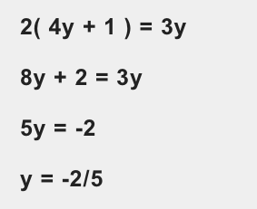

# Checkout

In 2008 I worked on Boots.com. They wanted a single-page checkout with the trendiest of techniques from that era including accordions, AJAX and client-side validation.

Each step (delivery address, delivery options and card details) had an accordion panel. Each panel was submitted via AJAX. On successful submission, the panel collapsed and the next one opened, with a sliding transition.

It looked a little like this:


Users struggled to complete their orders. Errors were hard to fix as users had to scroll up and down. And the the accordion panels were painful and distracting. Inevitably, the client asked us to make changes.

We redesigned it so that each panel became its own page removing the need for accordions and AJAX. However, we kept the client-side validation to avoid an unnecessary trip to the server.

It looked a little like this:


This version converted much better. Although I can’t remember the exact numbers, I do know that the client was happy.

Six years later (2014), when I was at Just Eat, the same thing happened. We redesigned the single-page checkout flow so that each section became its own page. This time I made a note of the numbers. The result was an extra 2 million orders a year. That’s *orders*, not revenue.

Here are some of the mobile-first designs we used:


A couple of years later (2016), Robin Whittleton from GDS, told me that putting each thing on a page of its own was a design pattern in its own right known as One Thing Per Page. Apart from the resulting numbers there is a lot of rationale behind the pattern which we’ll get to shortly.

Before we do that though, let’s take a look at exactly what this pattern is.

## What Does One Thing Per Page Mean Exactly?

One Thing Per Page is not necessarily about having one element or component on a page (although it could). In all likeliness you’ll still have, for example, a header and footer.

Similarly, it’s not about having a single form field on each page either (although, again, it could).

This pattern is about splitting up a complex process into multiple smaller pieces, and placing those smaller pieces on screens of their own.

For example, instead of placing the address form on the same page as the delivery options and payment forms, we put it on a dedicated page of its own.

An address form has multiple fields, but it’s a single, tangible question that is being asked of the user. It makes sense to tackle this question on one screen.

Next we’ll take a look at why the pattern is so good.

## Why Is It So Damn Good?

Whilst this pattern often bares wonderful and delicious fruit (or orders and conversions if you hate my analogies) it’s nice to understand the rationale behind it.

### 1. It reduces cognitive load

Like Ryan Holiday describes in The Obstacle Is The Way, remember the first time you saw a complicated algebra equation? It was a jumble of symbols and unknowns. But when you stopped to break it down and isolate the parts, all that was left was the answer.



It’s the same for users trying to complete a form or anything else for that matter. If there is less stuff on screen, and only one choice to make, friction is reduced to a minimum. Therefore users stay on task.

### 2. It's easy to fix errors

When users are filling in a small form, errors are caught and presented early. If there’s one thing to fix, it’s easy to fix, which reduces the chance of users giving up.

### 3. Pages load faster

If pages are small by design, they will load faster. Faster pages reduce the risk of users leaving and they build trust in the service.

### 4. It's easy to track progress and return to previous steps

If users submit information frequently, we can save it in a more granular fashion. If a user drops off, we can send them an email, prompting them to complete their order, for example.

### 5. It reduces the chance of losing information

A large form takes longer to complete. If it takes too long, then a page timeout may cause the information to be lost, causing tremendous frustration.

Alternatively, the computer freezes, which was the case for Daniel, the leading character in *I, Daniel Blake*. With declining health and having never used a computer before, his computer freezes and his data is lost. In the end, he gives up.

I've actually counted eleven more reasons[^Smashing Article] as to why this pattern works so well.

This inconspicuous and humble UX pattern is flexible, performant and inclusive by design. It truly embraces the web, making things easy for high and low confidence users.

Having lots (or everything) on one page, may give an illusion of simplicity, but like algebraic equations, they are difficult to deal with unless they are broken down.

If we consider a task as a transaction that a user wants to complete, breaking it down into multiple steps makes sense. It’s as if we’re using the very building blocks of the web as a form of progressive disclosure. And the metaphor behind pages provides a subconscious sense of moving forward.

I’ve not come across a design pattern that has as many benefits as this one. It’s like compound interest, it just keeps on giving. This is one of those cases where simple is just that. Simple.

Needless to say we'll this design pattern  to design our checkout form in this chapter.

## Flow and order

In Forms That Work[^] Caroline and Gerry explain the importance of asking questions in a logical order:

> Asking for information at the wrong time can alienate a user. The same question put at the right moment can be entirely acceptable.

> Think about buying a car. You’re just browsing, getting a sense of what is available. A salesperson comes along and starts to ask you how you’ll pay. Would you answer? Or would you think, “If that person doesn’t stop annoying me, then I’m out of here”?

> Now think about the point where you’ve told the salesperson which car you want to buy. Now it’s appropriate to start negotiating about payment. It would be quite odd if the salesperson did **not** do so.

We can apply the same principles to our checkout process:

1. Delivery address
2. Delivery options
3. Payment
4. Check details
5. Confirmation

Just like the salesperson, we'll be asking for the right information at the right time. The *Check details* page acts as a final check of contracts and the confirmation acts as sales receipt and invoice for record keeping.

Whenever we're designing a form, big or small, we should be thinking about flow and order.

Next, we'll look at each screen separately.

## Delivery address

What it looks like:


HTML:

```html
<form>
  <div>
    <label for="recipientName">Recipient name</label>
    <input type="text" id="recipientName" name="recipientName">
  </div>
  <div>
    <label for="mobile">
    	<span class="label">Your mobile</span>
    	<span class="hint">So we can notify you about delivery</span>
    </label>
    <input type="tel" id="mobile" name="mobile">
  </div>
  <div>
    <label for="address1">Recipient address line 1</label>
    <input type="text" id="address1" name="address1">
  </div>
  <div>
    <label for="address2">Recipient address line 2</label>
    <input type="text" id="address2" name="address2">
  </div>
  <div>
    <label for="city">Recipient city</label>
    <input type="text" id="city" name="city">
  </div>
  <div>
    <label for="postcode">Recipient postcode</label>
    <input type="text" id="postcode" name="poscode">
  </div>
  <input type="submit" value="Next">
</form>
```

### Mobile field

As we discussed in A Registration Form, we know how important it is to tell users why we're asking for information.

When a user first encounters this form, they wonder why we're asking for their mobile phone number, when they're ordering a product online.

But we, the designers, know that our couriers offer real-time text messages on the day of delivery. And so as you can see in the design, we're telling our users that transparently. This builds trust, reduces friction and offers a nice little feature, all at the same time.

Those of you with a keen eye for detail will have noticed that the mobile field has `type=tel`. Much like `type=email` discussed in A Registration Form, this will display a telephone-specific keyboard on various mobile devices:


This allows users to type their phone number easily with a dedicated context-specific keyboard.

### Postcode field

Often designers like to make everything line up perfectly. In this case they design the width of the postcode field to match all the others.

It's hard to argue that visually this is appealing. But we're not installing a minimalist art display. We're designing a form for people to use. And making the postcode field too big is a cognitive burden on the user.

The field width provides a clue as to the length of content required for input. The postcode consists of approximately eight characters, therefore this field should be smaller than other fields in an address form as shown.

You can apply these principles to other form fields where the length of the field is *known*.

### Capture+ enhancement

Capture+[^] is a Javascript API and plugin that allows users to search for their address quickly and easily. Instead of manually typing each part of your address in 5 separate text boxes, we can offer users a single text box.


As the user types the first line of their address, they can select their address from a list of suggestions. This drastically reduces the amount of keystrokes, and reduces the chance of typos.

In the event that the component doesn't recognise a user's address, we still offer the user the ability to change the UI back to the standard address form. In doing this we conform to the fourth of Heni Swans UX principles, give people the ability to choose.

Enhancing a textbox like this doesn't come for free. We either hand off responsibility to the plugin and hope that they considered screen reader users, or we write our own.

In upcoming chapters, we'll discuss what it takes to design and code a fully inclusive typeahead form component. This will give you some expertise in order to analyse other peoples plugins, or to write your own when needed.

## Delivery options

What it looks like:


HTML:

```html
<form>
	<fieldset>
	    <legend>Delivery options</legend>
      <div>
  	    <input type="radio" name="option" id="option1" value="Standard" checked>
  	    <label for="option1">UK Standard (Free, 2-3 days)</label>
      </div>
      <div>
  	    <input type="radio" name="option" id="option2" value="Premium">
  	    <label for="option2">UK Premium (£6, Next day)</label>
      </div>
	</fieldset>
</form>
```

### Grouping controls with fieldset and legend

This is the first time we've encountered fields that needs grouping. This is because we have several form fields that relate to the same piece of information.

As you can see in the code above, we wrap each of the form fields inside a `fieldset`, with a `legend` element that provides a description for those options.

Combining the fieldset and legend is an important inclusive form pattern. Visually the text provides an overarching description for the group. And in most screen readers, this results in the legend's text being read out with the radio button's label. For example *Delivery options, UK Standard (Free, 2-3 days)*.

You might think that all fields can be grouped in some way. For example, we could wrap the entire registration form from the previous chapter in a `fieldset` and `legend`.

Whilst this is valid it creates unnecessary noise to fields that are fully understandable anyway. As Heydon Pickering says in Inclusive Design Patterns[^], *it's easy to think of patterns as "right" and "wrong"* but, as with most design decisions, we should apply solutions based on the context of the problem.

### Provide a sensible default

The first radio button has a `checked` attribute. This automatically selects the first delivery option without needing the user to do so.

This has a couple of benefits:

1. There is less work for the user to do; and
2. There is no chance of causing validation errors.

In this situation it's vital that we put the most common choice first, which in this case we have assumed to be the cheapest.

What we should never do, is automically select the most expensive and least common option.

## Payment

What it looks like:


HTML:

```html
<form>
  TBD
</form>
```

### Field size

Again the size of the fields vary depending on their known lengths. Baymard institute usability study[^44] found that if a field is too long or too short, users start to wonder if they correctly understood the label. This was especially true for fields with uncommon data or a technical label like card verification code.

### We don't need to ask for it

You may have noticed that the payment form does not contain a Valid From field but does contain Name On Card. When we designed the payment form for Kidly we had to take into account a couple things.

Firstly, what did our payment provider need to take payment, and second, what did we want for our own records. I spoke to Oyvind Valland, CTO of Kidly about all this. Here is what he had to say:

> We don't need to ask for Valid From. Only a handful of debit cards show those and it provides more hassle for the customer to enter, than benefit to us in verifying card details. That is, if the card is stolen, having to enter a valid from date isn't going to stop the thief.

> Name on card is something we do ask for but I do not believe stripe uses it for verification. If I remember correctly, only the numerics contained in card details are used for verification. That is, house numbers are used, but not street names.

So I asked Oyvind why we have street name in the billing address field. Here's what he said:

> In order to verify card details I think the answer is no. I do recommend that you ask for it for your own records. Being able to eyeball this stuff is very handy in any situation where you have to query what's happened. Besides, I think people kind of expect that they'll have to provide an address (at least one which is used for both billing and shipping)

Oyvind is not a designer per se, but his input into the design is of vital importance. This goes to show the importance of designig as a team sport[^] and that by following the Question Protocol, mentioned in A Registration Form, we can decide what it is we must ask and what it is we want to ask and why.

Proving assumptions are correct or otherwise, is an essential weapon in a designer's arsenal.

### Expiry date

Generally speaking, dates are hard. But, fortunately, an expiry date is straightforward to design and easy to use. We offer users a single text box that closely matches the format found on the credit card themselves. This reduces the cognitive burden for users as they can just copy what they see.

> "Be conservative in what you send; be liberal in what you accept."

We can forgive users for entering a slash as we can easily strip that out on the server. We do the hard work so users don't have to. In addition to this we still give users a hint so for users that are more careful and anxious&mdash;those that read all insutrctions&mdash;they will feel at ease and empowered at the same time.

You'll also notice the expiry date uses `input type="number"`. For supporting browsers, users won't even be able to type a slash. It will be ignored. On mobile an on-screen number keyboard will be shown making it much easier. This is what it looks like:


And for people who like to use the keyboard on desktop, we might call them power users, can use the up and down arrows to increment and decrement the field without the pain of selecting/deleting/typing etc.

Some browsers show little increment and decrement buttons on these inputs. They are quite ugly and hard to use. To turn them off, we can use the following CSS:

```CSS
input::-webkit-outer-spin-button,
input::-webkit-inner-spin-button {
    -webkit-appearance: none;
    margin: 0;
}
```

### Billing address reveal

To validate a card, it needs an associated address. For most users the billing address is the same as the delivery address. The user has already provided this and so we can improve the experience here.

Instead of always exposing a billing address form, we provide users a checkbox asking them to confirm if their billing address is the same as their delivery address.

As this is the most common scenario we mark the checkbox as checked by default, and hide the billing address form. If the billing address *is* different, the user can uncheck the checkbox and fill out the form from there.

To do this we'll need a little Javascript.

```javascript
	var checkbox = document.getElementById('TheID');
	var billingAddressContainer = document.getElementById('etc');
	checkbox.addEventListener('click', onCheckboxClick, false);

	function onCheckboxClick(e) {
		if(checkbox.checked) {
			billingAddressContainer.classList.add('hidden');
			// aria to do
		} else {
			billingAddressContainer.classList.remove('hidden');
			// aria to do
		}
	}
```

```CSS
	// .enhanced .billingAddress-isHidden { display: none }
```

When the checkbox is checked we hide the billing address and ensure screen readers know to ignore the fields. When it is unchecked we show the billing address.

You'll also notice that the billing address form looks and functions exactly the same as the delivery address. This is important. In using the same pattern in multiple places, not only do we get to reuse the same solutions in the same way, but users become familiar with them too.

Familiarity is an important UX principle because familiar is easy and requires less effort from the user.

## Check Details Page

What it looks like:


You may be wondering why we even have this page. It's an extra page, an extra click and afterall we're trying to get users to buy stuff!

TODO: BUTTON TEXT Don't mislead etc.

However, in a checkout flow, there is nothing worse than submitting an order that the user didn't expect. Or equally, submitting the *wrong* order.

Even the most sophisticated validation mechanism cannot eradicate the chance of human error. Even if everything *looks* right and is formatted correctly, it doesn't mean mistakes aren't present.

For example, take Mary (I made her up), a mother of two, one of which is a baby. It's late at night and shes tired and stressed. To make it worse she's ran out of nappies.

She goes online, adds them to her basket, and goes to checkout. But she ordered the wrong nappies and used the wrong card. Both the nappies and the card are valid. But she needed different nappies and she wants to use a different card&mdash;one that is not in the red.

Having spent a lot of time filling out a lot of information to complete the order, it's only human and respectful to give her the chance to review her order and make amends where necessary.

Not only that but it saves the business a lot of time and money too. If she makes the wrong order then she'll need to return them. This is costly and time-consuming, especially if the business offers free returns.

By removing this step, it makes users anxious and therefore drop out. We should strive for clarity over brevity every time. Providing a check page like this is an essential part of this process.

### Amending their order

Each section in the flow is represented in the check page. They can edit any of those sections easily by clicking "change". When they do, they are taken to the dedicated page.


This is one of the great things about One Thing Per Page. It allows users to jump back and forth easily. Page loads are fast, and each page has zero noise, providing the user with just what they asked for to make the necessary change.

For example, if they want to update their delivery option to "Next Day" then they simply choose it, and the system should update that, and take the user right back to the Check pages for a final review.

This is an important aspect of designing a Checkout flow using One Thing Per Page. As we collect information, we don't have to ask for it again and can send users to the most advanced step at any time reducing friction and in all likeliness, increasing conversion.

## Confirmation page

What it looks like:


Technically, there is no form on this page, but confirmation pages are common at the end of a long form process and they are very much needed.

They serve many purposes and without one, it leaves users confused. In the case of buying something, they may wonder whether their order went through successfully or not.

The GDS service manual states[^4] each service must have a confirmation page with the following:

* a reference number (if there is one)
* details of what happens next and when
* contact details for the service
* links to information or services that users are likely to need next
* a link to your feedback page, where users can tell you what they think of the service
* a way for users to save a record of the transaction (for example, as a PDF)

Whilst GDS isn't selling something to its users, all of this is applicable to us here. But there's more for us to take into consideration...

After the user places an order, their experience is, in many respects, just beginning. We need to continue the relationship, provide users with what they need and so forth.

Much like the Check page, a user may have made a mistake so giving them a way to cancel the order is important. If we do this online, we make this quick for the user, and cheap for the business.

If users aren't signed in, this is a perfect opportunity to have users sign up by explaining the value they may get in doing so. It's up to you and your business to provide value though.

Perhaps it's money off their next order, but it can be something more simple, like offering the capability to track orders or enjoying a speedier checkout experience next time.

We'll discuss the merits of being able to checkout anonymously next.

## Guest checkout

Sometimes, online shops force users to sign up before they are able to place an order. As Jared Spool explains in The 300 Million Dollar Button[^], this is just about the worst thing we can do.

It puts unnecessary friction up front, for no gain at this point in time. Remember when we said earlier that we would offer a faster checkout experience next time? That's because we have the user's details in order to do this.

But the first time they place an order, we don't have those details. This is why we religiously ask ourselves *why are we asking for it?*

In this case, why are we asking users to register first? The answer to that question is invariably uncompelling.

By all means get users to sign up, by giving them genuine value, but do so on the confirmation page. We should always be looking to lower barriers, and we can only do that by asking ourselves these questions on a regular basis.

## Progress indicators

Age old advice would tell you that we should give users knowledge of where they are in the process. But this is not necessarily the case. There is little data that shows including one is valuable in anyway.


GDS have shown that they:

- are often not noticed
- take up lots of space
- don’t scale well on small screens
- can distract and confuse some people
- make it hard to write good labels for the steps
- make it hard to handle conditional sections

For these reasons, it's better to start without one, and test to see if one is actually needed. It's much easier to add features down the line than it is to remove them. Less costly that way and easier to measure.

If something is questionable, then by including it, it acts as visual noise and makes the page slower.

Also, if we follow the previous guidance, then we'll have already ensured that we're asking the essential questions, with clear labels and error messages. In which case, checking out should be so quick and friction-free anyway.

If, however, research shows you need one, go with a simple version first:


This progress indicator may well be enough and doesn't suffer from many of the challenges and problems of a more verbose, traditional indicator.

## Smart defaults

As we've already discussed, checking checkboxes and radio buttons by default helps users. But we can do more. A lot more. Particularly for those who are order for a second time.

As we have stored their information from the previous order, we can send them all the to the Check Details page again giving the users the chance to review and make amends.

In this case we've reduced the number of interaction points to potentially one. This is the mark of a friction-free checkout experience.

## Order summary

What it looks like:


When we go shopping in a physical shop we have everything we need through the experience. It's all close to hand. Even when we line up to pay, we can still see everything we're buying.

The order summary panel provides this functionality digitally. Including it throughout the checkout process keeps users informed and in control. Which in turn builds trust and keeps them moving.

Not including one puts the user at a severe disdavantage and as soon as they forget what they are buying and the choices they've made they are likely to drop out.

On small screens we put the order summary below the form. On bigger screens we have an opportunity put it beside the form as follows:


## Summary

In this chapter we've covered what it takes to design a checkout flow using the One Thing Per Page design pattern. Out of this pattern comes several advantages.

Most designers overcomplicate things by putting too much on a page. But by making each step focused, we make each step simple. In providing what appears to be a longer process, we significantly reduce the burden for *users*.

We'll draw on these techniques further in upcoming chapters.

## Footnotes

[^autocomplete fields attribute]: (https://www.smashingmagazine.com/2017/03/improve-billing-form-ux/)
[^west]: (https://www.smashingmagazine.com/2017/03/world-wide-web-not-wealthy-western-web-part-1/)
[^44]: (http://baymard.com/blog/form-field-usability-matching-user-expectations)
[^4]: (https://www.gov.uk/service-manual/design/confirmation-pageswestern-web-part-1/)
