# A Checkout Flow

> Here’s what I bring to the table: a valid credit card, 90 seconds of my time, and my right thumb. The rest is up to you. -- Melanie Jones

In 2008 I worked on Boots.com where we designed a single-page checkout flow. This involved the trendiest of techniques from that era including accordions, AJAX and client-side validation. Each step: delivery address, delivery options and payment was an accordion panel. Each panel was submitted via AJAX. On successful submission, the panel collapsed and the next one opened.

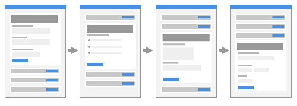

Users struggled to complete their orders. Errors were hard to fix as users had to scroll up and down. And the accordion was a distraction. Inevitably, Boots asked us to make changes. We redesigned it so that each panel became a page removing the need for an accordion and AJAX. (We kept the client-side validation to avoid an unnecessary trip to the server.)

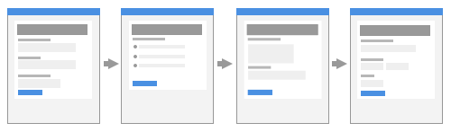

This converted a lot better. Although I can't remember the exact numbers, the client was happy with the results. Six years later, in 2014, at Just Eat, the same thing happened. We redesigned the single-page checkout flow so that each section became a page. This time I noted the numbers. The result was a whopping 5% increase in conversion. This equated to 2 million orders a year. That’s *orders*, not revenue.

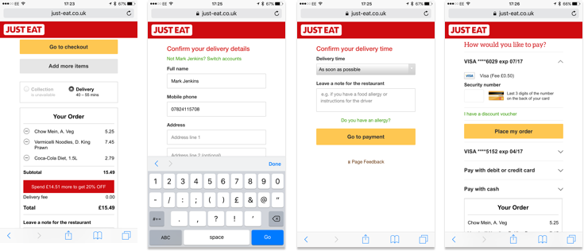

Two years later, in 2016, Robin Whittleton from GDS, told me that putting each thing on a page of its own was a design pattern called One Thing Per Page[^1]. Behind the improved numbers, there are many reasons why it drastically improves the user experience.

## One Thing Per Page

One Thing Per Page is about splitting up a complicated process into small chunks and placing them on screens of their own. For example, instead of putting Delivery Address, Delivery Options, and Payment forms on one page, we put them on separate pages.

It's not necessarily about having one element or component on a page (although it could). In all likeliness, you’ll still have, for example, a header. Similarly, it’s not about having a single form field on each page either (although, it absolutely could). And it doesn't mean you'll always end up with one question per page either.

Forms expert, Caroline Jarrett, who first wrote about the pattern in 2015, explains that user research “will quickly show you that some questions will be best grouped into a longer page.”

However, she also explains that “questions that naturally ‘go together’ from the point of view of designers, don’t need to be on the same page to work for users.” She provides an enlightening example when for GOV.UK Verify, they tested putting ‘Create a username’ on one page and ‘Create a password’ on the next.

Like most designers, Caroline thought that putting them on separate pages would be overkill. In reality, users weren’t bothered. So start with one thing (field or question) per page, then, through research, find out if grouping fields improves the experience.

While this pattern often bares wonderful and delicious fruit (or orders and conversions if you hate my analogies), it’s useful to understand why it works so well.

- Principle 6 says that we should *design interfaces that help users focus on core tasks by prioritising it*. It even goes on to say that *people should be able to focus on one thing at a time*. One Thing Per Page is simply following this principle to the letter, and in doing so, it drastically reduces the cognitive burden on users.
- When users fill in a small form, errors are caught and shown early and often. If there’s one thing to fix, it’s easy to fix, which reduces the chance of users giving up on the task.
- If pages have little on them, they'll load quickly. Faster pages reduce the risk of users leaving and they build trust.
- By submitting information frequently, we can save user's information in a more granular fashion. If a user drops out we can, for example, send them an email prompting them to complete their order.
- Conversely, a long form increases the chance of a page time out or the computer freezing. This is what happens to Daniel, the lead character in “I, Daniel Blake”[^]. With declining health and having never used a computer, it freezes and he loses his data. In the end, he gives up.
- It adds a sense of progression and increases momentum because the user is constantly moving forwards step by step.
- It lets you design interfaces that captalise on maximal  screen space — interfaces that wouldn't work so well if part of a large form. We'll see an example of this in the next chapter, when we design a seat chooser. 

## Flow And Order

In “Forms That Work”[^], Caroline Jarett and Gerry Gaffney explain the importance of asking questions in a sensible order:

> Asking for information at the wrong time can alienate a user. The same question put at the right moment can be entirely acceptable.

> Think about buying a car. You’re just browsing, getting a sense of what is available. A salesperson comes along and starts to ask you how you’ll pay. Would you answer? Or would you think, “If that person doesn’t stop annoying me, I’m out of here”?

> Now think about the point where you’ve told the salesperson which car you want to buy. Now it’s appropriate to start negotiating about payment. It would be quite odd if the salesperson did not do so.

Just like the car salesperson, we'll ask for the right information at the right time. For example, payment happens toward the end. And users will be given a chance to check their order before submitting it. Finally, the confirmation page acts a sales receipt for administrative purposes. Here's the complete flow:

1. Email address
2. Mobile phone (optional)
3. Delivery address
4. Delivery options
5. Delivery notes
6. Payment
7. Check your answers
8. Confirmation

## A Note On Guest Checkout

This flow is designed primarily for anonymous users. Not letting users check out as a guest is one of the worst things we can do as Jared spool attests to beautifully in “The 300 Million Dollar Button”[^]. 

The article tells a story of one company losing 300 million dollars because they thought forcing users to register first would help speed up subsequent purchases. While this is true, it also assumes users want to sign up in the first place.

Considering what we learned with regards to flow and order and applying the question protocol, the story is hardly surprising. What value does a first-time user get in return for the added effort of signing up? Nothing. And that's all you really need to know.

There are more appropriate times to ask users to sign up as we'll see later on in the chapter.

## 1. Email Address

In chapter one, “A Registration Form,” we had to ask users for an email address. We can reuse that pattern here saving us the effort of solving the same problem again from scratch.

There is, however, an opportunity to adapt the content to fit this context better. By that I mean, users may wonder why their being asked for an email address just to purchase something. One of the main takeaways from chapter one was the need to justify the existence of each and every form field.

Here, it's because we can send users a receipt of purchase, which is particularly important if checking out anonymously. Additionally the email may provide details about how to return it. We can tell users this transparently via the hint text.


*(Note: the button's positioning and styling is the same as set out in “A Registration Form”. But the label is set to “Continue” which implies progress and is better suited to the linear checkout flow)*.

## 2. Mobile Phone

Like the email field, we should be asking ourselves why we're asking for their phone number. We know that the courier offers real-time text messages on the day of delivery. But the customer doesn't. So we tell them via the hint. Remember, the hint is not just for formatting rules — it's for anything that will help users fill out the field. This transparency builds trust, reduces effort, and promotes the feature all at the same time.


```html
<div class="field">
  <label for="mobile">
    <span class="field-label">Mobile number (optional)</span>
    <span class="field-hint">So we can notify you about delivery</span>
  </label>
  <input type="tel" id="mobile" name="mobile">
</div>
```

The input's `type="tel"` attribute will spawn a telephone-specific keyboard on mobile devices. This makes it easier to enter a phone number thanks to the larger keypad.

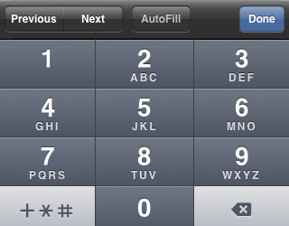

### Marking Optional Or Required Fields

While real-time notifications *add value*, we shouldn't assume everyone wants to receive them, nor that everyone has a mobile phone. So we let users choose to skip this field by marking the field as optional. This way, users can opt-in if they like.

Traditionally, required fields are marked with an asterisk. A legend is usually placed above the form to denote its meaning but as Luke Wroblewski says:

> “including the phrase ‘optional’ after a label is much clearer than any visual symbol you could use to mean the same thing. Someone may always wonder ‘what does this asterisk mean?’ and have to go hunting for a legend that explains it.”

You might also be wondering why we're marking optional fields, instead of required ones. In “Required Versus Optional Fields”[^], Jessica Enders says:

> “think about what we are doing when we mark something in an interface. We are trying to indicate that it's different.” 

Thanks to the Question Protocol, most fields should be required, so we mark optional fields instead.

*(Note: Putting the `aria-required="true"` attribute on an input will tell screen reader users that the field is required. As we're only marking optional fields, this attribute isn't necessary. And the optional text from within the label, will be announced by screen readers too giving sighted and non-sighted users an equivalent experience.)*

## 3. Delivery Address

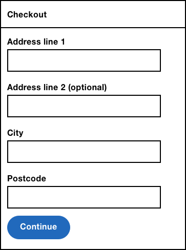

```HTML
<div class="field">
  <label for="address1">
  	<span class="field-label">Address line 1</span>
  </label>
  <input type="text" id="address1" name="address1">
</div>
<div class="field">
  <label for="address2">
  	<span class="field-label">Address line 2 (optional)</span>
 	</label>
  <input type="text" id="address2" name="address2">
</div>
<div class="field">
  <label for="city">
  	<span class="field-label">City</span>
  </label>
  <input type="text" id="city" name="city">
</div>
<div class="field">
  <label for="postcode">
  	<span class="field-label">Postcode</span>
  </label>
  <input type="text" id="postcode" name="postcode">
</div>
```

The delivery address contains five fields that together make up an address. Visually there is a slight difference between the fields: field width.

### Field Width

In “Write Less Damn Code”[^4], Heydon Pickering jokingly points out, that the reason some people used to add XHTML 1.1 Complaint banners to their website was to ensure the height of the menu matches the height of the content. Similarly, you might be tempted to give every address field the same width.

But giving the postcode field the same width as every other field increases the cognitive effort needed to fill it out. This is because the width gives users a clue as to the length of the content it requires.

Baymard Institute's study[^5] found that:

> “if a field is too long or too short, users start to wonder if they correctly understood the label. This was especially true for fields with uncommon data or a technical label like card verification code.”

As postcodes consist of 6-8 characters, the field's width should be smaller than the other fields. You should apply this rule to every field where the length of the content is known.

### Capture+ Enhancement

Capture Plus[^6] is a third party plugin that lets users search for their address quickly and accurately. Instead of manually typing each part of the address in 5 separate boxes, users type into just one. 

As the user types the first line of their address, suggestions will appear from which they can select. This reduces the number of keystrokes and therefore the chance of typos.

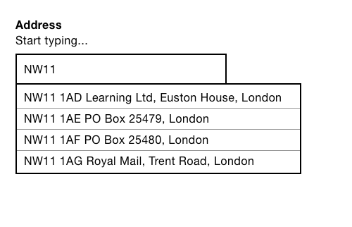

If no address is found, users can change the interface back to the original address form. In doing so, we conform to principle 5, *Offer choice*.

Capture+ has a third-party script which you can include on your page. But most third-party scripts don't account for the broad range of interaction preferences, usability and accessibility considerations. But, we'll look at all of this in the next chapter, when we build our own accessible autocomplete component from scratch.

## 4. Delivery Options


```html
<div class="field">
	<fieldset>
		<legend>
			<span class="field-legend">Delivery options</span>
		</legend>
		<div class="field-radioButton">
		  <input type="radio" name="option" id="option" value="Standard" checked>
		  <label for="option">Standard (Free, 2-3 days)</label>
		</div>
		<div class="field-radioButton">
		  <input type="radio" name="option" id="option2" value="Premium">
		  <label for="option2">Premium (£6, Next day)</label>
		</div>
	</fieldset>
</div>
```

This is the first field that consists of multiple controls, in this case, radio buttons.

### Grouping

To group multiple controls, we must wrap them in a `fieldset`. The `legend` describes the group like a `label` describes the individual control.

Some screen readers, such as NVDA — will read the `legend` out along with the first individual radio button's `label` when entering the field (in either direction). In this case, “Delivery options, Standard (Free 2-3 days)” is announced. In other screen readers — such as Voiceover with Safari — the legend is announced for every field.

If we omitted the `fieldset` and `legend` elements, screen reader users would only hear “Standard (Free, 2-3 days)” which is less clear.

You may be tempted to group all fields this way. For example, the address form from earlier could be wrapped inside a `fieldset` with a `legend` set to “Address.” While this is technically valid, it's unnecessary and verbose as the field labels make sense without a `legend`. Put another way, users don't need to hear “Address: Address Line 1” as it doesn't *add value*.

### Smart Defaults

As most users will want free delivery, that option comes first. It's also selected by default thanks to the `checked` attribute. This stops users from ever seeing an error and gives users less to do.

> “Design for common circumstances first” — Caroline Jarett

### Styling

By default, radio buttons (and checkboxes) are rendered small. This makes them hard to click or tap, especially for people with motor impairments.

We can increase the size using CSS. But this isn't as simple as it sounds. In “Making radio buttons and checkboxes easier to use”[^], Robin Whittleton explains that the way browsers respond to CSS differs.

Some browsers, such as Internet Explorer 8, won't apply size changes. But undesirably, space will be created around the radio button. Other browsers, such as FireFox on OS X (10.10), will increase the size but they will appear blurry. Finally, there are browsers that will apply the changes without making them blurry.

Fortunately, a radio button's label acts as a proxy for the radio button itself. That is, when clicked, the radio button will become checked (or unchecked depending on state). But, unfortunately, most users don't realise they can do this[^gds?]. This is hardly surprising because labels have very little to signify that clicking it would do anything different to regular copy.

To give users a better chance, we can colour them grey and make them respond to the mouse on hover. However, even with these enhancements, some users may still be unaware. GDS's research showed this to be the case which is why they embarked upon custom radio button controls[^].

The problem with creating custom controls is that you have to reimplement all of the behaviour that is provided natively for free. This is very involved and despite GDS's in-depth attempts, they aren't without their problems[^radiobuttonissues].

## 5. Delivery Notes

Imagine you're at work. You get a notification to say your item is being delivered. When you arrive home, instead of seeing the package, you see a delivery note saying it couldn't be delivered because it was too big to fit through the letter box. Frustrating.

A delivery note, which you can provide at your discretion, stops this from happening. The delivery note tells the delivery person what to do if you're not home. Perhaps you'd prefer it to be left with a neighbour, or inside your recycle bin which Amazon[^] refers to as a “safe place.” This, by the way, works surprisingly well.


```HTML
<div class="field">
  <label for="notes">
      <span class="field-label">Delivery notes (optional)</span>
      <span class="field-hint">Tell us what to do if you're not in. For example, *leave it with the next door neighbour*.</span>
  </label>
    <textarea id="notes" name="notes"></textarea>
</div>
```

The `textarea` is similar to a text box except that allows users to enter multiple lines of text which is particularly appropriate for a delivery note. (Remember earlier: the size of the field gives users a clue as to the length of content needed.)

While this question *adds value*, we need to understand how it will be used by the delivery person as this may influence the design. In this case, the viewport on the device is small and can't be scrolled, so we need to limit the amount of text that can be entered.

### Limiting Text

Limiting the amount of text a user can type can and should be handled by validation as set out in “A Registration Form.” But there are some additional considerations.

The `maxlength` attribute (which takes a number value) limits the amount of a text a user can type. As soon as the limit is reached, the browser will ignore the input. The support for this attribute on a `textarea` is both lacking and buggy[^8].

But, even if it was well supported, it's not recommended because some users don't look at the screen as they type — they are focused solely on the keyboard. Where a user enters a lot of text, they'll look up to find half their entry has been truncated. Not good.

### Character Countdown

Instead, we should let users type freely and tell users how many characters they have left. This way, users can see the feedback when they finally look up at the screen and can edit their entry in response. If they don't notice the feedback, an error will be shown when they submit the form, thanks to the validation routine (set out in chapter 1, “A Registration Form”).

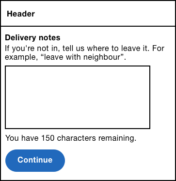

To create this component, we need to use Javascript to inject a status box below the field. Then we need to listen to the textarea's `keydown` event.

```JS
function CharacterCountdown(input) {
  this.input = $(input);
  this.status = $('<div role="status" aria-live="polite" />');
  this.setOptions(options);
  this.updateStatus(this.options.maxLength);
  this.input.parent().append(this.status);
  this.input.on("keydown", $.proxy(this, 'onKeydown'));
};
```

As the user types, the `keydown` event listener will be invoked. This method will check the `length` of the field against the (configurable) max length and update the status box:

```javascript
CharacterCountdown.prototype.onFieldChange = function(e) {
    var remaining = this.options.maxLength — this.field.val().length;
  this.status.html(this.options.message.replace(/%count%/, remaining));
};

```

The container has a `role="status` attribute and an `aria-live="polite"`. This instructs screen readers to announce the contents as it's changed — but only after the user finishes typing. This way, users aren't rudely interrupted.

```HTML
<div role="status" aria-live="polite">
  You have 100 characters remaining.
</div>
```

*(Note: both `role="status"` and `aria-live="polite"` are functionally equivalent, but older versions of JAWS don't support `role`.)*

When the maximum number of characters has been exceeded, the number will change to a negative value.

#### Announcing Only When It's Critical

The character countdown we've designed so far has several provisions that carefully helps the user as they type their entry. First, it doesn't stop the user typing when they exceed the maximum amount of characters. And second, it will only inform users when they stop typing.

Even so, if the user is able to type a large amount of characters, or if the maximum is rarely exceeded, it seems a bit overbearing to interupt users at all.

A more considerate approach would be to give feedback when users get close to the limit. To do this we could add a “critical percentage” option. Setting this to 10 percent, for example, when the maximum is 100 would mean users start being informed when they have typed 90 characters.

## 6. Payment

It's hardly surprising that most transactions are abandoned at the payment page. Not only is this screen shown toward the end of the journey (where users have had the most time to reconsider their decision, for example), but they may have to stop and find their credit card.

Fortunately, there are some usability provisions we can apply here. By leveraging autofill, removing unnecessary fields, using the right input types and crafting label (and hint) text — we can drastically reduce friction and keep users on-task.

### Removing Fields

There are a number of details on a credit or debit card: name on card, card number, valid from date, expiry date, issue number, security number; all of these are commonly found on payment forms. However, not all of these details are necessary to process a payment.

When I worked on Kidly's checkout flow, Øyvind Valland, Chief Technology Officer (CTO) carefully picked Stripe as the payment provider. This way, we didn't have to worry about PCI compliance and the cost of developing a solution from scratch. Here's the payment form we ended up with:

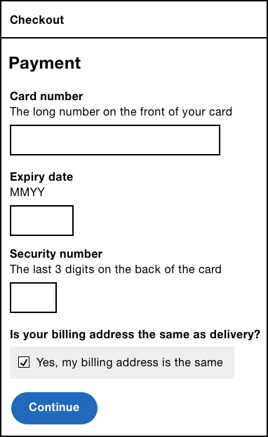

You'll notice *valid from* date is missing so I spoke with Øyvind to find out why that was:

> We don't need to ask for Valid From. Only a handful of debit cards show those, and it provides more hassle for the customer to enter than benefit to us in verifying card details. That is, if the card is stolen, having to enter a valid from date isn't going to stop the thief.

He goes on to talk about the billing address. That is the address to which the card is registered:

> Only the numerics contained in card details are used for verification. That is, the house number is used, but not street name. We ask for it for our records. Being able to eyeball this stuff is handy in any situation where you have to query what's happened. Besides, some people expect that they'll have to provide an address (at least one which is used for both billing and shipping).

Øyvind is not a designer per se, but his input into the design process was crucial. Many of us assume that back-end developers don't care about the user experience, but tapping into their knowledge is clearly valuable.

> “Design is a team sport” — Anon?

Design is a team sport, and so we should treat it as one. By designing (and researching) with a diverse set of people, we'll frequently end up producing a far better experience.

This also shows that we should constantly be questioning the existence of form fields. If you look at other people's designs and assume something has to be a certain way, we'll never improve micro patterns such as these. Proving assumptions are correct or otherwise, is an essential weapon in a designer's arsenal.

### Autofill

Most modern browsers can automatically fill in form fields, by way of the `autocomplete` attribute. When the user focuses a particular field, the browser checks if it has that information stored — if it does, the user can select it without having to type.

> Chrome autofill: used 9 billion times/month, saves an average of 12 seconds, 1.25 million days saved/month — Luke W, 24 October 2017[^luke autofill]

Since iOS 8, the Safari browser lets users scan their card using the iPhone's camera — it uses the same mechanism to automatically fill out those fields.

Not only does this drastically reduce the amount of effort to complete the form, but it also negates the chance of typos — two very helpful improvements to a form that has the highest drop-off rates in e-commerce.

As mentioned earlier, autofill is enabled with the `autocomplete` attribute. Most modern browsers support it, but for those that don't some older browsers offer similar functionality by using the `name` attribute instead. For the widest support, you should specify the correct values for both attributes as shown below.

```HTML
<div class="field">
  <label for="ccname">
    <span class="field-label">Name on card</span>
  </label>
  <input type="text" id="ccname" name="ccname" autocomplete="cc-name">
</div>
<div class="field">
  <label for="cardnumber">
    <span class="field-label">Card number</span>
  </label>
  <input type="text" id="cardnumber" name="cardnumber" autocomplete="cc-number">
</div>
<div class="field">
  <label for="expdate">
    <span class="field-label">Expiry date</span>
  </label>
  <input type="text" id="expdate" name="expdate" autocomplete="cc-exp">
</div>
<div class="field">
  <label for="cvc">
    <span class="field-label">Security code</span>
  </label>
  <input type="number" id="cvc" name="cvc" autocomplete="cc-csc">
</div>
<div class="field">
  <fieldset>
    <legend>
      <span class="field-legend">Is your billing address the same as delivery?</span>
    </legend>
    <div class="field-checkbox">
      <label for="things">
        <input type="checkbox" name="things" value="" id="things" checked>
        Yes, it's the same
      </label>
    </div>
  </fieldset>
</div>
```

*(Note: you can refer to the full list of available values in the HTML specification[^autofill])*

### Number Input

The number input (`input type="number"`) lets mobile users more quickly type a number via a numeric keypad. On desktop, the input will contain increment and decrement buttons called spinners which make it easy to make small adjustments without having to select and type.

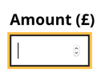

You might think that the number input is appropriate for the card number, expiry date, and CVC number — after all, they all consist of numbers. But it's a lot more complicated than that. By looking at what the spec says, what browsers do and what users want, we can more easily determine when the number input is appropriate or not.

Let's start with some definitions. Wikipedia says that:

> A number is a mathematical object used to count, measure, and label. [...] numerals are often used for labels (as with telephone numbers), for ordering (as with serial numbers), and for codes (as with ISBNs).

Most of us think of numbers this way. We use them to count and measure, but equally, we use them in dates and codes. However, the HTML specification only agrees in part with this definition. It says that:

> `type=number` is not appropriate for input that happens to only consist of numbers but isn’t strictly speaking a number. If it doesn’t make much sense to use number with spinners, `type=text` is probably the right choice (possibly with a pattern attribute).

In other words, numbers and numerals are different. Numbers represent an amount of something such as:

- my age (announced “thirty-four years old”)
- the price of an apple (announced “forty-five pence”)
- the time it took me to cook breakfast (announced “ten mins”)

Conversely, numerals might be used for dates and codes such as:

- birth date (announced “nineteenth of June, nineteen eighty-three”)
- pin code (announced “eight, double five, three, two, six”)

There is a difference between the way these values are announced. Understanding this helps to see that while the way browsers implement the number input may seem buggy at first — they aren't.

For example, IE11 and Chrome will ignore non-numeric input such as a letter or a slash. Some older versions of iOS will automatically convert “1000” to “1,000”. Safari 6 strips out leading zeros. Each example seems undesirable, but none of them stop users from entering true numbers.

Some numbers contain a decimal point such as a price; other numbers are negative which need a minus sign. Unfortunately, some browsers don't provide buttons for these symbols on the keypad. If that wasn't enough some desktop versions of Firefox will round up huge numbers.

In these cases, it's safer to use a regular text box to avoid excluding users unnecessarily. Remember users are still able to type numbers this way it's just that the buttons are smaller. To further soften the blow, the numeric keyboard can be triggered for iOS users by using the pattern attribute.

```HTML
<input type="text" pattern="[0-9]*">
```

In short, only use a number input if:

- incrementing and decrementing makes sense
- the number doesn't have a leading zero
- the value doesn't contain letters, slashes, minus signs and decimal points.
- the number isn't very large

Let's apply these rules to the expiry date. Incrementing it doesn't make sense, the number could start with a zero, and credit cards put a slash in the expiry date which users should be able to copy. Using a number input is not only inappropriate, but it creates a jarring experience as the user types a slash which would be ignored.

We'll look at appropriate use cases of the number input in the next chapter.

#### A Note About The Telephone Input

The telephone input (`<input type="tel">`) is sometimes used as a makeshift number input because it gives users the benefits of a number-specific keypad on mobile without some of the pitfalls discussed earlier.

Apart from the semantic incorrectness I've not come across practical reasons not to use it. However, ignoring the standards specification is not recommended because we don't know how browsers and devices, now and in the future, will handle it.

For example, perhaps a browsers autocomplete routine will try and fill in the user's telephone number, instead of the credit card number. Or in the future, a device may choose to spawn the user's contact address book from which the user can choose an appropriate number. 

Both of these features would be suited to a legitimate telephone field, but not for anything else that happens to consist of numbers. Updating your implementation in response to a new browser being realised or reported, is not an ideal strategy.

### Forgiving Bad Input

In “A Registration Form” we briefly talked about forgiving little input mistakes. In fact, the success of the Internet is largely down to its robustness, otherwise known as Postel's law:

> Be conservative in what you send; be liberal in what you accept.

We can apply this principle to the fields in the payment form. For example, a card number typically appears as 16 digits split into four parts by a space. Some users may type the space; others may not. Similarly, for the expiry date, some users may type a slash, others may leave it out. 

Whether it's a slash or space, or a card number or an expiry date, we should be forgiving. 

### Card Verification Code (CVC) Field

Every payment provider needs the user's CVC number. It's usually the last three digits found on the back of the card.

The first problem is that sites don't always refer to this field as CVC number. Sometimes it's referred to as a security code number or card verification value (CVV). Being specified as an acronym doesn't help either. And to top it off, on the card, the number is never accompanied by a description making it hard to reconcile the requirements.

To fix this, we should employ the hint text pattern to tell users exactly what it is and where to find it. For example, “This is the last three digits on the back of the card.”

### Billing Address

The billing address is the address to which the card is registered and is needed to process a payment. For most users, their billing address is the same as the delivery address. As the user has already provided this information, we can use it to improve the experience.

First, we need to add an extra field, this time a checkbox which asks the user if their billing address is the same as their delivery address. This way users only have to fill out the billing address on the rare occasion that it's different. As it's the most common scenario, it's checked by default. 

With Javascript, we can enhance the experience even more by hiding the billing address until the user unchecks the checkbox. This is a form of progressive disclosure which reduces noise in the interface. That is, we only show the fields when they are relevant to the user.

To do this, we need to listen to the checkbox's click event.

```JS
function CheckboxCollapser(checkbox, container) {
  this.checkbox = checkbox;
  this.container = $(container);
  $(this.checkbox).on('click', $.proxy(this, 'onCheckboxClick'));
  this.check();
};
```

When the checkbox is clicked, we check the state. If it's checked, then we need to hide the billing address. Otherwise, we need to show it.

```JS
CheckboxCollapser.prototype.onCheckboxClick = function(e) {
  this.check();
};

CheckboxCollapser.prototype.check = function() {
  this.container[this.checkbox.checked ? 'hide' : 'show']();
};
```

The container is hidden with CSS by toggling the display property between `block` and `none`.

## 7. Review Page

At this point in the flow, we have collected all the information needed to complete the order. But instead of processing the order after payment, you should let users review their order. As counterintuitive as this may sound, adding an extra step in the flow actually reduces effort.

Take Jack (I made him up), a father of two infants. It's the middle of the night, and his baby is crying inconsolably. Naturally, he's tired and stressed. To make things worse, there's no more nappies.

He grabs the phone, adds them to the basket, fills out all the checkout details and submits the order. Great, except it isn't. He ordered the wrong size nappies and paid with the wrong card. That is, what Jack entered was “valid” but still a mistake.

We can save Jack a lot of frustration by giving him the chance to review the order on a separate page. That way he can focus on the order details. Remember, filling out forms and checking information are two different mental contexts.

This also saves your (client's) business time and money. If Jack wants to cancel the order, then handling calls and processing would be costly — especially if the business offers free returns.

This shows that solely relying on completion time as a metric for success is dangerous. You should also look at how accurate people's orders are by checking how often items are returned. Ideally, you should use both metrics together.

*(Note: as this is the final step in the flow, the button's text should be set to “Place order” or similar. Leaving it as “Continue” would mislead the user into thinking there is another step to complete. This is likely to result in canceled orders.)*

### Visual Design

Every piece of information gathered during checkout should be represented on the review page. Users shouldn't have to go back to check information — that would defeat the purpose of the page. Users should only need to go back if they spot a mistake.

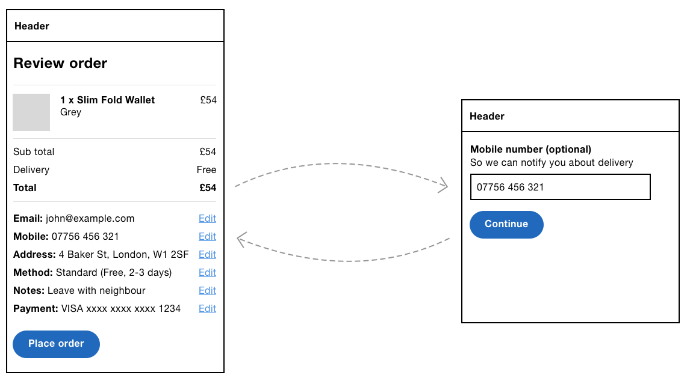

Users can click *edit* to make amendments which is another advantage of using the One Thing Per Page pattern. As pages are small they will load fast; as each page has just one thing, making a change is simple.

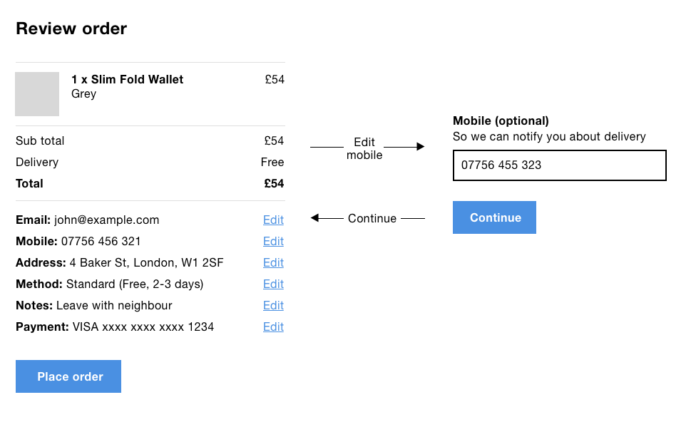

When the user makes a change, they are taken back to this page again for a final review which puts users firmly in control and which reduces stress and anxiety.

## 8. Confirmation Page

Confirmation pages are so much more than just confirming the order. Neglecting the user experience here is a great way to lose out on return business.

We've all probably experienced neglect after purchasing goods. For example, if you want to take out insurance, you call the free sales number and are quickly put through to a helpful agent. Parting with money is usually made easy. But then, when you need to make a claim, it's more painful: the number isn't free and calls take a long time be answered. All very stressful.

A confirmation page is the first opportunity to start forging a long-term relationship. And this is done in two ways: by looking after the user and giving them an incentive to come back.

You should tell users what happens next, such as when delivery will take place and what to do if something goes wrong.

It's also the best time to ask users to sign up (if they checked out anonymously). As we have most of the information to hand, we only need to ask for a password making this step both optional and easy. Users should have had a good experience up to now, which should naturally encourage sign up.

By giving users value, they'll probably want to sign up. By value, I mean something as simple as offering a faster checkout next time or offering them a discount for their next order. Depending on the service, you might even ask users to tweet or Instagram their purchase in return for a voucher. Whatever it is, now's as good a time as any to mention it.

Up to now, we've also been sure to use plain and simple language for labels, hints, and errors. On the confirmation page, there is an opportunity to let your brand's personality shine through because the important stuff has already been done. Mailchimp's confirmation page show's their chimp mascot giving you a virtual high-five. Nice.

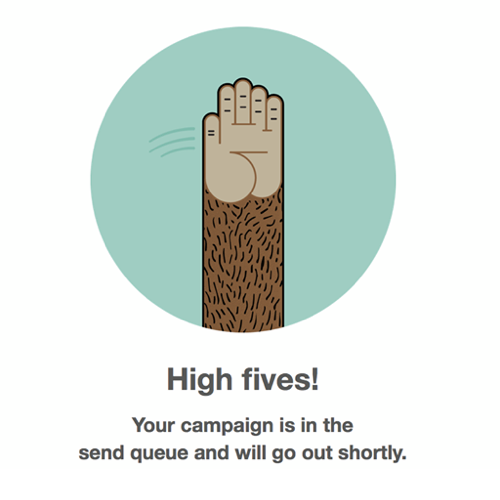

Here's a checklist of things to consider including on the confirmation page:

- a reference number
- contact details
- what happens next and when
- what to do if something goes wrong
- ask users to sign up in return for something
- ask users to spread the word to get a voucher
- links to further information if they might be useful
- a link to your feedback page

## The Second Time Experience 

I've made so many purchases with Amazon that I can't even remember Amazon's first-time experience. That is to say, I've made hundreds of purchases as a second-time user, and only one as a first-time user.

Once everything is good with the first-time experience, it's time to focus on the second-time experience. As we have collected and stored all the user's information, we shouldn't have to ask for it again.

In which case, we can bypass most of the steps. Instead, we can send users straight to the *Review* page. This way users get a reminder of their default preferences with the chance to make amends, should they wish to.

All in all, this significantly reduces the effort and in-turn improve conversion. Remember Jack from earlier: the next time he's out of nappies, buying them should be a breeze, something I'm sure he'd appreciate.

## Layout

Up to now, we've focused on the design of the form within each page, but we haven't considered the interface holistically. In fact, this is one of the dangers of composing interfaces out of pre-defined smaller components. In the end, the overall design can end up neglected.

Usually, checkout pages are given a special and more streamlined layout that helps reduce noise and keep users on task. For example, the header usually contains a logo, security note and accepted cards.

By omitting navigation and search, users can focus on checking out which speaks to principle 6, *Prioritise content*.

### Progress Bar

Progress bars are often used within checkout because — at least in theory — they give users an idea of where they are and how long's left. Despite the sound reasoning, there isn't much evidence to show that progress bars are all that useful.


Progress bars pose some practical design challenges too. First, they take up a lot of space at the top of the page which is particularly important on mobile where they push the main content down. Second, fitting an accessible progress bar (with clear labeling) into a small viewport is nigh on impossible. 

If that wasn't enough, they are very tricky to design if the journey consists of conditional steps. For example, imagine a checkout journey that offers “collect in store” instead of having it delivered. In this case, the user is taken down a different path — one that doesn't need to collect payment — they'll pay in-store.


The problem is that a progress bar should tell the user what steps exist in advance of going through them. But the steps are based on users' answers. So either you show every possible step which is misleading, or you update the progress bar (by removing or adding steps) as you go, which somewhat defeats the purpose of having one.

Not including a progress bar prioritises the main content, by elevating it up the page which speaks to principle 6, *Prioritse content*. In any case, having meticulously designed the journey to be as simple as possible, users should make their way through the journey with little fuss.

For these reasons, consider starting without a progress bar. Then test your journey with users to see if they struggle. Remember, it's far easier (and cheaper) to add features, than it is to remove them later on.

If you do decide to give users a progress bar, one simple way to do it would be to hide the visual progress bar from screen readers using `aria-hidden="true"`, and to add some visually hidden text inside the `h1` to explain what step the user is at:

```HTML
<!-- progress bar -->
<div aria-hidden="true">
Visual progress bar here
</div>

<!-- visually hidden text inside the main heading -->
<h1>Payment <span class="vh">Step 3 of 4</span></h1>
```

*(Note: some forms are especially long — a lot longer than a checkout flow. In this case, you might need some indication of progress, which is something we'll look at in chapter 10, “A Really Long Form.”)*

### Order Summary

When you're shopping in a physical shop, you pick up your items and place them in your shopping basket. Eventually you checkout at the till. All the while, you can see what you're buying. Sometimes at the last minute, we change our mind and take an item off the conveyor belt. Or we realise we forgot something and dash off to get it.

> “The system should always keep users informed about what is going on, through appropriate feedback” — 10 Usability Heuristics

Giving users a comparable experience digitally is important too. An order summary placed on every page keeps users informed without having to remember what they're buying.

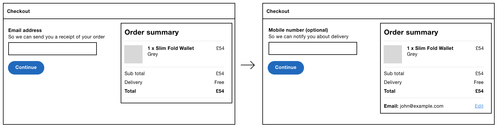

As the user completes each step, the order summary will populate with more information. For example, on the first screen (email address), it will contain what they're buying. On the next screen it will also contain their email address, and so forth. If the user spots a mistake, they can jump back to any previous step by clicking the edit link — just like the review page.

Layout wise, the summary panel should be less prominent than the form. So it should be placed beside the form on desktop, and below the form on mobile (where there's insufficient room).

### Back Links

As the user is moving through a linear flow, we need to consider the need to step back. The browser's back button provides this functionality for free, but some people mistrust it because of bad past experience where their data was lost.

AJAX-driven and modal-heavy sites haven't helped matters because clicking the browser's back button often goes against user's expectations[^backlink]. Thankfully, the checkout doesn't need AJAX or modal dialogs so this isn't a problem, but we still need to ensure the browser's back button works as expected. Users expect it to take them to the previous page in the state they left it in.

However, research might show you that it's useful to include a back link within the interface itself and that users will be more inclined to trust it. In this case, position the link at the top left of the page. By placing it at the top of the page, users can see that they can go back if they need to. And they're less likely to fill out the form before hitting back and losing their data.

Consider making the link text explicit. “Back” is ambiguous; “Back to delivery address” is clearer.

## Summary

In this chapter, we started out by looking at the One Thing Per Page pattern which helps to break down large forms into small chunks making it easy for users to fill out and make amendments.

We then looked at capturing optional information, making choices with radio buttons, entering long-form content via the `textarea` and several ways to improve the payment form experience.

After that, we looked at other issues: giving users the ability to review their order, improving the experience for second-time users and considering the overall design.

### Checklist

- Ask questions in a sensible order
- Let users checkout anonymously
- The width of the field should match the required input when the length is known.
- Use a fieldset and legend to give radio button and checkbox groups an accessible label.
- Add extra questions if they add value. Remember completion time is not the only useful metric for success.
- Let users check their answers before submission.
- The confirmation page is the end of the transaction but the start of the relationship.
- Store people's information to improve the second-time experience and increase conversion.
- Don't break the back button.

## Footnotes

[^1]: https://designnotes.blog.gov.uk/2015/07/03/one-thing-per-page/
[^2]: https://www.smashingmagazine.com/2017/05/better-form-design-one-thing-per-page/
[^3]: http://www.formsthatwork.com/
[^4]: https://www.youtube.com/watch?v=tzfHlEFd2Fk
[^5]: http://baymard.com/blog/form-field-usability-matching-user-expectations
[^6]: http://www.pcapredict.com/en-gb/address-capture-software/
[^7]: https://www.smashingmagazine.com/inclusive-design-patterns/
[^8]: http://caniuse.com/#feat=maxlength
[^9]: https://www.smashingmagazine.com/2017/03/improve-billing-form-ux/
[^10]: https://stripe.com/gb
[^11]: https://nordnet.design/design-is-a-team-sport-231a602fc072
[^12]: https://www.gov.uk/service-manual/design/confirmation-pageswestern-web-part-1/
[^13]: https://articles.uie.com/three_hund_million_button/
[^autofillattrs]: https://html.spec.whatwg.org/multipage/form-control-infrastructure.html#autofilling-form-controls:-the-autocomplete-attribute
[^backlink]: https://baymard.com/blog/back-button-expectations
[^luke autofill]: https://twitter.com/lukew/status/922630320293265408
[^gds patchy]: https://gdstechnology.blog.gov.uk/2015/08/27/making-radio-buttons-and-checkboxes-easier-to-use/
[^radiobuttonissue]: https://github.com/alphagov/govuk_elements/issues