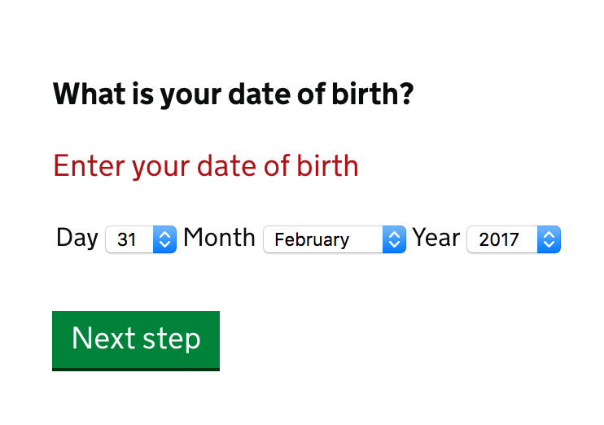
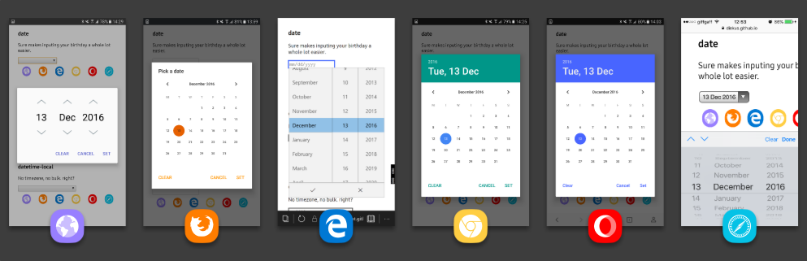

# Book A Flight

In this chapter, we'll design a flight booking service. At first this may seem a bit niche, especially when compared to *A Registration Form* and *A Checkout Flow*. However, we're going to explore several complex problems that in the end will result in reusable patterns. Patterns that are very much transferable to other problem domains such as booking a cinema ticket or hotel room.

Here are the main steps in the flow:

1. Choosing where to fly
2. Choosing when to fly
3. Choosing passengers
4. Choosing flight
5. Choosing where to sit

## 1. Choosing where to fly

First, users have to choose an origin and destination. That is, places to fly from and to. Without this information the service can't offer any flights. What's the best way of asking users for this information?

As designers, we should try and use the features that are native to the browser. This is because, generally speaking, they are are familiar (due to convention) and fully accessible out of the box. They also require far less work to implement. Browsers offer 3 suitable native controls. We're going to look at each of them now and play them off against each other.

### Select box

A select box hides choices behind a menu. Clicking the select box reveals the choices. Once a choice is selected, the menu collapses once more.

Designers often use `select` boxes due to their space-saving qualities. What's particulary interesting thouggh, is why we need to save space in the first place.

Often an interface is crammed with features, normally to please stakeholders, not users. It's understandable then, why learning ways to hide discrete pieces of an interface has become an essential weapon in a designer's arsenal. But design, so about so much more than saving space.

Really, if an interface contains too many features, it's our job as designers to declutter it. Only then can we evaluate the best component for the job, given ample space to design in. But back to select boxes specifically.

Select boxes are well-known for being hard-to-use. Usability expert Luke Wobrelski even goes as far to say that select boxes should be the ‘UI of Last Resort’[^1] and he suggests some better alternatives, some of which we'll be using later on.

In summary though, select boxes are problematic because:

- some users find them hard to close.
- some users try to type into them.
- some users confuse focused options with selected ones.
- users aren't able to pinch-zoom options on devices.
- they have limited hierarchy control.
- they hide choices behind an unnecessary extra click.
- they are not easily searchable.

### Radio buttons

Radio buttons, unlike select boxes, are generally well-understood and easy-to-use, not least because they don't hide choices. They are fully exposed making them easy to compare, scan and select. They're also more maleable. That is, they let us put whatever content in what ever format we want inside the label (more on that later).

The problem with radio buttons, however, is that they're far less suitable when there are vast amounts of them. An airline could fly to hundreds of destinations. Therefore, the page becomes long and unweildly, causing the user to scroll (or keyboard users to *tab*) a lot.

Don't get me wrong, users are more than happy to scroll and we shouldn't use this as a crutch for changing course. But it's certainly worthwhile exploring other options are our disposal.

### Search input

A search box (`input type="search"`) is a standard text box with some added extras. You can clear the contents of the field, by tapping *X* or pressing <kbd>Escape</kbd>. With a text box (`input type="text"`) you have to select the text and press <kbd>delete</kbd> which is more tedious.


Using a free search box is useful when searching a large amount of dynamic data, such as searching Amazon's[^2] product catalog. Airlines, however, fly to a finite set of destinations known in advance of the user searching. Letting users search unassisted like this could easily end up with a no results page due to typos or mismatched data.

### An autocomplete component

Users need a control that lets users filter a long list of destinations quickly. Something that combines the flexibility of a text box with the assurance of a select box. This is known as an autocomplete. An autocomplete is also known by other names such as *type ahead*, *predictive search* or *combobox*.

Autocomplete controls work by suggesting options (destinations in this case) as the user starts typing. As suggestions appear, you can select one quickly, automatically *completing* the field. Hence the name. This saves users scrolling and can be designed to be forgiving of small typos.

HTML5 introduced the `datalist` element which combines with a text box to create the desired behaviour. Unfortunately it's not ready for prime time due to its show stopping bugs[^3]. In the unlikely event that your project is locked down to a specific (set of) browser(s) that don't suffer from the bugs, then this may still be a suitable option for you.

But having defined our design principles (at the beginning of the book), we'll want to give users the best experience possible, no matter their browser choice or lack thereof. A word of warning though, we're about to break new ground. Designing custom form components is hard work. Certainly orders of magnitude harder than simply using a native one.

To help us through though, accessibility expert Steve Faulkner has what he calls a *punch list*[^4]. Essentially a list of rules that any custom component should adhere to. In a short a custom component should:

- Be focusable with the keyboard.
- Be operable with the keyboard.
- Work with assistive devices.
- Work without Javascript.

To abide by the last rule we need to talk about progressive enhancement. It was only a matter of time until this subject came up. We touched upon the subject in chapter 1 but it's worth while delving deeper now.

#### Progressive enhancement

Progressive enhancement is about giving everyone a core experience. Then, if possible and where necessary, creating a better, ‘enhanced’ experience for those who use a better browser. By better, I mean one that is more capable. When Javascript is available users will get the enhanced autocomplete component, but what happens when there is a Javascript failure?

This is a question that the concept of a core experience answers. In this situation it simply means which native component will users get. It comes down to a select box or a search box. On balance, a select box seems appropriate as it stops users enduring a trip to the server only to see no results.

How it might look before enhancement:


```html
<div class="field">
	<label for="destination">
		<span class="field-label">Destination</span>
	</label>
	<select name="destination" id="destination">
		<option value="">Select</option>
		<option value="france">France</option>
		<option value="germany">Germany</option>
		<option value="spain">Spain</option>
	</select>
</div>
```

How it might look after enhancement:


```html
<div class="field">
	<label for="destination">
		<span class="field-label">Destination</span>
	</label>
	<div class="autocomplete">
		<input
			type="text"
			name="destination"
			id="destination"
			autocomplete="off"
			role="combobox"
			aria-autocomplete="list"
			aria-expanded="true"
			class="autocomplete-textBox"
		>
		<ul
			role="listbox"
			class="autocomplete-options autocomplete-options-isHidden"
			>
			<li	role="option">
				France
			</li>
			<li role="option" aria-selected="true">
				Germany
			</li>
		</ul>
		<div
			aria-live="polite"
			aria-atomic="true"
			role="status"
			class="autocomplete-status">
		</div>
	</div>
</div>
```

The other three rules will be handled with a combination of HTML and Javascript. When the script runs the HTML will be modified as above. It consists of three separate parts. The text box and menu, let's users type and select their destination.The status box is for screen reader users. As the suggestions change it will say things like *2 destinations available*.

Text box notes:

- The role is set to `combobox` indicating that this control is more than just a regular text box.
- The `aria-autocomplete` attribute indicates that a list of options will appear from which the user can choose.
- The `aria-expanded` attributes tells users whether the menu is currently expanded or collapsed by toggling between `true` and `false` values.
- The `autocomplete` attribute is set to `off` to stop browsers making their own suggestions interfering with those offered by the component itself.

Options notes:

- The menu's role is set to `list` indicating that it contains a list of items. This is complimented by each item having a role of `option`.
- The `aria-selected` attribute tells users whether the option is selected or not by toggling between values `true` and `false`.

Status box notes:

- The role is set to `status` to tell users that *2 results are available* for example.
- The `aria-live` attribute ensures the screen reader doesn't interrupt the user as they type. Instead it waits until they stop typing.
- [CHECK] The `aria-atomic` attribute is set to true which ensures the entirety of the message is announced, even if just a small part of the status was injected by Javascript.

```Javascript
function Autocomplete(control) {
	this.control = control;
	this.controlId = control.id;
	this.container = $(control).parent();
	this.wrapper = $('<div class="autocomplete"></div>');
	this.container.append(this.wrapper);
	this.createTextBox();
	this.createButton();
	this.createOptionsUl();
	this.removeSelectBox();
	this.createStatusBox();
	this.setupKeys();
	$(document).on('click', $.proxy(this, 'onDocumentClick'));
};

Autocomplete.prototype.onDocumentClick = function(e) {
	if(!$.contains(this.container[0], e.target)) {
        this.hideOptions();
    }
};

Autocomplete.prototype.setupKeys = function() {
	this.keys = {
		enter: 13,
		esc: 27,
		space: 32,
		up: 38,
		down: 40,
		tab: 9
   };
};

Autocomplete.prototype.addTextBoxEvents = function() {
	this.textBox.on('keyup', $.proxy(this, 'onTextBoxKeyUp'));
	this.textBox.on('keydown', $.proxy(function(e) {
		switch (e.keyCode) {
			// this ensures that when users tabs away
			// from textbox that the normal tab sequence
			// is adhered to. We hide the options, which
			// removes the ability to focus the options
			case this.keys.tab:
				this.hideOptions();
				break;
		}
	}, this));
};

Autocomplete.prototype.addSuggestionEvents = function() {
	this.optionsUl.on('click', 'li', $.proxy(this, 'onSuggestionClick'));
	this.optionsUl.on('keydown', $.proxy(this, 'onSuggestionsKeyDown'));
};

Autocomplete.prototype.onTextBoxKeyUp = function(e) {
	switch (e.keyCode) {
		case this.keys.esc:
			// we ignore when users presses escape
			break;
		case this.keys.up:
			// we ignore when the user presses up when on textbox
			break;
		case this.keys.down:
			// we want to handle this one
			this.onTextBoxDownPressed(e);
			break;
		case this.keys.tab:
			this.hideOptions();
			break;
		case this.keys.enter:
			// we ignore when the user presses enter here,
			// otherwise the menu will show briefly before
			// submission completes
			break;
		default:
			// show suggestion
			this.onTextBoxType(e);
	}
};

Autocomplete.prototype.onSuggestionsKeyDown = function(e) {
	switch (e.keyCode) {
		case this.keys.up:
			// want to highlight previous option
			this.onSuggestionUpArrow(e);
			break;
		case this.keys.down:
			// want to highlight next suggestion
			this.onSuggestionDownArrow(e);
			break;
		case this.keys.enter:
			// want to select the suggestion
			this.onSuggestionEnter(e);
			break;
		case this.keys.space:
			// want to select the suggestion
			this.onSuggestionSpace(e);
			break;
		case this.keys.esc:
			// want to hide options
			this.onSuggestionEscape(e);
			break;
		case this.keys.tab:
			this.hideOptions();
			break;
		default:
			this.textBox.focus();
	}
};

Autocomplete.prototype.onTextBoxType = function(e) {
	if(this.textBox.val().trim().length > 0) {
		var options = this.getOptions(this.textBox.val().trim().toLowerCase());
		if(options.length > 0) {
			this.buildOptions(options);
			this.showOptionsPanel();
		} else {
			this.hideOptions();
			this.clearOptions();
		}
		this.updateStatus(options.length);
	}
};

Autocomplete.prototype.onSuggestionEscape = function(e) {
	this.clearOptions();
	this.hideOptions();
	this.focusTextBox();
};

Autocomplete.prototype.isShowingMenu = function() {
	return this.textBox.attr('aria-expanded', 'true');
};

Autocomplete.prototype.focusTextBox = function() {
	this.textBox.focus();
};

Autocomplete.prototype.onSuggestionClick = function(e) {
	this.textBox.val($(e.currentTarget).text());
	this.hideOptions();
	this.focusTextBox();
};

Autocomplete.prototype.onSuggestionEnter = function(e) {
	if(this.isOptionSelected()) {
		this.selectOption();
	}
	e.preventDefault();
};

Autocomplete.prototype.onSuggestionSpace = function(e) {
	if(this.isOptionSelected()) {
		this.selectOption();
		e.preventDefault();
	}
};

Autocomplete.prototype.selectOption = function() {
	this.textBox.val(this.getActiveOption().text());
	this.focusTextBox();
	this.hideOptions();
};

Autocomplete.prototype.onTextBoxDownPressed = function(e) {
	var option;
	var options;
	// No chars typed
	if(this.textBox.val().trim().length === 0) {
		options = this.getAllOptions();
		this.buildOptions(options);
		this.showOptionsPanel();
	// Chars typed
	} else {
		options = this.getOptions(this.textBox.val().trim());
		if(options.length > 0) {
			this.buildOptions(options);
			this.showOptionsPanel();
		}
	}
	option = this.getFirstOption();
	if(option[0]) {
		this.highlightOption(option);
	}
};

Autocomplete.prototype.onSuggestionDownArrow = function(e) {
	var option = this.getNextOption();
	if(option[0]) {
		this.highlightOption(option);
	}
	e.preventDefault();
};

Autocomplete.prototype.onSuggestionUpArrow = function(e) {
	if(this.isOptionSelected()) {
		option = this.getPreviousOption();
		if(option[0]) {
			this.highlightOption(option);

		} else {
			this.focusTextBox();
			this.hideOptions();
		}
	}
	e.preventDefault();
};

Autocomplete.prototype.isFirstOptionSelected = function() {
	var selectedOption = this.getActiveOption();
};

Autocomplete.prototype.isOptionSelected = function() {
	return this.activeOptionId;
};

Autocomplete.prototype.getActiveOption = function() {
	return $('#'+this.activeOptionId);
};

Autocomplete.prototype.getFirstOption = function() {
	return this.optionsUl.find('li').first();
};

Autocomplete.prototype.getPreviousOption = function() {
	return $('#'+this.activeOptionId).prev();
};

Autocomplete.prototype.getNextOption = function() {
	return $('#'+this.activeOptionId).next();
};

Autocomplete.prototype.highlightOption = function(option) {
	if(this.activeOptionId) {
		var activeOption = this.getOptionById(this.activeOptionId);
		activeOption.removeClass('autocomplete-option-isActive');
		activeOption.attr('aria-selected', 'false');
	}

	option.addClass('autocomplete-option-isActive');
	option.attr('aria-selected', 'true');

	if(!this.isElementVisible(option.parent(), option)) {
		option.parent().scrollTop(option.parent().scrollTop() + option.position().top);
	}

	this.activeOptionId = option[0].id;
	option.focus();
};

Autocomplete.prototype.getOptionById = function(id) {
	return $('#'+id);
};

Autocomplete.prototype.showOptionsPanel = function() {
	this.optionsUl.removeClass('autocomplete-options-isHidden');
	this.optionsUl.attr('aria-hidden', 'false');
	this.textBox.attr('aria-expanded', 'true');
	this.textBox.attr('tabindex', '0');
};

Autocomplete.prototype.hideOptions = function() {
	this.optionsUl.addClass('autocomplete-options-isHidden');
	this.optionsUl.attr('aria-hidden', 'true');
	this.textBox.attr('aria-expanded', 'false');
	this.activeOptionId = null;
	this.clearOptions();
	this.textBox.removeAttr('tabindex', '-1');
};

Autocomplete.prototype.clearOptions = function() {
	this.optionsUl.empty();
};

Autocomplete.prototype.getOptions = function(value) {
	var options = [];
	var selectOptions = this.control.options;
	var text;
	for(var i = 0; i < selectOptions.length; i++) {
		text = $(selectOptions[i]).text();
		if(text.toLowerCase().indexOf(value.toLowerCase()) > -1) {
			options.push(text);
		}
	}
	return options;
};

Autocomplete.prototype.getAllOptions = function() {
	var options = [];
	var selectOptions = this.control.options;
	var text;
	for(var i = 0; i < selectOptions.length; i++) {
		options.push($(selectOptions[i]).text());
	}
	return options;
};

Autocomplete.prototype.buildOptions = function(options) {
	this.clearOptions();
	this.activeOptionId = null;
	for(var i = 0; i < options.length; i++) {
		this.optionsUl.append(this.getOptionHtml(i, options[i]));
	}
	this.optionsUl.scrollTop(this.optionsUl.scrollTop());
};

Autocomplete.prototype.buildAllOptions = function() {
	this.clearOptions();
	this.activeOptionId = null;
	var options = this.control.options;
	for(var i = 0; i < options.length; i++) {
		this.optionsUl.append(this.getOptionHtml(i, $(options[i]).text()));
	}
};

Autocomplete.prototype.getOptionHtml = function(i, text) {
	return '<li tabindex="-1" class="autocomplete-option" aria-selected="false" role="option" id="autocomplete-option--' + i + '">' + text + '</li>';
};

Autocomplete.prototype.createStatusBox = function() {
	this.status = $('<div aria-live="polite" role="status" aria-atomic="true" class="autocomplete-status" />');
	this.wrapper.append(this.status);
};

Autocomplete.prototype.updateStatus = function(resultCount) {
	if(resultCount === 0) {
		this.status.text('No results.');
	} else {
		this.status.text(resultCount + ' results available.');
	}
	window.setTimeout(function() {
		this.status.text('');
	}.bind(this), 1000);
};

Autocomplete.prototype.removeSelectBox = function() {
	$(this.control).remove();
};

Autocomplete.prototype.createTextBox = function() {
	this.textBox = $('<input autocapitalize="none" class="autocomplete-textBox" type="text" autocomplete="off">');
	this.textBox.attr('aria-owns', this.getOptionsId());
	this.textBox.attr('aria-autocomplete', 'list');
	this.textBox.attr('role', 'combobox');
	this.textBox.prop('id', this.controlId);
	this.wrapper.append(this.textBox);
	this.addTextBoxEvents();
};

Autocomplete.prototype.getOptionsId = function() {
	return 'autocomplete-options--'+this.controlId;
};

Autocomplete.prototype.createButton = function() {
	this.button = $('<button class="autocomplete-button" type="button" tabindex="-1">&#9662;</button>');
	this.wrapper.append(this.button);
	this.button.on('click', $.proxy(this, 'onButtonClick'));
};

Autocomplete.prototype.onButtonClick = function(e) {
	this.clearOptions();
	var options = this.getAllOptions();
	this.buildOptions(options);
	this.updateStatus(options.length);
	this.showOptionsPanel();
	this.textBox.focus();
};

Autocomplete.prototype.createOptionsUl = function() {
	this.optionsUl = $('<ul id="'+this.getOptionsId()+'" role="listbox" class="autocomplete-options autocomplete-options-isHidden" aria-hidden="true"></ul>');
	this.wrapper.append(this.optionsUl);
	this.addSuggestionEvents();
};

Autocomplete.prototype.isElementVisible = function(container, element) {
	var containerHeight = $(container).height();
	var elementTop = $(element).offset().top;
	var containerTop = $(container).offset().top;
	var elementPaddingTop = parseInt($(element).css('padding-top'), 10);
	var elementPaddingBottom = parseInt($(element).css('padding-bottom'), 10);
	var elementHeight = $(element).height() + elementPaddingTop + elementPaddingBottom;
    var visible;

    if ((elementTop - containerTop < 0) || (elementTop - containerTop + elementHeight > containerHeight)) {
		visible = false;
    }
    else {
		visible = true;
    }
    return visible;
};
```

The script replaces the select box with a text box and adds a down arrow button, menu and status box. As the user types it shows suggestions.

Notes:

- When focus is within the text box, pressing <kbd>down</kbd> moves focus to the first option in the panel.
- When an option is focussed, pressing <kbd>down</kbd> moves focus to the next option. Pressing <kbd>up</kbd> moves focus to the previous option.
- When an option is focused, pressing <kbd>enter</kbd> or <kbd>space</kbd> or clicking/tapping the option populates the text box with the value and closes the menu.
- Pressing <kbd>enter</kbd> when focus is within the text box implicitly submits the form (like normal).
- Clicking the down arrow button, reveals all the possible options.
- Pressing <kbd>escape</kbd> closes the menu.

## 2. Choosing when to fly

Dates are hard[^5]. Different time zones, formats, delimitters, days in the month, length of a year, daylight savings and on and on. It's hard work designing all of this complexity out of an interface. Traditionally 3 select boxes, for day, month and year are used to enter dates. One of the redeeming qualities of select boxes is that they stop users entering wrong information. In the case of dates, even *this* doesn't hold up. That's because a user can, for example, select *31 February 2017* which is, of course, not a valid date.


[https://www.gov.uk/state-pension-age/y/age]

The other reason select boxes are used, is to avoid the problem of formats. Some dates start with month, others with day. Some delimit dates with slashes, others with dashes. We simply can't accurately determine the user's intent based on what they enter. Therefore, we can't be as forgiving as we would like to be.

But let's step back a moment. Before designing a date component, we first should understand what type of date we're asking for. The Goverment Digital Services (GDS) talks about this in their Service Manual[^6]. It says ‘the way you should ask for dates depends on the types of date you’re asking for’. There are 3 main types of date. We'll step through each in turn, to see if one of those suits the problem we're trying to solve.

### Dates from documents

GDS says *if you ask for a date exactly as it’s shown on a passport, credit card or similar item, make the fields match the format of the original. This will make it easier for users to copy it across accurately.* In fact, we followed this guidance to the letter, in chapter 2, for the expiry date field.

The field expects users to type a number matching the format found on the card. Users simply have to copy what they see, without needing to think. Obvious interfaces are good interfaces.

### Memorable dates

The defacto thinking is that date pickers are always better than  typing numbers into a text box. For memorable dates, such as date of birth, this is most certainly not true. It's arduous having to scroll and click through multiple years and months to find a date, when typing in 6 numbers unassisted is considerably quicker.

GDS's research shows that 3 *separate* text boxes works best&mdash;one for day, month and year. Why 3 boxes? Because it solves the formatting issues we discussed earlier.


```HTML
<div class="field">
	<fieldset>
		<legend>
			<span class="field-legend">Date of birth</span>
			<span class="field-hint">DD MM YYYY</span>
		</legend>
		<div class="field-dayWrapper">
			<label for="day">Day</label>
			<input class="field-dayBox" type="number" pattern="[0-9]*" name="day" id="day" min="0" max="31">
		</div>
		<div class="field-monthWrapper">
			<label for="month">Month</label>
			<input class="field-monthBox" type="number" pattern="[0-9]*" name="month" id="month" min="0" max="12">
		</div>
		<div class="field-yearWrapper">
			<label for="year">Year</label>
			<input class="field-yearBox" type="number" pattern="[0-9]*" name="year" id="year" min="0" max="2050">
		</div>
	</fieldset>
</div>
```

This is the second time we've encountered a need to group form controls inside a `fieldset`. It's crucial here because without labelling the group, there is some ambiguity as to what date the user is entering. Adding legend text *Date of birth* provides the context users need to understand the indivdual text boxes.

You may have noticed that there's a pattern attribute on the inputs. Some versions of iOS don't show the numeric keyboard even though we've clearly used `type="number"`. The pattern attribute fixes this problem and gives those users a numeric keyboard.

### Finding dates with a calendar

In the case of booking a flight, users are neither entering a memorable date nor one found in a document. Booking a flight normally revolves around some date in the future. As humans, we conceptualise time in years, months, and days etc. And when we're diarising future plans we use a calendar, which aligns with that notion.

Designing an interface that users are already familiar with makes wayfinding that much easier. People intuitively know how calendars work. In the interface design world, we call this component a date picker. Users can navigate through years, months and days easily with the context of what day of the week the date lands on. All useful information.

[Date picker](.)

#### Some other considerations

Interfaces that try to solve many problems at once cause problems. The primary user need for the calendar is to select a date. Trying to convey price and availability at the same time, for example, results in a busy interface that is likely to overwhelm users.

It's also not very practical from a design perspective. One aspect of design for the web is considering people who use different size screens. Responsive design encourages us to design for small and large screens alike. Cramming lots of information to a page that can ultimately be accessed on small screens is asking for a challenge.

Instead, we'll purposely let users focus on a choosing a date without the distraction of, for example, price and availability information. We'll give users this information later on in the flow.

#### Date input

Before HTML5, we always had to build our own date picker using Javascript. We know how hard this is because we just created an autocomplete component. Mobile browsers that support HTML5&mdash;nowadays, that's most&mdash;have `input type="date"` which to some extent saves us having to design our own component. That's not all they're good for:

- They are fast because they are provided by the browser.
- They are familiar because every website (and native app) will use the same interface.
- They are accessible by default.
- Users get improvements and bug fixes as soon as browser vendors release them.

All of which, give us back time and headspace to solve other, more pressing problems. Here's how the native date input looks on mobile:



Desktop browser support is not as good (but we'll sort that!). Chrome and Edge work well but Firefox, for example, doesn't have any support (at time of writing).


If you're concerned about it looking different in different browsers you needn't be. In Progressive Enhancement 2.0, at 16 minutes in[^8], Nicholas Zakas shows that users don't actually notice the differences between browsers. Nobody cares about your website as much as you do and if you're still not convinced check out the rather terse website Do Websites Need To Look The Same In Every Browser?[^9].

```HTML
<div class="field">
	<label for="departureDate">
		<span class="field-label">Departure date</span>
	</label>
	<input class="field-textBox" type="date" id="departureDate" name="departureDate">
</div>

```

#### What about browsers lacking support?

Browsers that don't support date inputs will degrade into a text box, which may be sufficient. Progressive enhancement (there it is again) lets us choose to either degrade gracefully or provide a better fallback with Javascript.

Choosing dates is integral to booking a flight. Letting some users experience the degraded experience is not something that's sufficient. We'd like it to be better because choosing a date should be simple for everyone.

First we need to ensure we only give users the component when their browser doesn't support the date input. That is, we'll need to feature detect this capability:

```Javascript
function supportsDateInput() {
	var el = document.createElement('input');
	try {
		el.type = "date";
	} catch(e) {}
	return el.type == "date";
}

if(!supportsDateInput()) {
	// use custom component
}
```

#### Date picker component

Having now detected support, we'll need to design the date picker component itself. Here's how it might look:


Notes:

- Buttons should have large tap[^11] targets making it easy to press with a finger or mouse.
- The calendar displays beneath the input. Dialogs obscure the interface and on small screens it takes up the entire screen anyway.

```HTML
<div class="field">
	<label for="departureDate">
		<span class="field-label">Departure date</span>
	</label>
	<div class="datepicker">
		<input class="field-textBox" type="text" id="departureDate" name="departureDate" value="">
		<button class="datepicker-toggleButton" type="button" aria-expanded="true">Choose</button>
		<div class="datepicker-wrapper" aria-hidden="false">
			<div class="datepicker-calendar">
				<div class="datepicker-actions">
					<button aria-label="Previous month" type="button" class="datepicker-back">&lt;</button>
					<div role="status" aria-live="polite" aria-atomic="true" class="datepicker-title">July 2017</div>
					<button aria-label="Next month" type="button" class="datepicker-next">&gt;</button>
				</div>
				<table role="grid">
					<thead>
						<tr>
							<th><abbr title="Sunday">Sun</abbr></th>
							<th><abbr title="Monday">Mon</abbr></th>
							<th><abbr title="Tuesday">Tue</abbr></th>
							<th><abbr title="Wednesday">Wed</abbr></th>
							<th><abbr title="Thursday">Thu</abbr></th>
							<th><abbr title="Friday">Fri</abbr></th>
							<th><abbr title="Saturday">Sat</abbr></th>
						</tr>
					</thead>
					<tbody>
						<tr>
							<td class="calendarControl-previousMonthDay">25</td>
							<td class="calendarControl-previousMonthDay">26</td>
							<td class="calendarControl-previousMonthDay">27</td>
							<td class="calendarControl-previousMonthDay">28</td>
							<td class="calendarControl-previousMonthDay">29</td>
							<td class="calendarControl-previousMonthDay">30</td>
							<td tabindex="-1" aria-selected="false" aria-label="1 July, 2017" data-date="Sat Jul 01 2017 00:00:00 GMT+0100 (BST)" id="tdate_day_1" class="datepicker-day">1</td>
						</tr>
						<tr>
							...
						</tr>
						<tr>
							...
						</tr>
						<tr>
							<td tabindex="-1" aria-selected="false" aria-label="16 July, 2017" data-date="Sun Jul 16 2017 00:00:00 GMT+0100 (BST)" id="tdate_day_16" class="datepicker-day">16</td>
							<td tabindex="-1" aria-selected="false" aria-label="17 July, 2017" data-date="Mon Jul 17 2017 00:00:00 GMT+0100 (BST)" id="tdate_day_17" class="datepicker-day">17</td>
							<td tabindex="0" aria-selected="true" aria-label="18 July, 2017" data-date="Tue Jul 18 2017 00:00:00 GMT+0100 (BST)" id="tdate_day_18" class="datepicker-day datepicker-day-isToday datepicker-day-isSelected">18</td>
							<td tabindex="-1" aria-selected="false" aria-label="19 July, 2017" data-date="Wed Jul 19 2017 00:00:00 GMT+0100 (BST)" id="tdate_day_19" class="datepicker-day">19</td>
							<td tabindex="-1" aria-selected="false" aria-label="20 July, 2017" data-date="Thu Jul 20 2017 00:00:00 GMT+0100 (BST)" id="tdate_day_20" class="datepicker-day">20</td>
							<td tabindex="-1" aria-selected="false" aria-label="21 July, 2017" data-date="Fri Jul 21 2017 00:00:00 GMT+0100 (BST)" id="tdate_day_21" class="datepicker-day">21</td>
							<td tabindex="-1" aria-selected="false" aria-label="22 July, 2017" data-date="Sat Jul 22 2017 00:00:00 GMT+0100 (BST)" id="tdate_day_22" class="datepicker-day">22</td>
						</tr>
						<tr>
							...
						</tr>
						<tr>
							<td tabindex="-1" aria-selected="false" aria-label="30 July, 2017" data-date="Sun Jul 30 2017 00:00:00 GMT+0100 (BST)" id="tdate_day_30" class="datepicker-day">30</td>
							<td tabindex="-1" aria-selected="false" aria-label="31 July, 2017" data-date="Mon Jul 31 2017 00:00:00 GMT+0100 (BST)" id="tdate_day_31" class="datepicker-day">31</td>
							<td class="calendarControl-nextMonthDay">1</td>
							<td class="calendarControl-nextMonthDay">2</td>
							<td class="calendarControl-nextMonthDay">3</td>
							<td class="calendarControl-nextMonthDay">4</td>
							<td class="calendarControl-nextMonthDay">5</td>
						</tr>
					</tbody>
				</table>
			</div>
		</div>
	</div>
</div>
```

The date picker is made up of 5 parts:

- Text box
- Toggle button
- Calendar header
- Calendar grid
- Day cell

Text box notes:

- This is a standard text box. The user can type directly into it if they wish, or they can use the date picker. Using the date picker populates the text box automatically.

Toggle button notes:

- The `type` attribute is set to `button` which stops it from submitting the form like a regular submit button.
- The `aria-expanded` attribute tells users whether the date picker is showing or not by toggling between `true` and `false` values.

Calendar header notes:

- The heading is inside a live region. This ensures that when the user navigates between months, the date is announced.
- The header also contains the previous and next month buttons.

Calendar grid notes:

- The `aria-hidden` attribute is set to true which means it is not perceivable to screen readers. Visual users experience the same thing as it's not actually visible.
- The table has a role of `grid` so that the screen reader treats the table as a special widget. In JAWS, for example, this means the arrow keys can be used to navigate between days. More on this shortly.
- The `thead` contains the column headings representing each day of the week. The days are abbreviated and use the `abbr` element. This saves space whilst letting screen readers announce them in full.
- The `tbody` contains the days organised by week which are represented as table `row`s.

Calendar cell notes:

- The `tabindex` is set to `-1` which allows the focus to be set programmatically but that it's not in the standard tab sequence. This is dicussed more later. ROVING.
- ????`aria-selected` allows the selected state to be announced. This is set to true when the cell is selected.
- ???? ID
- `aria-label` enables screen readers to announce the full day. Without it, the cell's value is ambiguous.

Javascript:

```JS
Put code here
```

Notes:

- Pressing *choose* toggles the calendar's visibility.
- Pressing *previous* shows the previous month and selects the first day of the previes month.
- Pressing *next* shows the next month and selects the first day of the next month.
- When the grid is focussed, the arrow keys let the user move freely between days and weeks. Pressing <kbd>left</kbd> moves to the previous day. Pressing <kbd>right</kbd> moves to the next day. Pressing <kbd>up</kbd> moves to the same day in the previous week. Pressing <kbd>down</kbd> moves to the same day in the next week.
- Only the selected day is in the natural tab sequence. This is because for those who tab would have to tab ~30 times in order to leave the calendar. This makes it hard to move focus to the selected day or to leave the component entirely.
- Pressing <kbd>escape</kbd> hides the calendar and moves focus to the button.
- Pressing <kbd>enter</kbd> or <kbd>space</kbd> populates the date and sets focus to text box, then hides the calendar.

Whilst screen reader users *can* operate the calendar, it's not especially useful to them. Entering a date by typing directly into the text box is probably easier and quicker. In any case, we don't assume they won't use it. Instead, we adhere to principle 5, *give users choice*.

#### What about the future?

Jeremy Keith often talks about the web being a *continuum*[^10]. He means the web is constantly changing. New browsers are released frequently. All of them have varying features and capabilities. At any particular moment in time, we need to think about what level of support makes sense for any given component.

As discussed earlier, there is a lack of (desktop) browser support for date inputs. But we fixed that with the date picker component. In future things will change. The number of people experiencing the degraded version will diminish as browser support gets better. And, when it does, we can remove the script. This creates a faster page as there is no script to download, and gives us less code to maintain.

#### Tying up loose ends

> There is something to be said for design that ignores people, people ignore it.

There are some users who use a browser that doesn't support date inputs. If the user experiences a Javascript failure while using one of these browsers they won't be informed of the expected format.

Remember they'll be supported by the interface when the date input is supported. And they'll also be supported by the date picker component. But in this case, they'll be left hintless. We can't add one because the hint will show for browsers that support the date input whereby the format differs. Unfortunately, the date input doesn't degrade as gracefully as we would have liked it to.


We can reduce the issue a little by forgiving users regardless of how they delimit: slashes, periods or spaces. But typing the year first, for example, *will* cause a validation error and there's nothing we can do. A well-written error message will have to suffice.

This is one of those times when a good solution for most, is less than ideal for a minority. It's still accessible but it's not inclusive. That is, they can access the interface and enter a date, but it's far from optimal. [Consider explaining this more.]

## 3. Choosing passengers

Users need to specify how many adults, children and infants are flying on the trip. Categorisations are based on age and will affect the price of the ticket.


```HTML
<div class="field">
    <label for="adults">
    	<span class="field-label">How many adults, 16 years and over, are flying?</span>
    </label>
    <input type="number" id="adults" name="adults">
</div>
<div class="field">
    <label for="children">
    	<span class="field-label">How many children, aged between 2 and 15 years old, are flying?</span>
    </label>
    <input type="number" id="children" name="children">
</div>
<div class="field">
    <label for="infants">
    	<span class="field-label">How many infants, under 2 years old, are flying?</span>
    </label>
    <input type="number" id="infants" name="infants">
</div>
```

Each category is represented by a separate field. As we're asking users for an *amount* of something&mdash;in this case passengers&mdash;the number input makes sense.

### A stepper component

Spinners, also known as steppers, let users increase or decrease the value by a constant amount. They are great for making small adjustments. In the same article as referenced earlier, Luke Wobrelkski says:

> When testing mobile flight booking forms, we found people preferred steppers for selecting the number of passengers. No dropdown menu required, especially since there's a maximum of 8 travelers allowed and the vast majority select 1-2 travelers.

Having discussed number inputs in chapter 2, we know that some browsers provide their own native stepper buttons. The problem is that they are tiny and hard to click. And mobile browsers don't show them at all&mdash;they just show a numeric keyboard. Instead, we can disable the browser spinners and enhance the input with larger ones.

[!](.)

```HTML
<div class="field">
    <label for="adults">
    	<span class="field-label">How many adults, 16 years and over, are flying?</span>
    </label>
    <button type="button" aria-label="Decrement">-</button>
    <input type="number" id="adults" name="adults">
    <button type="button" aria-label="Increment">+</button>
</div>
<div class="field">
    <label for="children">
    	<span class="field-label">How many children, between 2 and 15 years old, are flying?</span>
    </label>
    <button type="button" aria-label="Decrement">-</button>
    <input type="number" id="children" name="children">
    <button type="button" aria-label="Increment">+</button>
</div>
<div class="field">
    <label for="infants">
    	<span class="field-label">How many infants, under 2 years old, are flying?</span>
    </label>
    <button type="button" aria-label="Decrement">-</button>
    <input type="number" id="infants" name="infants">
    <button type="button" aria-label="Increment">+</button>
</div>
```

A few notes:

- Whilst the best icons are text[^12], the button text employs universally understood minus and plus symbols. This keeps the interface clean and in balance.
- The `aria-label` describes the symbol with text for those using screen readers. Instead of hearing ‘Button, minus symbol’ they'll hear ‘Button, increment’ or similar.

```JS
function Stepper(input) {
	this.input = $(input);
	this.container = this.input.parent();
	this.wrapper = $('<div class="stepper"></div>');
	this.wrapper.append(this.input);
	this.container.append(this.wrapper);
	this.createDecrementButton();
	this.createIncrementButton();
	this.wrapper.on('click', '.stepper-decrementButton', $.proxy(this, 'onDecrementClick'));
	this.wrapper.on('click', '.stepper-incrementButton', $.proxy(this, 'onIncrementClick'));
}

Stepper.prototype.createDecrementButton = function() {
	this.decrementButton = $('<button tabindex="-1" aria-label="Decrement" class="stepper-decrementButton" type="button">&#45;</button>');
	this.wrapper.prepend(this.decrementButton);
};

Stepper.prototype.createIncrementButton = function() {
	this.incrementButton = $('<button tabindex="-1" aria-label="Increment" class="stepper-incrementButton" type="button">&#43;</button>');
	this.wrapper.append(this.incrementButton);
};

Stepper.prototype.getInputValue = function() {
	var val = parseInt(this.input.val(), 10);
	if(isNaN(val)) {
		val = 0;
	}
	return val;
};

Stepper.prototype.onDecrementClick = function(e) {
	var val = this.getInputValue();
	this.input.val(val-1);
};

Stepper.prototype.onIncrementClick = function(e) {
	var val = this.getInputValue();
	this.input.val(val+1);
};
```

Notes:

- The script prepends and appends the decrement and increment buttons respectively.
- Clicking *increment* increases the value by 1.
- Clicking *decrement* decreases the value by 1.

## 4. Choosing a flight

Up to now, we've merely been collecting user's information. All with the goal of letting users choose a preferential flight. Now we have what we need, we can display a list of flights from which the user can choose. Here's how it might look:


```HTML
<div class="field">
	<fieldset>
		<legend>
			<span class="field-legend">Flights on Friday 19 June 2019</span>
		</legend>
		<div class="field-radioButton">
			<label for="flight">
				<input type="radio" name="flight" value="" id="flight" >
				Departing at 7:20am. Arriving at 10:30am. £169.
			</label>
		</div>
		<div class="field-radioButton">
			<label for="flight1">
				<input type="radio" name="flight" value="" id="flight1" >
				Departing at 12:20pm. Arriving at 14:30pm. £125.
			</label>
		</div>
		<div class="field-radioButton">
			<label for="flight1">
				<input type="radio" name="flight" value="" id="flight1" >
				Departing at 18:20pm. Arriving at 20:30pm. £99.
			</label>
		</div>
	</fieldset>
</div>
```

The user specified a date on which to fly. Therefore we're showing flights that match that date. However, we give users the freedom to move back and forth between days using a standard pagination component. This, by the way, conforms to principle 5, *offer choice*.

Each flight is represented as a radio button. The label contains departure time, arrival time and ticket price which is everything they need to make their selection. This is one of the nice things about radio buttons, they grant you the flexibility to add as much information to the label as necessary, with the flexibility to lay out the information hierarchically.

Earlier I noted that one of the advantages to radio buttons is that we can format the content of the label to suit the needs of users. This is because we can put constructs inside the `<label>` that can be targetted with CSS.

```HTML
<label>
	stuff etc
</label>
```

## 5. Choosing where to sit

In Checkboxes Are Never Round[^13], Daniel De Laney says that *interactive things have perceived affordances; the way they look tells us what they do and how to use them. That’s why checkboxes are square and radio buttons are round. Their appearance isn’t just for show&mdash;it signals what to expect from them. Making a checkbox round is like labeling the Push side of a door Pull.*

Essentially, Daniel is saying that radio buttons tell you that just one can be selected; and checkboxes tell you that *more than one* can. Therefore if one person is travelling use radio buttons, otherwise use checkboxes.


### Breaking the rules

There are many seats on a plane, therefore there are many inputs on-screen. Traditional advice says radio buttons should be used when there are less than 7 choices, otherwise use a select box. As designers, rules allow us to think less. In the context of a long form, the rule makes sense. But there are always exceptions to rules. When blindly accept rules, without thinking about the context, the resulting solution can suffer.

Our context is different. Choosing a seat is a niche interaction and therefore benefits from special treatment. Also, we don't have the same problem as a standard form because we're using One Thing Per Page from chapter 2. This lets us use the majority of the screen to design something better.

### Layout

Before now, we've ‘stacked’ form fields beneath one an other. Here we've laid them out in rows a bit like they are on a plane. Designing the interface based on a user's mental model makes choosing a seat that bit easier, at least for sighted users. To conform to principle 1&mdash;*provide a comparable experience*&mdash;we need to add visually hidden text just for screen readers.

```
<fieldset>
	<legend>
		Choose seats (WORDS)
	</legend>
	<fieldset>
		<legend>First class</legend>
		<div class="plane-row">
			<div class="plane-seat">
				<label for="S1A">
					<input type="checkbox" class="plane-checkbox" name="seat" value="1A" id="S1A">
					1A <span class="plane-seatDescripion">Window</span>
				</label>
			</div>
			<div class="plane-seat">
				<label for="S1B">
					<input type="checkbox" class="plane-checkbox" name="seat" value="1B" id="S1B">
					1B <span class="plane-seatDescripion">Isle</span>
				</label>
			</div>
			<div class="plane-seat">
				<label for="S1C">
					<input type="checkbox" class="plane-checkbox" name="seat" value="1C" id="S1C">
					1C <span class="plane-seatDescripion">Isle</span>
				</label>
			</div>
			<div class="plane-seat">
				<label for="S1D">
					<input type="checkbox" class="plane-checkbox" name="seat" value="1D" id="S1D">
					1D <span class="plane-seatDescripion">Window</span>
				</label>
			</div>
		</div>
		<div class="plane-row">...</div>
	</fieldset>
	<fieldset>
		<legend>Economy class</legend>
		<div class="plane-row">
			<div class="plane-seat">
				<label for="S1A">
					<input type="checkbox" class="plane-checkbox" name="seat" value="1A" id="S1A">
					1A <span class="plane-seatDescripion">Window</span>
				</label>
			</div>
			<div class="plane-seat">
				<label for="S1B">
					<input type="checkbox" class="plane-checkbox" name="seat" value="1B" id="S1B">
					1B
				</label>
			</div>
			<div class="plane-seat">
				<label for="S1C">
					<input type="checkbox" class="plane-checkbox" name="seat" value="1C" id="S1C">
					1C <span class="plane-seatDescripion">Isle</span>
				</label>
			</div>
			<div class="plane-seat">
				<label for="S1D">
					<input type="checkbox" class="plane-checkbox" name="seat" value="1D" id="S1D">
					1D <span class="plane-seatDescripion">Isle</span>
				</label>
			</div>
			<div class="plane-seat">
				<label for="S1E">
					<input type="checkbox" class="plane-checkbox" name="seat" value="1E" id="S1E">
					1E
				</label>
			</div>
			<div class="plane-seat">
				<label for="S1F">
					<input type="checkbox" class="plane-checkbox" name="seat" value="1F" id="S1F">
					1F <span class="plane-seatDescripion">Window</span>
				</label>
			</div>
		</div>
		<div class="plane-row">...</div>
	</fieldset>
</fieldset>
```

Screen readers will announce the seat description text as it's part of the label. Sighted users don't need it so we hide this with CSS:

```CSS
.plane-seatDescription {
	position: absolute;
	left: -9999em;
}
```

You'll notice the use of nested fieldsets. They're needed to indicate which seat belongs to which class (first class or economy). The manner in which we've asked for information before now has increased the complexity here. That is, we didn't ask users how they want to travel, and therefore we need to capture information here.

If, for example, we asked users how they wanted to travel beforehand, we could simplify the experience by showing less seats and not needing the extra level of grouping. Adding a little friction upfront is a worthwhile trade-off.

To mitigate this extra, albeit tiny, amount of friction we can use smart defaults (as discussed in chapter 2) by simply marking *economy* by default. After all, this is the most common choice. Here's how the simplified experience looks:


```HTML
<div class="field field--seats">
	<fieldset>
		<legend>
			<span class="field-legend">Choose seats</span>
		</legend>
		<div class="plane-row">
			<div class="plane-seat">
				<label for="S1A">
					<input type="checkbox" class="plane-checkbox" name="seat" value="1A" id="S1A">
					1A <span class="plane-seatDescripion">Window</span>
				</label>
			</div>
			<div class="plane-seat">
				<label for="S1B">
					<input type="checkbox" class="plane-checkbox" name="seat" value="1B" id="S1B">
					1B
				</label>
			</div>
			<div class="plane-seat">
				<label for="S1C">
					<input type="checkbox" class="plane-checkbox" name="seat" value="1C" id="S1C">
					1C <span class="plane-seatDescripion">Isle</span>
				</label>
			</div>
			<div class="plane-seat">
				<label for="S1D">
					<input type="checkbox" class="plane-checkbox" name="seat" value="1D" id="S1D">
					1D <span class="plane-seatDescripion">Isle</span>
				</label>
			</div>
			<div class="plane-seat">
				<label for="S1E">
					<input type="checkbox" class="plane-checkbox" name="seat" value="1E" id="S1E">
					1E
				</label>
			</div>
			<div class="plane-seat">
				<label for="S1F">
					<input type="checkbox" class="plane-checkbox" name="seat" value="1F" id="S1F">
					1F <span class="plane-seatDescripion">Window</span>
				</label>
			</div>
		</div>
		<div class="plane-row">
			...
		</div>
	</fieldset>
</div>
```

Note: Unavailable seats are marked as disabled (by setting a disabled attribute on the checkbox). Disabled controls aren't perceivable meaning you can't tab to them and screen readers won't announce them.

### Enhancing the interface

Visually presenting seats by row may cause seats to wrap (or cause a horizontal scroll bar) on small screens. Whilst this is certainly accessible, it's not ideal. If user research shows this to be a problem, we can look at ways of saving space.

One way to do that is by hiding the checkboxes and making the seats look clickable. Hiding the checkboxes through CSS alone is dangerous because pressing <kbd>tab</kbd> moves focus to the checkbox, not the label. This breaks the interface because as a user tabs to the hidden checkbox, there is no feedback to know which, if any, checkbox is focussed.

To fix this, we need to use Javascript by listening to `focus` and `blur` events. As the user moves focus to the visually hidden checkbox, a class is added to the *visible* label giving users the illusion that it is focused.

[!Focus](.)

```CSS
.enhanced .plane-seat input {
	position: absolute;
	left: -9999em;
	top: 0;
}

.enhanced .plane-seat-isFocussed label {
	/* etc */
}
```

The CSS is applied only once we know Javascript is available. This is achieved by adding a class of `enhanced` to the document element:

```JS
document.documentElement.className = 'enhanced';
```

While we're at it we might consider limiting how many seats users can select based on how many passengers they specified earlier. Radio buttons don't need this enhancement as only one is selectable. In the case of checkboxes, however, the user can select more than their quota. When they do, they'll get an error.

Without user research it's hard to know if this is a problem or not. If if proves to be, we can limit selection with Javascript. One way to do this is to disable the remaining seats as soon as the limit is reached. But what if the user wants to choose another seat as a replacement? If we disable the remaining seats the interface won't respond.


Savvy users may realise they have to deselect currently-selected seats first. Less savvy users probably won't. We should do the hard work for them. When the user reaches their quota and selects another seat, the script should uncheck the previous selection automatically.

```JS
function SeatEnhancer(max) {
	this.max = max;
	this.checkboxes = $('.plane-seat input');
	this.checkboxes.on('focus', $.proxy(this, 'onCheckboxFocus'));
	this.checkboxes.on('blur', $.proxy(this, 'onCheckboxBlur'));
	this.checkboxes.on('click', $.proxy(this, 'onCheckboxClick'));
}

SeatEnhancer.prototype.onCheckboxFocus = function(e) {
	$(e.target).parents('.plane-seat').addClass('plane-seat-isFocussed');
};

SeatEnhancer.prototype.onCheckboxBlur = function(e) {
	$(e.target).parents('.plane-seat').removeClass('plane-seat-isFocussed');
};

SeatEnhancer.prototype.onCheckboxClick = function(e) {
	if(this.getCheckedSeats().length > this.max) {
		var last = this.getLastCheckedSeat();
		this.markAsUnchecked(last);
		last[0].checked = false;
	}

	var checkbox = $(e.target);
	if(checkbox[0].checked) {
		this.markAsChecked(checkbox);
		this.lastChecked = checkbox;
	} else {
		this.markAsUnchecked(checkbox);
		if(this.lastChecked) {
			if(checkbox[0] == this.lastChecked[0]) {
				this.lastChecked = null;
			}
		}
	}

};

SeatEnhancer.prototype.markAsChecked = function(checkbox) {
	checkbox.parents('.plane-seat').addClass('plane-seat-isSelected');
};

SeatEnhancer.prototype.markAsUnchecked = function(checkbox) {
	checkbox.parents('.plane-seat').removeClass('plane-seat-isSelected');
};

SeatEnhancer.prototype.getLastCheckedSeat = function() {
	if(this.lastChecked) {
		return this.lastChecked;
	} else {
		var checked = this.getCheckedSeats();
		if(checked.length) {
			return $(checked[checked.length-1]);
		} else {
			return null;
		}
	}
};

SeatEnhancer.prototype.getCheckedSeats = function() {
	return this.checkboxes.filter(':checked');
};

```

Notes:

- The script listens to the checkbox `focus` and `blur` events.
- When the user focuses a checkbox, a class is added to the container enabling the seat to be styled to mimic a focus state. On `blur` the class is removed.
- If the user selects an extra seat, the previously chosen seat is automatically unchecked removing the need for error messages.

## Summary

This chapter continued where we left off from the previous: By leveraging One Thing Per Page, we could design simple but innovative interfaces that fully utilise the available screen estate. As much as we tried to use native form controls, it became necessary to break new ground by designing 4 custom components from scratch.

- An autocomplete component which lets users search through a long list of destinations quickly and accurately.
- A date picker which lets users find a date in the future matching people's concept of time.
- A stepper component which lets users make small adjustments to an amount of passengers effortlessly.
- A seat chooser which makes seat selection simple, even on mobile.

### Things to avoid

- Using radio buttons instead of checkboxes and vice versa.
- Using select boxes when better alternatives exist.
- Letting users do the hard work when the interface can be designed to do it for them.
- Adding complexity later on in a flow, when a little friction upfront drastically reduces it.
- Blindly following age-old advice without consideration of the specific problem.

## Footnotes

[^1]: http://www.lukew.com/ff/entry.asp?1950
[^2]: https://www.amazon.co.uk
[^3]: http://caniuse.com/#feat=datalist
[^4]: https://www.paciellogroup.com/blog/2014/09/web-components-punch-list/
[^5]: http://infiniteundo.com/post/25326999628/falsehoods-programmers-believe-about-time
[^6]: https://www.gov.uk/service-manual/design/dates
[^7]: http://html5doctor.com/html5-forms-input-types/#input-number
[^8]: https://www.youtube.com/watch?v=hdTxeR90_1E
[^9]: http://dowebsitesneedtolookexactlythesameineverybrowser.com/
[^10]: https://adactio.com/journal/6692
[^11]: https://developers.google.com/speed/docs/insights/SizeTapTargetsAppropriately
[^12]: https://thomasbyttebier.be/blog/the-best-icon-is-a-text-label
[^13]: http://danieldelaney.net/checkboxes/?utm_source=designernews