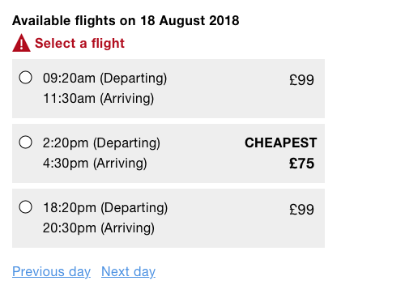
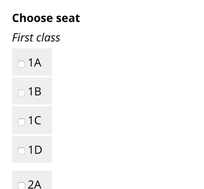
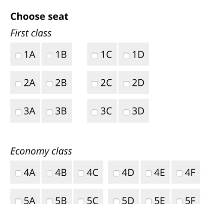
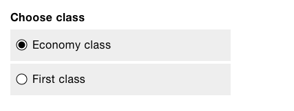

# Book a Flight

In this chapter, we'll design a flight booking service. At first this may seem a bit niche, especially when compared to *A Registration Form* and *A Checkout Flow*. However, we're going to explore several complex problems that in the end, will result in reusable patterns. Patterns that are very much transferable to other problem domains such as booking a cinema ticket or even a hotel room.

Booking a flight consists of many discrete steps. The first few steps simply collect user's preferences: where to fly, when to fly and who's flying. Once we have that we can give users a choice of available flights followed by choosing where to sit. Finally, users will have to make payment, but we covered payment patterns in the previous chapter.

## 1. Where to fly

First, users have to choose an origin and destination. That is, places to fly from and to. Without this information, the service can't offer any flights. What's the best way of asking users for this information?

As designers, we should try and use the features that are native to the browser. That's because, generally speaking, they are familiar (due to convention) and fully accessible out of the box. They also require far less work to implement.

You'd be forgiven for thinking you were spoiled for choice when it comes to form controls: select boxes, radio buttons, text boxes and more recently, datalists. The choice is yours, except it isn't. Not all of these options are suitable. Let's look at some of the pros and cons for each.

### Select Box

Select boxes, also known as drop-down menus, hide options behind a menu. Clicking the select box reveals the options. Once one is selected, the menu collapses back to its original state. Select boxes are often used because of their space-saving qualities. What's most interesting though, is why we need to save space in the first place.


Often an interface is crammed with features, usually to please stakeholders, not users. It's understandable then that learning ways to hide discrete pieces of an interface has become part of a designer's skillset. But design is about so much more than saving space. After all, if an interface really is crammed, then our first job as designers is to declutter it.

In her talk “Burn Your Select Tags”[^], Alice Bartlett shares the user research she undertook at the UK Government Digital Service. In short, select boxes are hard to use. Besides hiding options behind an unnecessary extra click, users generally don't understand how they work. Some users try to type into them, some confuse focused options with selected ones. And, if that weren't enough, users can't pinch-zoom the options on certain devices.

Usability expert, Luke Wobrelksi even wrote an article titled “Dropdowns Should be the UI of Last Resort”[^1]. In it, he suggests some better alternatives, some of which we'll discuss later in this chapter.

### Radio Buttons

Radio buttons, unlike select boxes, are generally well-understood and easy to use, not least because they don't hide options. They are exposed making them easy to compare, scan and select. They're also malleable. That is, they let us use whatever content, in whatever format, we want, inside the related label (more on that shortly).


The problem with radio buttons is that they're less suitable when there are many of them. As an airline could fly to hundreds of destinations, making the page long and unwieldy. This in turn, means users have to scroll (and keyboard users to tab) a lot more.

Don't get me wrong, users are more than happy to scroll[^], and we shouldn't use this as a crutch for changing course. But if we can naturally eliminate the need to scroll without introducing new problems we should.

### Search Input

A search box (`<input type="search">`) is a similar to a regular text box (`<input type="text">`). A search box, however, lets users clear the field by tapping *X* or pressing <kbd>Escape</kbd> when focused. With a text box you have to select the text and press <kbd>Delete</kbd> which takes a little longer.


Using a search box is useful when searching a large amount of dynamic data, such as searching Amazon's[^] product catalog. Airlines, however, fly to a finite set of destinations known in advance of the user searching. Letting users search unassisted like this could easily end up with a ‘no results’ page due to typos or a data mismatch.

### Datalist

Users need a control that lets them filter a long list of destinations. A control that marrys the flexibility of a text box with the assurance of a select box. This type of control goes by many different names including *type ahead*, *predictive search* and *combo box*, but we'll refer to it as an *autocomplete* control.

Autocomplete controls work by filtering options (destinations in this case) as the user types. As suggestions appear, users can select one quickly, automatically completing the field. This saves users having to scroll (unless, they want to) while also being able to forgive small typos.

HTML5's `<datalist>` combines with a text box (`<input type="text">`) to create a native autocomplete control which is unfortunately too buggy[^] for use on the open web. However, if your project is locked down to a few known browsers that don't have these bugs, then a native solution may work for you.


But, having already defined our design principles in the introduction, we know we want to design an inclusive experience—one that works for as many people as possible, no matter their choice of browser or mobile device.

### An Autocomplete Control

By creating a custom autocomplete component from scratch, there's an opportunity to create a powerful experience that also allows for common typos and endonyms. A word of warning though: we're going to break new ground; designing a robust and fully inclusive autocomplete control is hard work, but that's what our job is all about.

> Do the hardwork to make it simple—GDS Design Principle 4

Accessibility expert Steve Faulkner has what he calls a *punch list*[^] which is a list of rules to make sure that any custom JavaScript component is designed and built to a good standard. The rules state that a component should:

1. work without JavaScript
2. be focusable with the keyboard
3. be operable with the keyboard
4. work with assistive devices

#### The Basic Mark-up

To satisfy the first rule we need to make sure the interface works in the absence of JavaScript. This means starting with a native form control that browsers provide for free. 

Having already discussed the options above we know that there are too many options for radio buttons; a search box requires an unnecessary round-trip to the server and can lead to zero results; and the datalist is too buggy. By process of elimination, we're left with a select box.

```HTML
<div class="field">
  <label for="destination">
    <span class="field-label">Destination</span>
  </label>
  <select name="destination" id="destination">
    <option value="">Select</option>
    <option value="1">France</option>
    <option value="2">Germany</option>
    <option value="3">Spain</option>
  </select>
</div>
```

#### The Enhanced Mark-up

When JavaScript is available, the `Autocomplete()` constructor function will enhance the basic HTML to look like this:

```HTML
<div class="field">
  <label for="destination">
    <span class="field-label">Destination</span>
  </label>
  <select name="destination" aria-hidden="true" tabindex="-1" class="visually-hidden">
    <!-- options here -->
  </select>
  <div class="autocomplete">
    <input aria-owns="autocomplete-options--destination" autocapitalize="none" type="text" autocomplete="off"  aria-autocomplete="list" role="combobox" id="destination" aria-expanded="false">
    <svg focusable="false" version="1.1" xmlns="http://www.w3.org/2000/svg">
      <!-- rest of SVG here -->
    </svg>
    <ul id="autocomplete-options--destination" role="listbox" class="hidden">
      <li role="option" tabindex="-1" aria-selected="false" data-option-value="1" id="autocomplete_1">
        France
      </li>
      <li role="option" tabindex="-1" aria-selected="true" data-option-value="2" id="autocomplete_2">
        Germany
      </li>
      <!-- more options here -->
    </ul>
    <div aria-live="polite" role="status" class="visually-hidden">
      13 results available.
    </div>
  </div>
</div>
```

**Select box and text box notes**

Even though users will no longer interact with the select box, we can't remove it completely. If we were to remove the select box from the Document (or hide it with `display: none;`) then its value wouldn't be sent to the server upon submission. This is important because the text box `value` differs from the select box `value` that will be submitted.

Hiding the select box while still having its value submitted involves a number of techniques in combination. The `visually-hidden` class and `aria-hidden="true"` attribute (as first set out in chapter 2, “Checkout”) hides the select box from sighted and screen reader users respectively. The `tabindex="-1"` attribute stops keyboard users from being able to focus it.

Note, the select box `id` attribute is transferred over to the text box because the label must be assocated to it so that its read out in screen readers and increases the hit area of the control as explained in chapter 1. The select box, however, no longer needs an `id`—it's effectively become a hidden input. Inversly, the `name` attribute isn't needed on the text box because its value isn't sent to the server—it's purely for interaction purposes and is used as a proxy to set the select box value.

The `role="combobox"` attribute means the control is announced as a combo box instead. A combo box, according to MDN[^], is “an edit control with an associated list box that provides a set of predefined choices.” The `aria-autocomplete="list"` attribute tells users that a list of options will appear. The `aria-expanded` attribute tells users whether the menu is expanded or collapsed by toggling it's value between `true` and `false`.

The `autocomplete="off"` attribute stops browsers from showing their own suggestions which would interfere with those offered by the component itself. Finally, the `autocapitalize="none"` attribute stops browsers from autocapitalising the first letter. Something we'll look at in detail in the next chapter.

The SVG icon is layered on top of the text box using CSS. Note the `focusable="false"` attribute which fixes the issue that in Internet Explorer SVG elements are focusable by default.

**Menu notes**

The `role="list"` attribute is used to communicate the menu as a list, because it will be populated with a list of options. Each option has a `role="option"` attribute.

The `aria-selected="true"` attribute tells users which  option within the list is selected or not by toggling the value between `true` and `false`.

The `tabindex="-1"` attribute means focus can be set to the option programatically when users press certain keys with the keyboard. We'll look at keyboard interaction later.

Finally, the `data-option-value` attribute stores the select box option value. When the user clicks an autocomplete option, the select box value is updated accordingly to keep them in-sync. This is what ties the enhanced interface (what the user sees) with the select box (what the user can't see) that's used to communicate to the server, when the form is submitted.

**Live Region** 

Sighted users will see the suggestions appear in the menu as they type, but the act of populating the menu isn't determinable to screen reader users, without leaving the text box to explore the menu.

To provide a comparable experience (principle 1), we can use a live region as first laid out in chapter 2, “Checkout.” As the menu is populated, we'll also populate the live region with how many results are available—for example, “13 results available.” With this information at hand, users can continue typing to narrow the results further, or they can select a suggestion from the menu.

As the feedback is only useful to screen reader users, it's hidden with the `visually-hidden` class again.

#### Typing Into The Text Box

When the user types into the text box, we need to listen out for certain keys using JavaScript.

```JS
Autocomplete.prototype.createTextBox = function() {
  // ...
  this.textBox.on('keyup', $.proxy(this, 'onTextBoxKeyUp'));
  // ...
};

Autocomplete.prototype.onTextBoxKeyUp = function(e) {
  switch (e.keyCode) {
    case this.keys.esc:
    case this.keys.up:
    case this.keys.left:
    case this.keys.right:
    case this.keys.space:
    case this.keys.enter:
    case this.keys.tab:
    case this.keys.shift:
      // ignore these keys otherwise
      // the menu will show briefly
      break;
    case this.keys.down:
      this.onTextBoxDownPressed(e);
      break;
    default:
      this.onTextBoxType(e);
  }
};
```

The `this.keys` object is a collection of key codes (numbers) that correspond to particular keys by their name. This is to avoid magic numbers[^] which makes the code easy to understand at a glance.

The switch statement filters out the <kbd>Escape</kbd>, <kbd>Up</kbd>, <kbd>Left</kbd>, <kbd>Right</kbd>, <kbd>Space</kbd>, <kbd>Enter</kbd>, <kbd>Tab</kbd> and <kbd>Shift</kbd> keys. This is because if we didn't, the default case would run and would incorrectly show the menu. Instead of filtering out the keys we aren't interested in responding to, we could have specified the keys that we *are* interested in. But this would mean specifying a huge range of keys, which would increase the chance of one being missed, creating a broken experience.

We're mainly interested in the last two statements. That is, when the user presses <kbd>Down</kbd> or the default case above, which means “everything else” (a character, number, symbol etc). In this case the `onTextBoxType()` function will be called.

```JS
Autocomplete.prototype.onTextBoxType = function(e) {
  // only show options if user typed something
  if(this.textBox.val().trim().length > 0) {
    // get options based on value
    var options = this.getOptions(this.textBox.val().trim().toLowerCase());

    // build the menu based on the options
    this.buildMenu(options);

    // show the menu
    this.showMenu();

    // update the live region
    this.updateStatus(options.length);
  }

  // update the select box value which
  // the server uses to process the data
  this.updateSelectBox();
};
```

The `getOptions()` method filters the options based on what the user typed. We'll look at the the filter function later.

#### Controls Should Have A Single Tab Stop

The autocomplete control is what's known as a composite. That just means it's made up of several different interactive and focusable parts—in this case, the text box and menu. What's important is that composite components should have one tab stop. Here's what the WAI-ARIA Authoring Practices 1.1 specification[^] has to say on the subject:

> A primary keyboard navigation convention common across all platforms is that the tab and shift+tab keys move focus from one UI component to another while other keys, primarily the arrow keys, move focus inside of components that include multiple focusable elements. The path that the focus follows when pressing the tab key is known as the tab sequence or tab ring.

A radio button group, for example, is a composite control that has one tab stop. Once the first radio button is focused, users can use the arrow keys to move between the options. Pressing <kbd>Tab</kbd> at anytime from within the group, moves focus to the next focusable control in the tab sequence.

The text box within our autocomplete control is naturally focusable by the Tab key. Once focused, the user will be able to press the arrow keys to traverse the menu which we'll look at shortly. Pressing Tab when the text box or menu option is focused, should hide the menu to stop it from obscuring the content beneath when not in use. We'll look at how to do this next.

#### Hiding The Menu Onblur Is Problematic

The `onblur` event is triggered when the user leaves an in-focus element. In the case of the autocomplete, we could listen to this event on the text box. The virtue of using the `onblur` event is that it will be triggered when the user leaves the field by pressing <kbd>Tab</kbd> or by clicking or tapping outside of the element.

```JS
this.textBox.on('blur', function(e) {
  // hide menu
});
```

The problem with this approach is that the act of moving focus to the menu (even programatically like we'll be doing), triggers the blur event which subsequently hides the menu. This would make the menu inaccessible with the keyboard.

One work around involves using the `setTimeout()` function which allows us to put a delay on the event. In turn, the delay gives us time to cancel the event (using `clearTimeout()`, should the user move focus to the menu within that time. This would stop the menu being hidden making it accessible again.

```JS
this.textBox.on('blur', $.proxy(function(e) {
  // set a delay before hiding the menu
  this.timeout = window.setTimeout(function() {
    // hide menu
  }, 100);
}, this));

this.menu.on('focus', $.proxy(function(e) {
  // cancel the hiding of the menu
  window.clearTimeout(this.timeout);
}, this));
```

Unfortunately, there's a problem with the blur event in iOS 10. In short, it incorrectly triggers the blur event on the text box when the user hides the on-screen keyboard. This stops users from accessing the menu altogether. There's another solution which we'll look at next.

#### Listening To The Tab Key

Instead of hiding the menu `onblur`, we can use the `keydown` event. Specifically, we can listen out for when the user presses the Tab key.

```JS
this.textBox.on('keydown', $.proxy(function(e) {
  switch (e.keyCode) {
    case this.keys.tab:
      // hide menu
      break;
  }
}, this));
```

Unlike the `blur` event, this approach doesn't cover the case where users blur the control by clicking outside of it. We have to handle this case manually by listening to the Document's `click` event but being careful to work out what's clicked—we don't want to hide the menu if the user clicks within the control.

```JS
$(document).on('click', $.proxy(function(e) {
  if(!$.contains(this.container[0], e.target)) {
    // hide the menu
  }
}, this));
```

The event handler is using jQuery's `contains()` method which checks to see if what the user clicked (`e.target`) falls outside the container (`this.container[0]`). If it's outside, the menu is hidden. The [0] is used because the `contains()` method takes element nodes—not jQuery objects.

#### Moving To The Menu (Pressing Down)

When the text box is focused, pressing the Down key triggers the `onTextBoxDownPressed()` like this:

```JS
Autocomplete.prototype.onTextBoxDownPressed = function(e) {
  var option;
  var options;
  var value = this.textBox.val().trim();
  /*
    When the value is empty or if it exactly
    matches an option show the entire menu
  */
  if(value.length === 0 || this.isExactMatch(value)) {

    // get options based on the value
    options = this.getAllOptions();

    // build the menu based on the options
    this.buildMenu(options);

    // show the menu
    this.showMenu();

    // retrieve the first option in the menu
    option = this.getFirstOption();

    // highlight the first option
    this.highlightOption(option);

  /*
    When there's a value that doesn't have
    an exact match show the matching options
  */
  } else {

    // get options based on the value
    options = this.getOptions(value);

    // if there are options
    if(options.length > 0) {

      // build the menu based on the options
      this.buildMenu(options);

      // show the menu
      this.showMenu();

      // retrieve the first option in the menu
      option = this.getFirstOption();

      // highlight the first option
      this.highlightOption(option);
    }
  }
};
```

If the user presses Down without having typed anything, the menu will populate with every available option, and focus to the first menu option. The same thing will happen if the user types an exact match—this should be rare because most most users who notice the suggestion will select it—it's quicker that way. 

The `else` condition will will populate the menu with options that match (if any), and again will focus the first menu option. At the end of both scenarios the `highlightOption()` method is called, which we'll look at later.

#### Scrolling The Menu

As mentioned earlier, the menu may contain hundreds of options. To ensure the menu stays visible within the viewport, we need to use CSS.

```CSS
.autocomplete [role=listbox] {
  max-height: 12em;
  overflow-y: scroll;
  -webkit-overflow-scrolling: touch;
}
```

The `max-height` property works by letting the menu grow up to a maximum height of 12em. Once the content inside the menu surpasses that height, users can scroll the menu thanks to the `overflow-y: scroll` property. The last property is non-standard and is used to enable momentum scrolling on iOS. This ensures the autocomplete control scrolls the same way as it would everywhere else.

#### Clicking An Option

Clicking or tapping a menu option should perform a number of discrete tasks, but before we get to them, let's discuss how we might listen to the click event.

The most basic approach involves adding a click event onto each of the options individually. But this is problematic for two reasons.

First, each added event must be stored in memory. As there are hundreds of option, they'll use a lot of memory which may impact performance. Second, the menu options are constantly being updated as the user types. This means events needed to be constantly added and removed which is computationally intensive and bothersome to manage codewise.

Instead we can use event delegation[^] which is made possible by the concept of event bubbling. In short, events that originate from lower down the Document tree, propagate (bubble up) to the parent container, all the way up to the Document root.

In our particular case, we can add a single event listener onto the menu's container and filter out all events that don't match the option elements that we're interested in. To do this, we can use jQuery's `on()` method which has event delegation built in.

```JS
Autocomplete.prototype.createMenu = function() {
  //...
  this.menu.on('click', '[role=option]', $.proxy(this, 'onOptionClick'));
  //...
};
```

The click event is bound to the container (`this.menu`), but will only trigger the event handler (`onOptionClick()`) when the event originated on an element with `role="option"`.

```JS
Autocomplete.prototype.onOptionClick = function(e) {
  var option = $(e.currentTarget);
  this.selectOption(option);
};
```

The event handler retrieves the option (`e.currentTarget`) and hands it off to the `selectOption()` method. Normally, we'd reference `e.target`, but as we're using event delegation, `e.target` would return the delegate (`this.menu`) which isn't helpful. Whenever you're using event delegation, you'll almost definitely be interested in the originating element (`e.currentTarget`).

```JS
Autocomplete.prototype.selectOption = function(option) {
  var value = option.attr('data-option-value');
  this.setValue(value);
  this.hideMenu();
  this.focusTextBox();
};
```

The `selectOption()` function takes the option to be selected, extracts the `data-option-value` attribute. That value is passed to the `setValue()` method which populates the text box and hidden select box. Finally, the menu is hidden and the text is focused.

This same routine is performed when the user selects an option with the <kbd>Space</kbd> or <kbd>Enter</kbd> keys. We'll look at the menu interactions next.

#### Menu Keyboard Interaction

Once focus is within the menu (by pressing Down while the text box is focused), we need to let users traverse the menu with the keyboard. To do this, we'll listen to the `keydown` event.

```JS
Autocomplete.prototype.createMenu = function() {
  this.menu.on('keydown', $.proxy(this, 'onMenuKeyDown'));
};

Autocomplete.prototype.onMenuKeyDown = function(e) {
  switch (e.keyCode) {
    case this.keys.up:
      // Do stuff
      break;
    case this.keys.down:
      // Do stuff
      break;
    case this.keys.enter:
      // Do stuff
      break;
    case this.keys.space:
      // Do stuff
      break;
    case this.keys.esc:
      // Do stuff
      break;
    case this.keys.tab:
      // Do stuff
      break;
    default:
      this.textBox.focus();
  }
};
```

| Key | Action |
|:---|:---|
| <kbd>Up</kbd> | If the first option is focused, set focus to the text box, otherwise set focus to the previous option. |
| <kbd>Down</kbd> | Focus the next menu option. If it's the last menu option, do nothing. |
| <kbd>Tab</kbd> | Hide the menu. |
| <kbd>Enter</kbd> or <kbd>Space</kbd> | Select the currently selected option and focuse the text box. |
| <kbd>Escape</kbd> | Hide the menu and set focus to the text box. |
| Any other character | Focus the text box so users can continue typing. |

#### The Highlight Function

As noted above, the user can focus an option by pressing the Up and Down keys. When this happens, the `highlightOption()` method is called.

```JS
Autocomplete.prototype.highlightOption = function(option) {
  // if there's a currently selected option
  if(this.activeOptionId) {

    // get the option
    var activeOption = this.getOptionById(this.activeOptionId);

    // unselect the option
    activeOption.attr('aria-selected', 'false');
  }

  // set new option to selected
  option.attr('aria-selected', 'true');

  // If the option isn't visible within the menu
  if(!this.isElementVisible(option.parent(), option)) {
  
    // make it visible by setting its position inside the menu
    option.parent().scrollTop(option.parent().scrollTop() + option.position().top);
  }

  // store new option for next time
  this.activeOptionId = option[0].id;

  // focus the option
  option.focus();
};
```

The method performs a number of discrete steps. First, it checks to see if there's a previously active option. If so, the `aria-selected` attribute is set to `false` which ensures the state is communicated to screen reader users. Second, the new option's `aria-selected` attribute is set to `true`.

As the menu has a fixed height, there's a chance that the newly focused option is out of the menu's visible area. So we check whether this is the case using the `isElementVisible()` method. If it's not visible, the menu's scroll position is adjusted using jQuery's `scrollTop()` method which makes sure it's in view.

Next, the new option is stored, so that it can be referenced later when the method is called again for a different option. And finally, the option is focused programatically to ensure its value is announced in screen readers.

To provide feedback to sighted users we can use the same `[aria-selected=true]` CSS attribute selector like this:

```CSS
.autocomplete [role=option][aria-selected="true"] {
  background-color: #005EA5;
  border-color: #005EA5;
  color: #ffffff;
}
```

Tying state and its visual representation together is a good thing because tt ensures that state changes are communicated interoperably. Form should follow function, and doing so directly keeps them in-sync.

#### The Basic Filter Function

Having looked at the main interaction flows and routines that run off the back of them, we can look more closely at the filtering mechanism. This is important because a good filter is designed to forgive small typos and letter casing. It's worth reminding ourselves again that the data that drives the suggestions reside in the select box `<option>` elements.

```HTML
<select>
  <option value="">Select</option>
  <option value="1">France</option>
  <option value="2">Germany</option>
  <option value="3">Spain</option>
</select>
```

As noted above, the `getOptions()` method is called when we need to populate the menu with matching options.

```JS
Autocomplete.prototype.getOptions = function(value) {
  var matches = [];

  // Loop through each of the option elements
  this.select.find('option').each(function(i, el) {

    // if the option has a value and the option's text node matches the user-typed value
    if($(el).val().trim().length > 0 && $(el).text().toLowerCase().indexOf(value.toLowerCase()) > -1) {

      // push an object representation to the matches array
      matches.push({ 
        text: $(el).text(), 
        value: $(el).val() 
      });
    }
  });

  return matches;
};
```

The method takes the user-entered value as a parameter. It then loops through each of the `<option>`s and compares the value to the option's text content (the bit inside the element). It does so by using `indexOf()` which checks to see if the string contains an occurence of the specified value. This means users can type incomplete parts of countries and still have relevant suggestions presented to them. 

The value is trimmed and converted to lower case, which means options will still be shown if the user has, for example, turned on capslock on their keyboard. Users shouldn't have to fix problems that we can fix for them automatically.

Each matched option is added to the `matches` array which will be used by the calling function to populate the menu accordingly.

#### Supporting Endonyms And Common Typos

Some people refer to countries by different names. For example, Germany is sometimes referred to as Deutschland. An alternative name for a place is called an endonym. To allow users to type an endonym, we first need store it somewhere. We can put the endonym inside a data attribute on the `<option>` element.

```HTML
<select>
  <option value="">Select</option>
  <option value="1">France</option>
  <option value="2" data-alt="Deutschland">Germany</option>
  <option value="3">Spain</option>
</select>
<select>
```

With the select box ready, we can change the filter function to check the alternative name like this:

```JS
Autocomplete.prototype.getOptions = function(value) {
  var matches = [];

  // Loop through each of the option elements
  this.select.find('option').each(function(i, el) {

    // if the option has a value and the option's text node matches the user-typed value or the option's data-alt attribute matches the user-typed value
    if( $(el).val().trim().length > 0 
      && $(el).text().toLowerCase().indexOf(value.toLowerCase()) > -1 
      || $(el).attr('data-alt') 
      && $(el).attr('data-alt').toLowerCase().indexOf(value.toLowerCase()) > -1 ) {

      // push an object representation to the matches array
      matches.push({ 
        text: $(el).text(), 
        value: $(el).val() 
      });
    }
  });

  return matches;
};
```

The attribute isn't reserved for endonyms—it can be used to store common typos too.

#### How It Might Look


## 2. When To Fly

Dates are notoriously hard[^]: different time zones, formats, delimiters, days in the month, length of a year, daylight savings and on and on. It's hard work designing all of this complexity out of an interface.

Often three select boxes are used: one for day, month and year. Admittedly, we've just discussed the cons of select boxes, but it must be said that one of their redeeming qualities is that they stop users entering wrong information. But in the case of dates, even *this* quality doesn't hold up. For example, you can select an invalid date such as *31 February 2017*.


Select boxes are also used to avoid locale and formatting differences. Some dates start with month, others with day. Some delimit dates with slashes, others with dashes or dots. We can't reliably determine users' intention based on what they enter. It's just one of those things.


Many of us assume that using a calendar widget is always better than letting users type freely into a text box unassisted. But this is not always the case. The UK Goverment Digital Service (GDS) Service Manual states:

> “The way you should ask for dates depends on the types of date you’re asking for.”

Let's walk through some of the main types of dates to see what interface is best for users. Then we can see if any of those are suited to the contex of our problem: choosing a date to fly on.

### Dates From Documents

Here's what GDS says about asking for dates that are found on documents and other physical items users may need to reference:

> “If you ask for a date exactly as it’s shown on a passport, credit card or similar item, make the fields match the format of the original. This will make it easier for users to copy it across accurately.

The expiry date from chapter 2, “Checkout” falls under this category. As the expiry date is just 4 characters with an optional slash, we gave users a single text box that matches the expected format. Essentially, users just copy with they see. Easy.

### Memorable Dates

A memorable date is one that you remember easily such as your date of birth. Typing 6 digits unassisted into a text box is much quicker than scrolling, swiping and clicking through multiple years, months and days within a calendar.

Memorable dates are best represented by three text boxes: one for day, month and year. Why three? Because it solves the locale and formating issues mentioned earlier.


```HTML
<fieldset class="field">
  <legend>
    <span class="field-legend">Date of birth</span>
    <span class="field-hint">DD MM YYYY</span>
  </legend>
  <div class="field-dayWrapper">
    <label for="day">Day</label>
    <input class="field-dayBox" type="text" pattern="[0-9]*" name="day" id="day">
  </div>
  <div class="field-monthWrapper">
    <label for="month">Month</label>
    <input class="field-monthBox" type="text" pattern="[0-9]*" name="month" id="month">
  </div>
  <div class="field-yearWrapper">
    <label for="year">Year</label>
    <input class="field-yearBox" type="text" pattern="[0-9]*" name="year" id="year">
  </div>
</fieldset>
```

The three fields are wrapped in a `fieldset`. The `legend` (“Date of birth”) gives each text box context and would be read out as “Date of birth, day” (or similar) in screen readers.

*(Note: the pattern attribute is used to trigger the numeric keyboard—a little enhancement for iOS users. If you're wondering about why we haven't used the number input, you can refer back to the number input in chapter 2, “Checkout.”)*

### A Date Picker

When choosing a date to fly on, users are neither entering a memorable date, nor one found in a document. They are searching for a date sometime in the future and usually within the next few months.

We tend to think of time in structured chunks: days, weeks and months etc. And we plan our time using calendars which aligns with that notion. It's sensible then, to let users find and pick a date through a familiar and intuitive calendar interface or what's commonly known as a date picker.

As usual, our first port of call is to see if there's a date picker control that browsers provide natively for free. Good news: there is. The date input (`<input type="date">`) offers a special and convenient interface for picking dates while also enforcing a standard format for the value that's sent to the server upon submission.

Mobile browser support is really good and includes Samsung's browser, FireFox, Edge, Chrome, Opera and Safari. Desktop support is patchier: Chrome and Edge support it, but Internet Explorer and Safari (at time of writing) don't. We'll look at how to support them later.


Caption: A selection of date pickers on different browsers

As the date picker is provided by the browser, you'll notice how it looks a lot like the system date picker that's used for setting dates and times on your phone. That's by design so that mobile browsers can outsource the problem to native components. This is good because users will be familiar with it which speaks to principle 3, *Be consistent*.

You might be concerned that they look different in different browser vendors. Don't be. Most users don't notice the difference and the rest don't care. Remember, most people use the same browser every day. That is, they only see their platform's implementation. Unlike us, they're not agonising over subtle differences during cross-browser testing.

> Nobody cares about your website as much as you do[^]

If you're not able to conduct your own user research, watch “Progressive Enhancement 2.0”, at 29 minutes in[^]. Nicholas Zakas shows the audience a slide with a photo on it. He moves to the next slide which contains the same photo. He then asks the audience if they noticed any differences. Even though the second photo had a border and drop shadow, not one person noticed.

Ironically, the audience was made up of designers and developers—people who are trained to notice these things. But they didn't notice them, because like any user, they were focused on the content, not the finer points of the visual aesthetic.

#### The Basic Mark-up

```HTML
<div class="field">
  <label for="departure">
    <span class="field-label">Departure date</span>
  </label>
  <input type="date" id="departure" name="departure">
</div>
```

This mark-up has been used many times already in the book. The only difference is that the input's `type` attribute is set to `date`.

Browsers that support the date input give users a standard date picker that's familiar, accessible and performant by default. So that's good. But what happens in other browsers?

In this case, the date input will change into a basic text input—this is known as graceful degradation. While users won't get the convenience of a date picker, they'll still be able to enter a date. This is an example of HTML's inherent resilient nature. When things fails, they don't break.

Depending on your situation, this level of support may be fine. Perhaps entering a date is of low priority or happens too infrequently to worry about. Or perhaps none of your users will ever use an unsupported browser. But in our case, finding a date is integral to the flight booking experience. We ought to provide a better experience, for people using an unsupported browser.

#### How It Might Look


The date picker consists of a toggle button that reveals the calendar. From there users will be able to traverse the calendar and ultimately select a date to populate the text box.

#### Notes About The Design

- previous/next days greyed out a little

Many date pickers are designed as overlays, but they obscure the rest of the page and are prone to disappearing off screen when positioned absolutely on top of the interface. Instead our calendar will be positioned underneath the input and inline avoiding such issues.

There's an inset left border which visually connects the calendar to the field above. And the interactive elements within the calendar have large tap targets[^] which are  easier to tap and click.

You might be tempted to try and squeezy additional information—such as price and availability—into each of the cells. This may be possible in very large viewports, but it's not practical from a responsive design perpsective: there's simply not enough room to denote this information in small viewports. This is why it's important to design mobile-first.

In any case, the primary user need at this stage of the journey is to select a date. Trying to squeeze in additional information is going to result in a slower, busier and overwhelming experience that slows users down.

Instead, we'll let users focus on choosing a date unencumbered and later we'll give users more information when it's both useful and practical to do so.

#### Feature Detection

As we only want to give unsupported browsers the custom date picker component, the first thing we need to do is detect when and when not to initialise the component. Without a provision in place, users might get see two opposing date pickers: the native one and our own, which would be confusing and unnecessary.

We can check for support before enhancing the interface using a little feature detection script.

```JS
function dateInputSupported() {
  var el = document.createElement('input');
  try {
    el.type = "date";
  } catch(e) {}
  return el.type == "date";
}
```

The function works by trying to create a date input and then checking to see if its `type` attribute is correctly reported as a date input. In browsers that lack support, it will be reported as a text input instead. We can use this function to determine whether the `DatePicker()` component should be defined or not.

```JS
if(!dateInputSupported()) {
  function DatePicker() {
    // code here
  }
}
```

As the `DatePicker()` is only defined when there's no support for the native date input, we can check to see if its defined before initialising it. This is known as a dynamic JavaScript API[^], because it changes based on support and is a crucial aspect of designing progressively enhanced interfaces.

```JS
if(typeof DatePicker !== "undefined") {
 new DatePicker();
}
```

#### The Enhanced Mark-up

After the date picker has been initialised, the mark-up will have been changed to include the date picker controls: toggle button, next and previous month buttons and the calendar grid.

```HTML
<div class="field">
  <label for="when">
    <span class="field-label">Date</span>
  </label>
  <div class="datepicker">
    <input type="text" id="when" name="when">
    <button type="button" aria-expanded="true" aria-haspopup="true">Choose</button>
    <div class="datepicker-wrapper hidden">
      <!-- Calendar widget goes here -->
    </div>
  </div>
</div>
```

Notes:

- The `type="button"` attribute stops the button from submitting the form. If the type was set to `submit` (or omitted altogether) when pressed, it would incorrectly submit the form.
- The `aria-haspopup="true"` attribute indicates that the button reveals a calendar. It acts as a warning that, when pressed, the focus will be moved to the calendar. Note: its value is always set to `true`.
- The `aria-expanded` attribute indicates whether the calendar is currently in an open (expanded) or closed (collapsed) state by toggling between `true` and `false` values.

#### Revealing The Calendar

The calendar starts hidden. When the toggle button is clicked, the calendar is revealed by removing the `hidden` class on the wrapper. Immediately after, the focus is set to the Previous Month button, which is the first focusable element inside the calendar.

```JS
DatePicker.prototype.onToggleButtonClick = function() {
  // showing
  if(this.toggleButton.attr('aria-expanded') == 'true') {
    this.hide();

  // hiding
  } else {
    this.show();
    this.calendar.find('button:first-child').focus();
  }
};

DatePicker.prototype.hide = function() {
  this.calendar.addClass('hidden');
  this.toggleButton.attr('aria-expanded', 'false');
};

DatePicker.prototype.show = function() {
  this.calendar.removeClass('hidden');
  this.toggleButton.attr('aria-expanded', 'true');
};
```

#### The Calendar HTML

```HTML
<div class="datepicker-calendar" aria-label="date picker" role="group">
  <div class="datepicker-actions">
    <button type="button" aria-label="previous month">
      <svg focusable="false" version="1.1" xmlns="http://www.w3.org/2000/svg" xmlns:xlink="http://www.w3.org/1999/xlink" viewBox="0 0 17 17" width="1em" height="1em">...</svg>
    </button>
    <div role="status" aria-live="polite">February 2018</div>
    <button type="button" aria-label="next month">
      <svg focusable="false" version="1.1" xmlns="http://www.w3.org/2000/svg" xmlns:xlink="http://www.w3.org/1999/xlink" viewBox="0 0 17 17" width="1em" height="1em">...</svg>
    </button>
  </div>
  <!-- grid here -->
</div>
```

The container has two important attributes: the `role="group"` attribute groups the related calendar controls together. When the calendar is revealed, screen reader users will hear the button's label in combination with the group's label: “date picker, previous month, button”.

The month's title and year is placed within a live region (as first discussed in chapter 2). This means its content will be announced by screen readers when the calendar is revealed. This same information will be continually announced as users move between different months.

*(Note: As mentioned earlier, the `focusable="false"` attribute on the SVG icon fixes the issue that in Internet Explorer SVG elements are focusable.)*

#### Previous And Next Month Buttons

With the calendar now revealed, the user can move between the Previous Month and Next Month buttons by using the <kbd>Tab</kbd> key. This is becaue we've used `<button>` elements which are naturally focusable and part of the tab sequence.

Buttons are interoperable meaning they can be activated by clicking, tapping or pressing Space or Enter with the keyboard. All we need to do is listen for the click event.

```JS
DatePicker.prototype.addEventListeners = function() {
  this.calendar.on('click', 'button:first-child', $.proxy(this, 'onPreviousClick'));
  this.calendar.on('click', 'button:last-child', $.proxy(this, 'onNextClick'));
};

DatePicker.prototype.onPreviousClick = function(e) {
  this.showPreviousMonth();
};

DatePicker.prototype.onNextClick = function(e) {
  this.showNextMonth();
};
```

The `showPreviousMonth()` and `showNextMonth()` methods (not shown) work out which month to show and then update the title and grid HTML accordingly.

#### The Grid

The days of the month are presented in a grid format of which the `<table>` element is perfectly suited so that's easy. But it's the careful arrangmenet of attributes that are crucial in not only enabling interaction but understanding too.

```HTML
<table role="grid">
  <thead>
    <tr>
      <th aria-label="Sunday">Su</th>
      <th aria-label="Monday">Mo</th>
      <th aria-label="Tuesday">Tu</th>
      <th aria-label="Wednesday">We</th>
      <th aria-label="Thursday">Th</th>
      <th aria-label="Friday">Fr</th>
      <th aria-label="Saturday">Sa</th>
    </tr>
  </thead>
  <tbody>
    <tr>
      <td role="gridcell" tabindex="-1" aria-label="1 October, 2017">
        <span aria-hidden="true">1</span>
      </td>
      <td role="gridcell" tabindex="-1" aria-label="2 October, 2017">
        <span aria-hidden="true">2</span>
      </td>
      <td role="gridcell" tabindex="-1" aria-label="3 October, 2017">
        <span aria-hidden="true">3</span>
      </td>
      <td role="gridcell" tabindex="-1" aria-label="4 October, 2017">
        <span aria-hidden="true">4</span>
      </td>
      <td role="gridcell" tabindex="-1" aria-label="5 October, 2017">
        <span aria-hidden="true">5</span>
      </td>
      <td role="gridcell" tabindex="0" aria-label="6 October, 2017">6</td>
      <td role="gridcell" tabindex="-1" aria-label="7 October, 2017">
        <span aria-hidden="true">7</span>
      </td>
    </tr>
    <tr>...</tr>
    <tr>...</tr>
    <tr>...</tr>
  </tbody>
</table>
```

The `role="grid"` attribute (and each cell's `role="gridcell"` attribute) tells screen readers to treat the table as a grid. Without this, JAWS for example, won't let users operate the calendar with the arrow keys using JavaScript. This is because, the arrow keys are reserved for operating a standard table in a special way.

The `<thead>` contains the names of the days. Note that they're abbreviated which should be avoided in most cases. But in this case, the calendar needs to fit on small viewports too. The unabbreviated heading is placed inside the `aria-label` attribute which means it will be announcd in screen readers.

Each cell contains a number (the date) which is perfectly adequate for sighted users as they can see the entire calendar. But, screen reader users would only hear “17” which is ambiguous unless they carefully remember the previously announced month and year. To provide a comparable experience (principle 1), we put the full date inside the `aria-label` attribute.

The `<span>` has an `aria-hidden="true"` attribute which stops the number being read out twice by some screen readers without hiding it from sighted users.

#### Interaction


- Each `<td>` has `tabindex="-1"` except for the selected day, which has `tabindex="0"`. This means that the user can tab straight onto the selected day and navigate from there using the arrow keys.
- When the user presses the arrow keys to select a new day, the previously selected day's `tabindex` will be set to `-1`; the newly selected day's `tabindex` will be set `0`. This is known as roving tabs, which makes sure the grid becomes just a single tab stop. Otherwise users would have to tab ~30 times to move beyond the calendar with their keyboard which is tiresome.
- Pressing <kbd>Left</kbd> moves to the previous day. Pressing <kbd>Right</kbd> moves to the next day. Pressing <kbd>Up</kbd> moves to the same day in the previous week. Pressing <kbd>Down</kbd> moves to the same day in the next week. This way, users can move freely and efficiently between days and months.
- Pressing <kbd>Enter</kbd> or <kbd>Space</kbd> will confirm selection, populate the text box with the date, move focus back to the text box and finally, close the calendar.

OTHER
- Pressing <kbd>Escape</kbd> hides the calendar and moves focus to the button.

*(Note about aria-activedescendant)*

While screen reader users *can* operate the calendar, it's probably not that useful. Entering a date by typing directly into the text box is probably easier and quicker. But we don't make those assumptions. Instead, we adhere to principle 5, *Offer choice* by letting them do as they wish.

#### Future Support

Jeremy Keith thinks about the web as a *continuum*[^]. By that he means it's constantly changing. Technology evolves at a rapid pace and browsers and devices are released all the time. Each of which have varying features and capabilities.

At any particular moment in time we need to decide what level of support makes sense for a given feature.

Earlier, we made the decision to create an enhanced experience for (desktop) browsers that don't support the native date input by creating our own date picker. As time goes by browser support will get better and better. At the same time, the number of people who would have experienced the degraded version will diminish.

At which time, we can quietly remove the Javascript code, giving us less to maintain and users a faster experience (as they won't have to load that code). Lovely.

#### Doing Our Best

We have covered users who:

- use a browser that supports the date input
- use a browser that doesn't support the date input

But, we haven't covered users who:

- use an unsupported browser and experience a network or Javascript failure (like the ones described in “A Registration Form”).

> People ignore design that ignores people. - Frank Chimero

In this case, users will see a text box asking for a date. It's not what they see that matters here, it's what they don't see. And they don't see a hint explaining the expected format. We can't use the hint pattern (first discussed in “A Registration Form”) because browsers that support the date input may use a different format which would cause confusion.


We can be as forgiving as possible, by letting users type slashes, periods or spaces: whichever they prefer. But typing a two-digit year first, for example, will cause an error. In this case, a well-written error message message might have to suffice.

We could add a hint via the placeholder attribute and then remove it with JavaScript when our own date picker will be injected. Despite the problems with placeholders (discussed in “A Registration Form”) this might be the lesser of two evils.

Design is often a question of priorities. What is a good experience for most may create a less-than-ideal experience for some, which is especially the case on the web. Inclusive design is about making decisions that are unlikely to exclude people.

In this edge case, users are still able to enter a date which makes this pattern an accessible one. In the end, it's about doing our best and we've done that here.

## 3. Choosing passengers

Airlines typically ask how many people are travelling. They also want to know what age the travellers are because this affects the price of the ticket. Here's how it might look:


```HTML
<div class="field">
  <label for="adults">
    <span class="field-label">How many adults, 16 years and over, are flying?</span>
  </label>
  <input type="number" id="adults" name="adults" min="0" max="9">
</div>
<div class="field">
  <label for="children">
    <span class="field-label">How many children, aged between 2 and 15 years old, are flying?</span>
  </label>
  <input type="number" id="children" name="children" min="0" max="9">
</div>
<div class="field">
  <label for="infants">
    <span class="field-label">How many infants, under 2 years old, are flying?</span>
  </label>
  <input type="number" id="infants" name="infants" min="0" max="9">
</div>
```

Each category is represented by a separate field. As we're asking users for an *amount* of something—in this case passengers—the number input makes sense. (Note: we discussed when to use the number input in “Checkout”.)

Number inputs have little spinner buttons. Spinners, also known as steppers, let users increase or decrease the input's value by a constant amount. They are great for making small adjustments. As Luke Wobrelkski says:

> When testing mobile flight booking forms, we found people preferred steppers for selecting the number of passengers. No dropdown menu required, especially since there's a maximum of 8 travelers allowed and the vast majority select 1-2 travelers.

The downside is that the default spinners are really small, which make them especially difficult to use on touch screen displays or for motor-impaired users. Moreover, on many mobile devices, they don't show up at all.

### Custom Stepper Buttons

We can create bigger buttons with Javascript. Not only are they easier to use on desktop, but they will save mobile users having to trigger the on-screen keyboard reducing the time and effort to complete this task.

First, we need to turn off the native stepper buttons provided by the browser. In webkit browsers you can do this:

```CSS
input::-webkit-outer-spin-button,
input::-webkit-inner-spin-button {
  -webkit-appearance: none;
  appearance: none;
  margin: 0;
}
```

#### The Enhanced Interface


Each field is enhanced with this HTML:

```HTML
<div class="field">
  <label for="adults" id="adults-label">How many people aged 16 and over are flying?</label>
  <div class="stepper">
    <button type="button" aria-label="Decrement" aria-describedby="adults-label">&minus;</button>
    <input type="number" id="adults" name="adults" value="1">
    <button type="button" aria-label="Increment" aria-describedby="adults-label">&plus;</button>
    <div class="visually-hidden" role="status" aria-live="polite">1</div>
  </div>
</div>
```

Notes:

- The label is given an `id` attribute which the buttons will use as a description thanks to the `aria-describedby` attribute.
- The buttons and number input is wrapped in a `div` so that they can be styled as a group underneath the label.
- The button's `aria-label` attribute will ensure that screen readers read out “Decrement” instead of “minus symbol” (or similar).
- The button's `aria-describedby` attribute references the aformentioned label's `id` which means it combines with the label text to give screen reader users extra context. As there are three fields on the page, this stops users thinking “Decrement—decrement what exactly?”.
- Each button has a `type="button"` attribute which means it won't submit the form when clicked.
- Clicking increment or decrement updates the status box at the bottom so that screen reader users will hear the change without having to move away from the button (see note below).

*(Note: when the increment (or decrement) button is clicked, the input's value is updated. Unfortunately, screen readers won't announce the change. At first, I put the live region attributes on the input. This didn't work in some screen readers, but worse, was that it changed the input's semantics into a status box.)*

#### A Note On Iconography

There are pros and cons with using iconography over text. The problem with icons is that they aren't always understood. As Thomas Byttebier says in “The Best Icon is a Text Label”[^]:

> What good has a beautiful interface if it’s unclear? Hence it’s simple: only use an icon if its message is a 100% clear to everyone. Never give in.

However, Thomas also points out that good icons can be internationally recognised breaking language barriers -  which is why airports use them, for example. They also save space which is especially useful on mobile.

In the case of the stepper component, plus and minus icons keep the options balanced. That is, the buttons are the same size and have equal importance.

## 4. Choosing A flight

Now all the relevant information has been collected, we can give users a list of flights from which the user can choose one.


The system shows flights that match the date the user specified earlier. Additionally, the interface lets users move back and forth between days. The group's label is set as normal via the `<legend>` and is set to “Available flights on 18 August 2018.”

The flights are represented as radio buttons as the user can select just one. Each label contains the departure time, arrival time and ticket price: all useful information. One advantage of using this pattern is that you can add whatever details you need inside the label and style it in a hierarchical fashion.

```HTML
<div class="field-radioButton">
  <label for="flight1">
    <input type="radio" name="flight" value="1" id="flight">
    <span>Departing at 18:20pm</span>
    <span>Arriving at 20:30pm</span>
    <span>£99</span>
  </label>
</div>
```

### Handling Errors For A Group

In chapter 1, we looked at how to design an inclusive form validation experience. But because the registration form only consists of two simple text fields, we never looked at how to handle errors for a field consisting of multiple form controls.

A radio button group is one such example. Take a look at the mark-up below. The fieldset contains the group fo controls, and the legend is the group's label. We can effectively user the same error pattern as we used for the registration form, byt injecting the error span inside the legend. Not only, will sighted users see the error, but screen reader users will hear the error too.

```HTML
<fieldset aria-invalid="true">
  <legend>
    <span class="field-legend">
      Available flights on 18 August 2018
    </span>
    <span class="field-error">
      <svg width="1.5em" height="1.5em"><use xmlns:xlink="http://www.w3.org/1999/xlink" xlink:href="#warning-icon"></use></svg>
      Choose a flight.
    </span>
  </legend>
  <div class="field-radioButton">
    <label for="flight1">
      <input type="radio" name="flight" value="1" id="flight">
      ...
    </label>
  </div>
  <div class="field-radioButton">
    <label for="flight2">
      <input type="radio" name="flight" value="2" id="flight2">
      ...
    </label>
  </div>
  <div class="field-radioButton">
    <label for="flight3">
      <input type="radio" name="flight" value="3" id="flight3">
      ...
    </label>
  </div>
</fieldset>
```

The `aria-invalid="true"` attribute is placed on the `fieldset`. Putting it directly on the radio button would be incorrect here, because it's not the individual input that's invalid—it's the group. The error `<span>` is exactly the same as the one used for single text fields which ensures that errors look and behave the same across all types of form fields.



## 5. Choosing A Seat

Finally, users need to choose a seat. While this step is not especially complicated, the combination of affordance, layout and interaction can make or break this part of the journey.

### Layout

Up to now, radio buttons have been stacked beneath one an other, which is enough for most situations. For seat selection, this makes the page especially long, and more importantly, harder to scan as there is a lack of structure.



We can provide that structure by laying out seats in rows, just like they are on a plane. This will help users map their location. Users might be looking for aisle or window seats, for example.



To denote window seats and isle seats for screen reader users we can put hidden text inside the seat's label.

```HTML
<label for="S1A">
  <input type="checkbox" name="seat" value="1A" id="S1A">
  <span class="plane-seatNumber">1A <span class="vh">Window</span></span>
</label>
```

### Nested Fieldsets

The radio buttons are housed inside an extra fieldset (and legend) to incidate which class the seat belongs to: first class or economy. Visually this is fine, but screen readers don't always behave as expected. Sometimes, they announce both legends when the first radio button is focused. Sometimes they don't announce the outer legend at all. You can read Leonie Watson's article, “Using the fieldset and legend elements”[^] for more information.

Where possible, you should avoid nested fieldsets, not only for screen reader users, but because their use often signifies extra complexity that can be designed out of a system. In our case, we're showing both first class and economy class seats because users' never specified which class they wanted earlier in the journey.

Instead, we could ask users to specify their preference beforehand. At the same time, we can mark *economy* as checked by default. Marking the most common choice expedites the process.



### Checkboxes Are Never Round

In Checkboxes Are Never Round[^], Daniel De Laney says:

> interactive things have perceived affordances; the way they look tells us what they do and how to use them. That’s why checkboxes are square and radio buttons are round. Their appearance isn’t just for show - it signals what to expect from them. Making a checkbox round is like labeling the Push side of a door Pull.

In practical terms, a radio button tells you that just one can be selected. Checkboxes tell you that more than one can be. So if one person is travelling use radio buttons, otherwise use checkboxes.

### Oops, We Broke The Rules

Miller's law[^] would have you believe that we shouldn't present users with more than seven radio buttons at a time—if you have more than seven then use a select box. 

Laws are useful: they work as constraints that drive us to good, creative solutions; they allow us to think less, free up our time to solve other problems and avoid mistakes others have made in the past. But UX Myth 23[^]states that:

> Miller’s original theory argues that people can keep no more than 7 (plus or minus 2) items in their short-term memory. On a webpage, however, the information is visually present, people don’t have to memorize anything and therefore can easily manage broader choices.

A Boeing 747 commerical plane has over 400 seats. Call me a rebel, but I'm struggling to see a better way of presenting less seats. Choosing a seat is quite a unique interaction and benefits from this layout.

And using the One Thing Per Page pattern (explained in chapter 2) gives us maximal screen space to design something better. The screen, while long, is far less overwhelming as it's dedicated to just one thing: choosing a seat.

### Unavailable Seats

Unavailable seats are marked by disabling the checkbox (or radio button). Browsers will grey them out so that sighted users know they aren't selectable. Similarly screen readers won't announced them, and keyboard users can't focus to them. This is one of the few occasions where disabling elements works well.

```HTML
<input type="checkbox" name="seat" value="1A" disabled>
```

### Layout Enhancements

Laying out seats in rows can cause seats to wrap in small viewports. Alternatively, seats can be styled not to wrap, but this causes a horizontal scroll bar. Neither of these problems are deal breakers, but if we can reduce the chance of this happening we should.

One approach would be to hide the checkboxes and make the remaining label look clickable (which it is). Hiding checkboxes with CSS alone is dangerous because pressing <kbd>Tab</kbd> moves focus to the checkbox, not the label. On its own this breaks the interface for keyboard users because as the user focuses each checkbox there is no visual feedback.

To fix this problem, we can give the (still) visible `<span class="plane-seatNumber">` the appearance of focus using the adjacent sibling selector:

```JS
.enhanced [type="checkbox"]:focus + .plane-seatNumber {
  border: 3px solid #ffbf47;
}
```

Note that `.enhanced` is at the start of the selector because these styles should only be applied when Javascript is available. This is done by adding a class of `enhanced` to the document element in the `<head>` of the document like this:

```JS
document.documentElement.className = 'enhanced';
```

### Limiting Selection

If the user specified 2 travellers, then users shouldn't be able to select more than 2 seats. Checkboxes don't limit users in any way. that is, if they select more than their quota, they'll get an error message. Without user research, it's hard to know whether this is a problem. If it is, we can enhance the experience with Javascript. 

One way to do this is to disable the remaining seats as soon as the limit is reached. But this assumes users will pick the right seat the first time. If they try to click another seat, as the other seats are disabled, the interface won't respond.

Savvy users may realise they have to deselect the currently-selected seat first, but they shouldn't have to. And what about less savvy users? We should do the hard work ourselves, to make it simple for them. To do that, if they surpass their quota, the currently-selected seat should be unchecked automatically.

```JS
function SeatLimiter(max) {
  this.max = max;
  this.checkboxes = $('.plane-seat input');
  this.checkboxes.on('click', $.proxy(this, 'onCheckboxClick'));
}

SeatLimiter.prototype.onCheckboxClick = function(e) {
  var checkbox = e.target;
  var selected = this.checkboxes.filter(':checked');
  if(checkbox.checked && selected.length > this.max) {
    selected.not(checkbox)[0].checked = false;
  }
};
```

When a checkbox is clicked, the `onCheckboxClick` method is called. The first thing it does is check to see if the the checkbox has been checked or not. If it has, then it checks to see if the quota has been surpassed. If both conditions are met, then the previously selected checkbox is unchecked.

## Summary

In this chapter, we continued to use One Thing Per Page which allowed us to make use of the total screen estate. We looked at ways of reducing friction, not only through interface design, but also by looking at the journey as a whole.

As much as we tried to use native form controls, in their standard format, it became apparant that custom components were necessary to give users the best user experience. In the end we designed four custom components:

- An autocomplete control which lets users search through a long list of destinations quickly and accurately.
- A date picker components which lets users find a date in the future without having to worry about formatting issues.
- A stepper component which lets users make small adjustments to an amount of passengers effortlessly.
- A seat chooser which makes seat selection simple, even on small viewports.

### Things to avoid

- Using radio buttons that look like checkboxes (or vice versa).
- Using select boxes when better alternatives exist.
- Letting users do the hard work when the interface can be designed to it for them.
- Nested fieldsets.

## Demos

- Select box
- Datalist
- Autocomplete
- Memorable date
- Date picker
- Stepper
- Seat chooser nested
- Seat chooser

## Footnotes

[^burn select tags]: https://www.youtube.com/watch?v=CUkMCQR4TpY
[^ dropdown last resort]: http://www.lukew.com/ff/entry.asp?1950
[^users scroll]: ?
[^amazon]: https://www.amazon.co.uk
[^data list]: http://caniuse.com/#feat=datalist
[^ punch list]: https://www.paciellogroup.com/blog/2014/09/web-components-punch-list/
[^ event delegation]: ?
[^ dates are hard]: http://infiniteundo.com/post/25326999628/falsehoods-programmers-believe-about-time
[^progressive enhancement 2.0]: https://youtu.be/hdTxeR90_1E?t=29m27s
[^look the same]: http://dowebsitesneedtolookexactlythesameineverybrowser.com/
[^continuum]: https://adactio.com/journal/6692
[^tap]: https://developers.google.com/speed/docs/insights/SizeTapTargetsAppropriately
[^best icon is text]: https://thomasbyttebier.be/blog/the-best-icon-is-a-text-label
[^using fieldset and legend]: https://accessibility.blog.gov.uk/2016/07/22/using-the-fieldset-and-legend-elements/
[^checkboxes are never round]: http://danieldelaney.net/checkboxes/?utm_source=designernews