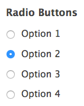
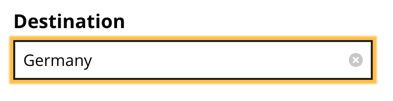
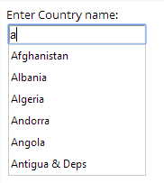
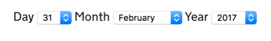
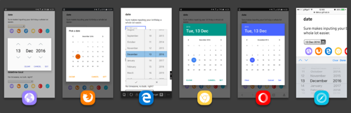
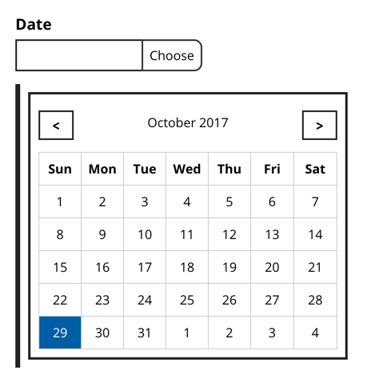
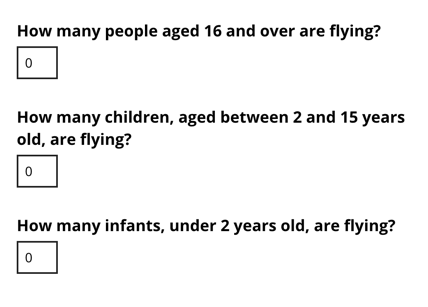
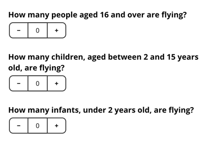
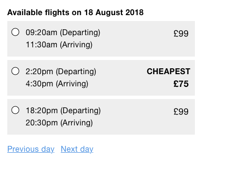

# Book a Flight

In this chapter, we'll design a flight booking service. At first this may seem a bit niche, especially when compared to *A Registration Form* and *A Checkout Flow*. However, we're going to explore several complex problems that in the end, will result in reusable patterns. Patterns that are very much transferable to other problem domains such as booking a cinema ticket or even a hotel room.

Booking a flight consists of many discrete steps. The first few steps simply collect user's preferences: where to fly, when to fly and who's flying. Once we have that we can give users a choice of available flights followed by choosing where to sit. Finally, users will have to make payment, but we covered payment patterns in the previous chapter.

## 1. Where to fly

First, users have to choose an origin and destination. That is, places to fly from and to. Without this information, the service can't offer any flights. What's the best way of asking users for this information?

As designers, we should try and use the features that are native to the browser. That's because, generally speaking, they are familiar (due to convention) and fully accessible out of the box. They also require far less work to implement.

You'd be forgiven for thinking you were spoiled for choice when it comes to form controls: select boxes, radio buttons, text boxes and more recently, datalists. The choice is yours, except it isn't. Not all of these options are suitable. Let's look at some of the pros and cons for each.

### Select Box

Select boxes, also known as drop-down menus, hide options behind a menu. Clicking the select box reveals the options. Once one is selected, the menu collapses back to its original state. Select boxes are often used because of their space-saving qualities. What's most interesting though, is why we need to save space in the first place.


Often an interface is crammed with features, usually to please stakeholders, not users. It's understandable then that learning ways to hide discrete pieces of an interface has become part of a designer's skillset. But design is about so much more than saving space. After all, if an interface really is crammed, then our first job as designers is to declutter it.

In her talk “Burn Your Select Tags”[^burn], Alice Bartlett shares the user research she undertook at the UK Government Digital Service. In short, select boxes are hard to use. Besides hiding options behind an unnecessary extra click, users generally don't understand how they work. Some users try to type into them, some confuse focused options with selected ones. And, if that weren't enough, users can't pinch-zoom the options on certain devices.

Usability expert, Luke Wobrelksi even wrote an article titled “Dropdowns Should be the UI of Last Resort”[^1]. In it, he suggests some better alternatives, some of which we'll discuss later in this chapter.

### Radio Buttons

Radio buttons, unlike select boxes, are generally well-understood and easy to use, not least because they don't hide options. They are exposed making them easy to compare, scan and select. They're also malleable. That is, they let us use whatever content, in whatever format, we want, inside the related label (more on that shortly).



The problem with radio buttons is that they're less suitable when there are many of them. As an airline could fly to hundreds of destinations, making the page long and unwieldy. This in turn, means users have to scroll (and keyboard users to tab) a lot more.

Don't get me wrong, users are more than happy to scroll[^], and we shouldn't use this as a crutch for changing course. But if we can naturally eliminate the need to scroll without introducing new problems we should.

### Search Input

A search box (`<input type="search">`) is a similar to a regular text box (`<input type="text">`). A search box, however, lets users clear the field by tapping *X* or pressing <kbd>Escape</kbd> when focused. With a text box you have to select the text and press <kbd>Delete</kbd> which takes a little longer.



Using a search box is useful when searching a large amount of dynamic data, such as searching Amazon's[^2] product catalog. Airlines, however, fly to a finite set of destinations known in advance of the user searching. Letting users search unassisted like this could easily end up with a ‘no results’ page due to typos or a data mismatch.

### Autocomplete

Users need a control that lets them filter a long list of destinations—one that combines the flexibility of a text input with the assurance of a select box. This type of control has many names: *type ahead*, *predictive search*, *combo box*, but we'll refer to it as *autocomplete*.

Autocomplete works by suggesting options (destinations in this case) as the user types. As suggestions appear, users can select one quickly, automatically completing the field — hence the name. This saves users having to scroll (unless, of course, they want to) while being able to forgive small typos at the same time. 

HTML5's `datalist` element combines with a text box to create this exact behaviour. Unfortunately, it's particularly buggy[^3]. If your project is locked down to a browser that doesn't contain bugs, then you could use it. But we want to design an inclusive experience - one that works for as many people as possible, no matter their browser or device choices.



Instead, we'll build a custom autocomplete component from scratch. A word of warning though: we're going to break new ground; designing a robust and fully inclusive autocomplete control is challenging work.

#### Building An Accessible Autocomplete

Accessibility expert Steve Faulkner has what he calls a *punch list*[^4] which is a list of rules anyone should follow to make sure that any custom Javascript component is designed and built to a good standard. The rules state that a component should:

1. work without Javascript
2. be focusable with the keyboard
3. be operable with the keyboard
4. work with assistive devices

To satisfy the first rule we need to choose a native form control to fall back to. There are too many options to use radio buttons, and a search box requires a round-trip to the server and may lead to no results. That leaves us with a select box.

```HTML
<div class="field">
  <label for="destination">
    <span class="field-label">Destination</span>
  </label>
  <select name="destination" id="destination">
    <option value="">Select</option>
    <option value="france">France</option>
    <option value="germany">Germany</option>
    <option value="spain">Spain</option>
  </select>
</div>
```

We'll cover off the other rules as we go.

#### Hiding The Select Box

First, we need to hide the select box like this:

```HTML
<select aria-hidden="true" tabindex="-1" class="visually-hidden">
```

If the select box was completely unnecessary, we could have just removed it from the Document using Javascript. But if we did it this way (or by using `display: none`) it wouldn't be sent to the server.

Instead, we've used the `visually-hidden` class and `aria-hidden="true"` attribute as first set out in chapter 2, “A Checkout Flow”. This hides the select box both visually and aurally (by screen readers). However, this alone isn't enough. We still need to stop keyboard users being able to focus it by way of the <kbd>Tab</kbd> key which is acheived by the `tabindex="-1"` attribute.

#### Enhancing The Interface

Then we need to inject the text box that users will interact with. To make sure the label still works, we transfer the `id` to the text box.

```HTML
<input
  type="text"
  id="destination"
  autocomplete="off"
  role="combobox"
  aria-autocomplete="list"
  aria-expanded="true"
  class="autocomplete-textBox"
>
```

Notes:

- The `name` attribute is not included, because the `select`s value is sent to the server.
- The `role="combobox"` attribute ensures this from control is announced as a combo box instead of a text box. A combo box, according to MDN, is “an edit control with an associated list box that provides a set of predefined choices.”
- The `aria-autocomplete="list"` attribute tells users that a list of options will appear.
- The `aria-expanded` attribute tells users whether the menu is showing or not by toggling it's value between `true` and `false`.
- The `autocomplete="off"` attribute stops browsers making their own suggestions which would interfere with those offered by the component.

Next, we inject a `<ul>` after the text box which will store the suggestions.

```HTML
<ul
  role="listbox"
  class="autocomplete-options autocomplete-options-isHidden"
  >
  <li role="option" tabindex="-1" aria-selected="false" data-option-value="1" id="autocomplete_1">
    France
  </li>
  <li role="option" tabindex="-1" aria-selected="true" data-option-value="2" id="autocomplete_2">
    Germany
  </li>
</ul>
```

Notes:

- The `role="list"` attribute tells users there is a list of choices from which the user can select. Each `<li>` has `role="option"` to denote it as a choice within the list.
- The `aria-selected="true"` attribute tells users whether the option is selected or not by toggling the value between `true` and `false`.
- The `tabindex="-1"` attribute allows us to set focus to the options programatically. More on this shortly.
- The `data-option-value` attribute is to store the corresponding `select` option value. When the user selects an option, we populate the hidden `select` box accordingly so that the real value will be persisted on submission.

Suggestions appear in the menu giving sighted users feedback. To give screen reader users an equivalent experience we need to use a live region (as first set out in chapter 2, “A Checkout Flow”. By injecting “13 results are available” into the `div`, we satisfy principle 1, *Provide a comparable experience*.

```HTML
<div role="status" aria-live="polite">13 results are available</div>
```

#### Text Box Interactions

Next we need to enrich the text box with some Javascript events. Here's the event handler that runs when the user types:

```JS
Autocomplete.prototype.onTextBoxKeyUp = function(e) {
  switch (e.keyCode) {
    case this.keys.esc:
    case this.keys.up:
    case this.keys.left:
    case this.keys.right:
    case this.keys.space:
    case this.keys.enter:
      // ignore these keys otherwise
      // the menu will show briefly
      break;
    case this.keys.down:
      this.onTextBoxDownPressed(e);
      break;
    default:
      this.onTextBoxType(e);
  }
};
```

Note that we're filtering out <kbd>Escape</kbd>, <kbd>Up</kbd>, <kbd>Left</kbd>, <kbd>Right</kbd>, <kbd>Space</kbd> and <kbd>Enter</kbd> keys. This is because if we didn't, the default case would run and would incorrectly show the menu. Instead of filtering out these keys, we could check for the keys we're interested in. But, this would mean specifying a huge range of keys which would increase the chance of one being missed - this would then break the experience.

We only want to do handle the cases when the user presses <kbd>Down</kbd> or a character to match on (which are the last two cases in the above function). When the user presses a character, matching options are shown in the menu and the live region is updated.

```JS
Autocomplete.prototype.onTextBoxType = function(e) {
  // only show options if user typed something
  if(this.textBox.val().trim().length > 0) {
    // get options based on value
    var options = this.getOptions(this.textBox.val().trim().toLowerCase());

    // build the menu based on the options
    this.buildMenu(options);

    // show the menu
    this.showMenu();

    // update the live region
    this.updateStatus(options.length);
  }

  // update the select box value which
  // the server uses to process the data
  this.updateSelectBox();
};
```

When the user presses <kbd>Down</kbd> there are two scenarios to handle:

1. If the text box value is empty or exactly matches an option then all the available options are shown
2. Otherwise, the matching options are shown (if any)

In either case, the first option is focused and highlighted which we'll walk through next.

```JS
Autocomplete.prototype.onTextBoxDownPressed = function(e) {
  var option;
  var options;
  var value = this.textBox.val().trim();
  // Empty value or exactly matches an option 
  // then show all the options
  if(value.length === 0 || this.isExactMatch(value)) {
    options = this.getAllOptions();
    this.buildMenu(options);
    this.showMenu();
    option = this.getFirstOption();
    this.highlightOption(option);
  } else {
    options = this.getOptions(value);
    if(options.length > 0) {
      this.buildMenu(options);
      this.showMenu();
      option = this.getFirstOption();
      this.highlightOption(option);
    }
  }
};
```

The `highlightOption` method is shown below with comments inline.

```JS
Autocomplete.prototype.highlightOption = function(option) {
  // remove currently selected option if there is one as 
  // only one option should be selected and highlighted.
  if(this.activeOptionId) {
    var activeOption = this.getOptionById(this.activeOptionId);
    activeOption.attr('aria-selected', 'false');
  }

  // set new option to selected
  option.attr('aria-selected', 'true');

  // Ensure option is visible within the menu
  if(!this.isElementVisible(option.parent(), option)) {
    option.parent().scrollTop(option.parent().scrollTop() + option.position().top);
  }

  // store new active option for next time
  this.activeOptionId = option[0].id;

  // focus the option
  option.focus();
};

```

#### Menu Interactions

Now we need to talk about how users interact with the menu. Mouse (and touch) users can scroll the menu and click an option. First, we listen to the menu's click event using event delegation[^]. This way, instead of adding a listener onto each option, we just add one listener onto the container.

```JS
Autocomplete.prototype.addSuggestionEvents = function() {
  this.optionsUl.on('click', '.autocomplete-option', $.proxy(this, 'onSuggestionClick'));
};
```

The `onSuggestionClick` handler (shown below), retrieves the clicked suggestion and hands it off to the `selectSuggestion` method:

```JS
Autocomplete.prototype.onSuggestionClick = function(e) {
  var suggestion = $(e.currentTarget);
  this.selectSuggestion(suggestion);
};
```

The `selectionSuggestion` method (shown below), first takes the suggestion's value and uses it to populate the text box and select box (via the `setValue` method). Additionally, the menu is hidden and the text box is focused.

```JS
Autocomplete.prototype.selectSuggestion = function(suggestion) {
  var value = suggestion.attr('data-option-value');
  this.setValue(value);
  this.hideMenu();
  this.focusTextBox();
};
```

We perform the exact same routine when the user presses <kbd>Space</kbd> or <kbd>Enter</kbd> on the keyboard.

The other actions can be summed up briefly. When the user presses:

- <kbd>Up</kbd>, the previous option is focused. If it's the first option, focus is set to the text box.
- <kbd>Down</kbd>, the next option is focused.
- <kbd>Tab</kbd>, the menu is hidden.
- <kbd>Escape</kbd>, the menu is hidden and focus is set to the text box.
- a character, then focus is set to the text box so users can continue typing.

## 2. Choosing When To Fly

Dates are notoriously hard[^5]: different time zones, formats, delimiters, days in the month, length of a year, daylight savings and on and on. It's hard work designing all of this complexity out of an interface.

Often three select boxes are used: one for day, month and year. Admittedly, we've just discussed the cons of select boxes, but it must be said that one of their redeeming qualities is that they stop users entering wrong information. But in the case of dates, even *this* quality doesn't hold up. For example, you can select an invalid date such as *31 February 2017*.



Select boxes are also used to avoid locale and formatting differences. Some dates start with month, others with day. Some delimit dates with slashes, others with dashes or dots. We can't reliably determine the user's intention based on what they enter. It's just one of those things.


### Types Of Date

Many of us assume that using a calendar widget is always better than letting users type freely into a text box unassisted. But this is not always the case. As the UK Goverment Digital Service (GDS) Service Manual states:

> “The way you should ask for dates depends on the types of date you’re asking for.”

Let's step through some of the main types of dates and see how we can handle them. Then we can see if any match up to the case of choosing a date to fly on.

#### Dates From Documents

> “If you ask for a date exactly as it’s shown on a passport, credit card or similar item, make the fields match the format of the original. This will make it easier for users to copy it across accurately.*

The expiry date from “A Checkout Flow” falls perfectly under this category. As the expiry date is just 4 characters with an optional slash, we gave users a single text box that matches the expected format. Essentially, users just copy with they see. Easy.

#### Memorable Dates

A memorable date is one that you remember easily such as your date of birth. Typing 6 digits unassisted into a text box is much quicker than scrolling, swiping and clicking through multiple years and months within a calendar.

In this case, you should use three text boxes: one for day, month and year. Why three? Because it solves the locale and formating issues mentioned earlier.


```HTML
<div class="field">
  <fieldset>
    <legend>
      <span class="field-legend">Date of birth</span>
      <span class="field-hint">DD MM YYYY</span>
    </legend>
    <div class="field-dayWrapper">
      <label for="day">Day</label>
      <input class="field-dayBox" type="text" pattern="[0-9]*" name="day" id="day">
    </div>
    <div class="field-monthWrapper">
      <label for="month">Month</label>
      <input class="field-monthBox" type="text" pattern="[0-9]*" name="month" id="month">
    </div>
    <div class="field-yearWrapper">
      <label for="year">Year</label>
      <input class="field-yearBox" type="text" pattern="[0-9]*" name="year" id="year">
    </div>
  </fieldset>
</div>
```

The three fields are wrapped in a `fieldset`. The `legend` (“Date of birth”) gives each text box context and would be read out as “Date of birth, day” (or similar) as the user steps through each field.

*(Note: the pattern attribute is used to trigger the numeric keyboard - a little enhancement for iOS users. If you're wondering why the number input isn't used here, we discussed the issues in “A Checkout Flow”.)*

#### Calendar Widgets

When choosing a date to fly, users are neither entering a memorable date, nor one found in a document. They are searching for a date in the future.

We tend to think of time in structured chunks: days, weeks and months etc. And we organise our lives using a calendar which aligns with that notion. It's sensible then, to let users find and pick a date through a familiar and intuitive calendar interface.

The primary user need at this stage of the journey is to select a date — nothing more. So trying to squeeze extra information into it, such as price or availability, is going to result in a busy and overwhelming experience that slows users down.

It's also not practical from a design perspective. Responsive design is about designing interfaces that work well in large and small screens. There's simply not enough room to add more information into each cell of a date picker.

Instead, we'll let users focus on choosing a date unencumbered and later we'll give users more information when it's both useful and practical to do so.

### The Date Input

As usual, our first port of call is to look at what browsers give us for free: HTML5 introduced the date input (`<input type="date">`) which offers a special interface for picking dates while enforcing a standard format value that's sent to the server. Mobile browser support is really good too.



Desktop browser support is patchy. Chrome and Edge have support but Firefox, for example, doesn't have any support (at time of writing).

#### Things Look Different

Don't be too concerned about the difference in appearance. Most users aren't aware and the rest don't care. Remember, most people use the same browser every day. That is, they only see their platform's implementation. Unlike us, they're not agonising over subtle differences during testing.

> Nobody cares about your website as much as you do

If you're not able to conduct your own user research, watch “Progressive Enhancement 2.0”, at 29 minutes in[^8]. Nicholas Zakas shows the audience a photo. He moves to the next slide which contains the same photo. He then asks the audience if they noticed any differences. Even though the second photo had a border and drop shadow, not one person noticed. Remember the audience was full of designers and developers — people who are trained to notice these things. They didn't notice, because like any user, they were focused on the content.

And if that's not enough proof, visit “Do Websites Need To Look Exactly The Same In Every Browser”[^].

### A Date Picker

Mobile (and some desktop) users are fine - they get the native date input. But what about people using an unsupported browser? Unless we do something, picking a date is going to be harder than it ought to be. Really, we should give users a better experience by providing our own date picker.

But we only want to give unsupported browsers the date picker, otherwise users will get two date pickers - the native one and ours. You can check for support like this:

```JS
function supportsDateInput() {
  var el = document.createElement('input');
  try {
    el.type = "date";
  } catch(e) {}
  return el.type == "date";
}
```

The function first tries to create a date input. Then it checks to see if the browser reports the `type` as `date`. If there is no support, browsers will show a text box and report the `type` as `text`.

We can use the function like this:

```JS
if(!supportsDateInput()) {
  // define date picker component
}
```

#### The Enhanced Interface

The enhanced interface takes the text box and injects a button beside it. Clicking the button reveals the calendar.



Many date pickers are designed as overlays, but they obscure the rest of the page and are prone to disappearing off screen. Instead the calendar is positioned underneath and inline which doesn't have these issues.

There is an inset left border which visually connects the calendar to the field above. And the interactive elements within the calendar have large tap targets which are easy to tap (or click) with a finger (or mouse).

#### Revealing The Calendar

As noted earlier, clicking the toggle button, reveals the calendar.

```HTML
<div class="field ">
  <label for="when">
    <span class="field-label">Date</span>
  </label>
  <div class="datepicker">
    <input type="text" id="when" name="when">
    <button type="button" aria-expanded="true" aria-haspopup="true">Choose</button>
    <div class="datepicker-wrapper" hidden>
      Calendar widget here
    </div>
  </div>
```

Notes:

- The `type="button"` attribute stops the button from submitting the form. If it was left undefined or set to “submit” it would submit the form.
- The `aria-haspopup="true"` attribute indicates that the button reveals a calendar. It acts as a warning that, when pressed, the focus will be moved to the calendar. Note: its value is always set to `true`.
- The `aria-expanded` attribute indicates whether the calendar is currently in an open (expanded) or closed (collapsed) state by toggling between `true` and `false` values.
- The calendar is hidden using the `hidden` attribute/property as explained in chapter 1, “A Registration Form”.

#### Keyboard And Focus Behaviour

Here's the calendar's container:

```HTML
<div aria-label="date picker" role="group">
  ...
  <button aria-label="Previous month" type="button" 
    >
      <svg 
        focusable="false" 
        version="1.1" 
        xmlns="http://www.w3.org/2000/svg" xmlns:xlink="http://www.w3.org/1999/xlink" 
        viewBox="0 0 17 17" 
        width="1em" 
        height="1em">
          ...
      </svg>
    </button>
  ...
</div>
```

When the toggle button is clicked, focus is set to the previous month button — the first focusable element within the container. The container has two attributes:

1. `role="group"`
2. `aria-label="date picker"`

The `role="group"` attribute is used to group a set of interface elements. In this case, the “previous month” button, the “next month” button and the days in the month.

The `aria-label="date picker"` will inform users that they are now entering the date picker component. For example, when the previous month button is focused, “date picker, previous month, button” (or similar) will be announced.

At this point pressing <kbd>Tab</kbd> moves to the next focusable element (the next month button). And tabbing again moves focus to the currently selected date within the grid, which defaults to today's date.

```HTML
<table role="grid">
  <thead>...</thead>
  <tbody>
    <tr>
      <td role="gridcell" tabindex="-1" aria-label="1 October, 2017">
        <span aria-hidden="true">1</span>
      </td>
      <td role="gridcell" tabindex="-1" aria-label="2 October, 2017">
        <span aria-hidden="true">2</span>
      </td>
      <td role="gridcell" tabindex="-1" aria-label="3 October, 2017">
        <span aria-hidden="true">3</span>
      </td>
      <td role="gridcell" tabindex="-1" aria-label="4 October, 2017">
        <span aria-hidden="true">4</span>
      </td>
      <td role="gridcell" tabindex="-1" aria-label="5 October, 2017">
        <span aria-hidden="true">5</span>
      </td>
      <td role="gridcell" tabindex="0" aria-label="6 October, 2017">6</td>
      <td role="gridcell" tabindex="-1" aria-label="7 October, 2017">
        <span aria-hidden="true">7</span>
      </td>
    </tr>
    <tr>...</tr>
    <tr>...</tr>
    <tr>...</tr>
  </tbody>
</table>
```

Notes:

- The `role="grid"` attribute tells screen readers, such as JAWS, that this is not a regular table and that the arrow keys can be used to navigate it with Javascript.
- Each `<td>` has `tabindex="-1"` except for the selected day, which has `tabindex="0"`. This means that the user can tab straight onto the selected day and navigate from there using the arrow keys.
- When the user presses the arrow keys to select a new day, the previously selected day's `tabindex` will be set to `-1`; the newly selected day's `tabindex` will be set `0`. This is known as roving tabs, which makes sure the grid becomes just a single tab stop. Otherwise users would have to tab ~30 times to move beyond the calendar with their keyboard which is tiresome.
- Pressing <kbd>Left</kbd> moves to the previous day. Pressing <kbd>Right</kbd> moves to the next day. Pressing <kbd>Up</kbd> moves to the same day in the previous week. Pressing <kbd>Down</kbd> moves to the same day in the next week. This way, users can move freely and efficiently between days and months.
- Pressing <kbd>Enter</kbd> or <kbd>Space</kbd> will confirm selection, populate the text box with the date, move focus back to the text box and finally, close the calendar.
- Pressing <kbd>Escape</kbd> hides the calendar and moves focus to the button.

#### Screen Readers

When the toggle button is pressed, sighted users will get feedback visually as the calendar appears. Because clicking the toggle button moves focus to the calendar, we can give screen reader users feedback by using a live region which contains the title: month name and year (“October 2017”, for example). This same information will be continually announced as users move between months and the title changes out as users move between months.

```HTML
<div role="status" aria-live="polite">October 2017</div>
```

The `thead` contains the column headings which represent each day of the week. The days are abbreviated visually to save space. This is because tables aren't stylistically malleable, something that we'll discuss more in chapter 5, “An Inbox”. While abbreviations work in this context, we can give screen reader users greater clarity by putting the unabbreviated heading inside the `aria-label` attribute:

```HTML
<thead>
  <tr>
    <th aria-label="Sunday">Sun</th>
    <th aria-label="Monday">Mon</th>
    <th aria-label="Tuesday">Tue</th>
    <th aria-label="Wednesday">Wed</th>
    <th aria-label="Thursday">Thu</th>
    <th aria-label="Friday">Fri</th>
    <th aria-label="Saturday">Sat</th>
  </tr>
</thead>
```

The days need to use the same technique: while sighted users can see the day in context of the month and year, in some screen readers, only the number is announced. For example, they'll hear “17” which is ambiguous because they would have had to of remembered the previously announced month and year as they switch months.

By storing the full date inside the `aria-label` attribute, we can give screen reader users an agreeable experience — one that speaks to principle 1, *Provide a comparable experience*:

```HTML
<td role="gridcell" tabindex="-1" aria-label="7 October, 2017">
  <span aria-hidden="true">7</span>
</td>
```

*(Note: the `span` has an `aria-hidden="true"` attribute which stops the number being read out twice by some screen readers without hiding it from sighted users.)*

While screen reader users *can* operate the calendar, it's probably not that useful. Entering a date by typing directly into the text box is probably easier and quicker. But we don't make those assumptions. Instead, we adhere to principle 5, *Offer choice* by letting them do as they wish.

#### Future Support

I love how Jeremy Keith thinks about the web as a *continuum*[^10]. By that he means it's constantly changing. Technology evolves at a rapid pace and browsers and devices are released all the time. Each of which have varying features and capabilities.

At any particular moment in time we need to decide what level of support makes sense for a given feature.

Earlier, we made the decision to create an enhanced experience for (desktop) browsers that don't support the native date input by creating our own date picker. As time goes by browser support will get better and better. At the same time, the number of people who would have experienced the degraded version will diminish.

At which time, we can quietly remove the Javascript code, giving us less to maintain and users a faster experience (as they won't have to load that code). Lovely.

#### Doing Our Best

We have covered users who:

- use a browser that supports the date input
- use a browser that doesn't support the date input

But, we haven't covered users who:

- use an unsupported browser and experience a network or Javascript failure (as described in “A Registration Form”).

> People ignore design that ignores people. - Frank Chimero

In this case users will see a text box asking for a date. It's not what they see that matters here, it's what they don't see. And they don't see a hint explaining the expected format. We can't use the hint pattern (first discussed in “A Registration Form”) because browsers that support the date input may use a different format which would cause confusion.


We can be as forgiving as possible, by letting users type slashes, periods or spaces: whichever they prefer. But typing a two-digit year first, for example, will cause an error. In this case, a well-written error message message might have to suffice.

We could add a hint via the placeholder attribute and then remove it with JavaScript when our own date picker will be injected. Despite the problems with placeholders (discussed in “A Registration Form”) this might be the lesser of two evils.

Design is often a question of priorities. What is a good experience for most may create a less-than-ideal for some, which is especially the case on the web. Inclusive design is about making decisions that are unlikely to exclude people.

In this edge case, users are still able to enter a date which makes this pattern an accessible one. In the end, it's about doing our best and we've done that here.

## 3. Choosing passengers

Airlines typically ask how many people are travelling. They also want to know what age the travellers are because this affects the price of the ticket. Here's how it might look:



```HTML
<div class="field">
  <label for="adults">
    <span class="field-label">How many adults, 16 years and over, are flying?</span>
  </label>
  <input type="number" id="adults" name="adults" min="0" max="9">
</div>
<div class="field">
  <label for="children">
    <span class="field-label">How many children, aged between 2 and 15 years old, are flying?</span>
  </label>
  <input type="number" id="children" name="children" min="0" max="9">
</div>
<div class="field">
  <label for="infants">
    <span class="field-label">How many infants, under 2 years old, are flying?</span>
  </label>
  <input type="number" id="infants" name="infants" min="0" max="9">
</div>
```

Each category is represented by a separate field. As we're asking users for an *amount* of something - in this case passengers - the number input makes sense. (Note: we discussed when to use the number input in “A Checkout Flow”.)

Number inputs have little spinner buttons. Spinners, also known as steppers, let users increase or decrease the input's value by a constant amount. They are great for making small adjustments. As Luke Wobrelkski says:

> When testing mobile flight booking forms, we found people preferred steppers for selecting the number of passengers. No dropdown menu required, especially since there's a maximum of 8 travelers allowed and the vast majority select 1-2 travelers.

The downside is the the default spinners are really small, which make them especially difficult to use on a touch screen display or for people have motor impairements. On many mobile devices, they don't show up at all.

### Custom Stepper Buttons

We can create bigger buttons with Javascript. Not only are they easier to use on desktop, but they will save mobile users having to trigger the on-screen keyboard.

The first thing we need to do is turn off the ones provided by the browser. In webkit browsers you can do this:

```CSS
input::-webkit-outer-spin-button,
input::-webkit-inner-spin-button {
  -webkit-appearance: none;
  appearance: none;
  margin: 0;
}
```

#### The Enhanced Interface



Each field is enhanced with this HTML:

```HTML
<div class="field">
  <label for="adults" id="adults-label">How many people aged 16 and over are flying?</label>
  <div class="stepper">
    <button type="button" aria-label="Decrement" aria-describedby="adults-label">&minus;</button>
    <input type="number" id="adults" name="adults" value="1">
    <button type="button" aria-label="Increment" aria-describedby="adults-label">&plus;</button>
    <div class="visually-hidden" role="status" aria-live="polite">1</div>
  </div>
</div>
```

Notes:

- The label is given an `id` attribute which the buttons will use as a description thanks to the `aria-describedby` attribute.
- The buttons and number input is wrapped in a `div` so that they can be styled as a group underneath the label.
- The button's `aria-label` attribute will ensure that screen readers read out “Decrement” instead of “minus symbol” (or similar).
- The button's `aria-describedby` attribute references the aformentioned label's `id` which means it combines with the label text to give screen reader users extra context. As there are three fields on the page, this stops users thinking “Decrement - decrement what exactly?”.
- Each button has a `type="button"` attribute which means it won't submit the form when clicked[^?].
- Clicking increment or decrement updates the status box at the bottom so that screen reader users will hear the change without having to move away from the button (see note below).

*(Note: when the increment (or decrement) button is clicked, the input's value is updated. Unfortunately, screen readers won't announce the change. At first, I put the live region attributes on the input. This didn't work in some screen readers, but worse, was that it changed the input's semantics into a status box.)*

#### A Note On Iconography

There are pros and cons with using iconography over text. The problem with icons is that they aren't always understood. As Thomas Byttebier says in “The Best Icon is a Text Label”[^12]:

> What good has a beautiful interface if it’s unclear? Hence it’s simple: only use an icon if its message is a 100% clear to everyone. Never give in.

However, Thomas also points out that good icons can be internationally recognised breaking language barriers -  which is why airports use them, for example. They also save space which is particularly useful on mobile where there's less space.

In the case of the stepper component, plus and minus icons also help to keep the interface equally weighted. That is, the buttons are the same size and have equal importance.

## 4. Choosing A flight

Now all the relevant information has been collected, we can give users a list of flights from which the user can choose one.



The system shows flights that match the date the user specified earlier. Additionally, the interface lets users move back and forth between days. The group's label is set as normal via the `<legend>` and is set to “Available flights on 18 August 2018.”

The flights are represented as radio buttons as the user can select just one. Each label contains the departure time, arrival time and ticket price: all useful information. One advantage of using this pattern is that you can add whatever details you need inside the label and style it in a hierarchical fashion.

```HTML
<div class="field-radioButton">
  <label for="flight1">
    <input type="radio" name="flight" value="" id="flight1" >
    <span>Departing at 18:20pm</span>
    <span>Arriving at 20:30pm</span>
    <span>£99</span>
  </label>
</div>
```

### Handling Errors

In chapter 1, we looked at how to design an inclusive form validation experience. However, the registration form in the chapter only consisted of two simple text fields. If you can recall, I said we'd look at how to handle errors for a field that consists of multiple inputs such as radio buttons.

As the fieldset's `legend` describes the group, the error message should be injected there. This way, screen readers will announce the error along with the group's label:

```HTML
<fieldset aria-invalid="true">
  <legend>
    <span class="field-legend">
      Available flights on 18 August 2018
    </span>
    <span class="field-error">
      <svg width="1.5em" height="1.5em"><use xmlns:xlink="http://www.w3.org/1999/xlink" xlink:href="#warning-icon"></use></svg>
      Choose a flight.
    </span>
  </legend>
  <!-- Radio buttons go here -->
</fieldset>
```

Notes:

- The `aria-invalid="true"` is placed on the `fieldset`. Putting it directly on the radio button would be incorrect here, because it's not the individual input that's invalid — it's the group.
- The error span itself is exactly the same one used for single input fields. So errors look and behave consistently across all types of form fields.


## 5. Choosing A Seat

Finally, users need to choose a seat. While this step is not especially complicated, the combination of affordance, layout and interaction can make or break this part of the journey.

### Layout

Up to now, radio buttons have been stacked beneath one an other, which is enough for most situations. For seat selection, this makes the page especially long, and more importantly, harder to scan as there is a lack of structure.


We can provide that structure by laying out seats in rows, just like they are on a plane. This will help users map their location. Users might be looking for aisle or window seats, for example.


To denote window seats and isle seats for screen reader users we can put hidden text inside the seat's label.

```HTML
<label for="S1A">
  <input type="checkbox" name="seat" value="1A" id="S1A">
  <span class="plane-seatNumber">1A <span class="vh">Window</span></span>
</label>
```

### Nested Fieldsets

The radio buttons are housed inside an extra fieldset (and legend) to incidate which class the seat belongs to: first class or economy. Visually this is fine, but screen readers don't always behave as expected. Sometimes, they announce both `legends` when the first radio button is focused. Sometimes they don't announce the outer `legend` at all. You can read Leonie Watson's article, “Using the fieldset and legend elements”[^] for more information.

Where possible, you should avoid nested fieldsets, not only for screen reader users, but because their use often signifies extra complexity that can be designed out of a system. For example, we're showing both first class and economy class seats because users' never specified which class they wanted.

Instead, we could ask users to specify their preference beforehand. At the same time, we can mark *economy* as checked by default. Marking the most common choice expedites the process.


### Checkboxes Are Never Round

In Checkboxes Are Never Round[^13], Daniel De Laney says:

> interactive things have perceived affordances; the way they look tells us what they do and how to use them. That’s why checkboxes are square and radio buttons are round. Their appearance isn’t just for show - it signals what to expect from them. Making a checkbox round is like labeling the Push side of a door Pull.

In practical terms, a radio button tells you that just one can be selected. Checkboxes tell you that more than one can be. So if one person is travelling use radio buttons, otherwise use checkboxes.

### Oops, We Broke The Rules

Traditional advice says you should only use radio buttons if there are less than 7 choices, otherwise use a select box. Rules are good: they allow us to think less and avoid the same mistakes others have made in the past. 

But there are always exceptions to rules. I prefer guidance to rules. Unlike rules, guidance offers up everything it knows, and gives you the power to break the rules when appropriate.

A Boeing 747 commerical plane has over 400 seats so we've shattered the 7 choice rule. Call me a rebel, but I'm struggling to see a better way of presenting seats. Choosing a seat is quite a unique interaction and benefits from this layout.

And using the One Thing Per Page pattern gives us maximal screen space to design something better. The screen, while long, is far less overwhelming as it'd dedicated to just one thing: choosing a seat.

### Unavailable Seats

Unavailable seats are denoted by marking the checkbox (or radio button) as disabled. They are grayed out so that sighted users know they aren't selectable. Similarly screen readers won't announced them, and keyboard users can't focus to them. This is where disabling elements works nicely.

```HTML
<input type="checkbox" name="seat" value="1A" disabled>
```

### Layout Enhancements

Laying out seats in rows can cause seats to wrap in small viewports. Alternatively, seats can be styled not to wrap, but this causes a horizontal scroll bar. Neither of these problems are deal breakers, but if we can reduce the chance of this happening we should.

One approach would be to hide the checkboxes and make the remaining label look clickable. Hiding checkboxes with CSS alone is dangerous because pressing <kbd>Tab</kbd> moves focus to the checkbox, not the label. On its own this breaks the interface for keyboard users because as the user focuses each checkbox there is no visual feedback.

To fix this problem, we can give the (still) visible `<span class="plane-seatNumber">` the appearance of focus using the adjacent sibling selector:

```JS
.enhanced [type="checkbox"]:focus + .plane-seatNumber {
  border: 3px solid #ffbf47;
}
```

Note that `.enhanced` is at the start of the selector. This is because these styles should only be applied when Javascript is available. This is done by adding a class of `enhanced` to the document element in the `<head>` of the document like this:

```JS
document.documentElement.className = 'enhanced';
```

### Limiting Selection

If the user specified 2 travellers, then users shouldn't be able to select more than 2 seats. Checkboxes don't limit users in any way. that is, if they select more than their quota, they'll get an error message. Without user research, it's hard to know whether this is a problem. If it is, we can enhance the experience with Javascript. 

One way to do this is to disable the remaining seats as soon as the limit is reached. But this assumes users will pick the right seat the first time. If they try to click another seat, as the other seats are disabled, the interface won't respond.

Savvy users may realise they have to deselect the currently-selected seat first, but they shouldn't have to. And what about less savvy users? We should do the hard work ourselves, to make it simple for them. To do that, if they surpass their quota, the currently-selected seat should be unchecked automatically.

```JS
function SeatLimiter(max) {
  this.max = max;
  this.checkboxes = $('.plane-seat input');
  this.checkboxes.on('click', $.proxy(this, 'onCheckboxClick'));
}

SeatLimiter.prototype.onCheckboxClick = function(e) {
  var checkbox = e.target;
  var selected = this.checkboxes.filter(':checked');
  if(checkbox.checked && selected.length > this.max) {
    selected.not(checkbox)[0].checked = false;
  }
};
```

When a checkbox is clicked, the `onCheckboxClick` method is called. The first thing it does is check to see if the the checkbox has been checked or not. If it has, then it checks to see if the quota has been surpassed. If both conditions are met, then the previously selected checkbox is unchecked.

## Summary

In this chapter, we continued to use One Thing Per Page which allowed us to make use of the total screen estate. We looked at ways of reducing friction, not only through interface design, but also by looking at the journey as a whole.

As much as we tried to use native form controls, in their standard format, it became apparant that custom components were necessary to give users the best user experience. In the end we designed four custom components:

- An autocomplete control which lets users search through a long list of destinations quickly and accurately.
- A date picker components which lets users find a date in the future without having to worry about formatting issues.
- A stepper component which lets users make small adjustments to an amount of passengers effortlessly.
- A seat chooser which makes seat selection simple, even on small viewports.

### Things to avoid

- Using radio buttons that look like checkboxes (or vice versa).
- Using select boxes when better alternatives exist.
- Letting users do the hard work when the interface can be designed to it for them.
- Nested fieldsets.

## Demos

- Select box
- Datalist
- Autocomplete
- Memorable date
- Date picker
- Stepper
- Seat chooser nested
- Seat chooser

## Footnotes

[^1]: http://www.lukew.com/ff/entry.asp?1950
[^2]: https://www.amazon.co.uk
[^3]: http://caniuse.com/#feat=datalist
[^4]: https://www.paciellogroup.com/blog/2014/09/web-components-punch-list/
[^5]: http://infiniteundo.com/post/25326999628/falsehoods-programmers-believe-about-time
[^6]: https://www.gov.uk/service-manual/design/dates
[^7]: http://html5doctor.com/html5-forms-input-types/#input-number
[^8]: https://youtu.be/hdTxeR90_1E?t=29m27s
[^9]: http://dowebsitesneedtolookexactlythesameineverybrowser.com/
[^10]: https://adactio.com/journal/6692
[^11]: https://developers.google.com/speed/docs/insights/SizeTapTargetsAppropriately
[^12]: https://thomasbyttebier.be/blog/the-best-icon-is-a-text-label
[^13]: http://danieldelaney.net/checkboxes/?utm_source=designernews
[^burn]: https://www.youtube.com/watch?v=CUkMCQR4TpY