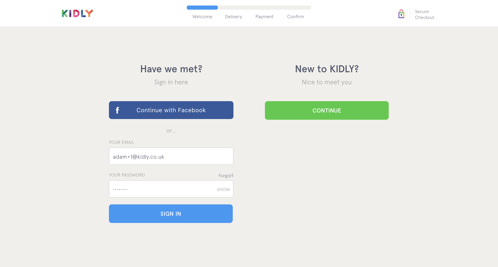
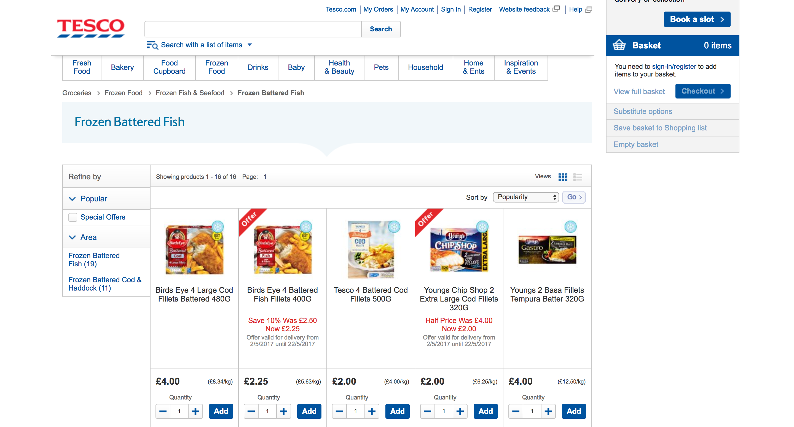
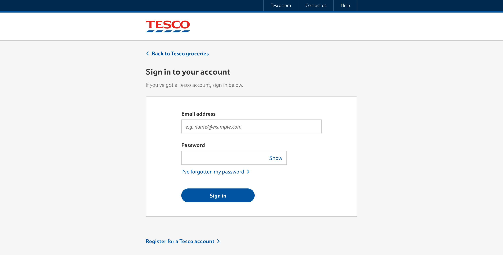
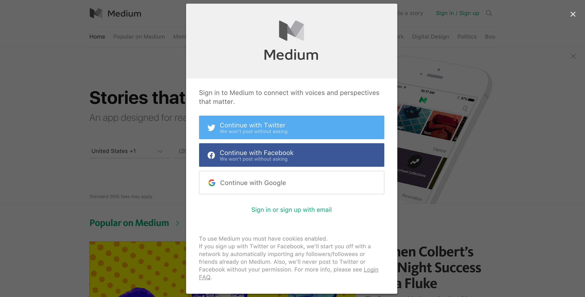
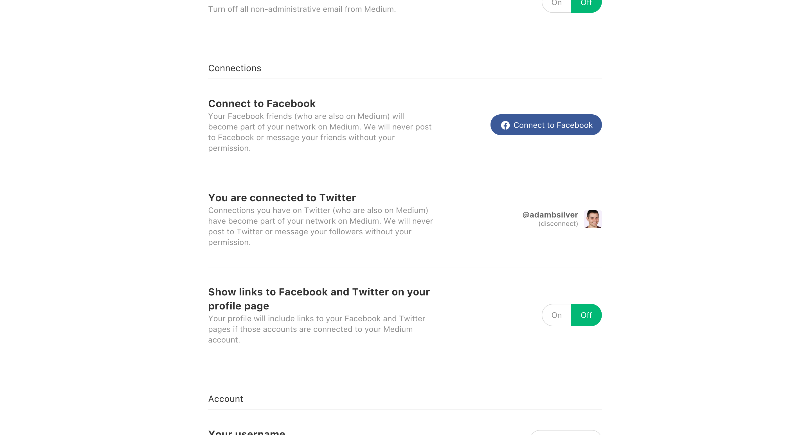

# A Login Form

> ‘As a user I want to login so that’&mdash;Nobody ever

In the previous chapter, we navigated our way through the treacherous world of custom form components. I don't know about you, but I could do with an intermission. I can't think of a better way to do that, than with the inocuous and ubiquitous login form.

Most sites have login forms but almost as many of them have UX failures. Social login hasn't helped matters either. And even without the need for custom form components there's plenty of issues to analyse and solve accordingly.

How it looks:


HTML:

```html
<form novalidate>
  <div class="field">
  	<label for="email">
  		<span class="field-label">Email address</span>
  	</label>
  	<input type="email" id="email" name="email">
  </div>
  <div class="field">
  	<label for="password">
  		<span class="field-label">Password</span>
  		<span class="field-hint">Must contains 8+ characters with at least 1 number and 1 uppercase letter.</span>
  	</label>
  	<input type="password" id="password" name="password">
  </div>
  <input type="submit" value="Sign in">
</form>
```

The sign in form is the counterpart to the registration form we designed in chapter 1. It's remarkably similar and contains the same fields. We even have the exact same hint. In fact, the main difference is the submit button's text.

All too often, login forms omit hint text. That is, they don't tell users what password rules they need to abide by. Shamefully, I use the same password for most sites, and I'll modify it where I must to adhere to the rules of the site in question.

For example, imagine my password is *password*. On a site that requires a capital letter, I'll capitalise the first letter: *Password*. And if the site forces me to include a number, then it will be *password1*.

The point is, if there is a hint to inform me of the rules, then I won't have to submit the form just to find out through an error message. Doing so is both slower and unnecessary.

Often we omit hints like these due to ‘security reasons’. But if a hacker wants to find out the rules, then all they need to do is register themselves.

The short of it is, include a useful hint, even on a login form. Give users a chance to avoid an error. If, like some users, they ignore the hint, our robust and fully inclusive validation pattern will come to their rescue.

## Non-standard username and password fields

Some services, like the flight booking service we designed in the previus chapter, may ask users to sign in with something other than an email and password. I've often seen them ask for a booking reference number, for example.

Similarly, banks typically ask for a pin number instead of a password. In both cases, use explicit field labels. If it's a pin number say so. And tell users what the format it is and where they might find it (it it is printed on a document).

All of this allows the user to think less, keeping their energy levels high and ready to do the thing they actually want to do. Remember they have no inclination to log in. They want the feature that lies behind it.

## The ‘username and password doesn't match’ problem

If the user enters an incorrect username or password, many sites will show an error saying *The username and password doesn't match*. Put simply, this is bad and as Jared Spool explains in Design Is Metrically Opposed[^]:

> We know which one doesn't match, we're just not going to tell you, because our security people think that if we told you that it was the password, they would know they had a legal username and they would try every possible password in history.*

Hackers don't do this and even if they did most sites let you sign up for one account. This means if they want to find out, all they have to do is sign up for an account themselves with that username.

Instead, tell users which field is problematic and allow them to fix it easily.

## Contextual login forms

Some sites have all-access areas and login-only areas. Often login form pages are designed without considering the context in which they are being used. To explain, we'll use checkout as an example. And for purposes of demonstration, we'll ignore that forcing users to login beforehand is an anti-pattern.

Take a shopping basket page. Below the basket details, there is a *checkout* button. Clicking it, takes the user to beginning of the checkout flow. However, if they are logged out, they're prompted to login. 

As discussed in chapter 2, we provide a checkout specific layout with a minimal header to streamline that process. We should ensure the login form should be given the same treatment, as the user should still feel as though they are in checkout. After all this is what they clicked.

This is what we did for Kidly:



This reinforces that the user is midway through a process and helps them focus. That's the reason for the dedicated checkout layout in the first place.

Conversely, Tesco don't do this. When the user adds a product to their basket, they are taken somewhere else, that feels more out of context which is disorientating.





## Social Login

Up until recently, most sites only offered people the standard username and password approach to login. Many sites today still do this.

However, more sites are offering users the ability to sign in with Facebook or Twitter for example. This saves users typing&mdash;if they are logged into Facebook already then there they are instantly logged into to the site.

Also, they don't have to spend time signing up and remembering yet another set of credentials. And some sites will integrate with your social media account. For example, Medium.com, a social media site for reading and writing articles, will post to Facebook automitically for example.

For those who spend a lot of time socialisiing on Facebook, they'll be pleased to automate some of these things.

However, with choice comes choice *paralysis*. If there are many ways to login then users have to spend time and energy *deciding*. There is also a question and concern over privacy.

To make the choices obvious, you can do this by clearly setting out the options. This is what we did for Kidly:


To try and mitigate concerns over privacy, it's important to tell users how their credentials will or won't be used. I think we could have done a better job on this at Kidly.

Medium.com make this clear by telling users that they *won't post without asking*.



The last problem is that some users may not remember which method they chose to sign up. At Kidly, if we detected that they had signed up with a different choice then we told them with an error message.


I think we could have done a better job with this. Again, Medium.com solves this elegantly. In fact it's so elegant that users have no idea. As a user I shouldn't have to remember which one I signed up with.

And Facebook, for example, knows what my email is. If I sign in with my email and have already signed up with Facebook, then Medium.com logs me in automatically. It's seamless. They just merge my accounts without me knowing. The only way I realise this is if I visit the settings page:



The "Connections" section shows Facebook and Twitter options. Users can connect or disconnect their social media logins easily here. But only if they're interested in doing so.

If you're going to provide social login capabilities, then first work out why. If the why is compelling, then be sure to make this seamless for users and make the choices clear.

## Forgot Password Placement

One aspect of inclusivity is honouring people's interaction preferences. Some users prefer using the keyboard. Some prefer the mouse. Some use them both interchangeably.

When using forms or more broadly websites, the *tab* allows users to move focus. By default links and form controls gain focus with the tab key. This switching between forms and links is a source of disruption. Unlike forms mode, a web page allows users to move freely between links and form controls.

This means that if you place a forgotten password link between the username and password fields, some users may tab to the link, instead of the expected password field.

Or perhaps the forgotten password link may appear straight after the password field. Both of these may make some sense from a visual design perspective. Offering a solution to a problem in context of the problem is an act of good contextual design.

However, the form is short and so we can place the forgotten password link after the form itself.


## Don't put two forms together on same page

Some sites put the registration and login forms on the same page. Putting them on the same page is problematic for many of the reasons most of which we discussed in One Thing Per Page.

As we know the registration form is similar to the login form. Putting them together makes it harder to differentiate. It's also confusing for users that have ended up on this page having clicked a specific call to action such as *login*.

Instead keep things separate and offer a small link before or after the login form allowing users to register.

## Summary

In this chapter we have covered the main problems associated with login forms. Most sites have a login form. Don't let unfounded security holes stop you designing a friction-free login experience.

If you're going to provide social login capabilites consider the tradeoffs, implement one at a time, and ensure users aren't penalised if they sign up using different mechanisms.

Finally, put login forms in context of the flow in which they have been triggered. It's intuitive and keeps users focussed on the task at hand.

## Footnotes

[^facebook]:(https://developers.facebook.com/docs/facebook-login/multiple-providers)

https://conversionxl.com/social-login/

https://blog.loginradius.com/2014/01/understanding-benefits-social-login-add-value-website/

Crappy bank login
