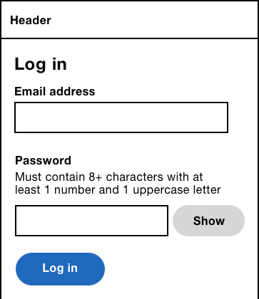
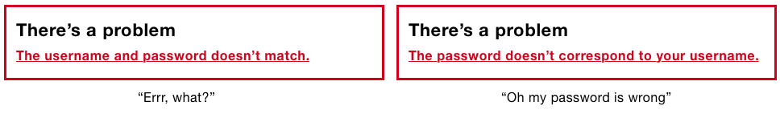
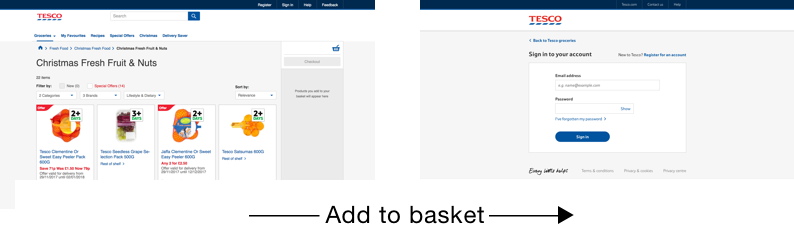
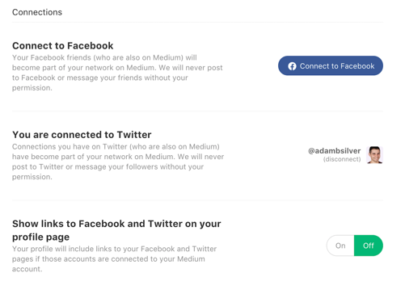
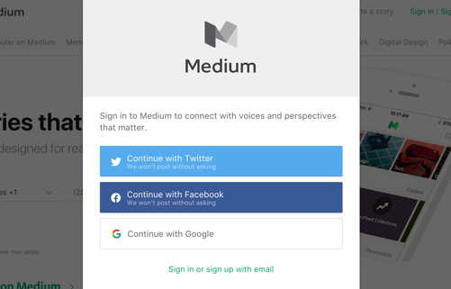
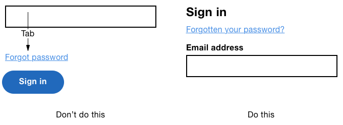
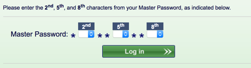

# A Login Form

> “As a user, I want to log in to [your service] so that I can [do stuff],” said nobody, ever!

Nobody *wants* to log into your site. They're forced to as a security measure. Without this, everyone has access to everyone else's stuff. Bad.

Given how prevalent login forms have been around for and how basic they are in appearance, you'd be surprised at how often they contain usability issues. And social login hasn't made things any easier.

In this chapter, we'll dissect each issue and provide ways to remedy them. By process of elimination, users should be left with a straightforward and relatively pleasant login experience.

## Microcopy

The login form is almost identical to the registration form from chapter 1. It contains the same fields, in the same order with the same microcopy. In fact, the only difference is the button's label. Instead of “Register” it's “Sign in”.



“Sign in” is arguably softer and more human than “Log in”. When you enter a spa, hotel or office building, you sign in which grants you entry. And you sign out as you leave. We should use the same and familiar language digitally that people are used to in the physical world.

Of course it depends on the type of service you're designing. Banks and investment services tend to use “Log in”. Interestingly though, the notion of “logging in” came along with computers in the 80s. And the operations that users do are logged for security reasons.

Whichever you go for, consistency is important. Make sure URLs, link text, headings and button text all match. And if users click “Log in” to log in, then they should click “Log out” to log out.

## Provide Hint Text

People often use the same password for different sites and applications. But password rules differ from site to site. Some sites ask for a capital letter, others ask for numbers and symbols.

Many users will tweak their password to match the rules of the site. For example, if their password is “password”, and the site requires a capital letter, they'll just capitalise the first letter to “Password”.

*(Note: not to encourage bad practice, passphrases - discussed in “A Registration Form” - are a better alternative to complex password rules like this.)*

That's okay for registration where users are often told what the rules are, but many sites don't provide a hint on the login form. In this case, users have to guess and hope for a useful error message. Or worse, they have to reset their password.


With hint text, users have a better chance of success without waiting for a useful error message.

## The ‘username and password don't match’ Problem

While omitting hint text increases the chance of an error, what's worse is when that error says “The username and password doesn't match” or something equally vague. Jared Spool comically explains why this is an issue in his talk “Design Is Metrically Opposed”[^1]:

> We know which one doesn't match, we're just not going to tell you, because our security people think that if we told you that it was the password, they would know they had a legal username and they would try every possible password in history.*

As Jared says, Hackers don't actually hack this way. But even if they did, all they have to do to find out if the username exists (or what the password rules were), is try and sign up for an account with that username.

The problem is that users are left to reset their password which is long-winded and can cause users to give up. As with any other form, errors should tell users exactly what went wrong so that they can fix it easily.



## Use Explicit Labels

Some sites ask for a username but expect an email address. Other sites, such as airlines or banks may ask for a booking reference number or pin number. If your service deviates from the standard login fields, you should label the fields explicitly.

If you expect an “Email address” don't use “Username”. If you accept one or the other then say so: “Username or email address”. Similarly, if you're asking for a booking reference number, say so, and tell users where they can find it.

Leaving users to guess is an unnecessary source of frustration.

## Contextual Login Forms

Often login forms are designed as an interstial page with a login-specific layout. Users perform an action which requires being logged in. The site navigates to the login page. The user is then taken back to where they were, or where they were trying to get to in the first place.

For example, in chapter 2, “A Checkout Flow”, we pared down the layout to only include information pertinent to the checkout. Specificall, giving users a header without navigation or search. When users checkout, and opt to log in first, the login form should employ the checkout-specific layout.

Conversely, when users try to add a product to their basket on the Tesco site, they are taken to a login page. However, the login form is housed in a completely different layout which is disorientating, especially for people using screen readers — they have to familiarise themselves with a completely different page structure.



## One Form Per Page

Some sites put the registration and login forms on the same page beside each other (or below one another on small screens). But, these forms are remarkably similiar; putting them together makes it hard to differentiate between them. It can also be confusing for users to see two forms when they clicked a “Sign in” link, for example.

Instead, put each form on a separate page and let users switch between them by giving them a link.


### A Note About The ARIA Tab Roles

Sometimes a two-tab interface is used so that users can easily switch between the login and register forms. Often, each tab loads a new page, which means the ARIA tab interface semantics and behaviours[^heydontabs] aren't appropriate. As the tab behaves like a regular link, it should have standard link semantics and behaviour.


## Social Login

Up until recently, most sites only offered people the standard username and password approach to login. However, more sites are offering the ability to sign in with social networks such as Facebook, Twitter and Google. This saves users having to type their credentials which they may not remember.

Some sites will integrate with your social media account. For example, Medium.com, a social networking site for reading and writing articles, will post to Facebook automatically. Those who spend a lot of time on Facebook may appreciate this functionality.

But, social login is not without its problems. First there are issues of privacy. So telling users exactly what you will and won't do with their details is essential. Medium does a good job by stating that “They won't post without asking”.


### Seamless Interchange

Some users won't remember how they originally created an account. At Kidly, we handled this by showing users an error message. For example, if users had signed up with standard login, then tried to sign up with social login, we'd show an error message saying so. But this puts the burden on the user.

Medium lets users log in interchangeably without users ever knowing what happened. For example, if I log in to Medium with my email but have already registered previously with Facebook, Medium logs me in automatically and merges my accounts without me knowing. As a user the only way I would know is if I bother to visit the settings page.



The ‘Connections’ section shows Facebook and Twitter options. Users can connect or disconnect their social media account easily, keeping users informed and in control.

### Choice Versus Choice Paralysis

Standard thinking is that choice is good. That it offers freedom, autonomy and personal responsibility. Heck, even one of *the design principles* is “Offer choice”. But *more* choice is not necessarily better when it comes to features or products.

Barry Schwartz, author of “The Paradox of Choice” has a case study where researchers set up two displays of jams at a gourmet food store. Customers could try samples, who were then given a coupon for a dollar off if they bought a jar. One display had 24 jams, the other had just 6. 30% of people exposed to the smaller selection bought a jam, but only 3% of those exposed to the larger selection did.

There's also some interesting data on companies that offer employees pension plans. One of Barry's colleagues got access to the records of Vanguard, a huge mutual-fund company, and found that for every 10 mutual funds the employer offered, the rate of participation went down 2%. Consider that employees knew that by not participating, they were passing up as much as 5000 dollars a year.

This phenomenon is actually called Hick's Law (named after psychologist William Edmund Hick), which states that the time taken to make a decision increases as the number of choices expand. It predicts that the greater the number of alternative choices, the longer it will take a user to make a decision.

Giving users multiple ways to sign in might seem useful but it can create a burden on users. Make sure the extra choice is valuable to users. Once you're sure, layout the options clearly.



## Forgotten Password Link Placement

Human beings are forgetful. Some people, myself included, use password managers[^2]. They store all your passwords in one place and all you have to do is remember a single master password.

That's great, but password managers aren't infallible. If you don't rememeber to save your credentials into it, you're in the same position as everyone else. In any case, not everyone uses one, nor should they have to.

Most sites give users a way to reset their password if they forget it. The feature itself isn't especially problematic. It's the placement of the link within a login form that can cause frustration for users.

If the link is just above the password field, when users tab from the email field, it's the link that will receive focus, not the password field. Some users will tab and start typing not realising what's happened.

What's worse is when the link is placed before the submit button. When keyboard and screen reader users tab from the password field and press <kbd>Enter</kbd>, they'll expect the form to submit. But instead, they'll be taken to reset their password. If and when they realise what's happened, they'll need to go back, re-enter their credentials and be careful to either tab twice or switch to using the mouse.



While placing the link in close proximity to the password field makes some sense visually, the primary user need is to still to sign in. Any link shouldn't disturb users from doing so. The submit button should be the last interactive element in the form, because that's what users expect. In which case, you should place the link before the form.

*Note: you could place it after the form. But this means users would have to look beyond the form to discover this feature. In the case of screen reader and keyboard users, they'd have to move past the form to discover it.)*

## Auto-tabbing

Some login forms, such as those found on bank sites, ask users for certain characters of their password. Or they may ask for certain digits of their security pin. In either case, they normally give users three text boxes, or worse, three select boxes.



The first problem with this approach is that sites will auto-tab between the fields. That is, focus is moved to the next field automatically as the user enters a pre-determined number of characters. But as the BBC's UX guidance[^3] says:

> it can be disorienting and hinder users from verifying information or correcting mistakes if the focus automatically changes when the user is not expecting it.

Leonie Watson, accessibility expert, and screen reader user backs this point up:

> I strongly dislike having auto-tab functionality imposed on me. It is unexpected, and based on a flawed assumption that it is helpful. It takes me more time and effort to correct mistakes caused by auto-tab, than it does to move focus for myself.

This point of view isn't particularly surprising given that the solution seems to be founded on assumptions that take control away from the user, while simultaneously breaking convention. It's okay to break convention, but only if there is a really good reason to do so.

Finally, splitting up a text box into three is unnecessary. Instead we should give users a clearly-labelled, text box and allow them to type the 3 characters of their password freely.


## Auto-captalisation and Autocorrect

Some browsers, for example on Android and iOS, try to help users fill out forms by autocapitalising and autocorrecting words. For example, if I type “adam” in a text box, these browsers will automatically change it “Adam” which is helpful.

However, you may not always want this functionality, which is turned on by default. And prior to iOS 5, the email input also did this which is undesirable. If I type “adam@example.com” I expect this to be left alone. Similarly, if you're asking for a username that's case sensitive, users are going to find this causes more effort as they fix mistakes they didn't even make.

Fortunately, you can turn off this behaviour like this:

```HTML
<input type="text" autocapitalize="none">
```

Similarly, iOS will autocorrect words in a text input that it thinks are a mistake. Continuing with the same example: a username may contain a random string of characters that may look like a mistake but isn't. But, you can turn it off like this:

```HTML
<input type="text" autocorrect="off">
```

By the same token, some browsers will mark misspelled words with an underline. Of course, if they're not really mispelt, you should turn it off like this:

```HTML
<input type="text" spellcheck="false">
```

## Summary

In this chapter we started by quashing traditional advice that omiting hint text and explicit error messages improve security on login forms. We then looked at some of the subtle usability issues that can be introduced with social login. Finally, we looked at ways of improving the experience for keyboard and mobile users which meant avoiding auto-tabbing, auto-correcting and auto-capitalising input.

### Things To Avoid

- Using ambiguous microcopy and error messages in the name of security.
- Putting the login form next to the registration form.
- Auto-tabbing between multiple fields.
- Using multiple text boxes for one field.
- Putting the forgot password link inside the form.
- Enabling autocorrect, autocapitalise and spellcheck on fields that may not expect real words: username, for example.

## Demos

TBD

## Footnotes

[^1]: https://vimeo.com/138359368
[^2]: https://www.lastpass.com/
[^3]: http://www.bbc.co.uk/guidelines/futuremedia/accessibility/mobile/forms/managing-focus
[^heydontabs]: https://inclusive-components.design/tabbed-interfaces/