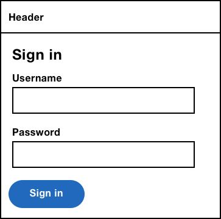

# A Login Form

> “As a user, I want to log in to [your service] so that I can [do stuff]” said nobody, ever!

Nobody *wants* to log into your site. They're forced to as a security measure. Without this, everyone has access to everyone else's stuff. Bad.

Given how long login forms have been around for and how basic they are in appearance, you'd be surprised at how often they contain the same usability mistakes that stop users doing something they don't even want to do in the first place. Add social login into the mix and things get even harder.

In this chapter, we'll design a login form and as we bump into each of the problems, we'll look at ways to remedy them. By process of elimination, users should be left with a straightforward and relatively pleasant login experience.

## A Standard Login Form



## Username Label And Hint Text

Our login form, like many sites on the web, has an ambiguous label of “Username” even though it expects users to enter their email address. Ultimately, the login form should mirror the site's registration form. In our case, this means the label should be “Email address.”


Legacy systems sometimes let users enter an email address or a username. In this case, the same rules apply—the label should be “Username or email address”—don't make users guess.


Some niche sites, such as airlines ask users to enter their booking reference number. In this case, use the hint pattern to tell users where they can find it.


## Auto-captalisation, Auto-correct And Spell checking

Some Android and iOS browsers try to help users by auto-capitalising words in text boxes (`<input type="text">`). For example, if I type “adam”, it will be changed to “Adam” which can be helpful depending on the circumstance. 

Prior to iOS 5, this behaviour also applied to the email input. In the case of the username or email address, we certainly don't want users to exert energy fixing mistakes they didn't even make themselves. So we can disable this behaviour like this:

```HTML
<input autocapitalize="none">
```

Similarly, iOS will autocorrect words in a text input that it thinks are a mistake. Continuing with the example above: a username may contain a random string of characters that may look like a mistake but isn't. You can disable this behaviour like this:

```HTML
<input autocorrect="off">
```

By the same token, some browsers will mark misspelled words with an underline. Again, you can disable this like this:

```HTML
<input spellcheck="false">
```

Here's the final HTML for our email address field:

```HTML
<div class="field ">
  <label for="email">
    <span class="field-label">Email address</span>
  </label>
  <input type="email" id="email" name="email" value="" autocapitalize="none" autocorrect="off" spellcheck="false">
</div>
```

## Password Field Design

People often use the same password for different sites and applications. But password rules differ from site to site. For example, some sites ask for a capital letter, others ask for numbers and symbols; other sites ask for a combination of all three.

Many users will tweak their password to match the rules of the site in question. For example, if their password is “password”, and the site requires a capital letter, they'll just capitalise the first letter to “Password.” Obviously, this is not recommended, but shows that users usually take the path of least resistance.

Referring back to the registration form in chapter 1 again, we gave users a hint that explained the password rules. But like many sites, our login form fails to provide the same clarity. Why should users have to guess, or worse, reset their password?


This sort of ambiguity is often in the name of security because providing a hint would make a hacker's job easier. But first, hackers don't hack this way and even if they did, what's to stop the the hacker checking the rules on the registration page? Nothing.

In short, we should leverage the patterns in “A Registration Form”:

1. Give users a hint text. This way, users have a greater chance of success without having to wait for a useful error message. 
2. Let users reveal their password using the password reveal pattern.


## Auto-tabbing

Some login forms, such as those found on bank sites, ask users for certain characters of their password. Or they may ask for certain digits of their security pin. In either case, users are normally given three separate text boxes or select boxes.


The first problem with this approach is that sites will auto-tab between the fields. That is, focus is moved to the next text box automatically as the user enters a pre-determined number of characters. But as the BBC's UX guidance[^3] says:

> it can be disorienting and hinder users from verifying information or correcting mistakes if the focus automatically changes when the user is not expecting it.

Leonie Watson, accessibility expert, and screen reader user, finds them problematic too:

> I strongly dislike having auto-tab functionality imposed on me. It is unexpected, and based on a flawed assumption that it is helpful. It takes me more time and effort to correct mistakes caused by auto-tab, than it does to move focus for myself.

This point of view shouldn't be surprising given that the technique is founded on assumptions that not only break convention, but also take control away from the user.

In this case, there's just no good reason for it. And splitting up a text box into three is unnecessary. A single, clearly-labelled text box lets users type three characters freely.


## Submit Button Text

Having ironed out problems with the username and password fields, our login form is almost identical to the registration form. It contains the same fields in the same order with the same microcopy. The only difference is the button's label. Instead of “Register” it's “Sign in.”


“Sign in” is arguably softer and more human than “Log in.” When you visit a spa, hotel or office building, you sign in which grants you entry. And you sign out as you leave. Where possible, we should use the same, familiar language in the digital world.

With that said, it can depend on the type of service you're designing. Banks, for example, tend to use “Log in.” Interestingly, the notion of logging came along with computers in the 80s. The operations that users do are logged for security reasons.

Whichever you go for, adhere to princple 3, *Be consistent*. Make sure URLs, link text, headings and button text all match. And if users click “Log in” to log in, then they should click “Log out” to log out.

## The ‘username and password don't match’ Problem

By providing users with clear labels and hint text, we've already reduced the chance of users seeing an error. However, when users do make a mistake, many sites will give users an error that says “The username and password doesn't match.” 

I'll delegate to Jared Spool's comical explanation[^1] of why this is in an issue:

> We know which one doesn't match, we're just not going to tell you, because our security people think that if we told you that it was the password, they would know they had a legal username and they would try every possible password in history.

But as Jared says, Hackers don't actually hack this way. But let's say they did—all they'd need to do to check the rules, would be to sign up for an account themselves.

The problem for users, is that they're left to reset their password which is long-winded and can cause users to give up. As with any other form, errors should tell users exactly what went wrong so that they can fix it easily.


## The Form In Context

We've ironed out many of the issues surrounding standard login forms, but we've done so while zoomed in on the form itself. We also need to consider the form in context of the page and the overal experience. This includes looking at various journeys through the login form. Let's start with layout.

### Layout

Users are often faced with a login page, when they try to perform an action that requires being logged in. Many sites design the login page as a special, interstitial page with a unique layout.

For example, when users try to add a product to their basket on the Tesco site, they are taken to a login page that looks completely different from the rest of the site. This is disorientating, especially for screen reader users and cognitively impaired users as they have to refamiliarise themselves with a new structure.


Instead, the login form should inherit the layout of the other pages. For example, if users go to checkout, and decide to log in first, they should still be given the checkout-specific layout with a pared down minimalist header and footer.


### One Form Per Page

Some sites place the registration and login forms on the same page. Either next to each other on desktop, or below one another on mobile.

As the forms are similar, putting them next to each other makes it hard to differentiate between them. It's also confusing for users that arrive on a page containing two forms, when what they clicked was a link that's labelled “Sign in”, for example.

Instead, give users just one form per page, and let them switch between each one by using a link before the form. For the login form, this will mean giving users a link to “Register.”


### Forgotten Password Link Placement

Human beings are forgetful. Password managers[^2] mitigate this problem by storing all your passwords in one place—you just have to remember a single, master password.

That's great, but password managers aren't infallible. If you don't rememeber to save your credentials into it, you're in the same position as everyone else. Moreover, not everyone uses one, nor should they have to.

Most sites give users a way to reset their password if they forget it. The feature itself isn't especially problematic. It's the placement of the link within the login form that can cause usability issues.

If the link is just above the password field, when users tab from the email field, it's the link that will receive focus, not the password field. Some users will tab and start typing not realising what's happened.

Worst still, is when the link is placed before the submit button. When keyboard and screen reader users tab from the password field and press <kbd>Enter</kbd>, they'll expect the form to submit. But instead, they'll be taken to reset their password. When they realise what's happened, they'll need to go back, re-enter their credentials and be careful not to make the same mistake again.


When the feature is considered in isolation, having the reset password link in close proximity to the password field makes sense. But the primary need is to sign in and the link shouldn't disturb the experience of logging in.

The submit button should be the last interactive element in the form because that's what users expect. Solving this problem is simple: place the forgotten password link before the form, which makes it easy to discover, especially for screen reader and keyboard users.

## Social Login

Recently, sites have started to offer users the ability to sign in with social networks such as Facebook, Twitter and Google. This saves users having to type their credentials they may not remember.

Medium.com, for example, lets users login in with Facebook. This is a boon for Medium users because they'll then have the option to post articles directly to Facebook automatically.

Social login is not without its problems though. 

### Privacy

Users are worried about their privacy. They don't know what you'll do automatically, and they want to feel as though they're information is safe and any actions they perform are intended.

Medium.com does this well because on the login page it says “We won't post without asking” which puts users minds at ease.


### Seamless Interchange

Some users won't remember how they originally created an account, therefore they won't know which login method to choose.

At Kidly, we handled this by showing users an error message. For example, if users had signed up with standard login, then tried to sign up with social login, we'd show an error message saying so. But this puts the burden on the user.

Again, Medium lets users log in interchangeably without users ever knowing what happened. For example, if I log in to Medium with my email but have already registered previously with Facebook, Medium logs me in automatically and merges my accounts. 

Users can visit the settings page to see what accounts are hooked up, which keeps users informed and in control.


### Choice Versus Choice Paralysis

Standard thinking is that choice is good. That it offers freedom, autonomy and personal responsibility. Heck, even one of *the design principles* is “Offer choice”. But *more* choice is not necessarily better when it comes to features or products.

Barry Schwartz, author of “The Paradox of Choice” has a case study where researchers set up two displays of jams at a gourmet food store. Customers could try samples, who were then given a coupon for a dollar off if they bought a jar. One display had 24 jams, the other had just 6. 30% of people exposed to the smaller selection bought a jam, but only 3% of those exposed to the larger selection did.

There's also some interesting data on companies that offer employees pension plans. One of Barry's colleagues got access to the records of Vanguard, a mutual-fund company, and found that for every 10 mutual funds the employer offered, the rate of participation went down 2%. Consider that employees knew that by not participating, they were passing up as much as 5000 dollars a year.

This phenomenon is actually called Hick's Law (named after psychologist William Edmund Hick), which states that the time taken to make a decision increases as the number of choices expand. Funny that William made a law in his own name that's just basic common sense.

The point of course is that we need to be wary that giving users multiple ways to sign in might seem useful, but it may also create a buren on them. We have to balance the value in doing so.

## Summary

In this chapter we started by quashing traditional advice that omiting hint text and explicit error messages improve security on login forms. We then looked at some of the subtle usability issues that can be introduced with social login. Finally, we looked at ways of improving the experience for keyboard and mobile users which meant avoiding auto-tabbing, auto-correcting and auto-capitalising input.

### Things To Avoid

- Using ambiguous microcopy and error messages in the name of security.
- Putting the login form next to the registration form.
- Auto-tabbing between multiple fields.
- Using multiple text boxes for one field.
- Putting the forgot password link inside the form.
- Enabling autocorrect, autocapitalise and spellcheck on fields that may not expect real words: username, for example.

## Demos

- Login form

## Footnotes

[^1]: https://vimeo.com/138359368
[^2]: https://www.lastpass.com/
[^3]: http://www.bbc.co.uk/guidelines/futuremedia/accessibility/mobile/forms/managing-focus

TODO: https://twitter.com/dburka/status/947864214303100929