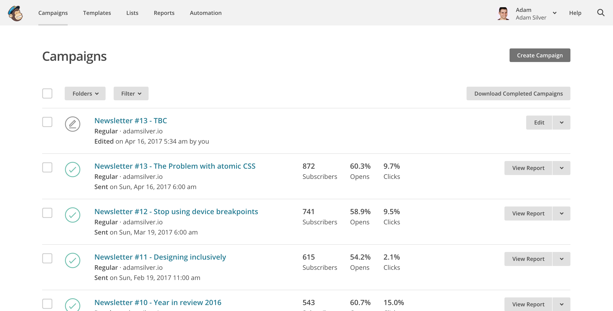

# Inbox Management

My sister loves lists. Her favourite list is a todo list. In fact she loves lists so much, that one of her favourite things is making new lists out of old ones.

Despite her obsession, the world is full of lists. There is even a list of great people[^]. But lists are a tricky thing to manage. On the web, there are some conventions that have emerged over the years.

In this chapter, we're going to make sure list management is easy, accessible and scalable. My sister loves pen and paper, but I hope that she may one day be converted to a digitally managed list.

On the web there are several elements that represent lists:

- tabular data (`<table>`)
- description lists (formely known as *definition lists*) (`<dl>`)
- unordered lists (`<ul>`)
- ordered lists (`ol`)

We can't discuss the merit of each of these until we orientate ourselves around a specific problem that needs solving. To do this, we'll design an inbox. The aim of course is to achieve a zen-like state of Inbox Zero[^].

To get to Inbox Zero our interace must enable users to delete, archive and mark emails as spam. But not just one at a time. In bulk.

Whilst this chapter is about email, the principles and design patterns are applicable to most, if not all types of lists that need to be operated on in bulk.

## Everything is list

Semantically speaking, everything is a list. The things on the page are a list of things on the page. Pedanticism aside, we need to decide what type of list is best for our inbox.

Tables work when representing two-dimensional data. In our case, rows represent emails and columns represent recipient, subject and date sent. Interestingly, Gmail omits table headings, suggesting that tables are less appropriate in this case.

We could represent rows as list items and (at least in big screens) visually present them as columns. This brings us to the first problem. Tables aren't especially responsive.

Tables are semantically tied to the way they look. Meaning it's hard to make tables not *look* like tables. There are some solutions, but they are not particularly cross-browser. However, striving to make tables (or any other element) not look like a table is materially dishonest[^].

Tables *are* a good choice when the data needs contextual information to make it useful. For example, *23* is ambiguous without *goals scored* and *Lionel Messi* as column and row headings respectively.

Our inbox, however, is seemingly less tabular. It's a list of emails that if read out as ‘From Heydon, subject: Buttons, 19/09/2017 at 9am’ would be quite readable. You might even argue that the verbosity of having column headings is something that hinders, as opposed to helps the experience. Mailchimp, which is not an inbox, has a similar interface to Gmail but uses list items:



It looks the same, but the advantage of list items over table rows is that they are maleable. We can style them differently and more appropriatelty for small and big screens alike. Semantics on the web is hard. Only once we take a step back and critique solutions from several angles does the ‘right’ solution present itself.

This may seem a bit out of place in a book about form patterns but forms aren't something that exist in a vaccum. They are a major part of an interface, but they rarely form an interface on their own.

On balance, an unordered list is preferential. This is not to say tables are bad. We can't classify elements as *good* and *bad*. We simply need to understand their meaning, their behaviour and their constraints. It's better to classify elements as *appropriate* or *inappropriate* for the given problem.

How it might look:


```HTML
<ul class="inbox">
	<li>
		<a href="/emails/1/">
			<div class="inbox-recipient">From Heydon Pickering</div>
			<div class="inbox-subject">Subject: Buttons</div>
			<div class="inbox-date">19/09/2017</div>
		</a>
	</li>
	...
</ul>
```

Here's the HTML without any form controls. We'll add those in shortly. Interestingly, the act of writing the HTML exposes another problem. The content is wrapped in a link which is not something we can do with tables&mdash;it's semantically invalid.

As designers, we should have a deep understanding of the materials we use to build artifacts. For example, a chair designer should intimately know how wood can be used to craft chairs. In our case the materials are HTML, CSS, Javascript. And the artefacts are web pages.

> ‘If you can solve a problem with a simpler solution lower in the stack, you should.’—Derek Featherstone

Gmail uses tables and yet the entire row is clickable. Google's developers use Javascript. But, as we've previously discussed, this is an act of exclusivity.

Wherever possible we should avoid solutions that exclude people. Inclusivity is really just a set of constraints that guide us to create robust, and therefore, better experiences.

## Enabling selection

To allow users to select and action multiple emails at once, we'll need to add a checkbox to each item in the list.

How it might look:


```
<ul class="inbox">
	<li>
		<input type="checkbox" name="email">
		<a href="/emails/1/">
			<div class="inbox-recipient">From Heydon Pickering</div>
			<div class="inbox-subject">Subject: Buttons</div>
			<div class="inbox-date">19/09/2017</div>
		</a>
	</li>
	...
</ul>
```

Unlike all other fields in the book so far, the checkbox has a label missing. In *almost* all cases, a visible label should be placed with the checkbox. However, this is a bit of a special case because the interface handles two disperate jobs. That is, to view emails and to *manage* them too.

In this case we can probably get away without having visible labels. In fact having a visible label in this interface interfers with the navigation behaviour of the row itself. We can't have a `label` and a link occupy the same space.

There are 2 solutions:

- Use modes
- Visually hide the label

### Use modes

As we said before, our interface is a little complicated because it's trying to do 2 jobs. Instead we could split these jobs out and use modes. Affectively this means have two interfaces. One that is read-only and one that is for management.

When in read-mode there are no forms and no checkboxes. Clicking the row takes the user to the email. When in manage-mode, the row becomes the `label` and therefore clicking it activates the checkbox, just like it does in all the other forms we've designed so far.


Modes work well, particulary if one is used a lot more than the other. But if both are used equally, then having to switch between them is somewhat undesirable. This seems applicable to our inbox interface. Instead we can visually hide the label.

### Visually hide the label

There are two ways to create a hidden label. One of the simpler and least verbose ways is to use `aria-labelledby`:

```
<ul class="inbox">
	<li>
		<input type="checkbox" name="email" aria-labelledby="e1_recipient e1_subject e1_date">
		<a href="/emails/1/">
			<div class="inbox-recipient" id="e1_recipient">From Heydon Pickering</div>
			<div class="inbox-subject" id="e1_subject">Subject: Buttons</div>
			<div class="inbox-date" id="e1_date">19/09/2017</div>
		</a>
	</li>
	...
</ul>
```

The downside is that there is less support for ARIA than there is if we were to use the native equivalent of a `label`. Using a label  means duplicating the contents and visually hiding the label with CSS.

```
<ul class="inbox">
	<li>
		<input type="checkbox" name="email" aria-labelledby="e1_recipient e1_subject e1_date">
		<a href="/emails/1/">
			<div class="inbox-recipient" id="e1_recipient">From Heydon Pickering</div>
			<div class="inbox-subject" id="e1_subject">Subject: Buttons</div>
			<div class="inbox-date" id="e1_date">19/09/2017</div>
		</a>
	</li>
	...
</ul>
```

Duplicating the contents bloats the HTML which can diminish the experience for many users since many operations will take longer. Assistive technology users especially may find their software unresponsive.

Much to our frustration, *perfect* rarely exists in design. On balance, using a visually hidden label creates a little bit of a bloat in exchange for a more inclusive experience. In fact having a visually hidden label is an opportunity to improve the experience for screen reader users. Note below that the label reads *From Heydon Pickering about Buttons (19 September 2017)* which works better audibly.

```HTML
<fieldset class="inbox">
	<legend>Inbox: 26 emails</legend>
	<ul>
		<li>
			<input type="checkbox" name="email" id="email1" value="1">
			<label for="email1">From Heydon Pickering about Buttons (19 September 2017)</label>
			<a href="/emails/1/">
				<div class="inbox-recipient">Heydon Pickering</div>
				<div class="inbox-subject">Subject: Buttons</div>
				<div class="inbox-date">19/09/2017</div>
			</a>
		</li>
		...
	</ul>
</fieldset>
```

Here's the CSS to visually hide the label.

```CSS
.inbox label {
	position: absolute !important;
    clip: rect(1px, 1px, 1px, 1px);
    padding:0 !important;
    border:0 !important;
    height: 1px !important;
    width: 1px !important;
    overflow: hidden;
}
```

## Highlighting rows

The deal with human-computer interaction is that when the human does something, the computer should respond. In this case, clicking a checkbox makes a little tick appear (and disappear) accordingly. In all likeliness this is enough, though we could highlight the entire row using Javascript.

As designers, we're tempted to do more than the minimum. We think that more is better. We think that more is a symbol of hard work. It's actually a lot easier to do more than it is to do less. Constantly striving for less in a world that pats you on the back for doing more is very hard work indeed.

If thorough and diverse testing shows a highlight is really needed then go ahead. But, by not highlighting the row, we have less work to do and the interface is as performant as possible.

Mailchimp, known for their usability prowess don't bother highlighting the rows. The checkbox is enough.


## Submit buttons

It's all well and good allowing users to select multiple emails, but our interface is lacking the ability to action them. Unlike other forms in this book, the inbox is a little bit different. Firstly it's not a simple matter of placing a button at the end of the form. Secondly this form contains multiple submit buttons. We're going to discuss all this and more now.

### Button location

Traditionally, submit buttons are placed after form fields. Up to now this is exactly what we've done. This made sense, as users typically have to answer the questions from top to bottom. And they submit once they've filled out the form entirely.

Users who wish to select and act on individual emails won't necessarily step through each and every checkbox. Having buttons at the bottom of a long list doesn't aid discovery of that functionality either. This is why we place them at the top.

### Implicit submission and multiple submit buttons

Implicit submission allows the user to press <kbd>enter</kbd> while a field is focussed. In doing so the form is submitted as if the user pressed the first button in the HTML. When there is a single submit button this is not an issue. When there are multiple, it's not obvious which action will be taken.

Where possible, we should try and split forms so that they have a single, and therefore intuitive action. It's normally easy to design solutions for this. For example, if you have a form that allows a user to update or delete the record, you can just have two separate forms:


Our inbox is a special case. As such it's not quite so obvious as to how we might split out the actions into separate forms. One way, would be for users to first select an action (such as ‘Bulk deletion’). Clicking it takes the user to a dedicated interface in which to select the emails and apply the action


This could work. On the other this approach seems a little long winded in the case of an inbox. At least in putting the buttons first in the flow, users (those who use screen readers and those more abled) have an opportunity to discover the multitude of available actions.

Also, a form consisting of a single checkbox group, doesn't make implicit submission all that useful. Conversely, a search form&mdash;one that consists of a text box and submit button&mdash;would benefit greatly from implicit submission, as users can take the efficient route pressing <kbd>enter</kbd>.

In any case, if a user did implicitly submit the form, we can mitigate the danger in two ways. First by putting the least invasive action first (such as archive). Secondly by letting users undo their action. This is useful experience regardless and we'll be talking about this more shortly.

### Disabling and hiding the submit buttons before selection

You may think it's a good idea to disable (or hide) the buttons until users selects at least one email. But we already discussed the problems with disabling submit buttons in the first chapter.  similarly, hiding the buttons makes the actions less discoverable. A clean interface is good, but not at the cost of clarity.

### Housing the buttons in a menu

On big screens, or responsively speaking, when there is space, laying out the buttons horizontally is fine. However, an inbox may have other features and there may not be enough space (even on big screens) to present them comfortably.

[Blah](.)

Similarly, on small screens the buttons are likely to stack beneath each other pushing the inbox itself down the page. Having the buttons dominate the interface like this is problematic. *Dominance* is a quality we should use sparingly. After all, if everything dominates, nothing does. The inbox should take center stage with the menu taking a more subtle role in the interface.


To keep the interface clean but easy to scan we hide the options behind a menu button. There are 2 ways to create a menu. The first is by using a `select` box which as we'll find out isn't a true menu. The second is by building a true menu using HTML, CSS and Javascript.

### Select box menu

Select boxes are a menu of sorts. They present items for selection (like a menu) and they're an attractive option because browsers supply them for free. Even though select boxes look like menus and behave a little like them, they *aren't* menus.

Select boxes are for input. That's why (forms that contain) select boxes&mdash;like any other input&mdash;must be accompanied by a submit button (to submit the choice). Not only is this by convention, but it's also in WCAG2.0:

> Changing the setting of any user interface component does not automatically cause a change of context.

This coincides with inclusive design principle 4, *give control*. Select boxes that automatically submit the form `onchange` *takes away control*. Unsuprisingly then, this causes problems. In this case, screen reader and keyboard users. On Chrome (Windows), for example, the form is submitted as soon as the user moves to the next option when pressing <kbd>down</kbd>. Getting to the option after that is either hard or impossible[^].

This is not a browser bug. It's just that some browsers are more forgiving than others. The forgiving ones wait until you press <kbd>space</kbd> or <kbd>enter</kbd> before submission. This lets users move through the options with the arrow keys. As we know, not all browsers are alike or implement the specification in the same way. Therefore, forgetting about people who use a less forgiving browser is an act of exclusivity.

This information easily discredits the use of a select box as a menu. However, there are other problems worth noting. A select box is always collapsed but when there is enough space (on big screens) we want to expose the options making them easier to scan and select. We could use Javascript to create vastly different experiences on small and big screens, but this is an adaptive approach to design and goes against the very foundation of responsive design[^].

[!Show adapative layout differences](.)

Practically speaking, this creates more work for us, and a more computationally heavy interface for the browser to render. It also adds complexity on the server because it has to be ready to handle the way select boxes and submit buttons transmit data to essentially perform the same task. The select box will send `selectName="value"` and the buttons send `buttonName="value"`.

### A true menu

HTML doesn't have a ‘menu’ element so we need to build our own. The basic HTML looks like this:

```HTML
<div role="menubar">
  <input role="menuitem" type="submit" name="archive" value="Archive">
  <input role="menuitem" type="submit" name="delete" value="Delete">
  <input role="menuitem" type="submit" name="spam" value="Mark as spam">
</div>
```

The menu takes the (aptly named) `menubar` role indicating this element contains a menu items. That's why each submit button is given a role of `menuitem`, letting screen readers announce the component as a three-item menu. Visually the three buttons are grouped together. So all we've really achieved in using ARIA is to denote this grouping for those using screen readers.

On small screens, the menu items stack beneath each other as there is no room to present them next to each other. Javascript is used to detect when the screen is small to then enhance the component into a traditional collapsed menu with all the expected interactive qualities which I'll explain shortly.

How it might look:


```HTML
<button aria-haspopup="true" aria-expanded="false">
  Actions
  <span aria-hidden="true">&#x25be;</span>
</button>
<div role="menu">
  <input role="menuitem" type="submit" name="archive" value="Archive">
  <input role="menuitem" type="submit" name="delete" value="Delete">
  <input role="menuitem" type="submit" name="spam" value="Mark as spam">
</div>
```

```JS
Put it here
```

Notes:

- The `aria-haspopup` attribute indicates that the button shows a menu. It acts as warning that, when pressed, the user will be moved to the “popup” menu.
- The `<span>` contains the unicode character representing a down arrow. Conventionally this indicates visually what `aria-haspopup` does non-visually&mdash;that pressing the button reveals something below it. The `aria-hidden="true"` attribute prevents screen readers from announcing “down pointing triangle” or similar. Thanks to `aria-haspopup`, it’s not needed in the non-visual context.
- The `aria-haspopup` property is complemented by `aria-expanded` which tells users whether the menu is currently expanded or collapsed by toggling between `true` and `false` values.
- The role is now set to `menu` instead of `menubar` because it now expands and collapses. Conversely a `menubar` is always visible.
- Pressing the button shows the menu and moves focus to the first `menuitem`.
- Pressing <kbd>down</kbd> or <kbd>up</kbd> on a `menuitem` moves to the next or previous item (on loop) as before.
- Pressing <kbd>escape</kbd> on a `menuitem` moves focus to the menu button and closes the menu.
- All `menuitems`s have `tabindex="-1"` which means pressing <kbd>tab</kbd> won't move focus to the buttons. We purposely let users use the arrow keys to traverse the menu because this saves the user having to wade through each of the menu items to get to the next interface component. Pressing <kbd>tab</kbd> once achieves this and mimics the behaviour of menus found in standard computer software.

---

## Select all

Sometimes users may want to perform these bulk actions to every single email in their inbox. Rather than having to select each email manually, we offer the convenience of a button that automates it for them.

Users may want to perform an action on every email in their inbox. To save the user having to select each checkbox manually, we offer them the convenience of a button that does it for them. This feature is usually offered as an Javascript enhancement. That is, for those without Javascript they are left to once again select each checkbox one by one.

But actually we can offer this functionality for those who lack Javascript. All that happens is that the user presses the button which posts back to the server and after the page refreshes all the items are marked as selected. Then we can enhance the experience with Javascript to do the same thing faster without a refresh.

Often an interface will have a checkbox to represent *select all*. Even though it's become convention it's not really the right element for the job, semantically speaking. Like the select box, the checkbox is another form of input. It's not for automating or performing actions on an interface.

----

Instead, we'll use the already available button and enrich it with a little ARIA.

```HTML
<button aria-pressed="false">Select all</button>
```

And the Javascript:

```JS
Loop through all checkboxes and check them
update aria-pressed to true
```

## Success messages

When the submits the form successfully, the page will refresh and the emails disappear from their inbox. It's wise to notify users of this action as without a clear message the user is left to wonder if it worked. This is particularly the case if they have marked many emails in an inbox full of emails.

Like error messgaes, success messages promote trust and instill calm. It leaves the user feeling good and in control. Two qualities that encourage the user to get to inbox zero.

In checkout, for example, the user ends on a confirmation screen. We could have a confirmation screen, but it seems a bit long-winded to use this approach for managing an inbox. Instead, we show a success message at the top of the page.

How it might look:


```HTML
<div role="alert" class="success">
	You've successfully archived 5 emails
</div>
```

### Notes

- The role of alert means the panel is announced immediately for those using screen readers
- The message stays on screen. It doesn't automatically hide. This is a poor experience. It either hangs around for too long, or it disappears before the user had a chance to read it.
- Without a Javascript, navigating away will dismiss the message.
- With Javascript, we can enrich the experience by adding a dismiss button. Clicking it will hide the message.

### Confirming versus undo

Roads have speed bumps in order to slow drivers down to keep them safe. In much the same way we can slow users down and keep them safe by asking them to confirm their action:


This works okay for infrequent tasks. But for tasks that are performed frequently, this is a frustrating source of friction.

Instead we might offer users an undo feature. This is Gmail's:


To do this, the success messgae needs to contain a button with the words *Undo*. Clicking it will undo their previous action and restore the emails back into their inbox.

## Summary

TODO

## Footnotes

TODO

## Other considerations

- Selecting all, but spanning several pages (Gmail)
- Hover vs click (for aria menu)
- checkbox indeterminate state.


## Notes

The advantage to users is that they can leave the menu by pressing <kbd>tab</kbd> once as opposed to having to move through each of the items. This is particularly useful for large menus.

When Javascript is available to handle the keyboard interactions we suppress the natural tab stops by giving each button a tabindex of -1, except for the first one. If we gave the first one the same attribute, users wouldn't be able to focus the menu at all. With Javascript, we detect when the user presses the arrow keys and programmatically moves focus to the next button.

Once the user enters the menu, the first button is also given a tabindex of -1 to match the others. On tabbing away from the menu everything is reset to the original state.

Pressing <kbd>right</kbd> or <kbd>left</kbd> moves to the next (or previous) item (on loop).

