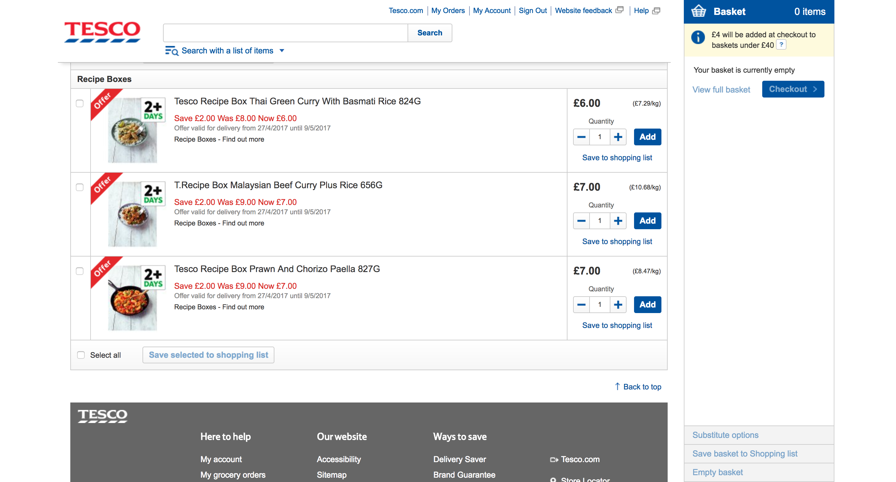

# Inbox Management

My sister loves lists. Her favourite list is a todo list. In fact she loves lists so much, that one of her favourite things is making new lists out of old ones.

Despite her obsession, the world is full of lists. There is even a list of great people[^]. But lists are a tricky thing to manage. On the web, there are some conventions that have emerged over the years.

In this chapter, we're going to make sure list management is easy, accessible and scalable. My sister loves pen and paper, but I hope that she may one day be converted to a digitally managed list.

On the web there are many types of list: tabular data (`<table>`), description lists (which used to be called definition lists) (`<dl>`), unordered lists (`<ul>`) and ordered lists (`ol`).

We can't discuss the merit of each until orientate ourselves around a  specific problem that needs solving. We'll design an inbox. The aim of course is to achieve a zen-like state of Inbox Zero.

To get to Inbox Zero our UI must enable users to delete, archive and mark  spam. But not individually. In bulk.

Whilst this chapter is about email, the principles and design patterns are applicable to most, if not all types of lists.

## Everything is list

Semantically speaking everything is a list. The things on the page are a list of things on the page. Pedantism aside, we need to decide what type of list our inbox will use.

We should use tables to represent two-dimensional data. In our case the rows represent emails and the columns represent the details about the email: recipient, subject and sent date etc. Gmail, omits table headings which might suggest a table is the wrong choice.

We could represent rows as list items and&mdash;at least in big screens&mdash;style them visually as columns. This brings us to the first problem. Tables aren't very responsive.

Tables are semantically tied to the way they look. Meaning it's hard to make tables not *look* like tables. There are some solutions, but they are not particularly cross-browser friendly.

Moreover, tables are a good choice when the data needs contextual information to make it useful. For example, *23* is useless information without the context of *goals scored* as a column heading and *Lionel Messi* as a row heading.

Our inbox is seemingly less tabular. It's a list of emails that if read out as "From Heydon, subject: Buttons, 19/09/2017 at 9am" would be quite readable.

Mailchimp, which is not an inbox, has a similar looking interface to Gmail but uses list items instead of tables:


It looks the same, but the advantage of a list items over tables is that they are maleable. Semantics on the web is hard. Only once we take a step back and critique solutions from many angles does the "right" solution show itself.

This may seem a bit out of place in a book about form patterns but forms aren't something that exist in a vaccum. They are a major part of an interface, but they rarely form an interface on their own.

On balance, an unordered list is preferential. This is not to say tables are bad. We can't classify elements this way. We simply need to understand their meaning, their behaviour and their constraints.

So here's our inbox:


HTML:

```
<ul class="inbox">
	<li>
		<a href="/emails/1/">
			<div class="inbox-recipient">From Heydon Pickering</div>
			<div class="inbox-subject">Subject: Buttons</div>
			<div class="inbox-date">19/09/2017</div>
		</a>
	</li>
	...
</ul>
```

This is the HTML without any form controls. We'll do that in a moment. Even so, the act of writing HTML has exposed another advantage of lists over tables.

You'll notice the contents of each item is wrapped in a link. The link takes the user to read the email in full. Tables don't allow this behaviour. It's invalid and broken to use an `a` acorss table cells.

> if you can solve a problem with a simpler solution lower in the stack, you should
> —Derek Featherstone

Gmail uses Javascript to make this happen, which unforunately is an act of exclusivity. We want to avoid this wherever possible. We haven't relied on Javascript so far, so let's keep it this way.

## Enabling selection

To allow users to select and action multiple emails at once, we'll need to add a checkbox to each item in the list.

What it looks like:


HTML:

```
<ul class="inbox">
	<li>
		<input type="checkbox" name="email">
		<a href="/emails/1/">
			<div class="inbox-recipient">From Heydon Pickering</div>
			<div class="inbox-subject">Subject: Buttons</div>
			<div class="inbox-date">19/09/2017</div>
		</a>
	</li>
	...
</ul>
```

The first thing to notice is that, unlike all other fields in the book so far, the checkbox doesn't have a label. This is one of those situations where there is no clear right answer. To my knowledge there are three options, each with their own set of tradeoffs:

- Use ARIA attributes in order to connect the values inside the divs to the label.
- Wrap the contents in a label and associate it with the checkbox.
- Create a separate label and duplicate the contents of the list item.

### Use ARIA attributes

We could use aria-describedby or aria-labelledby to associate the already-present information in the list item with the label. There are two problems with this.

The first is that there is less support for ARIA attributes than there is labels. In fact the first rule of ARIA is not to use ARIA if you can do it natively. Support is directly related to inclusivity, so this is not something to take lightly.

The second is that the hit area is reduced. You'll recall from the first chapter that increasing the hit area helps users with fine motor impairments.

TODO: when did ARIA come along

### Wrap the contents in a label

This is my favourite option because it doesn't rely on ARIA meaning it has excellent support. And the hit area is large, solving both of the problems with the previous option.

However, it has several problems:

In order to implement this solution we need to remove the link. But the link is what allows the user to read and reply to the email. We can't have two interactive elements taking up the same space.

We could instead have a *view email* link at the end of each row, but this forces a change in UI. It could be that an explicit buttons works well, but that would need testing and the hit area of the main action is now reduced.

Remember the links are repetitive, bloat that takes up screen real estate. Hardly insurmountable, but worth our consideration as designers.

We could use *modes*. We could have a separate button on the page that changes the mode in which the user is interacting with the list. For example, the list might start off in view mode, but clicking the "edit mode" button converts the list into a set of checkboxes that can be bulk actioned.

Having dedicated modes may work well but both view and edit modes seem desirable. If edit mode was signicantly less desirable then you could default view mode and allow users to switch and avoid the above problems.

This seems a bit over the top for this situation particularly as it slows users down as they have to switch between the views.

### Create a label and duplicate the contents

The final option is to duplicate the contents and put inside a separate regular email. In addition to duplication we must ensure to hide the label visually as it's the same as the already on-screen information.

The problem with this is duplication, bloat and once again a smaller hit area.

### Which to choose?

It's painstakingly obvious that there is no perfect answer. The trick is to find the balance and test. I'm caught between option 1 and 3. My inclination is to choose the duplicated label as we know it's better supported. A bit of duplication never hurt anyone.

HTML:

```HTML
<fieldset class="inbox">
	<legend>Inbox: 26 emails</legend>
	<ul>
		<li>
			<input type="checkbox" name="email" id="email1" value="1">
			<label for="email1">From: Heydon Pickering, Subject: Buttons, Sent: 19/09/2017</label>
			<a href="/emails/1/">
				<div class="inbox-recipient">From Heydon Pickering</div>
				<div class="inbox-subject">Subject: Buttons</div>
				<div class="inbox-date">19/09/2017</div>
			</a>
		</li>
		...
	</ul>
</fieldset>
```

CSS:

```CSS
.inbox label {
	// visually hidden
}
```

## Highlighting rows

When a user clicks a checkbox it becomes checked. The user knows this because a tick (or check) appears inside the box. We might be tempted to do more. Specifically, we may be tempted to use Javascript to highlight the entire list item when the user checks the box.

As humans we seem hard wired to want more. More money, more friends, more cars, more credibitily, more followers, more responsibility, more power. Whatever it may be, we have an unhealthy obsession with it.

A useful way to build software is to do the minimum, and test. There is even a special acronym for it: MVP. It stands for Minimal Viable Product. Simply put. Do the minimum, test. If it needs more, then do more. Testing proves that more is worth the investment.

Mailchimp, who are well-known for their investment into usability testing don't both highlighting the row. The checkbox is enough:


We'll follow their lead and avoid the extra work, safe in the knowledge that we'll test this later on.

## Submit buttons

We now have a form, that enables the selection of emails to action. But what use is selection, if there is no way of actioning them. We need to add some buttons. One for each action: delete, archive, and marking spam.

### Multiple buttons

### Button location

- At the top?
- At the bottom too?

--------

- buttons on each row, to quickly delete without having to select.
- showing actions (responsively too, select versus menu), misusing select
- (de)select all
- success messages

--------

## Showing actions

Another question is do we disable or hide the actions until they can be clicked? Maybe we don't even do that.

Mailchimp hides the actions until the user clicks at least one checkbox. Gmail does the exact same thing.

There is a case hoever, for always showing the actions, but having them in a disable state. This may give the user a clue that they can manage their list, but they first need to do something to enable the buttons.

I have a bit of an aversion to disabled buttons because I have seen users try and click on disabled elements and not understand why they are disabled. A subtle greyed out state doesn't say very must. UIs should be clear always.

So instead, we could allow users to press the button, and show an error if the user hasn't selected any items yet. This matches all the other forms we have designed in the book, and it just feels right.

Once again, consider your options, do the simplest thing first and test.

First time users, or low confidence users may need more than just the enabling or a button. Perhaps a little animation or something might help users notice it.

http://www.enterpriseux.co/gmail-style-data-tables-part-2/

## Where to display action buttons

Conventionally speaking we should display action buttons at the top of a list. This is becauses lists can be long. At least by having actions at the top, the user has a chance to see what actions are available before selection.

We can put the buttons at the bottom too for convenience and for screen readers. Or you could consider using `position: sticky`. It's not usually something I advise by default, because sticky elements get in the way. And is quite often to the way with lists, we're not always acting upon them in this way. Quite often we're just browsing and clicking in to detail.

## Select all?

With a list of my favourite products, or a list of emails, quite often we might want to select and act upon all options in a list. We may want to, for example archive all the emails. Having a (de)select all button makes sense.

- Without JS? Use buttons to reload the page with all selected.
- With JS piggyback the button/link to not do a post back.
- checkbox indeterminate state.

## Action buttons versus select box

- Sometimes it's not just a button, sometimes it's a selection, like apply filter. But better to go to other page probably. Like for Universal Credit, we have a page that selects people to be allocated to another agent. That means the user selects people, then chooses who to allocate it to then presses the button. Better as a flow, at least to start with.
- other thing is, can have modes. Modes that say "browse mode" or "manage mode". Only show checkboxes when users wants to manage stuff. One thing per page principle type thing.

This little gizmo has much to be discussed.

We could use a select box, one of the rare cases where saving space like this makes sense. But always use a submit button, and don't apply the change when the user changes options.

MISUSING THE SELECT BOX

The problem with using a select box despite the general disadvantages as we've discussed at length in Book A Flight is that they don't allow us to enhance the experience for big screens. That is to display the options when there is enough space to do so.

For this reason we might consider a ARIA TOOLBAR. A div with a button that exposes more buttons on small screens, and on big screens, just expose the buttons without showing/hiding (or aria-expand/collapse).

As we know we don't want to hide options if there is room to show them.

## Putting actions within the table too

If users often act upon one list item at a time, then you might want convenient buttons in context too. It saves users having to select an item first and then acting upon it. One click is better than three or four in this case.

If we count the clicks on small screens then it would be:

1. Check the item
2. Scroll up to the top (depending if the actions are off screen)
3. Open the menu/select box
4. Click action

Or with an in-context button

1. Click button

When modifying data, we should always use a form and submit button. Links are for getting/retrievig documents and information. They are not for modifying. This is an HTTP restful principle that I need to look up to get more detail as to why this is a good thing.

If you have an in context delete button, it shouldn't be a link. Unless of course, you're going to link to another page or whatever, that shows a form saying *are you sure you wish to delete* and that button being a form/submit.

But as you will see shortly, if having to confirm these actions all the time, makes the act full of friction and frsutrating. Instead we might be able to use a better way.

## Success messages

When the user submits the form, the page will refresh, and the item will be gone, if the user deleted (or archived). In this case it would be wise to make this clear to the user with a success message.

Like error messages, success messages are of vital importance. They leave users feeling good, and in control. When we built the checkout flow, we had a gigantic success message at the end in the form of an order confirmation.

In this case, we need a message in context. A toast message is named after toast popping up after a toaster has had its way with a piece of bread. The thing to know about toast messages is that they shouldn't disappear without users dismissing them.

Some users may not notice them at first. Some users may be using a screen reader, and not have read it out yet. Some users may notice it, but take a really long time to read the message.

Whatever it is, don't dismiss the message automatically.

Also, within the success message we may provide users with an undo feature, that let's them undo their last action. This often causes less friction, then asking users to confirm their action "Are you sure you want to delte this item?" etc.

In this case this undo feature will be part of the success message like gmail:


## Notes

- multi select box, checkboxes.
- Delete should be a post

http://www.enterpriseux.co/how-to-make-gmail-style-user-friendly-tables-part-1/
http://www.enterpriseux.co/gmail-style-data-tables-part-2/
http://www.enterpriseux.co/data-tables-part-3-user-feedback-and-messaging/

---

Unless of course it had a pound sign in front of it, and it was located within a list of products, with each product given it's own heading.

At Tesco, we did just this, but we also laid out parts of each product in columns as you can see below:



At the time, we weren't designing a fully responsive, mobile-first website but if we had it would have been relatively straightforward to convert these divs/list items.

Tables on the other hand aren't responsive: if there isn't enough room, then the user will get a horizontal scroll bar. This is particulary a problem with tables that have lots of (wide) columns.

If you can design something well that doesn't use tables, I would start there, but regardless, whether you use a table or a list item, or a div for that matter, the design principles in this chapter are still applicable.
