# An Inbox

My sister loves to-do lists. In fact, she loves them so much, that one of her favourite things is making new lists out of old ones. The world is full of lists. There is even a list of great people[^1]. On the web, there are several types of lists, and there are some design patterns that have emerged over the years that help to manage them.

In this chapter, we'll look at an inbox. That is, a list of emails sent from other people. In many respects, an inbox is a list of tasks organized around emails. Besides reading and replying to them, the aim is to achieve a zen-like state of Inbox Zero[^2]. To let users get there quickly, we will design the interface so that they can delete, archive and mark emails as spam. But not just one at a time — in bulk. My sister loves pen and paper, but if we get this right, I hope she'll be converted to digital.

## List Types

First, we're going to look at how best to mark-up a list of emails. Discussing lists may seem out of place in a book about forms, but forms rarely form part of an interface on their own. Ignoring their surroundings can result in disagreeable experiences.

The meaning — or semantics — behind elements should influence their appearance. In other words, form should follow function. There are 4 elements we can use to construct lists each with different semantics: description lists, tables, ordered lists and unordered lists. Let's discuss the pros and cons of each now.

### Description Lists

A description list (`<dl>`), formerly called a definition list, is for grouping a related group of key-value pairs for *one* record. For example, product details such as size, price and material. An inbox, however, consists of multiple records (in this case, emails), ruling this one out.

```HTML
<dl>
	<dt>Size:</dt>
	<dd>250cm x 135cm x 90cm</dd>
	<dt>Price:</dt>
	<dd>£429.95</dd>
	<dt>Material:</dt>
	<dd>Reclaimed teak</dd>
</dl>
```

### Tables

A table (`<table>`) is an arrangement of data, laid out in rows and columns. Like a spreadsheet, they are well-suited for data that needs to be compared, sorted and totalled.

Tables unfortunately, are difficult to style on small viewports, because there's no room to show more than two or three columns. Even then, it could be a squeeze depending on the data, creating layout issues. For example, content could wrap profusly or it could cause a horizontal scroll bar to appear.

Making tables responsive isn't the most straightforward thing to do. This is because they are inherently tied to the way they look. Put another way, making a table not look like a table, is not only very difficult, but it would be deceptive and counterproductive.

Gmail uses tables and puts recipient, subject and date sent into columns. Interestingly though, there are no table headings, which is the first clue that tables have been used for layout purposes rather than their semantic qualities which causes various access issues. Jeremy Keith talks about this in his book “Resilient Web Design”[^]:

> Using TABLEs for layout is materially dishonest. The TABLE element is intended for marking up the structure of tabular data. The end result [...] is a façade. At first glance everything looks fine, but it won’t stand up to scrutiny. As soon as such a website is stress‐tested by actual usage across a range of browsers, the façade crumbles.

```HTML
<table class="inbox">
  <a href="/email/1">
    <tr>
      <td>John Oates</td>
      <td>Your Amazon.co.uk order #123 is out for delivery</td>
      <td>10 August</td>
    </tr>
  </a>
</table>
```

See the mark-up above as an example. The `<tr>` is wrapped in an `<a>` to let users click an email to read it. The problem is that browsers ignore this code. It's simply not allowed and screen reader users will struggle to interpret it. 

*(Note: Gmail lets users click on table cells by using Javascript to listen to click events. But not only is this unclear for screen reader users, not everyone has Javascript and quite frankly, it's unnecessary.)*

### Ordered And Unordered Lists

The generic list is useful because it itemizes and groups content into related chunks accessibly. But they can be used for more than just bullet points. They come in two flavours: ordered (`<ol>`) and unordered (`<ul>`) lists. And they are far less opiniated than tables.

The difference between the two types, lies in their name. If order matters, use an ordered list. For example, following a recipe's instructions requires users to do so in order. Not doing may produce inedible food. On the other hand, an inbox doesn't have to be read or actioned in a predefined order. It sounds simple when put like that, but we tend to overthink these things. Let's lay out the inbox using a `<ul>`.

```HTML
<ul class="inbox">
  <li>
    <a href="/emails/1/">
		  <div class="inbox-recipient">John Oates</div>
		  <div class="inbox-subject">Your Amazon.co.uk order #123 is out for delivery</div>
		  <div class="inbox-date">10 August</div>
    </a>
  </li>
</ul>
```

Unlike tables, unordered lists are stylistically malleable and therefore responsive. That's because they can be laid out in different ways without having to affect their structure in a way that makes them less accessible non-visually.

With the mark-up above, on large viewports we can lay the emails out in columns and on small viewports we can avoid layout issues by stacking them vertically. Moreover, the entire list item can be made to be clickable without resorting to Javascript hacks. Wrapping a link around the contents is perfectly valid which is less work and more robust.

In the case of an inbox, list items are more suited anyway: not only are column headings redundant, but there's no need to compare or total items in the list.

## Marking Email For Action

To let users mark emails for action, we need to give each row a checkbox.

```
<ul class="inbox">
	<li>
		<input type="checkbox" name="email">
		<a href="/emails/1/">
			<div class="inbox-recipient">John Oates</div>
			<div class="inbox-subject">Your Amazon.co.uk order #123 is out for delivery</div>
			<div class="inbox-date">10 Aug</div>
		</a>
	</li>
	...
</ul>
```

You'll notice each checkbox is missing a label. The problem is that the contents of the link should also be the contents of the label. In other words, two opposing interactions need to occupy the same space. Remember, clicking the label should mark the checkbox but clicking the link should navigate the user to the email.

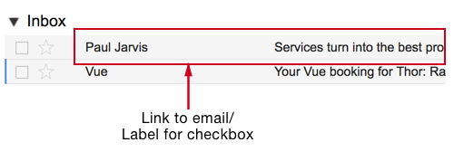

In this case, you could argue that a visible label is redundant. After all, the label would duplicate the link's content. This would make for a confusing experience for sighted users.

### Using Modes

Trying to meet two user needs in a single interface is partially responsible for the problem in the first place. One way to avoid the issue would be to split these needs apart using the concept of modes. This just means letting users switch between managing email and reading it.

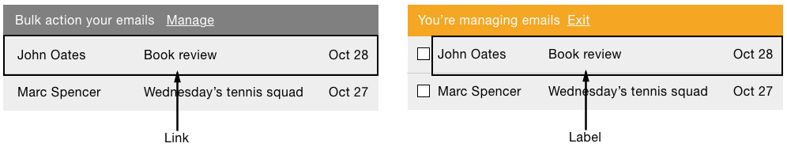

Clicking *Organise* puts users into *manage-mode*. When in manage-mode, the link's label changes to ‘Finished’ (or similar), which when clicked, takes the user back to read mode.

When in read-mode there are no checkboxes or any other form paraphernalia. The row is a link which takes users to read the email. When in manage-mode, the row turns into a `<label>`. When clicked, it marks (or unmarks) the checkbox just like normal.

Modes are best suited when one mode is used more frequently than the other. But, when both are used frequently, like an inbox, having to switch back and forth all the time is undesirable.

*(Note: we should try and avoid modes, but if they are necessary, the interface must make it obvious which mode is invoked.)*

### Visually Hide The Label

Instead of using modes, we can add a visually hidden label. There are two ways to do this. The first is to use the `aria-labelledby` attribute (shown below) which uses existing content to label the checkbox. The downside is that it means adding `id` attributes. In any case, ARIA shouldn't be used unless there is no better alternative&mdash;something first noted in chapter 1, “A Registration Form”.

```HTML
<li>
  <input type="checkbox" name="email" aria-labelledby="inbox_label1">
  <a href="/emails/1/" id="inbox_label1">
    <div class="inbox-recipient">John Oates</div>
    <div class="inbox-subject">Your Amazon.co.uk order #123 is out for delivery</div>
    <div class="inbox-date">10 Aug</div>
  </a>
</li>
```

Alternatively, a standard `<label>` has better support and adheres to ARIA's first rule (not to use it if a native option is available). But the downside with this approach, is that the content has to be duplicated which would create redundancy for sighted users with missing CSS. 

```HTML
<li>
  <input type="checkbox" name="email" id="email1">
  <label for="email1">From John Oates, subject ‘Your Amazon.co.uk order #123 is out for delivery’ (10 August 2017)</label>
  <a href="/emails/1/">
    <div class="inbox-recipient">John Oates</div>
    <div class="inbox-subject">Your Amazon.co.uk order #123 is out for delivery</div>
    <div class="inbox-date">10 Aug</div>
  </a>
</li>
```

*(Note: The CSS for the visually-hidden class is set out in “Book A Flight”.)*

While duplication isn't a big performance issue, if we're not careful, bloated HTML can eventually diminish the experience by causing some operations to take longer — screen reader software can be unresponsive, for example.

On the other hand, duplication in this case, can be advantageous. As the label content is just for screen reader users, we can create a specific message just for them. For example, the label has the word “subject” prefixed which is useful in this context. This follows principle 1, *Provide a comparable experience*, which is not about giving users the same experience, but one of comparable value and utility.

### Highlighting Marked Emails

The deal with human-computer interaction is that when the human does something, the computer should respond. In this case, clicking a checkbox makes a little tick appear (and disappear) accordingly. As with every other checkbox in any other form, this is probably enough feedback.


For example, Mailchimp, who have a reputation for their user-centered design philosophy, show that you don't need to highlight the entire row. They rely solely on the checked state of the checkbox. We can assume their research showed this to be enough. My own research aligns with this too.

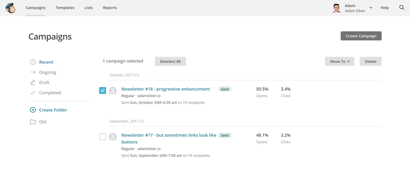

We could highlight the entire row using CSS and Javascript, but we should only do that if user research shows this will *Add value* (principle 7).

## An Action Menu

Letting users select multiple emails is all well and good, but we're going to want to facilitate actioning them too. Unlike the forms designed in previous chapters, this form contains multiple submit buttons with a new visual and interactive treatment that needs to be considered.

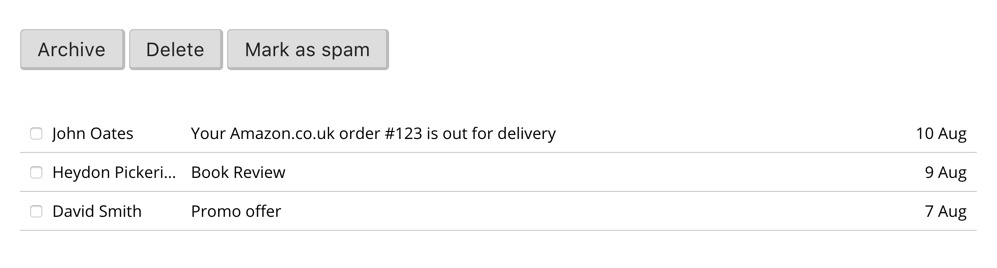

### Implicit Submission And Multiple Submit Buttons

Implicit submission lets users submit the form by pressing <kbd>Enter</kbd> when focus is within a field. This is convenient convention that speeds up submission without having to move focus to the submit button. This is particularly useful for a search form because it normally only consists of a single field.

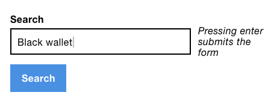

The problem is when there's multiple buttons because each button performs a different action. If the user presses <kbd>Enter</kbd>, which action should be taken? The answer is that browsers will choose the first button in the document source.

To mitigate this, try and split the actions into separate pages so that there's just one action per form. Depending on the design, this may not be easy — as is the case wit the inbox.

One way could be to ask users which action they want to perform before selecting the emails, but this seems a little long-winded.

Fortunately, multi-select interfaces usually place related controls at the top of form in close alignment to the checkboxes. This gives users a way to discover the available actions before making their selection.

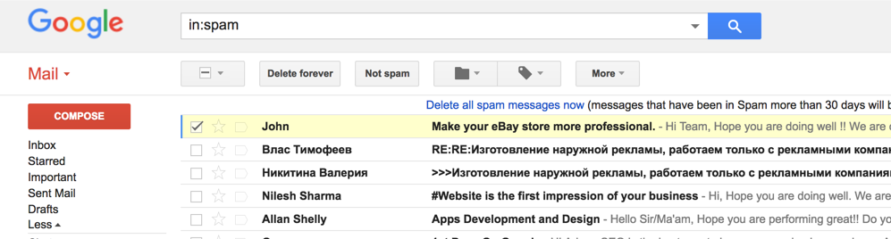

It's worth noting that implicit submission is probably less useful on a form consisting solely of checkboxes. But, if you need multiple submit buttons, put the least critical action first — in this case, *archive*. That way, if the user accidentally submits the form implicitly they'll be in less of a predicament.

Another way to design for this, is to offer users a way to *undo* their last action. We'll discuss this shortly.

### Sticky Menus

The menu is placed above the list of emails so as users scroll it might disappear off screen. A sticky menu, however, would stay on-screen as soon as the menu gets to the top edge of the viewport.

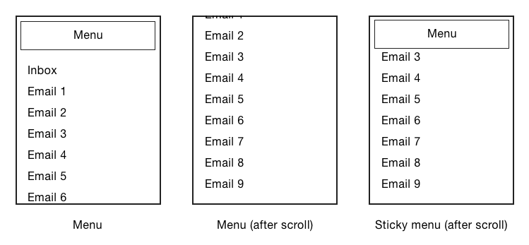

Similarly, Material Design has the floating action button. As users scroll, the action button floats on top of the content. Both of these techniques give users quick and easy access to the menu without having to scroll back up to the top.


However, sticky menus are problematic for several reasons. First, they obscure the content beneath which is especially jarring on smaller viewports as the menu imedes access to the primary content. In the case of the inbox, the primary need is to read and respond to email — not to bulk action it.

Second, sticky menus are usually employed to solve symptoms that mask the true underlying problems. That is, that the page is often too long in the first place. An inbox typically shows just 20 emails at a time, which means the menu is, at most, a quick flick away on mobile and always in view on desktop.

For these reasons, it's better to position the menu statically.

*(Note: where sticky menus are useful, you can use `position: sticky` as a progressive enhancement. In the past, we had to resort to complicated techniques that create a terrible experience across a range of mobile and tablet devices[^6].)*

### Disabling And Hiding Buttons

Some multi-select interfaces will hide or disable the menu buttons until at least one item's been selected. You could argue that showing (or enabling) the buttons in response to selecting an item helps users take the next step. In the case of hiding the buttons, the interface becomes more streamlined as they're only shown as they become relevant.

On the flipside, this only — potentially — helps sighted users. Even then, they'd have to be within the viewport to notice them. This is not a particularly inclusive approach to design. We also discussed the full range of problems associated with disabling buttons in “A Registration Form”. As a quick reminder, they don't let users know why they're disabled and they are not focusable to screen readers.

Decluttering an interface is a noble goal, but not at the cost of clarity and inclusivity. Instead of hiding buttons, make room for them early in the design process. Hiding functionality away from users and requiring them to reveal that functonality should be a last resort.

### Menu Types

On large viewports - or responsively speaking, when there is enough space - we should just lay out the submit buttons to make them available to users at all times. On desktop, there's rarely any reason to hide the buttons. However, the inbox could have other components such as a search bar or Gmail's layout menu *comfortable*, *cozy* and *compact* menu. This means there may not be enough space to lay out the buttons comfortably.

Similarly, on small viewports, if there are more than two or three buttons, they're likely to stack beneath each other. This pushes the main content down the page - having the menu dominate the interface like this is problematic. *Dominance* is a quality we should use sparingly. After all, if everything dominates, nothing does. The inbox itself should take center stage with the menu taking a back-seat role.

As noted earlier if there's enough room to lay out the submit buttons then do so. But if there isn't, we can keep the interface clean and easy-to-scan by hiding the options in a menu.

There are two ways to create a menu. First by using a standard `select` box and second by creating a custom menu component. Let's discuss the pros and cons of each next.

#### A Select Box Menu

Select boxes are a menu of sorts. In fact, select boxes, are also referred to as drop-down *menus*.

Like a menu, they group similar items together that users can select. And they hide the items behind a click, keeping the interface compact. They're an attractive option because, as we know, browsers supply them for free. However, even though select boxes look like menus and behave like them; and even though they are sometimes referred to as menus — they aren't true menus.

Select boxes are for input. That's why forms that contain select boxes — like any other input — must be accompanied by a submit button to submit the choice. Not only is this convention, but it's also in the Web Content Accessibility Guidelines (WCAG)[^4]:

> Changing the setting of any user interface component does not automatically cause a change of context.

The reason I bring this to your attention is because using a select box as a menu, usually means omitting the submit button and causing the form to submit `onchange` using Javascript without the user's say-so. This fails principle 4, *Give control*, by taking control *away* from the user.

This also causes problems for screen reader and keyboard users. For example, on Chrome (Windows), the form is submitted as soon as the user presses <kbd>Down</kbd> to select the next option. Moving beyond that option is impossible.

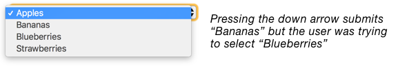

This isn't a browser bug. It's just that some browsers are more forgiving than others. The forgiving ones only submit the form by pressing <kbd>Space</kbd> or <kbd>Enter</kbd>. Unfortunately, not all browsers are alike or implement the specification consistently. Ignoring people who use a less forgiving browser doesn't make the problem any less real for them.

The other problem with using a select box, is that it's always collapsed, even when there is enough space to lay out the options. One solution is to create a completely different component for big screens using Javascript. This is known as adapative design.

### Adaptive Design Versus Responsive Design

When the web came along, we settled on 640px widths. Then a few years later, when larger monitors came to market, we changed to 960px widths. We no longer cared about people with small monitors.

Then more years passed. The mobile web was born. Or more accurately, we could use websites on our phones, which happen to have small screens. A million browsers came out. A million devices came out. And browsers gave us CSS media queries.

Accordingly, we started to design for 320px widths. Why? because many of us had iPhones and this happened to be its width in portrait mode.

Now we have tablets, desktops and really big desktop screens. And we can browse on large screen televisions. Then all the way back down to watches with tiny viewports. If your head is spinning, don't worry, so is mine. This is the problem that responsive design solves and adaptive design exacerbates.

The difference between responsive and adaptive design is both subtle and crucial. Both techniques are based on viewport width. And both use CSS media queries to change the interface. But they are quite different.

Adaptive design means defining several predefined interfaces for specifically chosen viewport widths that correspond to a particular device. All the code for the different interfaces are sent to the browser. Then the interface that matches the predefined media query is applied accordingly. These media queries are known as device breakpoints. That is, a breakpoint which is defined based on a device's width.

```CSS
@media only screen and (min-device-width : 375px) and (max-device-width : 667px) { /* STYLES GO HERE */}
```

Using this approach is normally unnecessary and counterproductive. First, there is an endless stream of devices and browsers with different widths. Creating specific designs for every device width is impossible. And the extra code needed to produce such designs would result in slow loading pages. Generally speaking adaptive design should be a last resort.

Responsive design takes a different approach. It's about designing a single, fluid interface that works well at any size regardless of device. Specific browsers and device widths become irrelevant. The difference is that you only add a media query when and if the something breaks. These media queries are known as content breakpoints.

```CSS
@media only screen and (min-device-width : 61.37em) { /* Fix broken layout for a particular selector here */}
```

Where adaptive design tries to bend the web to its will, responsive design embraces it. Responsive design understands that you can't possibly design for every device and browser individually. That's just not how the web works. Instead, responsive design encourages us to design interfaces that work on any size screen.

The select box design from earlier requires an adaptive approach. On small viewports, users get a select box. Then, when there is enough space, it's swapped for set of submit buttons, laid out in a row.


In this case, the big screen view entirely discards the select box in favour of a different interface using CSS and Javascript. Not only does this mean more work, but the page will take longer to load. And we either have to change the HTML dynamically with Javascript, or we have to have both layouts in HTML, ready to be enabled and disabled through a CSS device breakpoint.

```CSS
@media only screen and (min-device-width : 30em) {
  .smallScreenMenu {
    display: none;
  }

  .largeScreenMenu {
    display: block;
  }
}
```

If that weren't enough, the server needs to be aware of how both menus transmit data. That is, the select box sends different data to the submit buttons. Not only is all of this more work, but there are now two separate features to maintain indefinitely.

### Hover Versus Click

On the web, menus are often opened on hover. There are many problems with opening a menu or revealing anything else for that matter this way.

First, hovering is not an intention to open the menu. When a user moves over a menu that opens on hover it can obscure the content behind which disrupts the experience. With the inbox, as the user goes to select the first checkbox, they may accidentally end up clicking one of the items in the menu which fails principles 4, *Give Control*.

Second, users have to be careful to keep the cursor within the bounds of the menu, otherwise it will close. This is known as a hover tunnel, and is especially difficult to operate with motor impairments.

Third, not all users use a mouse (or other pointing device) and touch-screen devices are usually operated without one. So you need to show the menu on click anyway. If you wanted to open the menu on hover for large viewports and on click for small ones, think again. There are many large touch screen devices.

### A True Menu

Aware of the pitfalls of both adapative design and opening a menu on hover, we can proceed to design a true, responsive menu that opens on click.

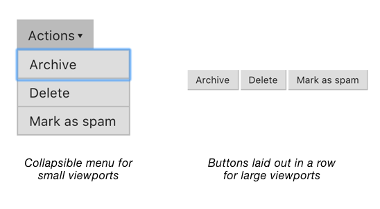

```HTML
<div role="menu">
  <input role="menuitem" type="submit" name="archive" value="Archive">
  <input role="menuitem" type="submit" name="delete" value="Delete">
  <input role="menuitem" type="submit" name="spam" value="Mark as spam">
</div>
```

The menu has a role of `menu` indicating that it contains menu items. When the menu is focused, screen readers will announce it as a three-item menu. You should note that the `menu` role isn't commonly used in web applications. Only ones that mimic desktop applications (like this one, which is essentially a web-based Outlook application) apply.

When there isn't enough room to display the menu items inline, they'll stack beneath each other taking up a lot of space. To avoid this, we can use media queries and Javascript's `matchMedia` API to collapse the buttons inside a traditional menu:

```JS
Menu.prototype.setupResponsiveChecks = function() {
  this.mq = window.matchMedia('(min-width: 40em)');
  this.mq.addListener($.proxy(this, 'checkMode'));
  this.checkMode(this.mq);
};

Menu.prototype.checkMode = function(mq) {
  if(mq.matches) {
    this.enableBigMode();
  } else {
    this.enableSmallMode();
  }
};
```

The `matchMedia` API is the Javascript equivalent of a media query. Where `@media() {}` is for CSS, `matchMedia()` is for Javascript. It's a way of keeping behaviour and style in-sync based on the same media query. In this case, when the viewport's width is less than `40em` the script will construct a toggle menu (small mode). When it's more than `40em` it will construct a horizontal menu (big mode).

Before `matchMedia` we had to use flakey techniques to get the width of the viewport[^]. Even then, you could only get the value in pixels, not `em`s. It's preferrable to use `em`s because if the user increases the the size of text, the layout will adapt in proportion.

When small mode is enabled, the enhanced HTML is updated:

```HTML
<button type="button" aria-haspopup="true" aria-expanded="false">
  Actions
  <span aria-hidden="true">&#x25be;</span>
</button>
<div role="menu">
  <input role="menuitem" type="submit" name="archive" value="Archive">
  <input role="menuitem" type="submit" name="delete" value="Delete">
  <input role="menuitem" type="submit" name="spam" value="Mark as spam">
</div>
```

Notes:

- The `aria-haspopup` attribute indicates that the button shows a menu. It acts as warning that, when pressed, the user will be moved to the “popup” menu.
- The `<span>` contains the unicode character for a down arrow. Conventionally this indicates visually what `aria-haspopup` does non-visually — that pressing the button reveals something. The `aria-hidden="true"` attribute prevents screen readers from announcing “down pointing triangle” or similar. Thanks to `aria-haspopup`, it’s not needed in the non-visual context.
- The `aria-haspopup` attribute is complemented by `aria-expanded` which tells users whether the menu is currently expanded (open) or collapsed (closed) by toggling between `true` and `false` values.

#### Keyboard And Focus Behaviour

When the menu button is clicked, the script checks to see if the menu is currently open be checking whether `aria-expanded` is set to `false`. If it is, the menu is shown and focus is moved to the first item. If it isn't, we hide the menu and move focus back to the menu button.

```JS
Menu.prototype.onMenuButtonClick = function() {
  if(this.menuButton.attr('aria-expanded') == 'false') {
    this.showMenu();
    this.menu.find('input').first().focus();
  } else {
    this.hideMenu();
    this.menuButton.focus();
  }
};
```

We can use the `[aria-expanded]` CSS attribute selector to toggle the menu's display:

```CSS
[aria-expanded="true"] + .menu-items {
  display: block;
}

[aria-expanded="false"] + .menu-items {
  display: none;
}
```

When focus is on a menu item, pressing <kbd>down</kbd> or <kbd>up</kbd> arrows will move to the next or previous item, on loop. Pressing <kbd>escape</kbd> on a menu item will move focus to the menu button and closes the menu. Sometimes, <kbd>Home</kbd> and <kbd>End</kbd> are used to go to the first and last items directly which is particularly useful if there are lots of menu items.

## Select All

Users may want to, for example, archive every email in their inbox. Rather than selecting each email, one by one, we can provide a more convenient method. One way to service this functionality is through a *special* checkbox, placed at the top and in vertical alignment with the others creating a visual connection. Clicking it checks every checkbox in one fell swoop.

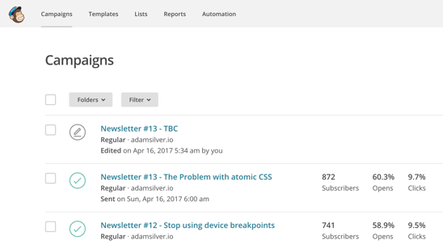

Arguably, this standard input has all the ingredients of an accessible control as it’s screen reader and keyboard accessible. It communicates through its label and change of state. Its label would be *Select all* and it's state would be announced as *checked* or *unchecked*. All this behaviour without any Javascript.

By now the benefits of using standard elements should be well understood. Despite this control being accessible by mouse, touch, keyboard and screen readers, it just doesn't quite feel right. Accessibility is only a part of inclusive design. This control should look like what it does.

The trouble with using a checkbox is that they don't signal what they do. Like select boxes, they are associated with collecting data for submission. We should match peoples's expectation by using the same interface component for the same job. In doing so, the interface becomes familiar and consistent which speaks to principle 3, *Be consistent*.

Like the menu button, we can use the `<button>` element again to create a true toggle button. What's missing is that buttons don't have the concept of *toggling*, but we can enrich their semantics with ARIA.

```HTML
<button type="button" aria-pressed="false">Select all</button>
```

The `aria-pressed` attribute will be announced by screen readers as ‘button, select all, pressed’ (or similar). Pressing the button toggles the attribute between `true` (pressed) and `false` (unpressed). We can convey the same meaning for sighted users by styling the button with CSS.

```CSS
button {
	/* styles */
}

button[aria-pressed="true"] {
	/* styles*/
}
```

## Success Messages

When the user submits the form, the selected emails will disppear from their inbox. When an action has been completed, telling users that it has been completeed a respectful thing to do. Not doing so leaves users to wonder what happened, if at all.

In chapter 1, “A Registration Form”, we designed and constructed an error summary panel that resides at the top of the page. A success message needs a similar treatment with a couple of tweaks.

Instead of having red colouration, it should be green which is universally associated with success. Second, the content should be “You've successfully archived 15 emails” (or similar).


```HTML
<div class="successMessage" role="alert">
  <h2>You've successfully archived 15 emails.</h2>
</div>
```

Both the error and success message panels are placed within the natural flow of the document and toward the top of the page to indicate their importance. The `role="alert"` attribute as noted in “A Registration Form” ensures that screen readers will announced it when the page loads.

### Toast Messages

Some applications employ what is known as a ‘toast’ message or notification. When the application needs to notify users, a little (non modal) dialog will pop-up on top of the page - a bit like a piece of toast. Then, after a certain amount of time the notification disappears automatically, usually with a fading out animation.

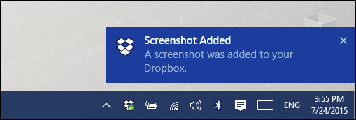

This is all very interesting from a design perspective, but it's hardly a useful way to communicate. First, the message obscures the content beneath. Second, users have to read the message before it disappears. This makes comprehension a stressful task and takes control *away* from the user.

Really, a success message should be laid out bare and placed within the natural flow of the page. There is no need to obscure parts of interface. After all the message is temporary and will naturally disappear when the user leaves the page.

However, if research shows that being able to dismiss a message *adds value*, you can offer the functionality in the form of a button. When clicked, it hides the message.


Be careful to inject the `<button>` with Javascript. If we put it in directly in the HTML, then the interface will appear broken when Javascript is unavailable. That is, clicking the button will do nothing.

### Confirming Versus Undoing

As a safety measure, some roads have speed bumps. They cause drivers to slow down on roads that are more likely to cause accidents. We can create a digital speed bump by asking users to confirm their action (shown below. 

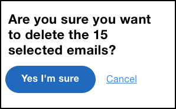

This is fine for infrequent tasks but it quikcly becomes tedious when that action needs to be performed more often. Continuing with the driving analogy then: it's a bit like puttings speed bumps on the motorway. They'd probably cause more accidents, not less.

An alternative approach would be letting users perform the action immediately, without any warning. Then, along with the success message, give users the choice to undo their action. Clicking *undo*, would reverse the action by restoring their emails back into their inbox. If only we could *undo* accidents on the road.


## Summary

In this chapter we began by choosing the right way to present a collection of emails and the impact of combining two disparate modes - reading email and actioning it - into one interface. We then looked at how a mult-select form is different to most other types of form and how this caused us to consider several other visual and interactive design treatments. Finally, we looked at ways in which to *add value* and put users firmly in control by designing consistent interfaces that give users feedback and a way to undo their actions.

### Things To Avoid

- Using the wrong element for the job and fixing it with Javascript.
- Using ARIA when standard HTML can be used instead.
- Using checkboxes and select boxes for buttons and menu components.
- Doing work that doesn't *add value*, such as highlighting selected rows.
- Disabling submit buttons until the form becomes valid.
- Hiding notifications automatically.
- Putting “speed bumps” in front of repetitive tasks.

## Footnotes

[^1]: https://en.wikipedia.org/wiki/List_of_people_known_as_%22the_Great%22
[^2]: http://whatis.techtarget.com/definition/inbox-zero
[^3]: https://resilientwebdesign.com/chapter2/#Using%20TABLEs%20for%20layout%20is%20materially%20dishonest.
[^4]: https://www.w3.org/TR/UNDERSTANDING-WCAG20/consistent-behavior-unpredictable-change.html
[^5]: https://www.smashingmagazine.com/2011/01/guidelines-for-responsive-web-design/
[^6]: http://bradfrost.com/blog/mobile/fixed-position/