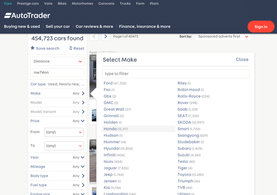
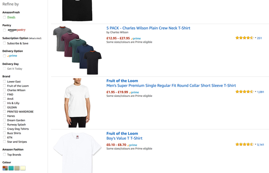

# A Filter Form

- Introduction
- When To Apply Filters
	- Interactive Filters
	- Batch Filters
- Feedback
- Links Versus Forms
- Feedback
- Material Dishonesty
- AJAX
- ARIA Landmarks
- Adaptive Design
- Filter Overload
- Summary

In the introduction to “A Search Form”, you'll recall the type of conversation I used to have with Mum. Sometimes I would ask “Where's my black top?”. But this was so vague that Mum would respond with questions like “Is it a football or tennis top?”. This question is a filter on a large set of results.

On the web, filters, sometimes referred to as facet navigation or guided navigation, let users refine a large set of search results. Were filters straightforward, I could have folded this pattern into the last one, but there are a number of challenges and concerns to address: the type of element to use; keeping to conventions; potential AJAX enhancements; how to make it work just as well on small screens as it does on large ones. All of these things need to be taken into account.

First of all, though, it needs to be said that if you don't need a filter, don't include one. They're only useful if searching returns a large amount of relevant items to wade through. In the case of Google, for example, most people aren't willing to click through beyond the first or second page.

On the web, a search can yield thousands, or even millions of results depending on the content available. But, as humans, we can't juggle more than approximately seven things at one time[^1], so being able to narrow them down is crucial. The ability to filter not only offers an additional dimension of control, but it does so in a way that matches each user's own mental model. In “Designing for Faceted Search”[^2], Stephanie Lemieux says:

> Think of a cookbook: authors have to organize the recipes in one way only - by course or by main ingredient - and users have to work with whatever choice of organizing principle that has been made, regardless of how that fits their particular style of searching. An online recipe site using faceted search can allow users to decide how they’d like to navigate to a specific recipe [by course type, cuisine or cooking method, for example].

While filters often look similar on many sites, their behaviours vary widely. What interface components should be used, when to apply the filtering, how to inform users of the updated results: it all needs consideration.

## When To Apply Filters

There are two ways to let users filter: selecting multiple filters at once (batch filters), or just one at a time (interactive filters).

Think about how you might order your lunch at a restaurant. Say you want to order 2 dishes, but as soon as you say the first one, the waiter walks away to tell the chef to start cooking the dish (interactive). Fortunately, waiters don't do this: they give you time to give the entire order before walking away, even though it might slightly delay the delivery of the first dish.

On the other hand, a waiter might first take your drinks order, to give you more time to decide on the mains. A good waiter knows to adapt to the needs of the customer.

Both batch filters and interactive filters have pros and cons. And the type of filter you decide to use should be based on the type of data you're dealing with, the user needs, speed of the site and as we'll find out, the size of the screen. It also impacts the way the interface is designed.

### Interactive Filters

If users don't know exactly what they want, then they'll want to know about the options available to them. These users normally benefit from interactive filters: as soon as they choose a filter, the results are displayed with the new applicable filters. 

For example, once they choose “starters”, new filters such as Cold and Hot will be shown. This helps the user avoid seeing zero-search results. 

The disadvantage is that each time a filter is clicked, a request has to be made and the page has to be refreshed. Also, keyboard users will have to tab back to the filter section. If the user is likely to need many filters, this merry-go-round isn't ideal.

However, with that said, generally speaking, the page refresh isn't a problem if you employ light-weight, well-optimised, single-focused pages. And we can help keyboard users get back to the filter by using a landmark.

#### Using Links

Do I discuss links here?

#### ARIA Landmarks

Stuff here about ARIA landmarks (check previous chapters)

### Batch Filters

Users who already know what they're looking for will benefit from batch filtering. For example, say they want a black, slimline wallet. Once they get to the wallets category they'll filter based on colour and size.

The downside is that there's a risk that the combination of filters could lead to zero-results — something that interactive filters don't suffer from. 

The advantage of this approach is that it's faster, as users make just one request before seeing the results.

## Links Versus Forms



Links let users filter a list of a results via the querystring. The querystring is the part of the URL that starts with a question mark:

```HTML
<a href="/filter/?make=honda">Honda (12,221)</a>
```

When the link is clicked, it makes a GET request. When the querystring is present, the server can use the values “make” and “honda” to determine which cars (in this case) should be shown to the user.

While links are not forms, they can be used in place of them in situations where the data on the server isn't being modified and the values being sent to the server aren't being typed. In this case, the server just needs to know what data to present. Here's a form that makes the same request as the link above:

```HTML
<form method="get" action="/filter/">
	<input type="radio" name="make" value="honda" checked>
</form>
```

The radio button's `name` and `value` attributes combine to create a request that matches the link's `href` attribute. That is, they make the exact same GET request and the server sees this as the same thing.

Each time a user chooses a filter, such as Honda, it will be added to the currently applied filters. But that's not all, the remaining filters will only be included if they match “Honda”. For example, if there are only green and white hondas available, then you won't see red or blue filters under “Colour”.




## Material (Dis)honesty (Again)

We already discussed material honesty earlier in the book. That's because dishonest interfaces are prevalent on the web. In short, one material shouldn't be used as a substitute for another because in that case the end result is deceptive.

In the case of filters, links are often styled to look like radio buttons or checkboxes (using CSS background images for example). The problem is that a radio button is not a link. When a link is clicked, it takes the user to that page.

The styling of native checkboxes and radio buttons differs greatly across various operating systems and devices. Therefore, a pseudo, CSS-styled version is always going to look different to the familiar version users are acustomed to on *their* browser. This creates a less familiar interface. But there's more to this than just vaneer.

By convention, a set of radio buttons can be moved through before submitting the choice. That's just how forms work. It would be confusing if clicking - what looks like - a radio button, suddenly appeared to submit the form automatically (because it's actually a link). That's materially dishonest and therefore deceptive.


> ‘Use checkboxes and radio buttons only to change settings, not as action buttons’ - Jakob Nielsen

Similarly, checkboxes and radio buttons are made to behave more like links. With a little Javascript, clicking a radio button can be made to submit the form automatically. This is particularly problematic for keyboard and screen reader users, because they'll struggle to move through the options. This would also remove the ability to select multiple options at the same time.

Breaking widely understood conventions that relate to links and form controls can seriously harm the resulting experience. By keeping to conventions, users who encounter these components both visually and audibly, don't have to think.

## Using AJAX

Earlier we discussed the pros and cons of using links and form controls. Using links, may cause users to endure many page refreshes. And using form controls, may increase the chance of users seeing no results.

For keyboard and screen reader users, having a page refresh means having to wade through all the page information again, such as header and navigation before getting back to the filter or the results, although they can skip that easily if landmarks are employed.

In any case, AJAX can be used to avoid this problem. For example, clicking a radio button could instantly submit the form with AJAX. When the request finishes, the page is updated and the focus remains unaffected. This also reduces the chance of seeing no results because as soon as the user selects a filter, the interface updates.

As many applications have materially dishonest filters, some users have acclimatised to this change in convention (that clicking a checkbox, for example, submits the form). Users may not realise they have to submit their choices. AJAX may help because it removes the need for the submit button.

You'd be forgiven then, for thinking this is a must-have, totally-beneficial enhancement. Unfortunately, submitting automatically goes against principle 4, to *give users control*. By removing the explicit act of submission, it's possible that triggering multiple AJAX requests will cause an unexpected and confusing experience.

Additionally, keyboard users who are operating the filter must use their arrow keys to move through each radio button. Not only does this set focus to the radio button, but it selects it too. Selecting the fourth radio button will inadvertently create four AJAX requests unknowingly. This adds increased load on the server, but more importantly, it will eat users' data allowance and cause battery drain on their device.

That's not all. Using AJAX requires a certain number of provisions such as a live region (extensively covered in chapters 1, 2, 3 and 5) to indicate loading states. When the user selects an option, the live region would have to be populated with ‘Loading results, please wait’, for example. Then when the request finishes, it would have to be populated with ‘212 results returned’. Having to hear this four times would be like listening to an overzealous disc jockey - headache inducing.

Despite what you may have heard, AJAX isn't necessarily better or faster than a standard page refresh[^3]. First, it requires more Javascript code to be sent initially. Second, and more importantly, it engineers away progressive rendering (also called chunking) and removes loading states, both of which the browser provides for free.

AJAX is more suited and beneficial when making updates to small parts of the page. Filters involve updating the majority of the page, making AJAX somewhat counterproductive.

All that said, we can only be sure of what's best if we research with a diverse set of users using a diverse set of devices.

## An Adaptive Approach

In chapter 5, “An Inbox”, we discussed the differences between responsive design and adaptive design. In short, a responsive approach is normally preferred because not only is it less work, but it's more robust and performant for users.

Mobile first, to me at least, just means small screen first. Which really means essential first, which to me just really really means essential only. The essential components here are the results panel and the filter widget.

Normally speaking, if you cut out the superfluous content and lay out what remains in a small viewport, the experience works well. Of course, this scales up nicely to large viewports too: an increase in font-size and whitespace is usually enough.

But because the filter widget is important, it needs to be almost as prominent as the results. On large viewports this is easy: you just lay them out side by side. But on small viewports, you'd have to place the results underneath the filter which pushes the main content down.

If the filter is placed after the results, then users would have to scroll past the results just to discover it. Many users would miss it.

We could collapse the filter widget above the results. This way the filters are discoverable without pushing the main content too far down. While this is a responsive approach, it's not the whole story.

I interviewed David House, a former designer at Gumtree where filters are a major part of the experience. As such, he and his team conducted extensive user research around their search results page. Here's what David had to say:

> On desktop, Gumtree users expected AJAX. Filters were selected but not submitted. They didn't realise they had to submit their choices. We got a lot of feedback saying “Your filters are broken.” We tried moving the apply button to the top (and the bottom) along with making it sticky; loads of things that didn't really make a difference.

But what about mobile?

> On mobile, AJAX wasn't desirable because users couldn't see any visible refresh. We didn't want to move focus to the results, because users wanted to pick more than one filter. Not to mention that using AJAX is a waste of bandwidth.

That's two opposing problems which are solved with completely different approaches.

> We reluctantly had to use an adaptive approach. On mobile, clicking the filter menu, would send users down a guided flow without AJAX. On Desktop (when there's enough space to show the filters next to the results), users got an AJAX experience where filters were immediately applied.

I asked Dave if he would use the same approach in future.

> Not necessarily. I wouldn't start with this approach. If a site doesn't have a lot of ads [like Gumtree does], we'd probably have better luck drawing attention to the submit button.

===

That is the main reason for which, on mobile devices, we recommend batch filtering — page loads are often slow on the go, and having to wait for four page loads for a complex query involving four filter values increases interaction cost too much for the user.

===

## TODO: Feedback

Don't automatically move the user to the new results. However, if you have a long list of facets on desktop, and not many results, the user may not realise they need to scroll up to see the results.

## TODO: Filter Overload

Beware not to go crazy with filters. Overloading users with hundreds of filters makes their job harder, not easier. This is partially because of the paradox of choice which we discussed in “A Login Form”.

If you're not sure which filters to show, perform user research and check your analytics. Extract the most popularly used filters and include just those — in order too. Then you can either remove the others or reveal them as they become relevant as the user drills down.

## Summary

This chapter looked at various interaction design details pertaining to responsive search results page. We looked at how design can shape users — so much so — that occasionally we may have to abandon convention and best practice. To that end, we looked at how adapative design may be better for users.

### Things To Avoid

- Making links look like radio buttons and checkboxes
- Making checkboxes and radio buttons behave like links
- Assuming AJAX always creates a faster and better experience
- Prioritising best practice above user research

## Demos

TBD

## Footnotes

[^1]: https://en.wikipedia.org/wiki/The_Magical_Number_Seven,_Plus_or_Minus_Two
[^2]: https://articles.uie.com/faceted_search/
[^3]: https://jakearchibald.com/2016/fun-hacks-faster-content/

====

- stick with food/restaurant analogies throughout and dont use screen shots?
- https://www.nngroup.com/articles/applying-filters/

TODO: Speed: how fast you can produce the results. If you expect the queries to be instantaneous then interactive filtering will be less offensive even to users in search mode. If your site can be slow, then batch filtering saves wait time.

TODO: talk about the fact that some categories may make better sense if you can only select one. In this case you'd use a radio button of course. The advantage over links is that checkboxes and radio buttons have perceived affordance. If some links were used for AND and some for OR that would be confusing and leads to materially dishonest interface, something we'll discuss next.