# An Upload Form

The web is more than just text. Whether it's sending a CV to a recruiter by email, or adding photos to an Ebay advert, we need to let users upload files. Forms have this capability baked in of course.

On one hand, uploading a file is only marginally more complex than say, inputting text or clicking a checkbox. On the other hand, there are number of unique design challenges and opportunities that arise, especially when there's a need to upload multiple files at the same time.

As usual, we'll start by looking at what browsers give us for free. After that, we'll look at adding various enhancements and the various issues that surface as a result of those enhancements. In the end, we'll end up with a number of different ways to upload a file, appropriate for several different occasions.

## A File Picker

A file picker (`<input type="file">`) is another type of form control. When clicked, it will spawn a dialog that let's users browse their files on their computer or device. Once a file is selected, the dialog closes and the picker updates to reflect the file has been chosen.

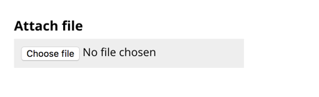

If all users need to do is upload a single file, then you can add a file picker to your form and you're pretty much done:

```HTML
<form enctype="multipart/form-data">
  <div class="field">
    <label for="documents">
      <span class="label">Choose file</span>
    </label>
    <input class="field-file" type="file" id="file" name="file">
  </div>
  <input type="submit" value="Upload" name="upload">
</form>
```

Notes:

- The form has a `enctype="multipart/form-data"` attribute, which ensures the file is transmitted to the server for uploading
- The file picker uses the same pattern as first described in “A Registration Form” and throughout the book, which can take a hint an error message.

### Restyling The File Picker Is Dangerous Territory

Some designers like to restyle the file picker to:

- achieve consistency between different browsers and operating systems
- match the brand's look and feel
- be able to configure the control's text

Whether you agree with all of these reasons or not, it must be said that *pretty and useless* is considerably worse than *ugly and useful*. But this doesn't mean aesthetics aren't important: where possible we should marry form and function together.

However, it's just as important to make sure that any techniques we employ to achieve these goals doesn't cause any adverse usability issues. Like modern medicine, that's a bit like taking one pill to fix one symptom, only to need additional pills to relieve the side-effects that come from the first pill.

When it comes to file pickers, styling them has always been tricky because browsers ignore any attempt at doing so with CSS. This means we have to resort to hacking, which is not usually a good idea—that's why it's called hacking. But, let's walk through how it could work, what can be achieved and the pitfalls that are involved.

#### Hiding The Input

The most robust way of styling the file picker is to visually hide it like this:

```HTML
<div class="field">
  <label for="file">
    <span class="label">Choose file</span>
  </label>
  <input class="visually-hidden" type="file" id="file" name="file">
</div>
```

*(Note: The CSS for the visually hidden class is set out in “Checkout”.)*

Now that it's hidden, we can style the control's label, which *is* easy to style. As described in “A Registration Form”, this works because a control's label acts as a proxy to the control itself. In this case, this means clicking the label is like clicking the input.

#### Styling The Label

Now the input is hidden, we need to style the label so that it looks interactive. To make it look interactive, we need to style it as a button and change it's text to “Upload file”.


#### Focus States

Now the label looks clickable and is clickable we need to think about focus states. 

As the input is visually hidden, when the user tabs to it, the user won't get any feedback that it's in focus. To do this, JavaScript can be used to give so that when the input is focused a class of `focused` is added to the label so that we can style it to look focused:

```CSS
.focused {
  /* focus styles */
}
```

#### Reflecting The Chosen File

When the user selects a file from the dialog, it's the input that will change state (as shown earlier). To reflect the chosen file we'll need to update the label text when the input's `onchange` event fires.

```JS
$('[type=file]').on('change', function(e) {
  // change label
});
```


#### Pitfalls

On the face of it, this implementation is visually pleasing and still accessible. Keyboard, mouse and touch users can operate it normally and screen readers will announce the value of the input. 

But that's not all it takes to design a fully inclusive and robust custom file picker interface. There are a number of additional considerations that this solution doesn't solve very well at all.

1. Updating the label to reflect the input's value is confusing because the label should describe the input and remain unchanged. In this case, screen reader users will hear “cv.doc” as opposed to “Attach document”.
2. The interface doesn't fit with the established convention of providing hint and error text, as set out in “A Registration Form”. Not only would we need to think of another way to provide this information, but it creates an inconsistent and unfamiliar user experience.
3. File inputs are actually drop zones which means they let users drag and drop files (instead of going through the dialog). Hiding the input means forgoing this behaviour which some users may prefer.
4. There's not much room inside the button for a large file name. Remember, good design adapts well to varying lengths of content.

Considering the pitfalls, the improvement to aesthetics doesn't seem to justify the downgrade in usability and utility.

## A Multiple File Picker

Very few tasks on the web, require a user to upload just a single file at a time. Take the two examples from the introduction to this chapter. Both attaching files to an email and uploading photos to an Ebay advert involve uploading multiple files in one go.

The easiest, but most problematic way to solve this would be to add the `multiple` boolean attribute to the file input:

```HTML
<input type="file" multiple>
```

This provides the same method of file selection as described above, except that users can select multiple files from within the dialog.

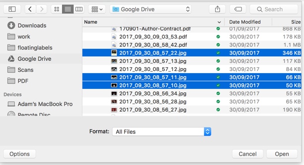

That would be it, if you ignored two significant problems:

First, users can only select files within a single folder. If they need to upload files in different folders they can't. Of course, users could move all the files into a single folder beforehand but this puts the onus on the user.

Second, not all browsers support the multiple attribute. And when support is lacking, a single file input may be found wanting.

For example, take a form which asks users to submit receipts. When the `multiple` attribute is supported, users can upload all the relevant receipts and submit them. Without support, users can only upload a single receipt.

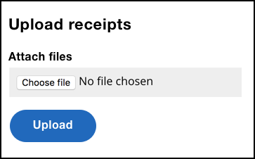

One way to solve this problem involves giving users a way to add additional files as part of the flow:

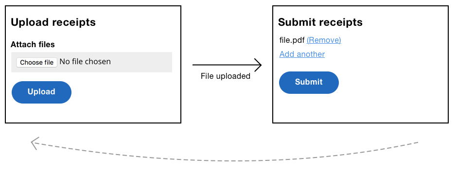

Not only does this design let users upload multiple files in unsupported browsers, but it also lets the user review their submission which is a useful addition regardless. 

## A Persistent Upload Form

Most forms are ephemeral—users submit a form and they're taken to another page without a form. For example, when registering, users are taken to a confirmation screen.

But the task of uploading files means it's useful to give users a form that persists until they're finished on their own terms. This is the persistent form pattern in action.

### How It Might Look

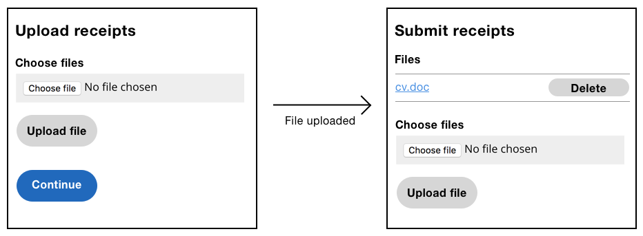

The user can choose and upload a file repeatedly until they've uploaded all the desired files. At which point, they can click the Continue button.

### The Mark-up

```HTML
<form enctype="multipart/form-data">
  <div class="field">
    <label for="documents">
      <span class="label">Attach file</span>
    </label>
    <input class="field-file" type="file" id="documents" name="documents" multiple>
  </div>
  <input type="submit" value="Upload" name="upload">
</form>
```

Note the file input has the `multiple` attribute. When used in conjunction with a persistent form, the multiple attribute becomes a robust enhancement. Where supported, users can select multiple files at a time, meaning fewer requests and a streamlined experience.

However, when not supported, users can keep uploading a single file at a time, as many times as they need to until the task is finished. This solves the problem I mentioned earlier regarding uploading files across different folders.

## A Drag And Drop Enhancement

As noted earlier, the native file input acts as a drop zone to let users drag and drop files. However, there are two problems with it.

First, it's not immediately obvious that dragging and dropping is even possible—there are no signifiers that makes this behaviour perceivable to users. Second, the drop zone has a small hit area, which makes it hard to use, especially for motor-impaired users.

To solve these issues, we're going to take our persistent upload form, and progressively enhance it with better drag and drop functionality. 

### Warning: Is Drag and Drop Necessary?

Depending on the situation, the humble file picker may be all that users needs to upload files. In this case, you may not need to worry about adding a drag and drop enhancement at all. This way, there's less code to send to the user. As a result, this speeds up page load times and simplifies the interface at the same time.

It's also worth noting that a drag and drop enhancement is just that—an enhancement. It should be used in conjunction with a standard file picker. First because users can't actually drag and drag on mobile, for example. Second, users with dexterity problems such as tremors may have difficulty dragging a file.

By giving users both choices, we're safely following principle 5, *Offer choice*.

### How It Might Look

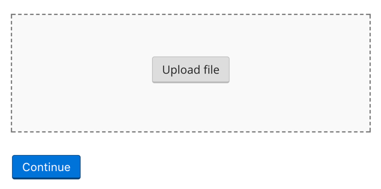

The large drop zone is more ergonomic, especially for people with motor-impairments. It's conventionally styled with a dashed border. However, if your users aren't familiar with this convention, you can add instructional text.

Inside the drop zone, sits a button. When clicked, it triggers the dialog as normal. The button is actually a label *styled* as a button using the ill-advised technique from earlier. But I haven't gone mad, there's good reason for this.

### Why Style The Label As A Button

The dropzone has two methods of interaction: dropping files onto the drop zone and clicking the button.

Browsers don't let you programmatically update a file input's value due to security reasons[^1]. Because of this, we can't, for example, update the file input's value, when the user drops files onto the drop zone. Because of this, files will be uploaded immediately with AJAX (which we'll cover shortly).

Remember, the form has two methods of interaciton: dropping files onto the drop zone and clicking the button. For consistency reasons we want both approaches to upload files immediately (drop zone `ondrop` and input `onchange`). This way, users don't have to think about when (or when not) to submit the form—that interaction is no longer an option.

### The Enhanced Mark-up

Here's the Javascript-enhanced mark-up:

```HTML
<form class="dropzone">
  <div class="field">
    <label for="files">Upload file</label>
    <input type="file" name="files" id="files" multiple>
  </div>
</form>
```

Notes:

- The button's been removed because the files will be uploaded with AJAX `onchange`.
- The “dropzone” class exists as a way to target this particular form for enhancement. 

### Dragover And Dragleave Events

When the user is dragging files over the dropzone, they should be given feedback so that they know that the files can be dropped. 

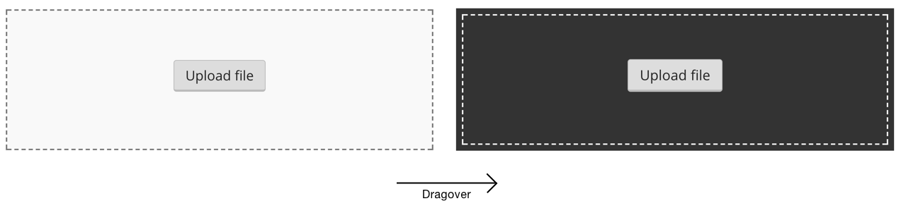

We can achieve this by adding a class onto the drop zone when the `ondragover` event is fired. Similarly, we need to remove the class when the user leaves the dropzone (`ondragleave`):

```JS
Dropzone.prototype.onDragOver = function(e) {
  e.preventDefault();
  this.dropzone.addClass('dropzone-dragover');
};

Dropzone.prototype.onDragLeave = function() {
  this.dropzone.removeClass('dropzone-dragover');
};
```

```CSS
.dropzone-dragover {
  /* styles here */
}
```

Notes:

- `e.preventDefault()` is called to allow the file to be dropped onto the drop zone. Without doing this, the browser will try and load the dropped file instead.
- we can't just use `:hover` because the feedback should only given when a user is dragging a file over the drop zone—not just that the cursor happens to be over the drop zone.

### Dropping Files

Next we need to handle the dropping of the files, which we can do by listening to the `ondrop` event.

```JS
Dropzone.prototype.onDrop = function(e) {
  e.preventDefault();
  this.dropzone.removeClass('dropzone-dragover');
  $('.fileList').removeClass('hidden');
  this.uploadFiles(e.originalEvent.dataTransfer.files);
};
```

Notes:

- `e.preventDefault()` is called to allow the file to be dropped onto the drop zone. Without this, the browser will attempt to load the file instead.
- The `dragover` highlight is removed as the file has now been dropped.
- The file list component is revealed ready to give users feedback as the files are uploaded. More on this shortly.
- The event object (`e`) contains information about the files, which is handed over to the `uploadFiles` method (shown below) 

```JS
Dropzone.prototype.uploadFiles = function(files) {
  for(var i = 0; i < files.length; i++) {
    this.uploadFile(files[i]);
  }
};
```

This method loops through each file and calls the `uploadFile` method, which is explained next.

### Uploading The File

Uploading the file involves two steps: creating the data to be sent and actually sending it.

```JS
Dropzone.prototype.uploadFile = function(file) {
  var formData = new FormData();
  formData.append('documents', file);
  $.ajax({
    data: formData
    url: '/ajax-upload',
    type: 'post',
    processData: false,
    contentType: false
  });
};
```

The `FormData` API is designed to construct key/value pairs that represent form fields and their values, which can then be sent with AJAX, including forms that contain files (like ours does). First, we create a new instance, then we append the file data to it.

For convenience, we're using jQuerys `$.ajax` method. Here's a run down of the properties used:

| Property | Description |
|:---|:---|
| data | The data constructed with `FormData`. |
| type | Set to "post" because data ia being sent. |
| url | The url/endpoint for which the server will process the uploaded files. |
| processData | Set to `false` which tells jQuery not to convert the data into a querystring. This is important as we're sending files, not just text. |
| contentType | Set to `false` which tells jQuery not to override the automatically-created header appropriate for sending files[^boundary]. |

### Feedback

It's all well and good having uploaded the files to the server, but at this moment, the user hasn't been given any feedback as to what's happened. Perhaps the file couldn't be uploaded, for example. There are a number of times we need to give users feedback: during upload, on success and on error.

#### Progress

Files can take a long time to upload, especially if the connection is slow. As such, it's important to give users feedback during upload—not just on completion. 

We can show feedback with a progress bar. Each file is represented separately as there's a separate request for each one. This way, some small files will upload quickly, while others load more slowly in parallel.

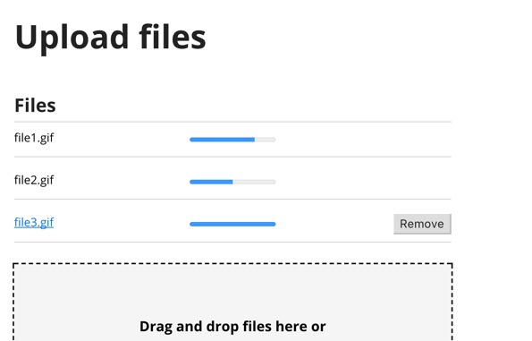

```HTML
<ul>
  <li>
    <span class="file-name">file.pdf</span>
    <progress max="100" value="80">80% complete</progress>
  </li>
  <li>
    <span class="file-name">file.pdf</span>
    <progress max="100" value="50">50% complete</progress>
  </li>
</ul>
```

Supporting browsers display the progress element as a progress bar. The element has two attributes: `max` and `value`. The `max` attribute describes how much work there is to be done. In our case, it's set to 100 as we're working in percentages. The `value` specifies how much is complete which we'll updating with JavaScript.

```JS
$.ajax({
  xhr: function() {
    var xhr = new XMLHttpRequest();
    xhr.upload.addEventListener('progress', function(e) {
      if (e.lengthComputable) {
        var percentComplete = e.loaded / e.total;
        percentComplete = parseInt(percentComplete * 100);
        li.find('progress')
          .prop('value', percentComplete)
          .text(percentComplete + '%');
      }
    }, false);
    return xhr;
  }
});
```

As jQuery (at time of writing) doesn't expose the `onprogress` event, we've created an `XMLHttpRequest` object ourselves.

The handler first checks to see if the server has correctly sent a `Content-Length` header by seeing if `e.lengthComputable` is `true`. If it is, then we can determine how much of the file has been uploaded, which is calculated by dividing `e.loaded` by `e.total`. That value is then converted to a percentage before updating the progress bar.

The progress bar's inner text is also set. This is so that users using a browser that lacks support for the progress element can still see it. That's inclusive.

#### Success

Next, we want to show users when a file has been successfully uploaded. First, the file name is converted into a link so that users can download and verify the file if they wish. Second, we inject a success message of “File uploaded” and a Remove button which is useful if the file was uploaded by mistake.

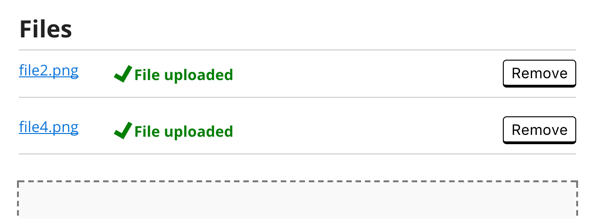

```HTML
<li>
	<a class="file-name" href="/path/to/file.pdf">file.pdf</a>
	<span class="success">
    <svg width="1.5em" height="1.5em">
      <use xmlns:xlink="http://www.w3.org/1999/xlink" xlink:href="#tick"></use>
    </svg>
    File uploaded
  </span>
	<input type="submit" name="remove1" value="Remove">
</li>
```

```JS
$.ajax({
  success: $.proxy(function(response){
    if(response.file) {
      li.html(this.getSuccessHtml(response.file));
    }
  }, this)
});
```

We're using the success callback which receives the response from the server as an object. The response contains a `file` property which contains the path and name of the file. This is used to create the HTML that is injected into the list item.

*(Note: the demo uses Multer and Express to process the request and generate the response object. You can use whatever you like.)*

#### Error

If the uploaded file is too big, or in the wrong format, we'll need to show users an error message. This is similar to the success message, but instead of showing a green success message with a tick, we'll show a red message with a warning symbol. Note: the error mark-up is the same as the error mark-up used to show validation errors in a standard form.

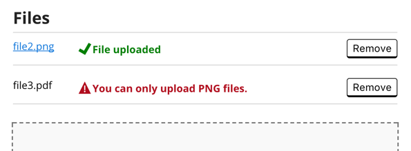

```HTML
<li>
	<span class="file-name">file.pdf</a>
	<span class="error">
    <svg width="1.5em" height="1.5em"><use xmlns:xlink="http://www.w3.org/1999/xlink" xlink:href="#warning-icon"></use></svg>
    File.pdf is too big.
  </span>
	<button type="button">Remove</button>
</li>
```

```JS
$.ajax({
  success: $.proxy(function(response){
    if(response.error) {
      li.html(this.getErrorHtml(response.error));
    } else if(response.file) {
      li.html(this.getSuccessHtml(response.file));
    }
  }, this)
});
```

The updated success function now checks to see if the response has an `error`. If it does, the error state will be constructed and injected into the list item instead.

#### Screen Reader Feedback

While the feedback is useful for sighted users, screen reader users won't hear any feedback. To provide a comparable experience (principle 1), we'll need to use a live region—something we've extensively covered in “Checkout” and “Book a Flight”. 

```HTML
<div class="visually-hidden" role="status" aria-live="polite">
  Uploading files. Please wait.
</div>
```

*(Note: the live region is visually hidden, because sighted users have already been catered for with the live progress bar and its various states. The CSS for the visually hidden class is set out in “Checkout”.)*

The live region will changed at various points:

| When | Description |
|:---|:---|
| Upload starts | Uploading files. Please wait. |
| Upload completes | [Name of file] has been uploaded. |
| Upload fails | For example: [Name of file] is too big. The size must be less than 2MB. |

### Feature Detection And Initialisation

Feature detection was introduced in the very first chapter and also demonstrated in “Book a Flight”. We'll be using it once again here because it's important to detect features before using them, otherwise we'll create a broken experience for users using a browser that lacks support.

The drag and drop enhancement uses a number of APIs that not all browsers recognise. Here's the feature detection functions with a usage example at the end.

```JS
function dragAndDropSupported() {
  var div = document.createElement('div');
  return typeof div.ondrop != 'undefined';
}

function formDataSupported() {
  return typeof FormData == 'function';
}

function fileApiSupported() {
  var input = document.createElement('input');
  input.type = 'file';
  return typeof input.files != "undefined";
};

if(dragAndDropSupported() && formDataSupported() && fileApiSupported()) {
  var Dropzone = function(container) {
    //...
  };
}
```

There are three feature detection functions for each of the features that browsers may not recognise. We then make sure that there is support for all of them before defining our Dropzone component.

As the Dropzone is conditionally defined based on feature detection, we need to detect the Dropzone function during initialisation too. If it's defined, then the browser supports it, meaning it's safe to initialise, otherwise users will get the basic (but not broken!) experience.

```JS
if(typeof Dropzone != 'undefined') {
  new Dropzone($('.dropzone'));
}
```

### A Note About Older Browser Support

Uploading files immediately `onchange` and `ondrop` might be confusing to users because, at least conventionally speaking, forms are submitted with a separate action. However, this isn't only a conventional problem. It doesn't work cross-browser either.

For example, some older browsers won't trigger the dialog when the label is used as proxy[^] and while the `onchange` event is supported there are two problems:

1. Choosing the same file (or a file with the same name) for a second time, won't fire the `onchange` event[^] which creates a broken interface. The solution is to replace the entire file input after the event with a clone of itself. As the cloned input would need to be re-focused, screen readers will announce it for a second time which is mildly annoying.
2. The `onchange` event won't fire until the field is blurred[^]. Newer browsers offer the `oninput` event which solves this problem because it fires the event as soon as the value changes.

Whether you need to support such browsers depends on your situation but it's worth being aware of the problems. Fortunately, the feature detection above happens to rule out the offending browsers.

## Other Considerations

There's a number of additional design considerations with regard to uploading files, some of which are deep topics in their own right. Let's run through them quickly now for completeness.

### Convert Formats Automatically

Depending on what users are uploading, we should do the hardwork on users behalf. For example, lets say users need to upload a spreadsheet. In this case, we should let users upload propriertary formats like Microsoft Excel, but also non-proprietary ones like CSV.

Whichever, they choose, we can convert it into the right format when it's processed. As you can see, the *Give choice* principle is more than just offering different interaction modalities.

This is also another example of “doing the hardwork so that users don't have to.”

### Many Users Struggle To Find Files

Many users, particularly less digitally savvy users, may struggle to use a file picker because they don't know where the file lives on the computer. And sometimes, the file needs to be transferred to the computer from an external camera or device creating additional effort and confusion.

Ed Horsford, a designer at GDS, conducted research around this for the Renew Your Passport service[^] which involves users uploading a photo of themselves. He said that desktop users who used a file importer (such as Windows photo-importer) struggled to find where the file was imported to when it came to selecting it from the file picker. 

I'd class myself as digitally savvy, but I've also struggled many times in the past to locate files I've downloaded from different applications. My personal workaround involves remembering to save my files to desktop. This makes the files easy to find. I just have to remember to delete the clutter every now and then.

Ed also said that while users generally found picking a photo easy on mobile, some Android devices house the photos inside “Documents” (not a folder named “Photos”) which in research threw most users.

One simple way to help users with this, is to provide additional guidance and instructions regarding how and where to save files, or alternatively tell users where they're likely to find the file.

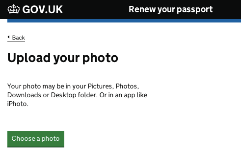

### It's Easier To Take A Photo On Mobile

It's easier to upload a photo on mobile because so many of us take photos with our phones. This means the photo is already on the device, or taking a new one is an easy task. If users are already on their mobile then it's fine, but what if they start the process on desktop?

For services that require users to have an account already, this is quite easy. For example, if I create an advert on Ebay but want to upload photos on my mobile, I just have to login on my mobile to continue where I left off—my in-progress advert will be there ready and waiting for me.

For services that don't require being logged in, such as the Renew Your Passport service, it's more tricky. In this case, consider directing users to their phone with one time security codes or unique URLs that they can type easily into their phone.

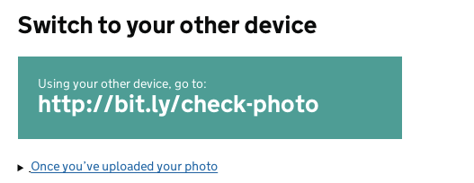

### Third Party Integration

Some (digitally savvy) users may already use third-party services (such as Dropbox) to store files. Giving users a way to upload or provide files from these services may well be easier for them, especially if it's connected with the service already.

However, be warned that it may be unhelpful or even confusing to users who don't know what “Dropbox” is. Be sure to make the different choices clear and test diversely in user research sessions.

### Microcopy: “Upload” or “Attach”

Generally speaking there's two ways to communicate to users about uploading files. The first is to use “attach”, but this seems best suited for email. In almost every other situation “Upload” seems more common, which is what we used for our generic drag and drop upload form.

### The `accept` and `capture` Attributes

The file input has two interesting attributes that affect the file uploading experience: `accept` and `capture`.

#### The `accept` Attribute

The `accept` attribute takes a string that indicates which types of file the picker will accept. 

```HTML
<input type="file" accept="image/*">
```

When supported, the browser/device may offer users a more stringent experience when choosing files. In Chrome and Safari on iOS and Android, for example, it will give users a choice of which app to use to capture the image, including the option of taking a photo with the camera or choosing an existing image file.

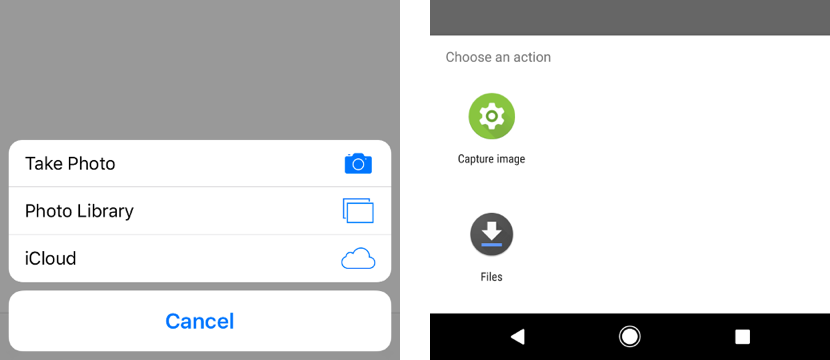

But on desktop browsers it will prompt the user to upload an image file from the file system disabling files that aren't to be accepted (images in the above case). The problem is users won't be told why the files are disabled as there's no feedback.

#### The `capture` Attribute

The `capture` attribute, when supported, indicates the preference of getting an image from the camera:

```HTML
<input type="file" accept="image/*" capture>
<input type="file" accept="image/*" capture="user">
<input type="file" accept="image/*" capture="environment">
```

Adding the capture attribute without a value lets the browser decide which camera to use (if there's one available), while the `user` and `environment` values tell the browser to prefer the front and rear cameras respectively.

The capture attribute works on Android and iOS, but is ignored on desktop. Beware that on Android this means the user will no longer have the option of choosing an existing picture as the camera app will be started directly instead, which is probably undesirable.

## Summary

In this chapter, we began by looking at the file picker as the browser gives us quite a bit of power for free. However, we also looked at its various problems that crop up with multi-file uploads. 

From here, we look at various solutions that started with the persistent upload form before enhancing the interface with a more ergonomic and inclusive drag and drop interface.

### Things To Avoid

- Prioritising form over function.
- Using the multiple file input without considering what dealing with browsers that lack support for it.
- Replacing a standard file picker with a drag and drop interface.
- Forcing users to use a particular file format, when we can convert it for them automatically.

## Demos

- Dropzone: http://nostyle.herokuapp.com/examples/dropzone

## Footnotes

[^ security]: https://css-tricks.com/drag-and-drop-file-uploading/#article-header-id-4
[^ boundary]: https://stackoverflow.com/questions/3508338/what-is-the-boundary-in-multipart-form-data
[^ proxy change]: https://stackoverflow.com/questions/2389341/jquery-change-event-to-input-file-on-ie
[^ second time]: https://stackoverflow.com/questions/12030686/html-input-file-selection-event-not-firing-upon-selecting-the-same-file
[^ blurred]: https://stackoverflow.com/questions/2389341/jquery-change-event-to-input-file-on-ie