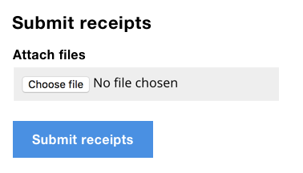
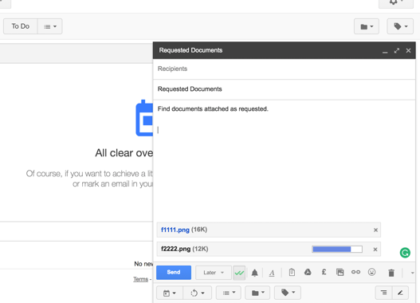

# An Upload Form

The web is more than just text. Whether it's sending a CV to a recruiter by email, or adding photos to an Ebay advert, we need to let users upload files. Forms have this capability baked in.

On one hand, uploading a file is only marginally more complex than say, inputting text or clicking a checkbox. On the other hand, there are number of unique design challenges and opportunities that arise, especially when there's a need to upload multiple files at the same time.

As usual, we'll start by looking at what browsers give us for free. After that, we'll look at designing various enhancements and issues that can arise along the way.

## A File Picker

A file picker (`<input type="file">`) is another type of form control. When clicked, it will spawn a dialog that let's users browse their files on their computer or device. Once a file is selected, the dialog closes and the picker updates to reflect the file has been chosen.


If all users need to do is upload a single file, then you can add a file picker to your form and you're pretty much done:

```HTML
<form enctype="multipart/form-data">
  <div class="field">
    <label for="documents">
      <span class="label">Attach document</span>
    </label>
    <input class="field-file" type="file" id="documents" name="documents">
  </div>
  <input type="submit" value="Upload" name="upload">
</form>
```

Notes:

- The form has a `enctype="multipart/form-data"` attribute, which ensures the file is transmitted to the server for uploading
- The file picker uses the same field constructs as first described in chapter 1, “A Registration Form”. Please refer to that chapter if you need to give users a hint or error message.

### Restyling The File Picker Is Dangerous Territory

Some designers like to restyle the file picker to:

- achieve consistency between different browsers and operating systems
- match the company's look and feel
- be able to configure the control's text

Whether you agree with all of these reasons or not, it must be said that *pretty and useless* is considerably worse than *ugly and useful*. But this doesn't mean aesthetics aren't important: where possible we should marry form and function together.

However, it's just as important to make sure that any technique's we employ to achieve these goals doesn't cause any adverse usability issues. That would be a bit like modern medicine. For example, taking a pill often fixes the symptom of a problem only to cause several adverse side effects that require additional pills to fix.

When it comes to file pickers, styling them has always been tricky because browsers ignore any attempt at doing so with CSS. This means we have to resort to a bit of hack, which is never normally a good idea. But, let's walk through how it works, what can be achieved and the pitfalls in doing so.

#### Hide the input

The most robust way of styling the the file picker is to actually just hide it with a visually hidden:

```HTML
<div class="field">
  <label for="documents">
    <span class="label">Attach document</span>
  </label>
  <input class="visually-hidden" type="file" id="documents" name="documents">
</div>
```

*(Note: The CSS for the vh (visually hidden) class is set out in “A Checkout Flow”.)*

Now that it's hidden, we can style the control's label, which fortunately, is easy to style. As described in “A Registration Form”, this works because a control's label acts as a proxy to the control itself. In this case, this means clicking the label is like clicking the input.

#### Style The Label

Now the input is hidden, we need to style the label so that it looks interactive. To make it look interactive, we need to style it and change the text like this:


#### Focus States

Now that the label looks clickable and is clickable we need to think about keyboard interaction. 

As the input is visually hidden, when the user Tabs to it, they won't get any feedback that it's actually in focus. To do this, JavaScript should be used so that when the input is focused a class of `focused` is added to the label so that we can style it to look focused:

```CSS
.focused {
  /* focus styles */
}
```

#### Reflecting The Chosen File

When the user selects a file from the dialog, it's the input that will change state (as shown earlier). We'll need to reflect the chosen file within the text of the label.


To do this, well need to listen to the input's `change` event like this:

```JS
$('[type=file]').on('change', function(e) {
  // change label
});
```

#### Pitfalls

On the face of it, this implementation is visually pleasing and still accessible. Keyboard, mouse and touch users can operate it normally and screen readers will announce the value of the input. But these do not cover the exhaustive list of considerations needed to provide a fully inclusive experience.

1. Updating the label to reflect the input's value is confusing because the label should describe the input and remain unchanged. In this case, screen reader users will hear “cv.doc” as opposed to “Attach document”.
2. The interface doesn't fit with the established convention for providing hint and error text, as set out in “A Registration Form”. As such, not only would we need to think of a way to solve this problem, this would make the experience of using this form control, different to all of the others, creating an unfamiliar and jarring experience.
3. File inputs are actually drop zones which means they let users drag and drop files (instead of going through the dialog). Hiding the input means forgoing this behaviour and multimodality of the control to suit the preference of the user.

Considering the pitfalls, the improvement to aesthetics doesn't seem to justify the downgrade in usability and utility.

## Multiple Files

Some tasks involve users uploading multiple files at once. One way to do this is to add the `multiple` attribute onto the input. Now, when the user activates the file picker dialog, the user can select multiple files.


The multiple attribute seems a straightforward way to support multiple file selection, but there are hidden problems.

First, users can only select files within a single folder. If they need to upload files within different folders they can't. Of course, users could move all the files into a single folder beforehand but this puts the onus on the user.

Second, some browsers don't recognise the `multiple` attribute. In this case it will degrade into a standard, single file picker, which could result in a broken experience. This may or may not be okay depending on your design.

For example, take the following form. It asks users to submit receipts. When the `multiple` attribute is supported, users can upload all the relevant receipts and submit. But when it's not supported, users can only upload a single receipt which may not be enough.



One way to solve this, is to ask users if they'd like to add another receipt as part of a flow. It also gives users the chance to review their submission. Crucially, this journey works whether the browser supports multiple or single file uploads. One potential downside is that it's long-winded - something that could be problematic if the form is used repeatedly.


## A Drag And Drop Enhancement

While file pickers let users drag and drop files onto the control there are two problems with it: First, it's not immediately obvious to users that this is even possible — there's no signifiers in the interface to make this behaviour perceivable.

Second, the drop zone has a small hit area, which makes it harder for users to drop files, especially if they have motor-impairments.

Creating a custom drag and drop interface from scratch, lets us solve both issues at the same time.

### How It Might Look


The large drop zone makes it more ergonimic, especially for motor-impaired users. Inside the drop zone is instructional text that clarifies the behaviour.

Below the text sits a button. Really, it's a label *styled* as a button which is the technique I lambasted earlier. This only works because the label is a proxy for the input. Clicking the label behaves as if the file input was clicked - even if the input is visually hidden.

## Interaction

There's no submit button because the files are uploaded as soon as they're dropped. This is because browsers don't let you programmatically update a file input's value due to security reasons[^1]. 

The act of selecting a file (as opposed to dropping one) also uploads them immediately (`onchange`). This is so both interactions behave consistently within the same component.

The user can keep uploading documents either by dragging and dropping, or selecting, or using both interchangeably. When they're finished, they can review the files and if needed, delete them too. 

Clicking continue takes the user to the next step, whatever that is. Gmail users, for example, upload files using a similar interface. This is the same pattern, but put to a different purpose.



*(Note: the technical constraints regarding security have driven us to abandon convention which is not without issues. I'll address this later.)*

### The Drop Zone

Here's the Javascript-enhanced mark-up:

```HTML
<form action="/upload" method="post" enctype="multipart/form-data">
	<div class="dropzone dropzone--enhanced">
		<div>
			<label for="files">
				Attach a file or drag and drop.
			</label>
			<input type="file" name="files" id="files" multiple>
		</div>
	</div>
</form>
```

The `enctype` attribute is necessary so that the files are transmitted to the server for processing. This is only relevant to the degraded experience. That is, when Javascript isn't available, users will see a file picker and upload button.


Keyboard users can tab to the visually hidden input which will pseudo focus the label with Javascript as described earlier. This is also the same technique used for the seat chooser interface as set out in chapter 3, “Book a flight”.

To create the drag and drop behaviour there are three javascript events: `ondragover`, `ondragleave` and `ondrop`.

The `ondragover` handler adds a class of `dropzone--dragover` and the `ondragleave` handler removes it. The class is used to give feedback so users know they are within the drop zone.


*(Note: you can't just use `:hover`, because it's only relevant if the user is hovering with a file in hand. That is, the `:hover` class would activate even if the user didn't drag a file onto the dropzone.)*

The `ondrop` handler is where the magic happens. The event handler receives an event object (`e.dataTransfer.files`) that holds data about the files. For each file dropped an AJAX request is made.

```JS
Dropzone.prototype.onDrop = function(e) {
	e.preventDefault();
	this.removeHighlight();
	this.upload(e.originalEvent.dataTransfer.files);
};
```

By default, dragging and dropping a file into the viewport will load the file in the browser which we prevent from happening on the firt line. Next, the highlight is removed. And finally, the `upload()` method is called passing in the dropped files. 

```JS
Dropzone.prototype.upload = function(files) {
    for(var i = 0; i < files.length; i++) {
      var formData = new FormData();
      formData.append('documents', files[i]);
      this.makeRequest(formData);
    }
    $('.fileList').removeClass('hidden');
  };
```

For each file dropped we create the data using the `FormData` object, then pass that data to `makeRequest`. Finally, the fileList component is revealed so that we can inject feedback.

### Feedback

Whether files are dropped or selected with the file picker, we need to give users feedback.

```JS
Dropzone.prototype.makeRequest = function(formData) {
  var li = $('<li>'+ formData.get('documents').name +'<br><progress value="0" max="100">0%</progress></li>');
  $('.fileList ul').append(li);
	$.ajax({
    url: '/ajax-upload',
    type: 'post',
    data: formData,
    xhr: function() {
      var xhr = new XMLHttpRequest();
      xhr.upload.addEventListener('progress', function(evt) {
        if (evt.lengthComputable) {
          // calculate the percentage of upload completed
          var percentComplete = evt.loaded / evt.total;
          percentComplete = parseInt(percentComplete * 100);

          li.find('progress').text(percentComplete + '%');
          li.find('progress').val(percentComplete);
        }
      }, false);
      return xhr;
    }
  });
};
```

This function injects a list item into the file list panel and fires the request. It listens to the `progress` event on the `XMLHttpRequest` object, so that feedback can be given in real time. This is particularly useful if users are uploading large files or using a slow network (or both).

Each file is represented as a list item. Progress is indicated by the `<progress>` element.


```HTML
<ul>
  <li>
    <span class="file">file.pdf</span>
    <progress max="100" value="80">80% complete</progress>
  </li>
  ...
</ul>
```

The text inside the element is for browsers that lack support for the progress element. They'll just see the text.

The progress bar is updated in response to the AJAX request that has an `onprogress` event.

When the file is finished uploading, the `<span>` is converted into a link so that it can be downloaded. Additionallity, a submit button is added, letting users delete the file if they uploaded it by mistake, for example.


```HTML
<ul>
	<li>
		<a href="/path/to/file.pdf">file.pdf</a>
		<progress max="100" value="100">100% complete</progress>
		<input type="submit" name="remove1" value="Remove">
	</li>
	...
</ul>
```

If there's an error, a message is shown in place of the progress bar, letting users dismiss that file to try again by clicking the button.


```HTML
<ul>
	<li>
		<a href="/path/to/file.pdf">file.pdf</a>
		<span class="error">File.pdf is too big.</span>
		<button type="button">Dismiss message</button>
	</li>
	...
</ul>
```

The only thing missing is a hidden live region in order to *provide a comparable experience* for screen readers. There are three scenarios that need to be announced:

1. The user starts uploading: “3 files are being uploaded”
2. The upload finishes successfully: “file.pdf has been uploaded”
3. The file couldn't be uploaded: “file.pdf couldn't be uploaded because it was too big”

These messages are only needed for screen reader users, and so they should be placed inside a hidden live region:

```HTML
<div class="vh" role="status" aria-live="polite">
	3 files are being uploaded
</div>
```

### Feature Detection

The drag and drop script uses several Javascript APIs that not all browsers recognise. Before referencing them, they need to be detected to ensure users don't get a broken experience.

```JS
(function() {
	var dragAndDropSupported = (function() {
		var div = document.createElement('div');
		return ('draggable' in div) || ('ondragstart' in div && 'ondrop' in div);
	}());

	var formDataSupported = (typeof Formdata == 'function');

	var fileReaderSupported = (typeof FileReader == 'function');

	if(dragAndDropSupported && formDataSupported && fileReaderSupported) {
		// Define Dropzone code here
	}
}());
```

The calling application detects `Dropzone` before creating an instance. When it's undefined, that indicates the browser either lacks support or there was a network failure. Either way, users get the degraded, but not broken, experience.

```JS
if(typeof Dropzone !== 'undefined') {
  new Dropzone();
}
```

### The Small Print

As noted earlier, we're breaking convention by uploading files immediately `ondrop` and `onchange`. And while there's rationale behind the approach, doing so might be unexpected and confusing for users: they'd normally expect to submit the form separately.

This isn't just an academic endeavour. The `onchange` event is historically problematic, particularly when it's applied to a file input. For example, in some browsers, if you upload the same file (or a file with the same name) for a second time, the `onchange` event won't fire at all[^2]. This would create a broken experience.

The solution is to replace the entire file input after the `onchange` event fires. This would mean having to set focus to the cloned file input, which causes screen readers to announce it for a second time. Mildly annoying.

The other problem is that some older browsers, won't fire the `onchange` event until blurring the field[^3], which is something that new browsers solve by way of the `oninput` event. Unlike the `onchange` event, this will fire as soon as the input's value is changed without having to blur the field.

In any case, the feature detection happens to rule out the offending browsers, because they don't support the drag and drop APIs, for example.

Lastly, some older browsers won't trigger the file input by clicking the label[^4]. Once again, the feature detection rules out these browsers too.

Anything like this needs a a lot of diverse testing to ensure what is better for some, doesn't exclude others. As you can see, going against WCAG guidelines can, if we're not careful, lead to usability failures.

It's also worth baring in mind that users may not want, or benefit, from drag and drop at all. Before embarking on your own drag and drop solution, make sure there is a user need.

## A Note About The `accept` and `capture` Attributes

The file input offers two interesting attributes that affect the experience of uploading files: `accept` and `capture`.

The `accept` attribute takes a hint or mime type. When supported, the browser/device may offer users an optimised interface in which to choose files. 

```HTML
<input type="file" accept="image/*">
```

In Chrome and Safari on iOS and Android, for example, it will give the user a choice of which app to use to capture the image, including the option of taking a photo with the camera or choosing an existing image file.


*(Note: On desktop it will prompt the user to upload an image file from the file system disabling files that aren't images, for example. The problem with this is that users won't know why the files are disabled as there's no feedback.)*

You can also add the `capture` attribute, which indicates to supporting browsers that you prefer getting an image from the camera:

```HTML
<input type="file" accept="image/*" capture>
<input type="file" accept="image/*" capture="user">
<input type="file" accept="image/*" capture="environment">
```

Adding the capture attribute without a value let's the browser decide which camera to use (if there's one available), while the "user" and "environment" values tell the browser to prefer the front and rear cameras, respectively.

The capture attribute works on Android and iOS, but is ignored on desktop. Be aware, however, that on Android this means that the user will no longer have the option of choosing an existing picture. The system camera app will be started directly instead, which is probably undesirable.

## Summary

In this chapter, we looked at the intricacies of uploading files - not just one at a time, in bulk. 

We looked at ways to mitigate the file input's ugliness, but soon realised that making it look better is at the cost of usability.

Finally, we looked at ways to enhance the native file input's drag and drop behaviour by creating a large custom drop zone. To do that we used various modern Javascript APIs that meant breaking convention due to security constraints.

### Things To Avoid

- Visually hiding the file input for aesthetic reasons.
- Using multiple file inputs without considering the degraded experience and end-to-end flow.
- Creating a drag and drop solution without first ensuring there's a need for it.

## Demos

TBD

## Footnotes

[^1]: https://css-tricks.com/drag-and-drop-file-uploading/#article-header-id-4
[^2]: https://stackoverflow.com/questions/12030686/html-input-file-selection-event-not-firing-upon-selecting-the-same-file
[^3]: https://stackoverflow.com/questions/2389341/jquery-change-event-to-input-file-on-ie
[^4]: https://stackoverflow.com/questions/2389341/jquery-change-event-to-input-file-on-ie