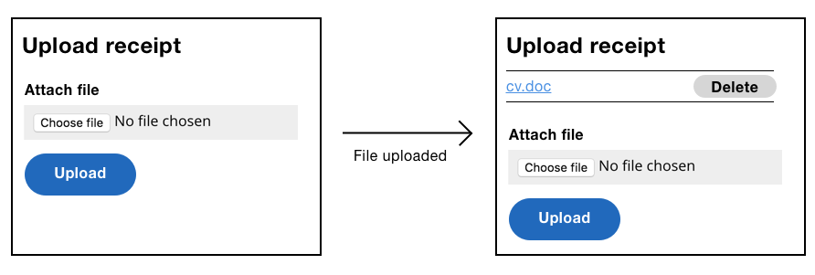
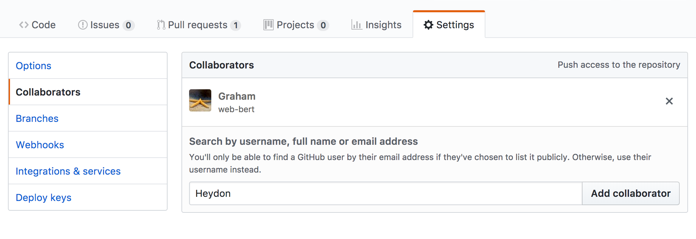
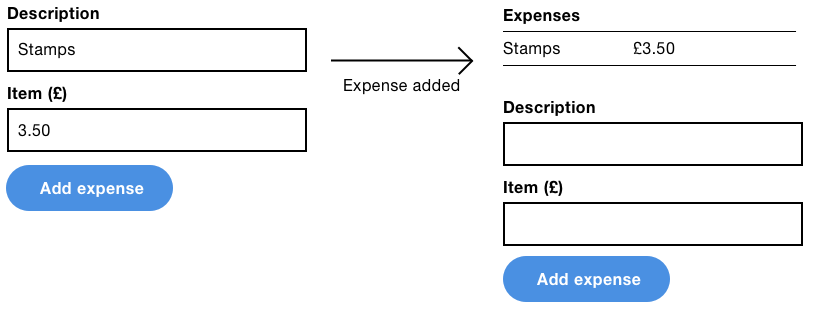
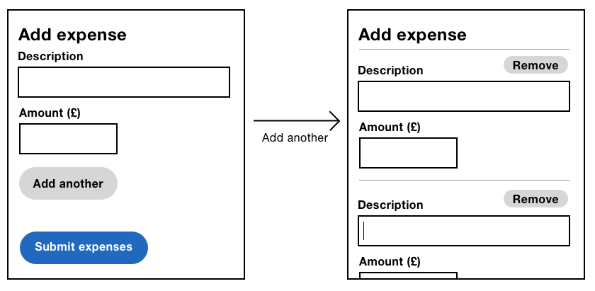
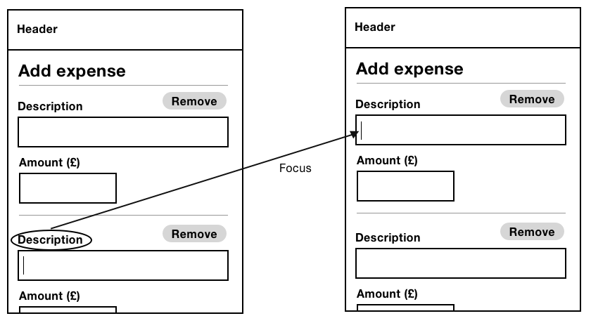

# An Expense Form

As a freelancer I have to submit expenses for my tax return. It’s a pain but if I do it correctly I get tax breaks. The problem is that I have so many expenses to enter and a limited amount of time to enter them.

The anatomy of an expense depends on the system you use and perhaps the country you live in. It might include a description, company, date, amount and proof of purchase. How can we design a form that makes inputting multiple entries easy, fast, performant and inclusive?

Of course, if you know how many entries are needed in advance, then give users a form with that many fields, make them required and that's about it. But if we don't how many entries are needed in advance (like expenses), keep reading.

## The Persistent Form Pattern (Again)

In the previous chapter, I introduced the persistent form pattern. In short, we gave users an upload form, which users can keep using until they've finished uploading as many files as they need. At which point they can proceed or exit the page—whichever is most appropriate for the specific problem at hand.



There are a number of other forms on the web that use the persistent form pattern. For example, Github's *add collaborators* form and the infamous Todo List[^] form that many JavaScript frameworks use to demonstrate their approach.



This pattern works for adding expenses too. Each time the user submits an expense, it will be added to the list that sits above the form.



This pattern is well-suited to short, simple forms that can be submitted in one go. The pattern does, however, have a number of downsides:

1. Users might need to use a form that has dynamic questions (branching) that are conditionally shown based on previous answers. In this case, the pattern doesn't work so well. We'll look at branching in more detail shortly.
2. As the list of added expenses grow, the form moves further down the page. This could be a problem, especially on mobile, as users would have to scroll down to see and use the form.
3. Having multiple calls to action (to submit and to proceed or exit) might be confusing, especially for cognitively-impaired users. Where possible, one call to action is preferrable as it requires less thinking.
4. Each submission requires a separate request to the server. This could be frustrating, where lots of entries need to be added.

## Branching With One Thing Per Page

One of the major problems with the Persistent Form pattern is that it can't handle branching. Branching involves users being asked different questions depending on previous answers. For example, if users are expensing a car, they'll need to enter mileage; if they're expensing a train ticket, then they'll need to enter its price.


In this case, the One Thing Per Page pattern (first discussed in “Checkout”) is more suitable. This is because it presents one question at time meaning we can show users different pages depending on their answers. This solves the branching problem elegantly and simply, but, what if users need to enter multiple expenses and submit them in one go?

We can add an additional screen to the end of the journey asking users if they'd like to add another expense. Selecting Yes takes the user to down the same flow again. Selecting No completes the task.


## The Add Another Pattern

Both the Persistent Form pattern and the One Thing Per Page pattern suffer from the same problem—that each expense created requires at least one trip to the server, which is slow. How might we solve this problem?

The Add Another pattern works by giving users a single form, on a single page, submitted in a single step. However, the user can keep adding fields for how ever many expenses they need to add. For demonstration purposes, lets simplify the anatomy of an expense down to just a description and cost.

### How It Works



The form starts with enough fields to enter one expense. However, there's an Add Another button, that when pressed, will instantly clone the fields so that users can enter the details of an additional expense.

Users can keep on doing this until they're done, at which point the user is able to submit all their expenses at once, with just a single trip to the server—speeding up the process drastically.

*(Note: the basic experience (before adding the JavaScript enhancement), works the same way except that pressing the Add Another button will generate the new fields on the server.)*

### The Basic Mark-Up

```
<form>
  <div class="addAnother">
    <div class="addAnother-item">
      <div class="field">
        <label for="items[0][description]">
          <span class="field-label">Description</span>
        </label>
        <input 
          type="text" 
          id="items[0][description]" 
          name="items[0][description]">
      </div>
      <div class="field">
        <label for="items[0][amount]">
          <span class="field-label">Amount</span>
        </label>
        <input 
          type="text" 
          id="items[0][amount]" 
          name="items[0][amount]">
      </div>
    </div>
    <input type="submit" name="addAnother" value="Add another expense">
  </div>
  <input type="submit" name="submitexpenses" value="Submit expenses">
</form>
```

There are two important notes about this form:

1. The expense fields are wrapped in a `<div class="addAnother-item">`. This lets us target the expense with CSS and JavaScript (explained shortly).
2. The inputs `name` and `id` attributes have a special-array like naming convention, which we'll discuss now.

### Processing Multiple (Dynamic) Expenses

When the form is submitted, the payload will consist of multiple expenses. The server will need to process this payload, but it won't know how many expenses will be sent in ahead of time. That is, the amount of expenses are dynamic.

To help the server recognise and process the expenses, a contract must be made between the client and the server. When it comes to forms, the contract is forged by the `name` attribute.

```HTML
<input type="text" name="items[0][description]">
<input type="text" name="items[0][amount]">
```

Note the special `name` attribute value. By formatting it this way, the request payload can be parsed and converted into an array of expenses that the server can process easily. Some server-side frameworks, such as Express[^], are designed to recognise this convention. Let's run through each part and its meaning.

- *items* is the name of the group. You can use whatever name you like. On the server, this will be used to identify the list of expenses.
- *[0]* represents the particular expense in the list and starts from zero, like a JavaScript array. That is, the second expense will be represented by *[1]* and so on.
- *[description]* and *[amount]* represents the specific attributes about the expense. In this case, the description and the amount. For each unique attribute you want to process, you'll need a name to identify it with.

### Adding Another Expense

Pressing the Add Another button needs to create a new set of expense fields. There are several ways we might go about doing this. For example, we might use templating—which could be written in JavaScript[^] or in HTML[^]. Both approaches, however, lack browser support. A simple, alternative approach involves cloning the already-existing expense fields.

```JS
function AddAnotherForm(container) {
  container.on('click', '.addAnother-addButton', $.proxy(this, 'onAddButtonClick'));
}

AddAnotherForm.prototype.onAddButtonClick = function(e) {
  var item = this.getNewItem();
  this.getItems().last().after(item);
};

AddAnotherForm.prototype.getNewItem = function() {
  return this.getItems().first().clone();
};

AddAnotherForm.prototype.getItems = function() {
  return this.container.find('.addAnother-item');
};
```

There are three small functions that have been split out for readability and maintainability. When the button is clicked, we get a clone of the first `<div class="addAnother-item>` in the form. Then we add the clone to the end of the form.

#### Injecting Remove Buttons

The form initially starts out with just a single expense. There's no Remove button because the user has to submit at least one expense. However, when the user adds another expense, we need to add a Remove button to the first expense. To do this, when the Add Another button is pressed, we'll need to check whether a Remove button should be added.

```JS
AddAnotherForm.prototype.onAddButtonClick = function(e) {
  // previous code

  var firstItem = this.getItems().first();
  if(!this.hasRemoveButton(firstItem)) {
    this.createRemoveButton(firstItem); 
  }
};

AddAnotherForm.prototype.hasRemoveButton = function(item) {
  return item.find('.addAnother-removeButton').length;
};

AddAnotherForm.prototype.createRemoveButton = function(item) {
  item.append('<button type="button" class=" addAnother-removeButton">Remove</button>');
};
```

Now, when the button is clicked, the function checkes to see if the first expense has a Remove button. If it doesn't, one is created. The reason we have to check for its existence is because the first expense may or may not have a Remove button, depending on how many expenses the user has added.

Having given the first expense a Remove button, we'll need to apply the same provision for the newly-cloned expense like this:

```JS
AddAnotherForm.prototype.getNewItem = function() {
  var item = this.getItems().first().clone();
  if(!this.hasRemoveButton(item)) {
    this.createRemoveButton(item);
  }
  return item;
};
```

This function uses the same helper methods in the exact same way. Now, whenever an item is cloned it will always be cloned with a Remove button.

#### Updating The Attributes

Having cloned the fields and ensured each field has a Remove button, we need to update the name and id attributes. This ensures that the newly-cloned fields adhere to the naming convetion so that the server can process the submission (as explained earlier).

But how can our script know what `name` and `id` values to use? To make this easy, we'll store the naming convention inside data attributes.

```HTML
<input data-name="items[%index%][description]" data-id="items[%index%][description]">
<input type="text" name="items[0][amount]">
```

The reason for both the name *and* the id data attributes is because some fields consist of multiple inputs with the same name. For example, as laid out in chapter 2, “Checkout”, the `name` of each radio button is the same because it identifies the set to which they belong. The `id` identifies the individual radio button.

Now all we need to do is replace `%index%` with the new index of the cloned item like this:

```JS
AddAnotherForm.prototype.updateAttributes = function(index, item) {
  item.find('[data-name]').each(function(i, el) {
    el.name = $(el).attr('data-name').replace(/%index%/, index);
    el.id = $(el).attr('data-id').replace(/%index%/, index);
    ($(el).prev('label')[0] || $(el).parents('label')[0]).htmlFor = el.id;
  });
};
```

The function works by searching for all form controls that have the `data-name` data attribute. For each control that it finds, it will update the control's `name` and `id` attributes by replacing `%index%` with the new index which has to increase by 1 each time.

Finally, the label's `for` attribute is set to the control's `id` attribute. If we didn't do this, then when the user clicks the cloned label, focus will be moved to the first field instead. 



*(Note: the code for retrieving the label uses a logic OR operator. This is because the label appears in different places depending on the type of field. In the case of a text field, for example, it will be the previous sibling. However, for radio buttons, should an expense need radio buttons, it will be the parent.)*

#### Managing Focus

When the Add Another button is clicked, it should focus the first newly-created form field. In screen readers, this will announce the field, prompting the user to fill out the expense.

```JS
AddAnotherForm.prototype.onAddButtonClick = function(e) {
  // code

  item.find('.field:first').find('input, textarea, select').focus();
};
```

### Removing An Expense

When the user clicks an item's Remove button, there's a number of tasks we need to implement. First, of course, is that it should be removed from the form.

```JS
function AddAnotherForm(container) {
  // code

  this.container.on('click', '.addAnother-removeButton', $.proxy(this, 'onRemoveButtonClick'));
}

AddAnotherForm.prototype.onRemoveButtonClick = function(e) {
  $(e.currentTarget).parents('.addAnother-item').remove();
};
```

We're using jQuery's event delegation. This is useful because we're adding and removing Remove buttons dynamically. Without using delegation we'd have to keep adding and removing event listeners which is a pain.

When the event listener is called, the Remove button si referenced by `e.currentTarget`. Then it's just a matter of searching for the parent container for the expense and removing it.

#### Removing The Remove Buttons

When the penultimate expense is removed, we need to remove the first items Remove button. That is, the user shouldn't be able to remove every expense, because they must enter at least one.

```JS
AddAnotherForm.prototype.onRemoveButtonClick = function(e) {
  $(e.currentTarget).parents('.addAnother-item').remove();
  var items = this.getItems();
  if(items.length === 1) {
    items.find('.addAnother-removeButton').remove();
  }
};
```

The function checks to see if there's just one expense item left in the form. And if there is, the Remove button is removed.

#### Updating The Attributes

When the user has added a number of expenses, they are free to remove any which they might have provided by mistake. The interface gives users control to remove whichever item they want.

Remember the names of the fields use array-like indexes so that the form can be processed on the server. If there are three expenses, for example, but the user deletes the second expense, then the data will be out of sync.

We can fix this, by running through all the expenses in the form, and updating the the fields indexes:

```JS
AddAnotherForm.prototype.onRemoveButtonClick = function(e) {
  // code
  
  var items = this.getItems();
  
  // code
  
  items.each($.proxy(function(index, el) {
    this.updateAttributes(index, $(el));
  }, this));
};
```

This loops through all the items in the form and invokes the `updateAttributes()` method from earlier.

#### Managing Focus

When the user clicks the Remove button, everything inside the `<div class="addAnother-item">` will be removed. But, what happens to the focus when you delete the currently focused element? Heydon Pickering answers this question in “A Todo List”[^2]:

> [...] browsers don’t know where to place focus when it has been destroyed in this way. Some maintain a sort of “ghost” focus where the item used to exist, while others jump to focus the next focusable element. Some flip out completely and default to focusing the outer document — meaning keyboard users have to crawl [...] back to where the removed element was.

We could set focus to the previous or next expense item but this seems arbitrary and confusing. Alternatively, we could set focus to the Add Another button, but that's presumptuous and odd—why delete an item if you're just going to add another one—users might more easily just type over the fields that are already there.

Instead, we can set focus to the heading, which puts users back to the beginning of the expense form while announcing itself—“Expenses, heading, level 1” or similar—to screen reader users.

```JS
AddAnotherForm.prototype.onRemoveButtonClick = function(e) {
  // code
  
  this.container.find('.addAnother-heading').focus();
};
```

The problem is that, by default, headings aren't focusable. But we can fix that by giving the heading a `tabindex="-1"` attribute. The -1 value allows us to focus the element programmatically using JavaScript, without making it user-focusable—using the Tab key, for example.

```HTML
<h1 tabindex="-1">Expenses</h1>
```

When the heading is focused, browsers will give the heading an outline. This should be removed because as the heading is not an interactive element it shouldn't appear interactive.

```CSS
.addAnother-heading { outline: none }
```

Once the heading is focused, pressing <kbd>Tab</kbd> will focus the first form field, which makes orientation simple.

### Feedback

As it stands the act of adding and removing expenses provides sufficient feedback for sighted users. This is because items in the form can be seen to appear or disappear from the list. Giving users an additional notification bar would draw users' attention in two directions. And as more expenses are added, the notification bar will be out of the viewport so users wouldn't see it anyway.

Screen reader users are catered for also because the act adding and removing items moves the users focus and announces the focused element accordingly. This may not tell the user explicitly that “the item has been added” but it should be enough. If research shows otherwise, you can add a hidden live region (as set out in ...) to give screen reader users explicit feedback.

#### Animation Isn't Necessarily Valuable

It's possible that judicious animation effects can help users understand an interface.

But all too often, designers want to add animation for the sake of it. Users, however, just want to get things done. And, needless animation is jarring and actually *detracts* from the user experience. Like anything else, animation should only be added if it adds value.

Even when animation is valuable to some users, it can be harmful to users with cognitive impairments such as Attention Deficit Hyperactivity Disorder (ADHD) and Autism[^3].

In the case of the expense form, had we not moved focus from the button to the field, an animation might mean the item's arrival is more likely to be noticed. Alas, we *are* moving focus to the form field and so animation is unnecessary here.

## Summary

In this chapter, we looked at three different patterns that let users submit multiple expenses into a system. Really though, expenses were used just for demonstration purposes—these patterns are applicable to all kinds of data—not just expenses.

The Persistent Form and One Thing Per Page patterns are more suitable for infrequent use and users with a lower digital literacy. The Add Another pattern is more suitable for frequent usage that doesn't require branching.

The downside to the Add Another pattern is that despite the usability provisions we've put in place, the interface is a little more complicated to operate.

There's no right or wrong here. It's about choosing the most appropriate pattern for your users.

### Things To Avoid

- Letting browsers manage the focus when the focus element is removed from the Document.
- Giving non interactive (but programmatically focusable elements) an outline when focused.
- Giving users multiple sources of feedback for a single action.
- Animating parts of the interface for no actual reason.

## Demos

- Add another

## Footnotes

[^1]: http://todomvc.com/
[^2]: https://inclusive-components.design/a-todo-list/
[^3]: https://axesslab.com/accessibility-according-to-pwd/#motion-animations-and-cluttered-pages