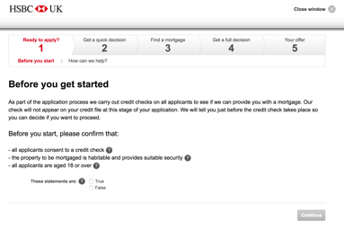
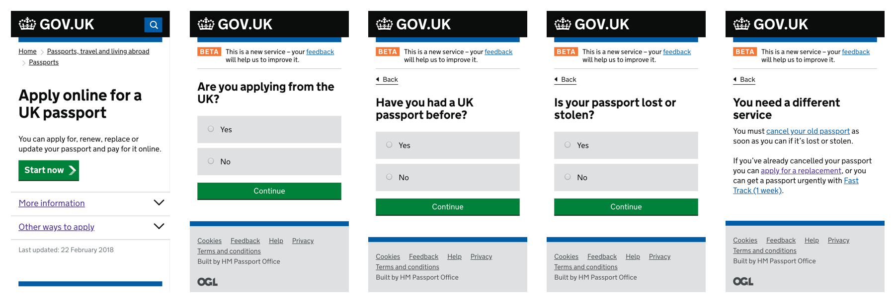

# A Really Long, Complicated Form

Different types of tasks take different amounts of time to complete. The One Thing Per Page pattern (introduced in “Checkout”) helps users complete tasks in one sitting, but what about those that take hours, or even days, to complete?

In Mailchimp[^], for example, I'll usually start drafting an email campaign weeks before I send it. And there are a number of steps to complete, in a particular order too. First, I check the content reads well. Then I need to make sure it looks good in various email clients. Then days or even weeks later, I'll run through some final checks, decide the subject line and schedule it for release.

Other tasks may be performed by several people using the same application. For example, processing a return may involve someone receiving the goods at the warehouse. Then a decision maker may look at the goods to make sure it satisfies the returns policy.

Some services, such as applying for a mortgage or registering for a bank account, involve supplying personal information, and this may involve offline processes such as sending identification documents in the post.

How can we design forms that play nicely with this complex and long-form process that can take weeks to complete? And by different people across digital and non-digital journeys?

First thought, it must be said that if you can simplify the process so that it's short in the first place—or even remove it altogether—do that. If not, this chapter explores some useful patterns specifically designed to solve these things.

## The Check Before You Start Pattern

One of the best ways we can help users save time, is by not wasting it in the first place. One way to do that is to tell users what they need to know before they start the process. For example, to apply for an HSBC[^] mortgage in the UK, users must:

- constent to a credit check
- confirm the property is in a habitual condition
- be aged 18 and over

This is good, but users may also want to know:

- what the process looks like
- if they need to visit a branch
- how long it takes to get a decision
- what documents they'll need (and what alternative options they might have, if any)

Knowing this upfront, not only saves users a lot of time, but it can also lower the operating costs of the service. This works by reducing the time and effort support teams spend working out and explaining all of this to people over the phone.

This pattern is applicable in other situations too. For example, if an underaged person is trying to buy cinema tickets for an adult-only showing, they should know that they may need to prove their age before entering the cinema.

Some services are more complicated and can depend on the individual's circumstances. For example, the Passport[^] service (shown below), needs to ask a series of questions to determines someone eligibility to apply for a passport. 

Caption: The user is asked if the passport is lost or stolen. Answering “No” lets them apply for a passport as normal. Answering “Yes” takes them to a screen telling them to cancel their passport, with a number of options suited to their specific situation.

If the applicant has lost their passport, for example, then they aren't able to use the main service. The Government Digital Service calls this the Check Before You Start pattern[^]. This pattern can:

- make the process more transparent which increases trust
- save users a lot of time
- reduce support costs
- empower users to decide the best course of action

## The Task List Pattern

In “The Psychology of Checklists”[^], Lauren Marchese explains the importance of breaking down big tasks into smaller ones which is proven to motivate people. When we experience even small amounts of success, our brains release a chemical called dopamine which gives us feelings of pleasure, learning and motivation.

Most of us work in teams employing Agile methodologies[^]. This involves breaking down a large project into epics, stories and tasks. Complete enough tasks, and the story is done. Complete enough stories, and the epic is done. Complete enough epics and the project is done. Of course our work is never done, but you know what I mean.

What's really happening is that tasks seem far easier to achieve when they're broken down. Crucially, if tasks are small enough, then we'll get that hit of dopamine more frequently, which creates momentum. Momentum improves morale and morale improves productivity.

That's not all checklists are good for. In “The Design of Everyday Things”, Don Norman says:

> “Checklists are powerful tools, proven to increase the accuracy of behaviour and to reduce error [...]. They are especially important in situations with multiple, complex requirements, and even more so where there are interruptions.”

As people perform digital tasks on the go using different devices, the chances of interruption is high. Designing for interruption and being able to jump back into the middle of a long and complex task is crucial. And as mentioned earlier, some parts of the process happen offline too.

The Task List pattern[^], as coined by the Government Digital Service (GDS) shows a page with several top level tasks. 

Each top level task is broken down into several sub tasks. Each one of those takes users through a flow—whether each flow consists of one or several screens doesn't really matter, as long as it's achievable in a reasonable time. Once a sub task is completed, users come back to the task list view with that particular task marked as complete.

This is not a pattern reserved for Government services. Mailchimp users have a similar need. The only difference is the visual design and the flatter hierarchy of tasks.

Instead of text, Mailchimp uses iconography to mark tasks as complete. I've discussed the pros and cons of iconography in chapter 3, “Book A Flight”. Additionally, instead of standard looking links, they use call-to-action buttons which are labelled as ‘Resolve’ to prompt the user and reduce the effort on their part.

The exact design details you choose to employ will come down to your product's design language and user research but it's key to ensure that:

- each task's status is clear marked so that users can see what's left at a glance
- users can get a feel for how long is left until completition
- previous information is saved, so that users can return easily to it later

### When All Tasks Are Complete

When the last task in the list is completed, the user can still go back to the task list page with all the tasks marked as completed. This let's users bask in the glory of completing everything (which is another hit of dopamine). After all, the best part of completing a long to-do list is seeing all those ticks.

It also gives users a chance to review all their answers and make any amends if necessary, which speaks to principle 4, *give control*. The only other thing to remember, is to give users an obvious way to proceed once everything is complete. For this, offer users a clear, single call to action.

### Additional Considerations

The points discussed above are probably applicable to any super long form you're designing, but you might also want to consider:

- Explaining what users need, such as documents, in context of each individual task.
- Indicating how long each task will take. An estimate or a range can work well. If you can't offer this information, then you may need to break down the tasks further.
- Using verbs for task names. For example, ‘Agree to the terms, ‘Create subject line’, ‘Choose template’.
- Listing tasks in order. If so, use an ordered list, the advantages of which are discussed in chapter 5, “An Inbox”.
- Marking who needs to complete the task. This is only useful if the tasks are performed by different people.
- Sizing all the tasks the same. Don't take this too literally, but if one task is 20 questions and another is 2, then take another look.

## Summary

In this chapter, we looked at how to break down really long forms into smaller ones. By using the task list pattern, users are guided through a long and potentially complex journey with relative ease.

### Checklist

- Avoid really long forms.
- If you really need one, break the tasks up into smaller pieces.
- Save users state, so that they can come back in their own time.

## Footnotes

[^ mailchimp]: https://mailchimp.com/
[^ hsbc]: https://www.hsbc.co.uk/1/2/mortgages
[^ passport]: https://www.gov.uk/apply-renew-passport
[^ check before]: https://www.gov.uk/service-manual/design/check-before-you-start
[^ checklists]: https://blog.trello.com/the-psychology-of-checklists-why-setting-small-goals-motivates-us-to-accomplish-bigger-things
[^ agile]: https://en.wikipedia.org/wiki/Agile_software_development
[^ task list]: https://designnotes.blog.gov.uk/2017/04/04/weve-published-the-task-list-pattern/