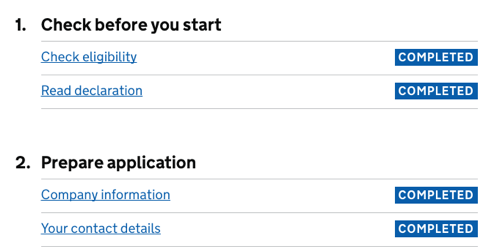
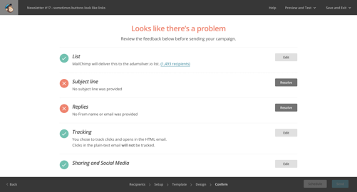

# A Really Long Form

Different types of tasks take different amounts of time to complete. One Thing Per Page helps users complete tasks in one sitting, but what about those that take hours, or even days, to complete?

In Mailchimp[^], for example, I'll usually start drafting an email campaign weeks before I send it. And there are a number of steps to complete, in a particular order too. First, I check the content reads well. Then I need to make sure it looks good in various email clients. Then days or even weeks later, I'll run through some final checks, decide the subject line and schedule it for release.

Other tasks are performed by more than one person using the same application. For example, processing a return may involve someone receiving the goods at the warehouse. Then a decision maker may take a look at the goods to make sure it satisfies the returns policy.

Some Government services take weeks to apply for and users need to provide information about their identity, home, family and financial situation. And sometimes people need to gather evidence and send it by post. That is, the journey users go through is not solely digital.

How can we design forms that play nicely with this complex and long-form process that can take weeks to complete, by different people across digital and non digital journeys?

Of course, if you can simplify the process so that it's short in the first place (or even remove it altogether), all the better. If you can't, let's look at some patterns that solve these problems.

## The Check Before You Start Pattern

One of the best ways we can help users save time, is by not wasting it in the first place. Many Goverment services, for instance, require certain criteria to be met before people can apply. 

Take the Apply For Passport service (shown below). Before applying users are given some important information such as how long it takes to apply. And there's a link for users that need their passport more urgently.

Giving users some basic information upfront is valuable but some services have a complex set of rules that can't be communicated generically with a few bullet points. Sometimes the system needs to consider the individual and their circumstances before determining what to do.

Continuing with the Passport service then, one of the first questions I'm asked is “Is your passport lost or stolen?”. Answering “No” lets me continue to apply for a passport as normal. But answering “Yes” takes me to a screen telling me to cancel my passport with a number of options that are best suited to my situation.

This pattern isn't just useful to Government services. For example, you could use these patterns to stop under-aged users from buying cinema tickets for adult-only showings. For example, telling users that they may need to prove their age by bringing an ID card to the cinema.

Alternatively, people applying for a mortgage online may wish to know some high level criteria before spending a lot of time gathering documents and setting up meetings. 

Not only does this save users a lot of time, but it can also lower the business' operating costs by reducing the time and effort support teams spend working out and explaining all of this to people over the phone.

## The Task List Pattern

In “The Psychology of Checklists”[^], Lauren Marchese explains the importance of breaking down big tasks into smaller ones and doing so is proven to motivate people. When we experience even small amounts of success, our brains release a chemical called dopamine which gives us feelings of pleasure, learning and motivation.

Most of us work in teams employing Agile methodologies[^]. One of the main aspects to this is breaking down a large project into epics, stories and tasks. Complete enough tasks, and the story is done. Complete enough stories, and the epic is done. Complete enough epics and the project is done. Of course our work is never done, but you know what I mean.

What's really happening is that tasks seem far easier to achieve when they're broken down. Crucially, if tasks are small enough, then we'll get that hit of dopamine frequently, which creates momentum. Momentum improves morale and morale improves productivity.

That's not all checklists are good for. In “The Design of Everyday Things”, Don Norman says:

> “Checklists are powerful tools, proven to increase the accuracy of behaviour and to reduce error [...]. They are especially important in situations with multiple, complex requirements, and even more so where there are interruptions.”

As we're able to perform digital tasks on the go using different devices, the chances of interruption are always high. Designing for interruption and being able to fly back into a long and complex task is crucial. And as mentioned earlier, some parts of the process happen offline too.

In the work place, many developers isolate themselves away from their teammates in a busy office buy putting on headphones. This helps them concentrate on large complex tasks without being interrupted which is unhealthy. Smaller tasks reduces the need for this, and promotes more communication.

The Task List pattern[^], as coined by the Government Digital Service (GDS) shows a page with several top level tasks. Each top level task is broken down into several sub tasks. Each one of those takes users through a flow. Whether it's one screen or several doesn't matter too much. As long as each sub task is achievable in a reasonable amount of time.

Once a sub task is completed, users come back to the view with that task marked as complete.

This is not a pattern reserved for Government services. Mailchimp users have a similar need. The only difference is the visual design and the flatter hierarchy of tasks.

Instead of text, Mailchimp uses iconography to mark tasks as complete. I've discussed the pros and cons of iconography in chapter 3, “Book A Flight”. Additionally, instead of standard looking links, they use call-to-action buttons which are labelled as ‘Resolve’ to prompt the user and reduce the effort on their part.

The exact design details you choose to employ will come down to your product's design language and your own user research.

Key points:

- Each task's status is clearly marked, so that users can see what's left at a glance.
- It gives users an overall feel for how long is left.
- Previous information is saved so that users can return later to complete it.

### When All Tasks Are Complete

When the last task in the list is completed, the user can still go back to the task list page with all the tasks marked as completed. This let's users bask in the glory of completing everything (which is another hit of dopamine). After all, the best part of completing a long to-do list is seeing all those ticks.

It also gives users a chance to review all their answers and make any amends if necessary, which speaks to principle 4, *give control*. The only other thing to remember, is to give users an obvious way to proceed once everything is complete. For this, offer users a clear, single call to action.

### Additional Considerations

The points discussed above are probably applicable to any super long form you're designing, but you might also want to consider:

- Explaining what users need, such as documents, in context of each individual task.
- Indicating how long each task will take. An estimate or a range can work well. If you can't offer this information, then you may need to break down the tasks further.
- Using verbs for task names. For example, ‘Agree to the terms, ‘Create subject line’, ‘Choose template’.
- Listing tasks in order. If so, use an ordered list, the advantages of which are discussed in chapter 5, “An Inbox”.
- Marking who needs to complete the task. This is only useful if the tasks are performed by different people.
- Sizing all the tasks the same. Don't take this too literally, but if one task is 20 questions and another is 2, then take another look.

## Summary

In this chapter, we looked at how to break down really long forms into smaller ones. By using the task list pattern, users are guided through a long and potentially complex journey with relative ease.

### Checklist

- Avoid really long forms.
- If you really need one, break the tasks up into smaller pieces.
- Save users state, so that they can come back in their own time.

## Footnotes

[^ mailchimp]: https://mailchimp.com/
[^ checklists]: https://blog.trello.com/the-psychology-of-checklists-why-setting-small-goals-motivates-us-to-accomplish-bigger-things
[^ agile]: https://en.wikipedia.org/wiki/Agile_software_development
[^ task list]: https://designnotes.blog.gov.uk/2017/04/04/weve-published-the-task-list-pattern/