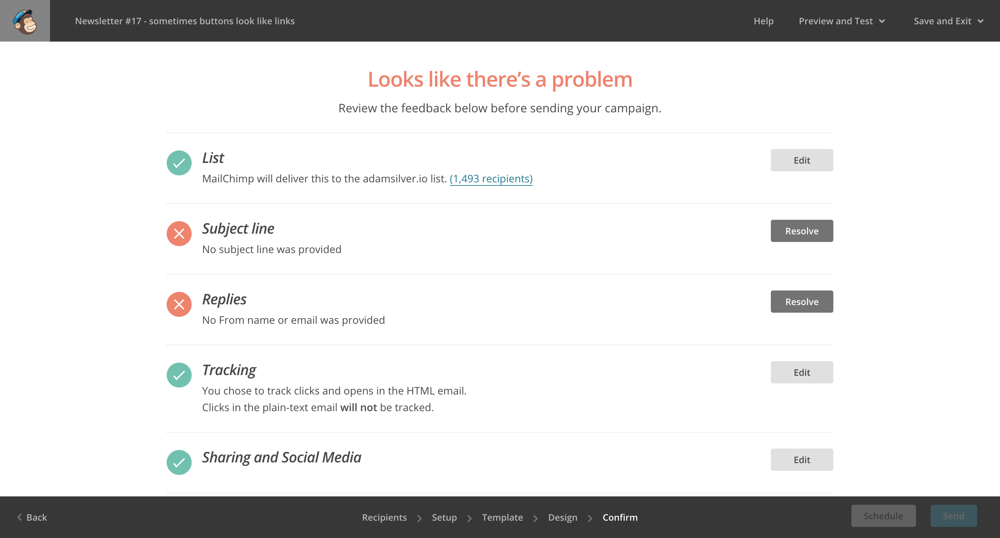

# A Really Long Form

Different types of tasks take different amounts of time to complete. One Thing Per Page helps users complete tasks in one sitting, but what about those that take hours to complete?

In Mailchimp, for example, I'll usually start drafting an email campaign weeks before I send it. And there are a number of steps to go through. First, I check the content reads well. Then I need to make sure it looks good in various email clients. Then days or even weeks later, I'll run through some final checks, decide the subject line and schedule it for release.

Other tasks are performed by more than one person using the same application. For example, processing a return may involve someone at the warehouse to receive the order. Then a decision maker may take a look at the goods to make sure they satisfy the returns policy.

Some Government services take weeks to apply for and users need to provide lots of information about their identity, home, family and financial situation and sometimes they need to gather evidence and send it by post.

Whatever the case, if you're designing a really long form, there's some patterns that we can use to improve the experience. Of course, if you can simplify the process so that it's short in the first place, all the better.

## The Task List Pattern

In “The Psychology of Checklists”[^], Lauren Marchese explains the importance of breaking down big tasks into smaller ones and doing so is bioligically proven to motivate us. When we experience even small amounts of success, our brains release a chemical called dopamine which gives us feelings of pleasure, learning and motivation.

Most of us work in teams employing Agile methodologies. One of the main aspects of this is breaking down a large project into epics, stories and tasks. Complete enough tasks, and the story is done. Complete enough stories, and the epic is done, and so forth.

What's really happening is that tasks seem far easier to achieve when they're broken down. Crucially, if tasks are small enough, then we'll get that hit of dopamine frequently, which creates momentum.

This is the basis of the task list pattern, the name of which I stole from The Service Manual[^]. Here's how it looks:

This particular example involves three top level tasks, each containing sub tasks. Clicking the task link takes the user down a flow. Whether that's one screen or several doesn't matter. Once it's complete, they come back to this view with the task marked as complete.

This is not a pattern reserved for Government services. As I mentioned earlier, Mailchimp users have a need for something remarkably similar. The only difference is the visual design and the flatter hierarchy of tasks as shown below.

Instead of text, Mailchimp uses iconography to mark tasks as complete or otherwise. I've discussed the pros and cons of iconography in chapter 3, “Book A Flight”. Additionally, instead of standard looking links, they use call-to-action buttons with label text as ‘resolve’ to prompt the user clearly.

The exact design details you choose to employ will come down to your product's design language and user research. As a starting point, you can read how GDS iterated their version in “We've Published The Task List Pattern”[^]. But the main takeaways are as follows:

- Each task's status is clearly marked, so that users can see what's left at a glance.
- It gives users and overall feel for how long is left.
- Previous information is saved so that users can return later to complete it.

## When all tasks are complete

When the last task in the list is completed, the user should still go back to the task list page with all the tasks marked as completed. This let's users bask in the glory of completing everything (which is another hit of dopamine). After all, the best part of completing a long to-do list is seeing all the ticks.

It also gives users a chance to review all their answers and make any amends if necessary, which speaks to principle number 4, *give control*. The only other thing to remember, is to give users an extra button in this state that lets users proceed.

## Additional considerations

The points discussed above are probably applicable to any super long form you're designing, but you might also want to consider:

- Explaining what users need, such as documents, in context of each individual task.
- Indicating how long each task will take. An estimate or a range can work well. If you can't offer this information, then you may need to break down the tasks further.
- Using verbs for task names. For example, ‘Agree to the terms, ‘Create subject line’, ‘Choose template’.
- Listing tasks in order. If so, use an ordered list, the advantages of which are discussed in “An Inbox”.
- Marking who needs to complete the task. This is only useful if the tasks are performed by different people.
- Sizing all the tasks the same. Don't take this too literally, but if one task is 20 questions and another is 2, then maybe it should be looked at again.

## Summary

In this chapter, we looked at how to break down really long forms into smaller forms, by using the task list pattern. We learnt that doing so is biolically proven to help users get through it, whilst also giving users essential information to help them through.

### Things to avoid

- Really long forms.
- Not saving state.

## Footnotes

[^]: https://designnotes.blog.gov.uk/2017/04/04/weve-published-the-task-list-pattern/
[^]: Mailchimp
[^]:

## Todo

- If tasks can't be done out of order